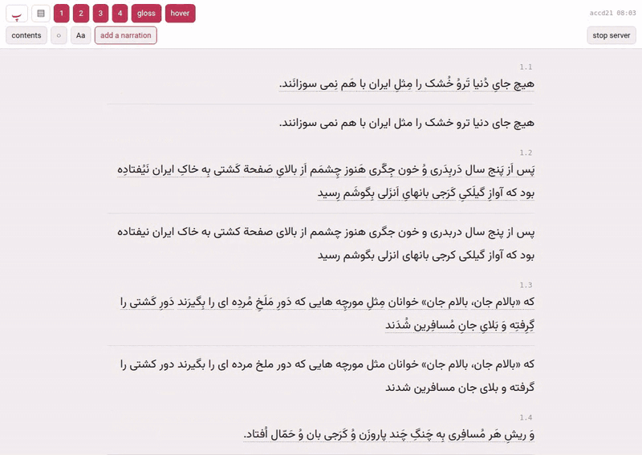
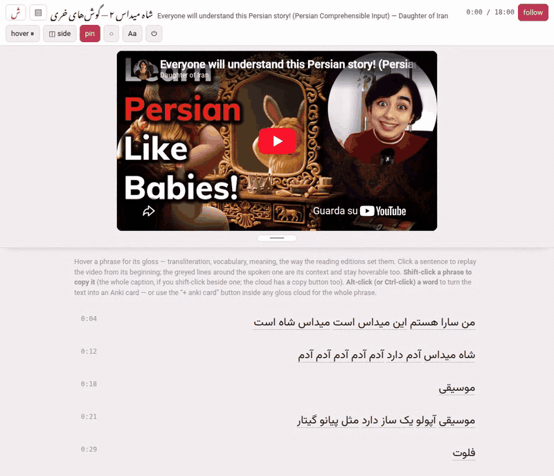
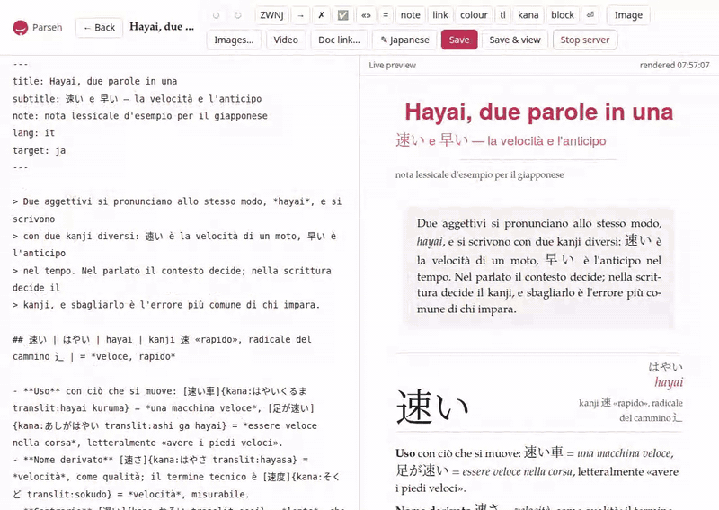

<!--
  The banner is docs/banner-light.svg and docs/banner-dark.svg: type set by
  XeLaTeX in the toolbox's own faces and converted to paths, so it needs no
  font on the machine that reads it.  Do not edit the SVGs -- they are built
  from docs/banner.tex by `cd docs && ./banner.sh`, which writes both.  A
  language added to the toolbox is one line of \LangRow in that file; the
  row was a row of outlines with no text in it for a while, and went two
  languages stale without anything being able to notice.

  Keep the pair -- GitHub picks the dark one on a dark theme, where a single
  dark-on-transparent image would vanish.
-->
<p align="center">
  <picture>
    <source media="(prefers-color-scheme: dark)" srcset="docs/banner-dark.svg">
    
  </picture>
</p>

One toolbox for reading a language the Ilya Frank way: the text parsed into
chunks, each chunk glossed, the narration playing in step:

| door | what | where |
|---|---|---|
| **Books** | reading editions: the text in chunks, each glossed, the audiobook playing in step | `/books/` |
| **Videos** | YouTube videos, or films of your own, with the whole transcript underneath, every phrase glossed | `/youtube/` |
| **Studio** | answers from an LLM, typeset: a library of notes, on screen or as a verified PDF | `/studio/` |
| **Exercises** | decks of studio exercises, studied like Anki cards: each comes back when it is due, sooner when it was hard | `/exercises/` |
| **Anki** | the card store the readers write into, and the wizard that syncs it with Anki | `/anki/sync/` |
| **Lookup** | reading what nobody has glossed: a dictionary per language | `/lookup/` |

<!--
  The three clips are docs/demo-*.gif, recorded against a local server in the
  light theme with a scripted browser (the cursor in them is drawn by the
  script; a recorder does not capture the real one).
-->

**Books** — a reading edition, here in **hover** mode: the passage stands
clean, in the vowelled text and the plain one, and the gloss arrives as a
cloud over whichever chunk you are reading rather than sitting between the
lines. The target script has its own size slider, so it can be large while the
English stays where it was; alt-click any word and the Anki card is already
filled in. A book grows: the add page's third lane puts more text onto one
that is already here, as a new chapter or as more of the last one, with the
same cutting choice and nothing written before it touched.



**Videos** — a video with its whole transcript underneath, the video
**pinned** so it stays under the header while the transcript runs on. Every
phrase is glossed where you hover: the transliteration, the words, the
meaning. The same alt-click makes a card, with the caption it came from as its
context. The video may be **on YouTube or a file on this machine** — give the
add page a path instead of a URL and its `.srt` or `.vtt` subtitles instead of
a pasted panel, and a film of your own reads exactly like a YouTube one, with
no internet involved. Its download carries the film itself, so the video and
its glosses travel together.



**Studio** — markdown on the left, the typeset sheet on the right as you type,
including a Japanese block set vertically. Then the reading view: the target
script on its own slider again, and every gloss of the document as a table with
its kana and its rōmaji.



Parseh began as a Persian toolbox and now teaches eleven languages — Persian,
Arabic, Italian, Japanese, French, German, Turkish, English, Hindi, Spanish,
Chinese — with the same doors, the same gestures and the same card store. What
you read through them is yours: the repository ships the doors and none of the
content.

## Languages

One table, [`lib/languages.json`](lib/languages.json), holds everything a
language is: its code and names, the folder its content lives in, the
direction, the script, the digits, the fonts, the passes of a reading
edition, its Anki note types. Every tool reads that table
(`lib/languages.py`); nothing else in the toolbox holds a list of
languages, a font name or a script-specific rule. The languages today:

| code | language | folder | script | direction | what is special |
|---|---|---|---|---|---|
| `fa` | Persian | `persian` | Arabic | RTL | vowelled and bare passes, a nastaliq pass |
| `ar` | Arabic | `arabic` | Arabic | RTL | vowelled and unvowelled passes |
| `it` | Italian | `italian` | Latin | LTR | no bare pass; target runs are **marked**, since Italian cannot be told from English prose |
| `ja` | Japanese | `japanese` | CJK | LTR | a **reading** (kana) beside the transliteration; the chunks divided into **words**, each with its own reading, so the furigana stand over words and a word is what is looked up and marked as known; a pass of the reading alone; a **vertical** (tategaki) pass |
| `fr` | French | `french` | Latin | LTR | two passes and marked runs, as Italian has; here the pronunciation line does the work, because the spelling hides the sound — *eaux* is one vowel, *-ent* is silent, and the liaison is heard but never written |
| `de` | German | `german` | Latin | LTR | the same two passes; a separable verb is glossed whole (*ruft … an* → *anrufen*) however far apart its halves sit, and a capital marks a noun, not emphasis |
| `tr` | Turkish | `turkish` | Latin | LTR | the same two passes; one word is often a whole clause (*görüşemedik*, *we could not meet*), so the vocabulary line is morphology: the stem, then each suffix in order |
| `en` | English | `english` | Latin | LTR | the same two passes; the spelling hides the sound more thoroughly than any of the others — *wound* is two words and *-ough* is six sounds — so the pronunciation line (IPA) earns its place on nearly every chunk, and the three principal parts are what a verb cannot be guessed from |
| `hi` | Hindi | `hindi` | Devanagari | LTR | two passes, since Devanagari writes its vowels and there is nothing to strip; the transliteration line carries the **schwa deletion** the script does not (कमल is *kamal*, not *kamala*), and every noun is glossed with its gender, which nothing in the word shows |
| `es` | Spanish | `spanish` | Latin | LTR | the same two passes and marked runs; the spelling says the sound, so the pronunciation line has little to do and the vocabulary line carries the verb — the person is in the ending rather than in a pronoun, and the object pronouns ride on the end of it (*dímelo* is three words in one) |
| `zh` | Chinese | `chinese` | CJK | LTR | **simplified** characters and no spaces at all, so where the chunks fall *is* the reading; the **pinyin is the transliteration** — there is no second reading line as Japanese has — the chunks divided into **words** as Japanese's are, each with its pinyin over it, a pass of the pinyin alone, a pass of its own sets the text vertically, and the character class deliberately leaves the kana out, so nothing can read Japanese as Chinese |

**The language being taught, and the language it is explained in.** Every
piece of content declares both. A book or a video has `"language"` — what
it teaches — and `"gloss"`, the language its glosses are written in; a
missing `gloss` means English, so everything written before this existed
means what it always meant. An Italian learning English wants an English
book glossed in Italian: it declares `"language": "en"` and `"gloss": "it"`;
the reader labels the field *italiano* and the PDF hyphenates it as Italian.
(An Anki card built from such a page still carries the Italian text, but the
card store does not yet record the gloss language, so the note type is built
with the unmarked English templates.) The gloss language need not be one
the toolbox teaches — Persian glossed in Portuguese is a legal book, since
what a gloss language has to do is be set on a page, not have a reading
edition of its own. A studio document is written *about* a target language
*in* a prose language: its front matter's `target:` is the language being
learned and `lang:` the language the notes are written in (which picks the
hyphenation). Content that declares no language is Persian — the toolbox's
first — so nothing written before languages existed changed meaning. In
every stored format the target-language text sits under the key `fa`, named
after Persian for the same reason.

**What each door does per language.** The books give each passage the
passes its registry entry lists — Persian: vowelled, chunks, bare,
nastaliq; Arabic: vowelled, chunks, unvowelled; Japanese: the text with
furigana over each word, the reading alone in kana, the chunks (the chunk's
kana as a line of the gloss), the plain text, and a fifth pass set
vertically; Chinese: the sentence with pinyin over each word, the pinyin
alone, the chunks, the plain characters, and a pass set vertically; every
other language the sentence and the chunks, there being nothing to strip
and no second face. The videos gloss every phrase the same way, the
Japanese cloud showing the kana above the rōmaji, and a Japanese or Chinese
transcript carries the same reading over each word and turns into the
reading alone at the **kana** / **pinyin** button. The studio finds the runs of the target language
by their characters wherever the registry gives that language a
character class (`chars`); where `chars` is null — the six Latin-script
languages — the target is the prose's own alphabet and cannot be told
from it, so its runs are marked by hand (`[così]{tl}`,
`[voulez-vous]{tl}`, `[well-known]{tl}`); a Japanese or Chinese block can
be set vertically on screen and on paper. The Anki dashboards label their
first field with the language's name, add a reading row for Japanese, and
write into note types of that language.

**Words, in Japanese and Chinese.** Neither writes a space between words, so
each chunk carries a second line saying where its words are and how each is
read — `山(やま) へ 柴刈り(しばかり) に 、`, `我(wǒ) 想(xiǎng) 要(yào)` —
the last argument of `\chrw` / `\chw` in a book and `"words"` in a video.
The words joined back must be the chunk's text exactly, and the chunk's own
reading stays beside them: it is compared with them only to warn, and a text
read out of its written order (kanbun) is marked `"reorders"` — a checkbox on
the book-info and video-info sheets — and not compared at all. The furigana
and the pinyin stand over each word, **I know this** marks a word rather than
a character, and the dictionary looks the words up. **The division is
proposed** whenever text comes in — a book or a video drafted from pasted
text, a video's answer pasted in — by SudachiPy for Japanese and pkuseg with
pypinyin for Chinese (optional packages of the conda environment; without
them nothing is proposed and a chunk simply has no words). A draft also
starts each chunk's reading from its words — the kana, or for Chinese the
pinyin of `tr`, run together, the text's punctuation kept — so the two agree
from the first moment, and
the checkers count that reading as nobody's writing until somebody changes
it. `python3 lib/fill_words.py --book <dir>` / `--video <dir>` fills in what
is already there without touching a line somebody wrote, and `--json` does it
for an annotator's own files: that is where the words of a text annotated by
a model start, the machine proposing and the model correcting (the book and
video prompts say so, and the video prompt lists the machine's division under
each caption). Where a chunk already has its reading, each proposed word's is
cut from it, so the furigana say what the chunk's kana says; where it has
none yet, the readings are a dictionary's. A proposal is a draft: the chunk editor draws the words as a strip in which a word is
cut, joined to its neighbour, has its boundary moved, is retyped as the line
itself, or is proposed again. The notation and its checks are
[`docs/languages.md`](docs/languages.md)'s *Words* section; the conventions
are [`docs/lang/ja.md`](docs/lang/ja.md) and
[`docs/lang/zh.md`](docs/lang/zh.md).

The conventions an annotator follows — what the text field carries, the
transliteration scheme, the vocabulary line, what never to gloss, how to
chunk — are one file per language under [`docs/lang/`](docs/lang/), embedded
into the video prompt and the new-book prompt. **Adding a language** is one
command — `python3 lib/newlang.py <code> --name … --native …` writes
the entry, the two files and the three folders, and `--check` says whether
anything is missing. What it does not write — and says so in the list it
ends on — is the language's verb recipe, `lib/verbs/<code>.py` (below), and
until somebody does, a verb the dictionary finds is offered as a plain
`\dw`, like any other word. The process end to end is the *Adding a
language* chapter of the manual, and the design under it is
[`docs/languages.md`](docs/languages.md).

## Run it

The first time, install what Parseh needs, with one command or one double-click:

| Linux | macOS | Windows |
|---|---|---|
| `./install.sh` | double-click **`Parseh.command`** (or `./install.sh`) | double-click **`install.bat`** |

It makes the environment inside the checkout (`.runtime/`, with micromamba:
nothing is installed system-wide, and removing the folder removes it), adds
whatever an older environment lacks, compiles the guide, fetches the models
the word analyzers need, and builds the readers. `./install.sh --guide`
compiles the guide alone. A conda environment called `ilya-frank` that
you already have is used instead. [`docs/installer.md`](docs/installer.md)
says what goes where, and the JSON lines a graphical installer will read.

Then, on Linux and macOS:

```sh
./serve.sh              # everything, in the background, https on port 8765
./serve.sh status       # is it running, and where
./serve.sh log          # follow the log
./serve.sh stop
```

Windows: double-click **`serve.bat`**. The first time it is a setup wizard —
what `install.sh` is elsewhere: it checks the machine, offers to make the
environment as `install.bat` does (or to add what an older one lacks) and
to install what winget can (OpenSSL for the certificate), builds the readers
and the library page, compiles the HTML guide, makes the certificate. After
that a double-click just starts the server in its own window and opens the
browser on it. The stop button on any page, Ctrl-C, or closing that window
stops it; `serve.bat setup` runs the wizard again, and `serve.bat stop`,
`status` and `cert` do what `serve.sh`'s do.

Then open <https://localhost:8765/> — or the Tailscale address it prints, from
any device on the tailnet. The certificate is **self-signed and made by
`serve.py` itself** on first start (`.tls/`): every browser warns once, you
accept, and that is the whole ceremony. It is our own server on our own
network; nobody else is being asked to trust it. `./serve.sh cert` mints a
fresh one if the machine's addresses change. An old `http://` bookmark on the
same port is redirected to https.

Serving needs only Python 3 (and `openssl`, once, for the certificate; the
environment carries one, and without any `serve.bat` serves plain http).
Rebuilding, dividing words and the rest need the `ilya-frank` environment —
see [`environment.yml`](environment.yml); `serve.sh`, `build.sh` and
`serve.bat` use it whenever it exists, the checkout's own `.runtime/env`
first and then any conda's (`lib/env.sh`, `lib/runtime.py`), and
`python3 lib/runtime.py status` says what the machine has.

## On every page

* **◐** — the theme (light, dark, and the sepia paper
  the studio reads on: one setting for the whole toolbox); **⏻** — stop the
  server. While the server is still working on something, **⏻** says what
  first — "2 tasks are still running: …" — because stopping cuts it off.
* **Working…** — whatever takes a while shows on every page until it is
  over: a book's PDF being built, a book, a video, a note or a whole shelf
  going up or coming down (a bundle, a backup, a restore, a deck export), a
  narration being uploaded or aligned, a studio PDF, a video being added, a
  dictionary or a model being fetched, the HTML guide being compiled from its
  front page. A pill in the bottom-right corner says
  **Working:** and what — the file and its size, the book by its title — with
  **+N more** when there are several; click it for the whole list, each with
  its time, how far the bytes have got where they are counted, and **open the
  page** it was started from. **shrink** folds it to its spinner until the
  work is over. The page you started it from shows it the moment you press
  the button — over the dimmed page too, when you started it from inside a
  note, the narration panel or a dialog — and the **hub** lists everything
  running in a panel under its name as well. A download still goes to the
  browser's own downloads: the pill says *Preparing the download…* while the
  server packs the zip, and goes once it has been sent; a short **Done** says
  when something finished (a refusal is said by the page, as before, not
  here).
* **Browser | Mobile**, in the hub's top bar — which of the two interfaces the
  toolbox is in. *Browser* is every page as it has always been. *Mobile* is a
  streamlined set of pages made to be read on a phone, with no editing controls
  on them: a single column, big targets, the four doors (books, videos, the
  studio's notes, the exercises) with their counts, the language chips in one
  row that scrolls sideways (with a mouse they wrap instead), and the guide.
  The switch is instant and holds across every page and reload. The hub is the
  first mobile page; every other door opens its browser page until its own
  mobile version is written. Nothing is locked — a browser page reached by its
  address works as always. [`docs/mobile.md`](docs/mobile.md) has the design
  and how a mobile page is added.
* **guide**, on the hub — the guide: web pages at `/guide/`, one per part of
  the toolbox, with a list of pages, a search box and working examples of
  everything the studio's Markdown can hold; its **PDF manual** link opens
  `HOW TO USE THIS TOOLBOX.pdf`. The pages are compiled from
  [`html-guide/markdown/`](html-guide/) — the installer does it, and when
  they are missing or older than their Markdown the guide's front page says
  so and compiles them from a button.
* **Shift-click copies**, in the books and the videos: the chunk or phrase
  under the cursor (the hoverable unit), or the whole sentence / caption when
  you shift-click beside one. A plain click still plays, and alt- or
  ctrl-click still makes an Anki card; the gloss cloud has a copy button for
  touch screens. In the studio a plain click copies — there is nothing to play.
* One palette, the studio's — `lib/parseh.css` — under the books, the
  videos and the studio alike; and in the two readers an **Aa** button with
  the studio's kind of sliders: text size, gloss size, column width,
  leading. The first slider is labelled with the language of the page.
  Japanese and Chinese also have character spacing; Japanese has reading
  contrast (the current grey through full text contrast) and kana size
  relative to kanji (50% by default, up to 200%).
* In Japanese books and videos, the hover cloud has an **I know this** button
  for each kanji. It hides that kanji's reading throughout the current book
  or video; **show reading** restores it. Choices are saved in this browser
  separately for each book/video. The full reading stays in the cloud.
  Kana in the spelling separates readings where possible; a shared compound
  reading stays together and hides once all its kanji are marked known.
* **Decompose Kanji / Decompose Hanzi** — temporarily select individual characters
  in books and videos to open a recursive component tree. Select a component to
  explore it; **Back** and **Return to** navigate within the tree. **Escape**
  closes the tree, then leaves the mode; **Done** also returns to normal reading.
  Install the optional **KanjiVG** (Japanese), **Make Me a Hanzi** (Chinese),
  and **CJKVI-IDS** fallback packs from the same `/lookup/` setup page as the
  dictionaries and translation models. Inspection works offline. Component
  meanings come from the existing dictionary, and the tree still works without
  one. See [character decomposition](docs/character-decomposition.md) for setup,
  data sources, stopping rules, and developer checks.
* The reader's **pass toggles** (1, 2, 3…) sit in one dashed group with a
  caption naming what the row of them is. **Hover mode** greys the two it
  swallows — the chunks-and-glosses pass and the alternate face, with the
  gloss switch that acts on nothing else — while the text passes keep
  working: hover mode showing pass 1 alone is exactly what they are for.
* **One chapter at a time.** A book of several chapters ships with the first
  chapter in the page and every other one in a file beside it, fetched when
  it is wanted — the contents jumped into it, the reading place is in it,
  the narration played into it, or it simply came near the window. The
  numbering runs straight across the pieces, so nothing else in the reader
  changes, and a book of one chapter is built exactly as before. The
  browser's own find-in-page cannot see a chapter that has not arrived; the
  contents search, built from the incipits, still finds every paragraph.
* **Chapters, and sections inside them.** A chapter says in the text which
  chapter it is — its number centred, with its name under it when it has one —
  and a **section** marks a place between two paragraphs inside a chapter, set
  one step smaller, the way an h2 is smaller than an h1. A section has **no
  number of its own and changes no paragraph's number**: it is a heading in
  the text and a row in the contents, and nothing else. Both are written into
  the chapter's own `.tex` (`\chapname`, `\secmark`), so they are in the PDF as
  well as the reader and they travel in a bundle by the rule that already
  carries every `.tex` — download a book and bring it back and its sections
  come with it. **sections…** in the contents panel opens one, renames it,
  removes it, and names a chapter. The division into *chapters* stays what the
  files say it is: that is where the text is actually cut.
* **The contents is a tree.** Chapter → section → paragraph, each folding on
  its own, with **fold all** and **open all**. Fold everything and the panel is
  a list of chapter names to walk; open a chapter and its sections show; open a
  section and its paragraphs do. Nothing is folded when it opens, and a book
  with no sections folds the same way with one level fewer. A search opens
  whatever it has to, so a match is never left hidden inside something folded.
* **Stopping where something begins.** **stop at a change** in the header holds
  the narration when a new chapter or section starts and waits for play. It is
  off to begin with, so a book plays straight through as it always has.
* **Folding a run away.** **fold** in the reader's header takes a first
  paragraph and a last and folds everything between them: the text is not
  shown, and a bar saying how many there are stands in its place, which opens
  them on the page whenever you want to look. Reading walks past a folded run
  — with a narration the playhead jumps from the subparagraph before it to the
  first one after, and with no narration the arrows do the same. Two runs that
  meet become one. Nothing is deleted and the build knows nothing of it: the
  runs live in `reading.json` beside the book and travel in its bundle, so it
  is the edition that is folded, not one machine's view of it.
* **rebuild the reader**, beside **build PDF** in the reader's header. What a
  page can do is written into it when it is built, so a book built before a
  feature simply has not got it — and a book built before *this* one has
  neither button. Such a book is brought up to date by its own **build PDF**,
  or by **rebuild** on its library card: both write the reader as well as the
  PDF, and where the book's own sources are unchanged the PDF is kept and only
  the page is written, so no LaTeX runs at all. Afterwards this button writes
  the page alone (`build.sh --html`), in seconds.
* **On a phone**, in every subsystem: the top bar gets out of the way as the
  page moves down and comes back on the smallest move up, not only at the
  top of the page. And a tap opens a chunk's gloss in hover mode — in the
  books and the videos alike — even on a screen that claims a hover it never
  delivers. Wide screens are left exactly as they were. This follows the
  width of the screen, in either mode; it is not the mobile mode above.
* In the studio, **↑ Top** in the lower-left corner of a long note takes the
  page back to the beginning; it appears once the page has moved down.
* The **language chips** on every index page: behind a door they filter
  what the page lists; on the hub they record the choice the doors open
  with, and the doors count for it — pick Japanese and each door says how
  many Japanese books, videos, documents and exercise decks there are.
  Either way it is one preference, remembered across the toolbox.
* A studio document's **zip carries its tags**. They live in `meta.json`, not
  in the markdown's header, so a zip of the text alone lost them on the way
  back in; `<slug>.tags.json` travels beside the markdown and the upload reads
  it (a document with no tags gets no such file). **Download N shown** offers
  the same two shapes as a single document's Download: one zip of `.md`
  sources, or one zip holding each document's own zip — its markdown, its tags
  and its pictures.
* **Backup** has its other half, **Load from backup**. A backup is not
  markdown somebody wrote: it carries `meta.json`, so what comes back is the
  document that went in — its id, its uid, the name every `[…](doc:Name)` link
  to it spells, its tags, its timestamps and its pictures — rather than a new document with
  the same text. A document already in the library is kept and counted, and
  only then is replacing it offered. A backed-up document whose name another
  document of the library has taken since is asked about first, in the same
  name-conflict dialog a save or an upload opens (`markdown/README.md`,
  "Links between documents").
* **Every shelf has the same pair.** The decks page, the books page and the
  video index each carry **Backup** and **Load from backup**, with the same
  rule: what is already there is kept and named, and replacing it is offered
  only then. A shelf of books or of videos backs up as **one bundle per
  item** — the very zips the "bring a book back" panel takes one at a time —
  so a backup can be taken apart and half of it put back by hand, and each
  item comes back in through the door that already checks it. The exercises'
  backup differs from a deck's **Export** in three ways on purpose: the
  deck's own id and settings travel, every picture and recording travels
  whether an exercise names it or not, and the scheduling always travels.
* The library's **tag filters count what is still visible**: the number on a
  tag is how many of the documents now in front of you it would leave, not how
  many the whole library holds. A tag that would leave none is not offered at
  all; a tag doing the filtering always stays, whatever its count, since an
  excluded tag shows zero by its nature and hiding it would take away the only
  way to switch it off. **Clear all filters** appears when anything is on.
* The studio's editor writes the whole source **right to left** at a click
  (**⇤ RTL editor** in its bar), in a face made for the script, for a
  document whose prose is a right-to-left language — a Persian teaching
  English to Persians — and does so by itself when the front matter's
  `lang:` is one; the choice is remembered for each document. See
  [the editor](markdown/README.md#editor-docidedit-new).
* Studio pages can contain interactive exercises using a small
  primitive-driven Markdown extension: placement, choice, matching, and
  embedded flashcards cover fill-the-blank, ordering, sentence building,
  three matching types, boolean/single/multiple selection, error finding,
  odd-one-out, and Jolly cards. The editor supplies templates and a solved
  preview; the reader supplies shared correction and answer-level feedback,
  and **⤢ Enlarge** opens a flashcard over the page as large as the window
  holds — the same card, laid out as it is on the page, only bigger (on a
  phone, laid out a little narrower so that it can be up to twice as
  large, though never so narrow that a picture or player shrinks beside
  the words, or that a line whole on the page breaks: only a paragraph
  that already wraps there may wrap at other words) — so that a picture on
  it can be seen.
  **+ Deck** beside an exercise copies it into a deck of the **Exercises**
  door — **+ Add all exercises** copies all of a page's at once, the ones
  left ticked — which also adds exercises with the same form, lets you browse, edit,
  duplicate and delete them, schedules them with Anki's algorithm after you
  rate each one, and exports and imports decks with or without that
  scheduling. See [Studio interactive exercises](docs/studio-exercises.md).
  A studio page and a flashcard can hold **recordings**, and the card sheet
  of a book or a video sends a card to Anki, to an exercise deck or to the
  clipboard as markdown, with the word's own sound cut by ear from the
  narration or the film (a YouTube video's recorded from the tab as it
  plays, in Chrome or Edge on a computer).
* A studio document prints for the classroom. **PDF options ▾**, beside
  **Build PDF**, sets the print size — 11 pt, or 14, 17 or 20 pt for readers
  with low vision, the exercises a step larger still — and **black and
  white**, with no colour and no grey but in the pictures, for photocopies.
  On paper each matching entry is framed, a sentence to construct gets
  lines to write it on, and true/false marks keep a column of their own
  ([On paper](docs/studio-exercises.md#on-paper)).

## Adding to it

Each add page opens with a question and shows only what the answer needs.
Both have a **language select**, defaulting to the language the chips last
picked; what they write lands in that language's folder.

* **A video** — `/youtube/add/` asks two: **where the video is** (from
  YouTube, or a film already on this machine) and **who writes the glosses**
  (an LLM, whose answer the page checks, or nobody — you gloss it in the
  player). Then the URL or the film's path, and the transcript. The LLM way
  copies a prompt that needs nothing else — the conventions of that language
  and the numbered captions are in it, and a worked example too once the
  player holds a video to draw one from — and checks the answer with the
  pipeline's tools before writing `youtube/videos/<language>/<id>/`.
* **A book** — `/books/add/` asks one: **what you are doing**. A reading
  edition is days of work, paragraph by paragraph, and three cards answer it.
  **Write it here, by hand**: paste a chapter, and the whole book is drafted
  with the text divided and every gloss blank, to fill in in the reader.
  **Add to a book already here**: more text onto the end of a book on the
  shelf, with nothing already written touched or re-cut. **Let an LLM do it
  outside**: the page writes that folder's recipe — the shell that sets it up
  with the tools and a finished edition to learn from (one of the same
  language when there is one, else the Persian one), the prompt
  ([`docs/new-book-prompt.md`](docs/new-book-prompt.md)) that sets the same
  batch-by-batch method with the language's own conventions, and the shell
  that brings the result back.
* **Move a boundary** — in both readers, a chunk can be **cut in two** or
  **joined to its neighbour**, which is the thing a first pass by a model most
  often gets wrong. The text divides only where the language divides; the
  transliteration, the vocabulary entry by entry and the meaning are proposed
  and typed over. [`lib/chunkdiv.py`](lib/chunkdiv.py) is the one set of rules
  both doors draw.
* **Fix the title, the author, the channel** — in both readers, a **book
  info** / **video info** button opens a sheet of the fields nothing else
  edits: a book's title, its transliteration, its English title, its
  author and the author's transliteration, the year, the library card's
  blurb; a video's title, its native title, its channel, its level, its
  blurb. The concrete case it exists for: a video's title or channel comes
  from YouTube's own lookup or from an LLM's answer, and either can get it
  wrong. A book's title and author (and their transliterations) are also
  baked into `main.tex`'s own title page at the moment the book is made —
  nothing rebuilds that from `book.json` at build time — so saving rewrites
  both, or neither if the new value cannot sit inside a `\newcommand{...}`
  unescaped (the reader says which character and why); the PDF itself only
  catches up at its next build, **build PDF** in the reader. A video has no such second copy —
  the player reads `video.json` straight, so a video's edit needs no
  rebuild at all.
* **Write a note in the seam** — between any two lines of a book or a video
  there is a `+`. It makes a markdown file, kept **with the content** in its
  own `markdown/` directory, written with the studio's editor and rendered by
  the studio's renderer — because it *is* a studio document, in a second
  library. It is never shown inside the reading: the seam carries a small
  mark, and clicking it opens the note over the page. **Resting the pointer
  on the mark** for a third of a second (or tabbing to it) shows a small card
  first — the note's title and its opening lines, at most 280 characters,
  with the front matter, the footnotes and the figures left out — so you can
  tell whether to open it without leaving the line. The card is plain text
  and nothing more: a note can come in somebody else's bundle, and a preview
  happens to whoever's pointer crosses the seam, where opening one is a
  choice. A touch screen has no hover and shows no card; a tap opens the note
  as before. Never built to a PDF, never asked for by any prompt: a note is
  your reading of your own book.
* **Or start either one empty** — on the video page that is an answer to
  **who writes the glosses**: the transcript as it stands, every caption cut
  into sentences, every gloss blank, and no prompt shown at all. What is
  drafted carries `"draft": true`, which is what lets the checkers forgive a
  chunk nobody has glossed yet while still catching a half-written one.
* **A studio document** — `/studio/prompt`: the studio's own prompt page,
  with a target-language select; the model answers with a `.md` file you
  upload.
* **A narration** — after the book is finished, from the reader itself:
  **narration** in its header. A book's narration is a **list of recordings**,
  and the panel is that list: one row each, saying which file it is, what
  stretch of the text it covers, how much of it is timed and how much of that
  was stamped by ear. Everything that can be done to a recording is done from
  its own row — **align** it against its own transcript, **estimate times**
  when it has none, change what it covers, give it a transcript, or take it
  off the book. What is about the book rather than a recording sits above the
  list: add a recording, **edit times by hand**, export or import a narration
  file, and a **how this works** that holds the explanations rather than
  spreading them between the buttons.
* **An audiobook a part at a time.** A book does not have to be recorded all
  at once. Each recording's times are seconds into *its own file*, so
  recording two chapters tonight re-times those two chapters and touches
  nothing else — which is also what makes the alignment easy to get right,
  since it is only ever a few minutes of audio against a few paragraphs.
  **With no transcript**, a recording that names its stretch is shared out
  over it the moment it lands — each subparagraph gets a slice in proportion
  to its length, so the file plays at once and what drifts is nudged by ear.
  Those times are marked as the guess they are, and an alignment later
  replaces them; a stretch already timed for real is left alone unless you say
  so, and you are asked at the moment it would matter. The reader swaps file
  as you read across a seam. Files are never joined together: each stays
  exactly as it was recorded, in `audio/`. A book recorded in one sitting is
  one row covering the whole book — the same `book.json`, the same comments in
  the `.tex`.

## Writing it yourself

A book or a video can be written by somebody who knows the language rather
than by a model, and there are two places to do it.

**In the page.** Every chunk has a pencil, always, as in the video player —
**✎ edit** in its gloss cloud, or a small ✎ at its corner where it opens no
cloud (the rows of pass 2), or <kbd>E</kbd> — and a click on the chunk itself
still plays. The pencil opens the chunk: the text, the transliteration, the vocabulary
line, the meaning, and one of four colours. Saving rewrites that one `\ch`
call in the chapter's `.tex` — and, where the paragraph's opening words
change, the `\parstart` line that names it in the contents; every other byte
of the file is left exactly as it was — and rebuilds the reader; the PDF is
LaTeX, so the header says it is now behind, and **build PDF** catches it
up. The video player has the same in its gloss cloud: four dots to mark a
phrase, a ✎ to open its fields. Every edit goes through the checker that
guards the file *before* anything is written, and a refusal names the rule
it broke — a colour that is not one of the four, an edit that would stop a
paragraph reproducing its own source paragraph, a video chunk whose text no
longer adds up to its caption. Where that edit is *meant*, the same sheet has
a checkbox saying this paragraph may depart from its source: the check then
stands aside for that paragraph and for no other, both here and in
`verify_book.py`, which names it rather than counting it a fault. It is per
paragraph because the check is — the chunks of a paragraph are joined before
they are compared — and it is kept in `reading.json` beside the book, so it
travels with the edition.

**In the files.** **download** on the reader and on the player gives the
authored files as one zip — for a book `book.json`, the `.tex` files,
`NOTES.md`, `source/**` and `reading.json` where there is one; for a video
`video.json`, `annotations.json`,
`transcript.txt` and `parts/**` — with a manifest saying which kind, which
language, where it came from, and for a book which of the three shapes below
it is. No PDF and no built reader: those are derived, and one carried back in
stale would show text the chapters no longer say.

A **narrated** book is three downloads and not one, so the button opens a
sheet. *The text alone* takes out `timings.json`, the alignment review,
`book.json`'s `audio` and `transcript`, and the `% @par` comment above every
subparagraph of every chapter — what comes out reads as a book that never had
a narration. *Everything but the recording* keeps all of those and leaves out
only `audio/`: drop that one directory back in and the book is whole again.
*All of it* is the book as it stands, recording included. The middle one is
the default and the one to watch — it looks complete, and a book installed
from it shows no audio, and says **no audio yet** on the library page, until
`audio/` is put back in the book's own directory (under the names `book.json`
gives, normally `audio/audio.webm` and `audio/transcript.txt`) and the book
rebuilt. A book with no narration gives the same zip all three ways and is
offered no choice; nor is a video, whose media is on YouTube and was never
here. An install never deletes a narration at the far end, whichever shape
arrives.

Each of the three says **how big it is** — the sum of what that bundle will
carry, so *all of it* counts every recording under `audio/` (a book read in
nine parts carries nine files, and any replaced one still on the shelf) and
says how much of the zip they are. Each file is counted as the zip holds it —
the recordings as they are, the text compressed (a Persian or Arabic text
goes in at a third of its size on disk) — so the figure is the size of the
file that arrives, to within a few bytes. The player's **⤓**
says the same of a film on this machine in its tooltip. A reader built before
this change says the first recording's size until **rebuild the reader** (or
any narration change, which rebuilds it) — the sheet is part of the page.

Work on the files in a text editor (this is where find-and-replace across a
whole chapter belongs), zip them again, and drop the zip on the panel at the
foot of the book library or the video index. It is checked before it is
installed — the language must be one the registry has, the chapters must
parse, the text must still reproduce its source, the annotations must pass
`check_annotations.py` — and a name already taken is answered with a
*replace it* choice. A book is then on the shelf at once — grey, among the
others, exactly like a book nobody has built yet — and the **build** button
on its own card makes its reader, its PDF and its card, following the build
to the end. That is the only way a book is ever built, which is one thing
fewer to go wrong than a panel with a build of its own; a video needs
nothing.

The file formats, argument by argument, and every refusal either door can
give are the *Writing it yourself* chapter of the manual.

**A book nobody has glossed yet.** Both content doors now read even when the
glosses are not written — the state a draft is in for weeks, and the state
every book is in on its first day. One switch in the header of every reader
and every player turns on the help — it appears as soon as *any* of the three
below is installed for that language, and its tooltip says which — and it is
off until you turn it on.

**It is set up on one page, in the browser, with buttons** — the last
door on the hub, *Reading what nobody has glossed*, or **reading help** in the
header of any reader, or the link the cloud itself offers when you hover a
chunk with nothing under it. The address is `/lookup/`.

**dictionary** looks the words of an unglossed chunk up in a real dictionary
and shows what it finds — headword, romanisation, part of speech, the senses,
for a verb its principal parts (below), and *how the word was reached*,
which for an inflected form is the half that matters (`किताबें` → `किताब`,
plural; `می‌سازمت` → `ساختن`, the present with an object pronoun on it).
A Persian verb prefix typed apart — `نمی بیند`, with a space where the
joiner belongs, as a typewriter, an old printing and much of the Web write
it — is looked up joined to its verb: it comes back as one word, *to see*
with *the negative continuous nemi- taken off*, where it used to be *moisture*
(نم, an -i taken off) followed by a verb whose negation had gone. Only a verb
counts, so `می ناب`, pure wine, is still wine; of the 1,140 such pairs in
Tatoeba's Persian sentences, 1,129 now reach their verb.

Getting one is three clicks: open `/lookup/`, press **get it** beside your
language, and watch. It downloads Wiktionary's own extract — 90 MB for
Persian, a gigabyte or more for German, Spanish or Chinese — and builds a
database, telling you where it is up to. A minute or two, once. Then the
**dictionary** button appears in the header of every reader of that language.
**remove** deletes the file; **rebuild** picks up a year of Wiktionary's
edits, and whatever a newer toolbox keeps that an older one threw away — which
is what the verb entries below need.

Everything happens on your machine: nothing about what you read is sent
anywhere, and nothing is kept but the file, in `dict/` (gitignored, and the
licence travels inside it and is printed under every entry). The command line
still works — `python3 lib/getdict.py hi` — and does exactly what the button
does. A language with no dictionary is simply not offered one. Japanese and
Chinese, which write no spaces between their words, are cut into words by
longest match against the dictionary's own list — so installing the
dictionary is the whole of the setup there too.

**How a draft is cut into chunks** is a choice on both add pages, for books
and for videos. **One chunk per sentence** leaves the cutting to you and is
the default. **Sense groups** cuts at the edges of phrases — a preposition
with its noun, a noun with its adjectives, a verb with its auxiliaries —
and first of all at the text's own punctuation, in every language: a comma
closes a chunk. In a language that writes spaces between its words it reads
the language's own list of function words — articles, prepositions,
conjunctions, pronouns, auxiliaries, in `lib/lang/<code>.chunk.json` — and
the parts of speech of everything else out of that language's installed
dictionary; with the list alone it cuts by the list and the punctuation,
and with neither by the punctuation alone. Neither language that writes
no spaces asks the dictionary at all. Japanese is cut between the words
SudachiPy divides it into, by their parts of speech, where the conda
environment has it — so a chunk never ends inside a word — and otherwise
into the bunsetsu it is read in, after the marks and particles listed in
[`lib/lang/ja.chunk.json`](lib/lang/ja.chunk.json); either way the pieces
then grow into phrases of up to eight characters, so an object keeps its
verb. Chinese is cut at its own punctuation — the full stop, the
enumeration comma, the sentence particles — by the list in
[`lib/lang/zh.chunk.json`](lib/lang/zh.chunk.json), and where pkuseg's
part-of-speech model is installed, between its words by their tags as
well: a coverb with its object, a verb with its object, a measure word with
its noun — so that a clause nobody punctuated, an auto-caption's, is cut
too. For both, sense groups are there from the first day, dictionary or no
dictionary.

**The senses are ordered rather than merely listed.** A dictionary's real
weakness is that it cannot choose: `شیر` is *lion*, *faucet*, *tiger* and
*milk*, and it prints them in whatever order the page was written in. So the
register tags the source already records — and the toolbox used to throw away
— now sort them: a sense marked *obsolete* or *archaic* goes last, a
*figurative* or *slang* one after the plain reading, and everything untagged
keeps the source's own order. `literary` and `poetic` are deliberately **not**
demoted, because this toolbox is pointed at literature: `یار` is tagged
literary for *friend, lover*, which is exactly the sense a page of Hafez
wants. The ranking happens *before* the list is cut to three, so a plain
sense sitting fifth behind four obsolete ones can now be reached at all.

**English, explained in English.** Every dictionary here is the English
Wiktionary's, which explains the words of every language in English. For
Persian or Italian that is a translation — `خانه`, *house* — but for English
itself it is a *definition*: *house* is "a structure serving as an abode of
human beings", written in the very language you are learning. So a reader or
player of English has a switch of its own beside **dictionary**:
**definitions**, off until you turn it on. Off, an entry still gives the
headword, how it is said, its part of speech, how the word was reached and a
verb's principal parts, and says once where the definitions are. On, it gives
Wiktionary's definitions with the labels Wiktionary puts on them
(*transitive*, *countable*, *slang*) — the first three, and the rest one click
away. Where a translation model from English into the language of the glosses
is installed, a second switch, named after that language (**in italian**),
puts each definition into it, underneath: in the page, on this machine, and
labelled as a machine's reading. Both switches can be flipped while you read
or watch, and both are remembered; neither appears for a dictionary that
translates rather than defines.

**A sentence somebody has already translated.** Where the dictionary lists
every sense and cannot say which, a **parallel corpus** can, without anybody
guessing: a whole sentence a person wrote and another person translated,
picked because it shares the *rare* words of your chunk. `سیگار می‌کشد`
finds *«سامی دارد علف می‌کشد و می‌نوشد» — "Sami is smoking weed and
drinking"*, which is the smoking sense of a verb the dictionary offers as
*to kill*. It is not a translation of your line and never pretends to be:
both sides are shown with the shared words named under them. In both
readers, matching source words are coloured, as are their equivalents in
the translation when the dictionary alignment can identify them. This also
applies to examples in the editing panels. The match is
weighted by how few sentences hold a word — sharing *and* is worth nothing,
sharing *homeland* is worth the match — and it is gated on the rarest word
in common, so a handful of common words cannot add up to a real one. The
sentences are Tatoeba's, under CC BY 2.0 FR, downloaded like a dictionary
into `corpus/`. Coverage is very uneven, and so is the size:
Italian–English is 719,000 pairs and 182 MB, Spanish–English 283,123 and
83 MB, Persian–English 8,454 and 3 MB. A thin pair simply finds a sentence
less often; a pair nobody has downloaded offers none.

**A translation model, in the page.** And where you want the *line* read
rather than its words, a translation model can do that too. It is not a chat
model and there is nothing to configure — one job, no prompt, no address, no
key, and the same answer every time. It runs as WebAssembly **inside the
reader**, so the line never leaves the machine and Parseh gains no
dependency to run it. The engine is
[bergamot-translator](https://github.com/browsermt/bergamot-translator), the
one Firefox's own translations use; the models are Mozilla's, about 20 MB a
pair against gigabytes for a general model. **What it reads is the sentence,
not the chunk.** A chunk is a fragment by construction — that is what a
chunk is — and a fragment translated alone comes back as one: `مثل ایران با
هم` gave *"The parable of Iran with Hem"*, where the sentence holding
`دوباره می‌سازمت، وطن` came back *"I will rebuild you, my country…"* — the
near future and the attached *you* that every small chat model dropped. So
the sentence is shown whole, and the words of it that are this chunk's are
marked inside it. That mark is a **guess** and is drawn as one, because the
engine offers no word alignment — and it is made **from meaning, never from
place**. Word order is exactly what a translation changes: a Persian verb
comes last and an English one second, so `امروز صبح` opens its sentence and
*"this morning"* ends the English one. So the mark goes where the
**dictionary's** meanings for the chunk's words turn up in the translation
(`باکو` Baku, `رشت` Rasht: *"Baku and Rasht"*, wherever the model put them),
helped by the chunk translated on its own; it can fall in two places when the
chunk's meaning did (`رؤیاهایش را پیدا کرد` is *"found … dreams"*), and the
line under it names what it stands on (*"صبح → morning"*). A mark resting on
half the chunk's words or fewer is dotted-underlined rather than in the
confident colour. Where no word matches — the model said something the
dictionary does not, or garbled the line — **nothing is marked**, and the
panel says so rather than guess by position. Measured on the fixtures' 393
chunks against their human glosses, wrong marks went from 21% to 4% in
Persian and to none in Chinese, Spanish and Italian.

**A word can be right and still not match.** `begin` for `start`, `master`
for `lord` — the model chose a different word for the same idea, and an
exact-word match finds nothing. So where nothing stronger exists, the mark
also tries [WordNet](https://wordnet.princeton.edu/)'s **synonyms**: about a
megabyte, fetched once from `/lookup/`, of which English words a
lexicographer judged interchangeable — used only where nothing was, never
instead of it. **A synonym never outscores the word itself**: `helped`, the
real word, wins over `aid`, only a synonym of it, wherever both appear in the
same reading. It is admitted on its own only from a word's own first,
commonest sense — `master` links to `lord` because that is what `صاحب`'s
dictionary entry lists first — never a stray sense three hits down, which is
what stopped `mountain` (a land mass) from inheriting `heap`'s "a large
quantity" synonyms in testing. It still misses the ordinary case of two
unrelated words for one idea (`want` and `like` are not literal WordNet
synonyms), and it can occasionally borrow the wrong sense of an ambiguous
English word — narrow, honest gains, always below an exact match.
There is no button. The reading is simply there when the panel opens — 0.3 s
in the book reader — because the sentences ahead were already translated
while you were reading. It is labelled *a machine's reading* and is never
written into a book. Mozilla trains its pairs **against English** rather than
against each other, so Persian glossed in English has a model and the same
book glossed in Italian has none; where the pair cannot exist, the panel
simply has nothing to say.

**None of the three is a gloss, and none pretends to be.** All three are
drawn in the same tinted panel, ruled off from the written lines, each
labelled with what it is and where it came from, and all three shown only
where nobody has written a vocabulary line. They are **ruled off from each
other** as well: a solid line, with room either side of it, falls between
the dictionary, the machine's reading and the sentences somebody translated,
and each block's heading is set bolder and less faint than it was. The dotted
line that used to part them measured 1.08:1 against the panel's tint — no
line at all — so the three read as one list; the solid one is 2.3–2.4:1 in
all three themes. Nothing in a reader writes anything, and none of the three
touches the studio or the card store.

**Where they can be taken up is the gloss editor: the sources sidebar.**
Reading them in the panel and then retyping them into the sheet was the
whole of the work, and retyping is where a romanisation loses a macron. So
the chunk sheet in a book reader and the edit cloud in a player each carry a
**⊕ sources** button, closed by default and remembered — per book in a
reader, and once for all videos in a player — which opens a column **to the
left of the fields**. The window grows to hold it instead of drawing it over
them: its right edge stays where it was and the room is taken to the left —
the book's sheet goes from 680 pixels to 964 on a 1280-pixel screen, the
player's cloud from 460 to 940 — so the box you are typing in keeps its
place and, while there is room for both, its width. That is the left in a
right-to-left book too, the sheet being the page's furniture and not the
book's text. The column scrolls on its own, and an answer landing in it
never moves the field under your cursor. On a narrow screen there is no
left to grow into, and the column goes under the fields instead. It holds
the same three things about the chunk being edited, in the panel's order and
ruled off the same way: every entry the dictionary finds for its words,
each with its first sense, the model's reading of its sentence with this
chunk's share marked, and the sentences somebody translated. Each line has
the buttons that put it where it goes — a romanisation into the
transliteration, a sense into the
meaning, a whole entry appended to the vocabulary line in the form that
shelf uses (`\dw{word}{rom} meaning` in a book, `word rom meaning` joined by
` · ` in a video — and a verb as a verb, below), the marked words or the
whole reading into the meaning. **It writes into a box and
never into the book.** Everything lands in the sheet's own fields, unsaved,
appended rather than replacing, for you to correct before you press save —
and save is the ordinary edit route with the ordinary checkers on the far
side. It does not need the reading switch on, and unlike the reading
panel it is offered on every chunk that has gloss slots rather than only on
the ones nobody has written yet — a `\chp`, which carries a colour and no
gloss at all, has no fields to fill and is offered no sidebar. A block with
nothing to offer says so in its own words.

**A verb goes in as a verb.** A book's vocabulary line has always written a
verb as `\vb`, with its principal parts, and every other word as `\dw`; the
sidebar offered every hit as a `\dw`, which for a verb meant the infinitive
and its translation and nothing of what it takes to know the verb again in
the next sentence. Now each language has a recipe,
[`lib/verbs/<code>.py`](lib/verbs/), that reads a verb hit's forms out of
the dictionary's own conjugation rows and the tags on its senses, with a
short list kept by hand where the data is silent (the ten English modals,
the case each German preposition takes) and no model anywhere, and the row
offers **`\vb → vocabulary`** where it offered `\dw`:

```
\vb{andare}{}{vado}{}{andato}{}{to go (aux. \pw{essere})}
```

which the PDF prints *andare · pres. vado · p.p. andato · to go (aux.
essere)*. The macro takes the same seven arguments in every language —
three forms, each followed by its romanisation, then the meaning — and what
changes is what fills them. The two labels printed before the second and
third forms are the language's own, set in the registry and in
`lib/lang/<code>.tex` (`newlang.py --check` says if the two disagree); a
pair whose form is empty is not printed at all, which Chinese needs and an
Arabic verb with no masdar does too. What the three forms cannot say goes
after the meaning, in one parenthesis, and — the Japanese class aside — only
where it is not the ordinary case: Italian never prints *aux. avere*, and
Spanish never names a regular future.

| | the three forms | labels | in the parenthesis after the meaning |
|---|---|---|---|
| Persian | infinitive · present stem · past stem | `pres.` `past` | *pres. without mi-* for داشتن; in a video only, the colloquial present where it differs (*coll. می‌گم*) |
| Arabic | perfect, its form number in the sound (*qāla (I)*) · imperfect · masdar | `impf.` `masdar` | the preposition the verb takes (*+ إِلَى*); other masdars go in a note beside the row |
| Italian | infinitive · first person present · past participle | `pres.` `p.p.` | *aux. essere* or *avere/essere*; the passato remoto where it is irregular (*p.r. venni*) |
| Japanese | dictionary form · -masu stem · -te form | `stem` `-te` | the class, always (*godan*, *ichidan*, *suru*, *irregular*); *tr.* or *intr.*; *hon.* or *hum.* |
| French | infinitive · first person present · past participle | `pres.` `p.p.` | *aux. être* or *être/avoir*; a *nous* form or a future not built on the infinitive (*fut. irai*) |
| German | infinitive, with *sich* when reflexive · preterite · past participle | `pret.` `p.p.` | an irregular present (*er fährt*); *aux. sein* or *haben/sein*; a dative, or a preposition and its case (*über + acc.*) |
| Turkish | infinitive · present in *-iyor* · aorist | `pres.` `aor.` | the case the verb governs (*-e*, *-den*), where the dictionary tags it |
| English | plain form · past · past participle | `past` `p.p.` | the present of *be*, *have*, *do* and *say* (*pres. says*) |
| Hindi | infinitive · stem · perfective | `stem` `perf.` | whether the subject takes ने in the perfective (*+ने*, *±ने*) |
| Spanish | infinitive · first person present · third person preterite | `pres.` `pret.` | an irregular participle or future (*p.p. hecho*; *fut. haré*) |
| Chinese | the verb · A了B, for a separable verb (睡了觉) · A不B, for a verb with a complement (看不见) — one or the other | `split` `can't` | nothing |

The romanisations are the dictionary's, put into each language's own scheme
(English in General American). Turkish and Spanish leave those slots empty,
the spelling being the sound; Italian fills one only where the stress is off
the next-to-last syllable (*córrere*); German's are left for you, there
being no respelling to take them from. Each language's file under
[`docs/lang/`](docs/lang/) gives its `\vb` in full, for writing one by hand.
A hit the recipe does not take for a verb is offered as `\dw`, as before —
every Chinese verb that neither splits nor takes a complement, an English
modal, and every verb of a language with no recipe yet. In a player the
row's **→ vocabulary** writes the entry as plain text, led by the chunk's
own form where that is not the dictionary's:
`vado (andare · pres. vado · p.p. andato · to go (aux. essere))`. And the
reading panel, in both doors, carries the forms on a line under a verb's
headword: `stand`, in *…und stand langsam von seinem Stuhl auf*, comes up
as *stehen* with *→ aufstehen · pret. stand auf · p.p. aufgestanden · aux.
sein* under it, the rest of the sentence having said where the other half
was.

**It is a draft, and says where.** The meaning is the dictionary's first
sense, not the text's — `fährt` comes with *to go at speed* — and a book
glossed in anything but English gets no meaning at all, to write yourself.
Whatever the language needs and the dictionary did not give is listed under
the row as *to fill in* — a sound it has no record of, the masdar, whether
*si* makes it *alzarsi* here or is impersonal — and the button is drawn
dashed, in a book and in a player. A Persian, Turkish or Hindi compound
gets the `\vb` of its light verb, with the `\bw` for the noun named there
for you to type
(`فکر می‌کنم` gives کردن, and *bw for فکر fekr after it: to think*). Where
the source gives two auxiliaries, both are printed; strike one. And where the
book already writes a `\vb` for the same verb, that one is offered first,
**as this book glosses it**, so a verb glossed once is glossed alike.

**The verb entries want a rebuilt dictionary.** They read what the
dictionary used not to keep: a Japanese verb's class, Persian's literary
conjugation table, a German sense's auxiliary and case, the sound of each
French and English form — and the Chinese pinyin, which came through for
160 entries and now does for 156,024 of 189,192. A dictionary got before
them goes on working and gives less (Chinese no `\vb` at all, having no
pinyin to write), so get it again: **rebuild** beside the language on
`/lookup/`, or `python3 lib/getdict.py <code>`. The files come out larger —
Spanish went from 197 MB to 272, and German is 342.

**Each is a separate download and any one is enough.** The switch in the
header appears when *any* of the three is installed and its tooltip says
which — a corpus with no dictionary is perfectly usable, and so is a model on
its own. In the reading panel each block draws only if it has something to
say, so nothing shows an empty heading. All three are got the same way: a
row per language on `/lookup/` with **get it**, **remove**, and **rebuild**
where retaking makes sense (a dictionary and a corpus are snapshots of
sources that move; a model is a pinned version that would come back byte
for byte).

**It gets ahead of you.** While nothing else is being asked of it, the
unglossed chunks of the next ten sentences are looked up and kept, so the
panel opens already filled when you reach them. One at a time, and only
after a moment's quiet — every lookup is one local database read, so it
costs nothing but a little idle time. The model runs ahead too, and in one
call rather than ten: its cost is almost all fixed, and ten Persian
sentences came back in 74 ms against about 30 ms for one, so the sentences
ahead that hold a chunk nobody has glossed are handed over together. That
only happens while the switch is on; with it off the page costs exactly what
it always cost. What is kept is bounded — about four hundred sentences and
as many chunk probes a reader, the oldest evicted — because a long book
would otherwise hold every line you had walked past.

**Off the shelf.** The ✕ in the corner of a card in the book library or the
video index takes that book or that video away, asking first. Nothing is
removed: the whole directory is moved to `books/.trash/` or
`youtube/videos/.trash/`, named for the thing and the minute, with its audio
and its notes still in it. Everything that walks the shelves skips a dot
directory, so it is gone from the library page and out of every build, check
and bundle the moment it lands; bringing it back is `mv` and, for a book,
`python3 lib/make_index.py`. A studio document, whose ✕ this borrows, really
is deleted — a page can be written again, and a reading edition cannot.

## Layout

```
serve.sh  serve.py          the one server: https, the hub, the routes, Range for the audio
serve.bat                   the same on Windows: double-click it (the first run is the setup wizard)
build.sh                    builds the books: PDF + HTML reader + the library page
install.sh                  first-time setup check
lib/                        book tooling (tex2html.py, fonts, preamble);
                            parseh.css + parseh.js — the palette, the theme, the clipboard, the language chips,
                            the browser/mobile mode; mobile.css — the mobile interface's sheet;
                            activity.py + activity.js — what the server is working on, on every page;
                            languages.json + languages.py — THE LANGUAGE REGISTRY;
                            lang/<code>.tex — what each language decides in the reading editions' preamble;
                            verbs/<code>.py — how each language's verb entry (\vb) is read out of its dictionary;
                            fonts/ — Vazirmatn, Noto Nastaliq Urdu, Noto Naskh Arabic, Noto Serif Devanagari;
                            launcher.py — what serve.bat runs
books/<language>/<slug>/    one book: main.tex, chapters, book.json, reader/ (built),
                            audio/ (the narration; yours, never committed),
                            markdown/ (the notes written into its seams)
markdown/                   the studio: app/ (routes, templates, script), exlex/ (markdown → XeLaTeX),
                            library/<language>/ (the notes); app/ also holds the exercise decks'
                            pages, store and scheduler (deckroutes.py, decks.py, srs.py)
exercises/<language>/<slug>/  one exercise deck: deck.json, items/, schedule/, images/, audio/
                            (your study state; only exercises/README.md is in git)
clips/                      the clip tray: recordings and frames cut for cards, waiting to be
                            used (yours; only clips/README.md is in git)
youtube/                    the video player: lib/ytpages.py (its pages), lib/player.js,
                            videos/<language>/<id>/,
                            anki/<language>/<deck>/ (THE CARD STORE)
dict/<code>.db              the dictionaries (got on /lookup/; never in git)
corpus/<code>-<gloss>.db    sentences somebody translated, from Tatoeba (likewise)
mt/                         the translation engine and its models (likewise)
docs/                       languages.md (the design), lang/<code>.md (the conventions per language),
                            mobile.md (the mobile mode), new-book-prompt.md; banner-*.svg and demo-*.gif — the README's own pictures
tests/                      smoke.py and its fixtures: one of every language through every renderer,
                            and fixtures/verbs/ — each language's verb recipe on cases of its own;
                            mtcheck.py — runs the model, and --panels opens a real book
                            and a real video in a browser to see what the panel draws,
                            where the sources open, what a note's card shows, and a verb going in as a \vb
guide/                      the manual → HOW TO USE THIS TOOLBOX.pdf (also served at /guide.pdf)
html-guide/                 the guide as web pages, served at /guide/: markdown/ (the pages, Hugo's
                            Markdown and the studio's dialect), build.py + engine/ (the compiler,
                            standard-library Python, drawing with the studio's own renderer),
                            assets/ and index.html (the front page); site/ is what a compile
                            makes, committed so GitHub Pages can publish it; README.md says how
                            to write a page
.github/workflows/          guide-pages.yml: the guide compiled and published on GitHub Pages
.tls/                       the certificate (made on first start; not in git)
```

The language folder is the registry's English name in lower case
(`persian`, `arabic`, `italian`, `japanese`, `french`, `german`, `turkish`,
`english`, `hindi`, `spanish`, `chinese`). A book, a video or a note lying
directly under `books/`, `videos/` or `library/` — the layout before
languages — is still read, as Persian, with a note to move it.

## Building

```sh
./build.sh                  # every book that changed: PDF + reader + library page
./build.sh --html           # readers and library page only, no LaTeX
cd guide && ./build.sh      # the manual
python3 html-guide/build.py # the guide's web pages (--check to only say what is wrong)
python3 tests/smoke.py      # a fixture of every language through every renderer
```

Or from the pages, with no terminal: a book's card has a **build** button —
a book with no reader yet is all button — and the reader a **build PDF**
one, which the *PDF behind the text* notice after an edit also presses. The
server runs `./build.sh` for that one book as a job and the page follows it
to the end, its last line shown as it goes; on Windows, which has no shell,
the same steps run in Python ([`lib/bookbuild.py`](lib/bookbuild.py)).

Videos need no build: drop a `youtube/videos/<language>/<id>/` with its
`video.json` and `annotations.json` (see
[`youtube/PROMPT.md`](youtube/PROMPT.md)) and it is on the index. Studio
documents are made in the browser.

## From a fresh clone

Not in the repository, by design:

* the books, the videos and the studio's documents themselves: what you read
  is yours, not the software's. `books/<language>/` and
  `youtube/videos/<language>/` hold a `.gitkeep` and nothing else, and the
  doors are what fill them — **add a book**, **add a video**, or upload a
  bundle somebody sent you. `markdown/library/` starts empty too: the
  studio copies in whatever example documents `markdown/exlex/examples/`
  holds, once each, remembered by a marker — and it holds none at present,
  the four that shipped having been written when the studio read Persian
  for Italians. A document seeded there later shows as untracked, which is
  the same answer `books/` gives;
* narrations: an audiobook is hundreds of megabytes and its own affair.
  A book that has one declares it in its `book.json` (`audio`, `transcript`,
  under `books/<language>/<slug>/audio/`); put the files back there, or add
  the narration again from the reader's **narration** panel;
* the source scans a book was extracted from: only needed to re-extract its
  text, and the extracted `source/` travels with each book;
* the Anki decks under `youtube/anki/<language>/`: yours; the store starts
  empty;
* the exercise decks under `exercises/<language>/`: yours too, every answer
  you ever gave in their schedule files; a deck travels by its **Export**,
  not by git;
* everything `./build.sh` makes: the readers, the library page, the PDFs.
  (The guide's compiled pages, `html-guide/site/`, are the one thing built
  that IS committed: GitHub Pages publishes them from the repository.)

```sh
./install.sh              # the environment, the guide, its models, a report on the machine, the readers
./serve.sh                # https://localhost:8765/
```

On Windows, double-click `install.bat`, then `serve.bat`; on a Mac,
`Parseh.command` does both. A conda user's `conda env create -f
environment.yml` works as well, and `./install.sh` then only adds what that
environment lacks.

## Content and licences

The code is GNU General Public License v3.0 (see `LICENSE`).
Vazirmatn, Noto Nastaliq Urdu, Noto Naskh Arabic and Noto Serif
Devanagari — the last setting Hindi — are under the SIL Open Font License
and travel with the toolbox (`lib/fonts/`); the two CJK languages use the
device's own fonts, a CJK face being tens of megabytes and none bundled —
Noto Serif CJK JP and Noto Sans CJK JP for Japanese, Noto Serif CJK SC for
Chinese, where they are installed (`fonts-noto-cjk` on Linux), the system's
own CJK faces elsewhere — and `install.sh` says so when a book or a video
in one of them exists and no font is found; the hyphenation patterns
`install.sh --pdf` puts in, one per language that hyphenates at all —
Italian, French, German, Turkish, English and Spanish — are under the LPPL;
the TeX Gyre fonts the studio uses come from TeX Live. The texts, their
glosses and the video transcripts are included for study: the texts belong
to their authors and the videos to their channels, and each video card
links to the original.

## Where the details are

* [`HOW TO USE THIS TOOLBOX.pdf`](HOW%20TO%20USE%20THIS%20TOOLBOX.pdf) — the manual.
* [`html-guide/README.md`](html-guide/README.md) — the guide's web pages: how one is written,
  compiled, published on GitHub Pages, and taken into a project of its own.
* [`docs/languages.md`](docs/languages.md) — how the languages are designed in, and what a new one needs.
* [`docs/mobile.md`](docs/mobile.md) — the mobile mode: what it is, how it is stored, how a mobile page is added.
* [`docs/lang/`](docs/lang/) — the annotation conventions, one file per language.
* [`youtube/README.md`](youtube/README.md) — the player, the annotation pipeline, the Anki cards.
* [`youtube/anki/README.md`](youtube/anki/README.md) — the card store and the round trip with Anki.
* [`markdown/README.md`](markdown/README.md) — the studio and its markdown dialect.
* [`docs/studio-exercises.md`](docs/studio-exercises.md) — the studio's exercises, and the decks that study them.
