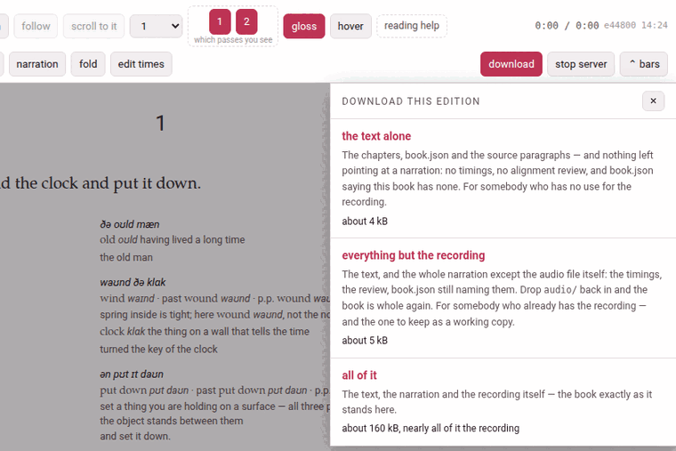

**download**, in the reader's header, gives the whole edition as one zip —
a **bundle** — to keep, to work on in a text editor, or to give to somebody
whose Parseh takes it back whole. It comes back in by the library's **⇩
Bring a book back** panel ([The library](doc:The library)).

## What a bundle carries

One folder named after the book's slug, holding what the book is *made of*:

| Carried | |
|---|---|
| `book.json` | the book's facts |
| every `.tex` at the top of the folder | `main.tex` and the chapters — but not `frankdraft.tex`, which a draft PDF build leaves behind |
| `NOTES.md` | where an edition keeps the account of how it was made |
| `source/` | the original paragraphs the text is checked against |
| `markdown/` | the notes in the seams ([Notes in the seam](notes.md)) |
| `reading.json` | what you folded away, and the paragraphs you took charge of |
| *the narration* | as much of it as you ask for (below) |

and, at the root of the zip, `parseh-bundle.json`: a small manifest saying
what kind of bundle it is, the book's language and gloss language, its slug
and — for a narrated book — its shape. It is what makes the zip something a
toolbox can reason about instead of guess at; only its format is believed on
its word, and everything else in it is checked against the files inside.

**Never in a bundle**: `main.pdf`, `reader/`, LaTeX's `.aux`, `.log` and
`.toc`, and the build keys by which a build knows the book has changed.
They are made from the text, so they would carry the same text twice — and,
carried back in stale, they would show text the chapters no longer say. The
alignment's review page, `review.html`, is not carried either: a bundle may
carry the text the pages read and nothing that would run in them.

## A book with no narration

**download** is a plain link, and the zip is `<slug>-book.zip`. There is
nothing to choose: all three shapes below would give the same bytes. Keep
it in mind if the book is narrated later: brought back over it with
**replace**, such a zip counts as **everything but the recording** and
carries no timings, so the book's `timings.json` and review are deleted
([The library](doc:The library)).

## Three shapes, for a narrated book

A narration is not one file, and not only in `audio/`: it is the recording,
its transcript, `timings.json`, the alignment's review, the fields of
`book.json` that name them, and a `% @par` comment line above every
subparagraph of every chapter, which is where the reader reads its times
from. A recording is also large, and yours in a way the text is not. So in a
narrated book **download** opens a small sheet, *download this edition*,
with three choices:



| The sheet says | The zip holds | Take it when |
|---|---|---|
| **the text alone** — `<slug>-book-text.zip` | the chapters, `book.json` and the source paragraphs, and **nothing left pointing at a narration** | you want the edition and have no use for the recording — to hand to somebody who will read it without one, or to keep the text by itself |
| **everything but the recording** — `<slug>-book-linked.zip` | the text and the whole narration except the audio files: the timings, the review, `book.json` still naming them | the other person has the recording already, or you do: it leaves out nothing but `audio/`, so it is the one to keep as a working copy |
| **all of it** — `<slug>-book-full.zip` | the same, and `audio/` with it: the book exactly as it stands here | the recordings have to travel too |

**The size of each** is shown under it when the sheet opens — *about 4 kB*,
*about 5 kB*, *about 160 kB, nearly all of it the recording* — worked out
from exactly the files that shape's zip will carry, counted as the zip will
hold them. For **all of it** that is every recording the book has (a book
recorded in nine parts carries all nine, and says *…, nearly all of it the
9 recordings*) and anything else in `audio/`: transcripts, and recordings
you removed from the list, which stay in the folder. It is the one number a
browser will not warn you about before you start a download of hundreds of
megabytes. Where the recordings are not on this machine, it says so instead:
*the recording is not on this machine — so this one gives what the middle
one gives*.

Each choice is an ordinary link: the browser's own download takes over, and
the **Working…** indicator shows *Preparing the download…* while the server
packs the zip. **×**, **Esc** or a click outside close the sheet.

### What *the text alone* takes out

Item by item, because the question is always whether an alignment survives:

- `timings.json` — every subparagraph's start, end and confidence, and
  whether it was fixed by hand;
- `review.json` and `review-corrections.json` — the subparagraphs the
  aligner was unsure of, and what you corrected in them;
- the `audio`, `transcript` and `narrations` fields of `book.json` — set to
  null, which is what a book.json with no narration says;
- the `% @par` line above every subparagraph of every chapter. Leave those
  lines in, and the book would still light up in step with a recording the
  zip does not contain. Nothing else in a chapter changes: a whole-line
  comment is swallowed by TeX with its line, so the PDF and the reader set
  the same book with or without them;
- `audio/`.

### *Everything but the recording* looks complete, and is not

It carries the timings, the review, and a `book.json` still naming
`audio/clock-and-wind.mp3` — everything about the narration except the
narration. Brought into a toolbox that has never had the recording, the
book opens with no audio at all: no player, nothing lighting up as it is
read, and **no audio yet** on its card. Nothing is broken and nothing is
lost — the file is simply not there. To make it whole, put the `audio/`
folder back inside the book's own folder (from an **all of it** bundle, or
from wherever you keep it), with the names `book.json` gives, and press
**rebuild** on the book's card: the times were in `timings.json` and the
chapters all along.

**Bringing a bundle back over its own book** is where a narration can be
lost, and how much depends on the shape ([The library](doc:The library)
has the whole table). Taken back with **replace**, **the text alone**
leaves the recording, its transcript, the timings and the review where they
are, and points `book.json` back at the recording. **Everything but the
recording** keeps `audio/`, but its own `timings.json` and review take the
place of the book's: times fixed by hand since the download are lost. **All
of it** puts its own `audio/` in place of the book's: a recording added
since the download is deleted, not moved to the trash. So before a replace,
take a fresh **all of it** download of the book as it stands — the
download itself never changes the book.

## Working on the files in a text editor

A page edits one chunk at a time. A text editor does what a page cannot —
**find and replace across a whole chapter** above all, which is how a name
comes to be spelled the same way in fifteen paragraphs. Take the book away
with **download**, unzip it, work on it, zip the folder up again with its
`parseh-bundle.json` at the root, and bring it back with the library's panel.
The chapter format is in [What a book is made of](doc:What a book is made of).

**What is safe to replace** is anything in a **gloss**: the meaning, the
transliteration, a note. Nothing but a reader's eye reads those, so a bad
one is wrong and not broken. Renaming a character through a chapter's
English, settling on one spelling of a grammatical term: a minute's work in
an editor.

**What is not safe:**

- **The text** — the second argument of every chunk. A replace there breaks
  the check against `source/paras/` unless you change the source the same
  way; a replace typed at the whole file cannot tell the text from the gloss.
- **The vocabulary line**, which is LaTeX: a replace can leave a brace
  unbalanced, and that swallows the arguments after it rather than merely
  making the gloss wrong.
- **A colour** (`\Cred` is an argument, not a word), and the paragraph
  scaffolding (`\parstart`, `\parnum`, the `frank` blocks, the `% @par`
  lines).

You need not check by hand: bringing the book back **is** the check. The
panel refuses a chapter that does not parse (*ch1.tex does not parse: …*),
and a text that no longer reproduces its source (*the text no longer
reproduces its own source paragraphs: MISMATCH chapter 1 paragraph 1 at char
4 of 109 …*, quoting both texts either side of the difference) — and writes
nothing until everything passes.

> **For the command line.** The same bundle can be made, looked into and
> installed without a browser:
>
> ```bash
> python3 lib/bundle.py pack    books/<language>/<slug> --audio text|linked|full
> python3 lib/bundle.py inspect <slug>-book.zip        # what is in it; writes nothing
> python3 lib/bundle.py install <slug>-book.zip [--replace]
> FRANK_BOOK=books/<language>/<slug> python3 lib/verify_book.py   # the text against its source
> python3 lib/texwrite.py books/<language>/<slug>/ch1.tex         # the chunks as the reader numbers them
> ```
>
> Without `--audio`, a book is packed as `linked`.
