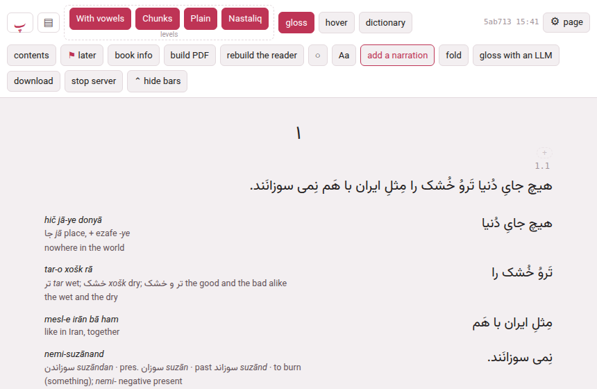
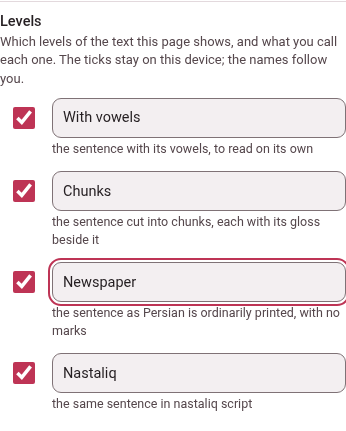
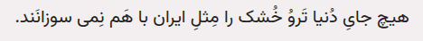
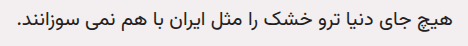

Each subparagraph of a book is set several times over, one after the other,
and each setting is a **level**. Which levels there are depends on the
language. The header of the reader has one button for each, named for what
it shows — **With vowels**, **Chunks**, **Plain**, **Nastaliq** in a Persian
book — under the word *levels*. There are no numbers on them anywhere: not on
the buttons, not in the panel, not in what pointing at one says.

A level is one of a few kinds, and the kind is what a name is kept against:
the sentence on its own, the chunks with their glosses, the sentence as it is
ordinarily printed, the sentence in another face, and — Japanese and Chinese —
the reading alone. Level 1 is your own attempt at the sentence, before any help
arrives; the chunks level is the help; the others give the sentence again, as
it is really printed, in its other face, or as it is read aloud.

## What each language calls them

These are the names a book has until you change them, and the sentence the
panel prints under each ([The ⚙ settings of a page](../getting-started/page-settings.md)).
They come from Parseh's language registry, so a language you add brings its
own ([Adding a language](../lookup-and-languages/adding-a-language.md)).

| Language | The level | What it shows |
|---|---|---|
| Persian | **With vowels** | the sentence with its vowels, to read on its own |
| | **Chunks** | the sentence cut into chunks, each with its gloss beside it |
| | **Plain** | the sentence as Persian is ordinarily printed, with no marks |
| | **Nastaliq** | the same sentence in nastaliq script |
| Arabic | **With vowels** | the sentence with its vowels, to read on its own |
| | **Chunks** | the sentence cut into chunks, each with its gloss beside it |
| | **Plain** | the sentence as Arabic is ordinarily printed, with no marks |
| Italian, French, German, Turkish, English, Hindi, Spanish | **Sentence** | the sentence, to read on its own |
| | **Chunks** | the sentence cut into chunks, each with its gloss beside it |
| Japanese | **Furigana** | with furigana over each word |
| | **Kana only** | the reading alone, in kana |
| | **Chunks** | the sentence cut into chunks, each with its gloss beside it |
| | **Plain** | plain, as Japanese is written |
| | **Vertical** | the sentence in vertical columns (tategaki) |
| Chinese | **Pinyin** | with pinyin over each word |
| | **Pinyin only** | the reading alone, in pinyin |
| | **Chunks** | the sentence cut into chunks, each with its gloss beside it |
| | **Plain** | plain, as Chinese is written |
| | **Vertical** | the sentence in vertical columns (tategaki) |

The buttons come in the order of the table. In Persian and Arabic the first
level has the vowel marks, the third has none and is not a hovering text —
there is no cloud on it, so it is the sentence as a printed page has it.

## Hiding a level

Press a level's button to show or hide it — the level goes and comes back, and
the rest of the page closes up. Or open the panel, **⚙ page → Levels &
reading → Levels**, and tick or untick it there; the two are one switch. What you
choose is kept on this device, for every book: turn everything off but the
sentence to read it alone, or leave only the chunks to work through the
glosses. The choice is made for a *kind* of level, so hiding **Plain** hides it
in every book that has one.

While **hover** is on, the levels it takes over rest — the chunks, the other
face, the vertical one — and the panel says so under the row: *Hover mode
shows the glosses in the cloud instead.* ([The reader](reader.md#hover-mode-and-the-gloss-cloud).)

## Renaming a level

The panel's **Levels** row is one line per level: the tick, a field with the
level's name in it, and under it what the level shows.

Type a new name in the field and the button on the page has it a moment later,
and so does its tooltip, and so does the sentence hover mode's own tooltip
says (*the text alone (the levels With vowels and Newspaper)…*). The rules:

- **Twelve characters at most**, on one line — what a button holds. A name
  that is too long is cut as it is typed.
- **Empty is the default.** Clear the field, or type the default name itself,
  and the level goes back to the name in the table above.
- **A name is for a language.** *Plain* in Persian and *Plain* in Arabic are
  two names, so you can call one **Newspaper** and leave the other. A book in
  that language wears it, whichever book it is.
- **It follows you.** A name is a word you chose, not a way a screen is set up,
  so it is kept by the computer and every device you read on wears it: rename a
  level on the phone and the computer's reader has it the next time it loads.
- **It works in every reader**, however long ago the book was built: the names
  are put on the page when it opens, with no rebuilding.

## Diacritics

A Persian or Arabic sentence can be written with the small marks above and
below the letters that say the vowels, a doubled consonant and a stop. A reader
who knows the word does not need them, and a page full of them is hard to look
at. **Diacritics** puts them away — in the reader, where it is **⚙ page →
Levels & reading → Diacritics**, and in a video's own panel, **Watching &
reading → Diacritics** — and puts them back.

- **Which marks.** Exactly the ones the third level has never had, and that
  the lookups fold away: in **Persian** the eight of U+064B to U+0652 —
  fathatan, dammatan, kasratan, fatha, damma, kasra, **shadda** (the doubling)
  and **sukun** (the silent stop); in **Arabic** the same eight and the
  **superscript alef** (U+0670). One rule, whichever level or video. No letter, hamza or madda is
  touched.
- **Which levels.** The first and the second — **With vowels** and **Chunks** —
  in a book; the lines of the transcript in a video. The third level, **Plain**,
  is as it ever was: no marks at all, as the language is ordinarily printed,
  with no cloud. **Diacritics** does not change that level, and it is not the
  same thing as it: with **Diacritics** off you still have the first level, its
  words still open their cloud when you point at them, the chunk's gloss in it
  — the third level is the same text without the hover.
- **Display only.** The marks are put away from the screen and from nowhere
  else. The book's files, the search, the lookups, the cards, the printed PDF
  and a bundle are exactly as they were. **Selecting text with the mouse and
  copying it gives what is drawn**, without the marks; but **Shift-click**, the
  cloud's **copy** button, a **card** and the chunk editor give the book's own
  text, **with** its marks, and so does the search — a card made from a chunk with
  the marks put away carries the vowelled text.
- **Chapters that come later.** A book of several chapters brings them as they
  are wanted; a chapter that arrives after you turned the marks off arrives
  without them.
- **A video** has the switch only if the video's lines hold marks — a Persian
  video whose captions are written without any has nothing to put away, and no
  row. The lines, the cloud and the colours work as before; copying, cards, the
  editor and every lookup keep the phrase as it was written.
- **On this device.** The switch is kept on this device, and the marks are
  shown to begin with. It is in the panel only — a language with no such
  marks (Italian, Japanese…) has no row.
