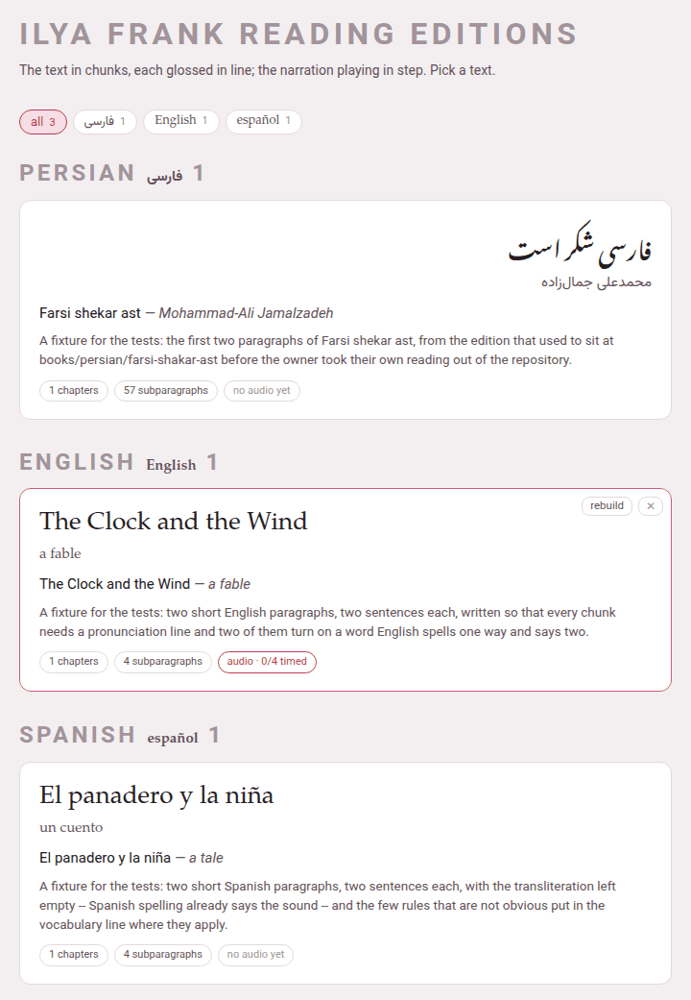

The hub's **Books** door opens the library, `https://localhost:7654/books/`.
It is one page: a row of language chips, the books grouped by language,
the **＋ Add a book** card, and two panels at the foot — one that takes a
single book back in, and one for the whole shelf.

## The language chips

The chips at the top — **all**, then one per language that has a book, with
its count — are the same row every index page of the toolbox carries. A
click shows that language's books and hides the rest; **all** shows them
all again. The choice is one preference for the whole toolbox, so the video
index and the studio open on the same language, and the hub remembers it
too.

## A book's card

Each card shows the title and the author in the book's own script, the
transliterated title and author, the one-sentence blurb, and a row of tags:

| Tag | Means |
|---|---|
| **N chapters**, **N subparagraphs** | what the built reader holds |
| **audio · 12/57 timed** | the book has a recording, and how many subparagraphs have a time in it |
| **no audio yet** | the book has no recording |
| **not built yet** | the book has no reader: nothing has built it |

A click on a built card opens its reader. A card whose book has **not been
built yet** is all one button: clicking anywhere on it builds the book (its
reader and its PDF), and when the build succeeds the page reloads so the
card shows what the new reader says.

Two small buttons sit in the corner of every card, faint until the pointer
is over it:

- **rebuild** (or **build**, on a book never built) builds the book again —
  its PDF and its reader — on the server. The button stays disabled while it
  works; a toast says what the build is doing, line by line, and then
  **built** or **the build failed** with what went wrong — usually the
  first error LaTeX printed. When it succeeds the page reloads, so the card
  shows the new reader; when it fails the page is left as it was, the toast
  shows the error for a few seconds, and the button can be pressed again.
  [The printed edition](doc:The printed edition) has the details.
- **✕** takes the book off the shelf (below).

While a build runs, the **Working…** indicator in the corner of every page
of Parseh says so, and so does the hub's own panel: a book's PDF can take
minutes, and you can go on doing something else meanwhile.

## Taking a book off the shelf

The **✕** on a card asks first:

> *Take “Farsi shekar ast” off the shelf?* It is moved to the trash beside
> the others, not deleted: nothing is lost, and it stops being part of the
> library.

Press **OK** and the book's whole folder — its chapters, its notes, its
recording — is **moved**, not deleted, to `books/.trash/<slug>-<date>-<time>/`.
A toast names the folder it went to, and the library reloads without it.
A reading edition is weeks of glossing and may carry a recording that exists
nowhere else, which is why this button never destroys anything.

To have a book back, move its folder out of `books/.trash/` into its
language's folder (`books/persian/`, say) with your file manager, and give it
back its own name (`mini-fa-20260921-142741` becomes `mini-fa`). The library
page is written afresh by every build, so press **rebuild** on any card and
the book is listed again. Emptying the trash is up to you, in the file
manager: nothing in Parseh ever does it.

## Adding a book

The **＋ Add a book** card opens `/books/add/`, which offers three ways to
begin a book: writing it here by hand, adding text to a book already on the
shelf, or handing the work to an LLM outside Parseh.
[Adding a book](doc:Adding a book) walks through all three.

## ⇩ Bring a book back

The first panel at the foot takes a **bundle** — the zip the reader's
**download** makes — back into the toolbox: a book you took away, worked on
elsewhere and zipped up again, or a book somebody else sent you from their
own Parseh. **Choose the zip — or drop it here**: click the dashed box to pick
the file, or drag the file onto it.

While the zip goes up and is checked, the panel says **Reading
<file>…**, and the **Working…** indicator lists the upload. Everything is
checked in a staging folder beside where the book is going, and the book's
folder is not touched until all the checks have passed: a bundle that fails
leaves nothing behind.

When it is in, the panel says what went in and where — *mini-en is in, at
books/english/mini-en — an English book, 9 files, 6.8 kB* — and, for a
narrated book, **which of the three shapes** the bundle was packed as
([Taking a book away](doc:Taking a book away)):

| Packed as | The panel says |
|---|---|
| **the text alone** | it carries no narration at all — no recording, no timings, no alignment review, and its book.json says the book has none |
| **everything but the recording** | it carries the timings and the alignment review, but not the audio file itself |
| **all of it** | the recording came with it |

Anything else worth a second look is listed under it, and the answer ends
with **reload the list**. The book is on the shelf at once, **not built
yet**: reload the list and press **build** on its card, as for any book that
has never been built. The PDF, the reader and the build keys never travel in
a bundle — they are made from the text, so they are made again.

### When the book is already here

If a book with that name is already on the shelf, the panel stops and asks:
*mini-en is already in the toolbox, at books/english/mini-en. Ticking replace
overwrites its authored files with this bundle's.* Two buttons answer it:

- **replace** puts the bundle's chapters, `book.json`, sources, notes and
  `reading.json` in place of the ones here, and as much of the narration as
  the bundle carries (below);
- **leave it** closes the question and changes nothing.

The question does not say which shape the bundle was packed as, and for a
narrated book that is what decides what a replace costs (below). The file's
name says it, as long as nobody has renamed it: `<slug>-book-text.zip`,
`<slug>-book-linked.zip` or `<slug>-book-full.zip`, and plain
`<slug>-book.zip` for a book that had no narration when it was downloaded.

What happens to a narration the book already has depends on the shape the
bundle was packed as — what a shape carries, it puts in place of the book's
own:

| Packed as | The narration already here |
|---|---|
| **the text alone** | **kept whole**: the recording, its transcript, `timings.json` and the alignment review stay, and `book.json` — which in this shape says the book has no narration — is pointed back at the recording it still has. The times are safe in `timings.json`, and the answer says so. |
| **everything but the recording** | `audio/` is kept — the recording and its transcript — but `timings.json` and the review files are the **bundle's**. Times you fixed by hand since the bundle was made are lost. The answer says *the recording already in audio/ was kept, and the timings are this bundle's*. |
| **all of it** | the whole `audio/` folder is the **bundle's**, and so are the timings and the review. A recording added to the book since the bundle was made is **deleted** — not moved to the trash — and the answer does not mention it. |
| a bundle made **before the book had a narration** (the plain `<slug>-book.zip`, no shape) | counts as **everything but the recording**, and carries no timings: `audio/` stays, but `timings.json` and the review are deleted, and the bundle's `book.json` says the book has no recording. Nothing in the answer says so. |

So before you replace a narrated book with anything but **the text alone**,
take a fresh **download** of it as it stands, choosing **all of it**
([Taking a book away](doc:Taking a book away)): that zip holds every
recording and every time the book has now, and brings them all back if the
replace takes something you wanted.

What is never kept, whatever the shape, is what was made from the old
text — the reader, the PDF, the build keys — so press **build** on the card
afterwards. The build also writes the times from `timings.json` back into
the chapters, which is where the reader reads them from.

### What it refuses

A refusal names its reason, and nothing is written:

| It says | Which means |
|---|---|
| *that is not a Parseh bundle: it carries no parseh-bundle.json …* | the zip was not made by a **download** button; a zip of a folder is not a bundle |
| *that is a video bundle; this is where a book goes* | a video's bundle belongs on the video index's own panel |
| *this bundle carries '…', which is not a path inside it — refused whole, and nothing was unpacked* | an entry that would land outside the book's folder |
| *parseh-bundle.json says the language is fr and book.json says en — they must agree* | the manifest is checked against the files inside |
| *this bundle is in language 'xx', which this toolbox has not got* | the book is in a language this toolbox does not have yet |
| *book.json says main "main.tex", which the bundle does not carry* | a file the book needs is missing |
| *ch1.tex does not parse: … A \ch takes five brace groups …* | usually a find-and-replace that broke a brace in a vocabulary line |
| *the text no longer reproduces its own source paragraphs: …* | a chunk's text was changed without the source paragraph; see [What a book is made of](doc:What a book is made of) |

Opened straight off the disk rather than through Parseh, the panel says
*This page is open off the disk* and offers nothing: there is no server to
send the zip to.

## ⇩ The whole shelf

The second panel backs up **every book at once**, and puts them back:

- **Backup every book** downloads one zip, `books-backup-<date>-<time>.zip`,
  holding one bundle per book — each one the **everything but the
  recording** shape. The recordings are left out to keep the backup small:
  copy each book's `audio/` folder yourself if you want them kept too, and
  after a restore put `audio/` back in the book's folder and press
  **rebuild** on its card. Because the backup is a zip of ordinary bundles,
  any one book can be taken out of it and brought back on its own with the
  panel above.
- **Load from backup** picks such a zip and puts every book in it back. The
  button stays disabled while it works (*… this can take a while*). A book
  **already on the shelf is left as it is**, and the panel names the ones it
  kept — *4 books here already were left as they are: …* — with two buttons:
  **Replace them**, which sends the backup again and overwrites those books
  with the backup's copies — anything written since the backup was made is
  lost, the timings of a narration included, while the recordings in
  `audio/` stay, as with any **everything but the recording** bundle
  (above) — and **Keep mine**, which leaves them alone. The answer ends *N books
  put back — reload the page to see them*. A book in the backup that cannot
  be put back is reported and skipped; the others still go in.

Both show on the **Working…** indicator while they run. Off the disk, the
panel says *Open this page from the toolbox's own address to back up or
restore.*

The bar at the top of the library carries the theme button — ○, ● or ◐ for
light, dark or sepia; each click moves to the next, for the whole toolbox —
and **⏻ stop**, which stops the
Parseh server — asking first, and naming anything still running, such as a
build, that stopping would cut off.
