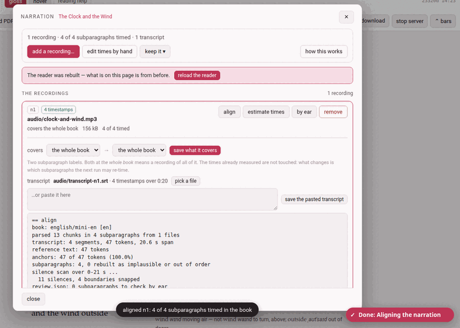

A narration is added **after** the book exists, from the reader: **narration**
in its header — **add a narration**, highlighted, in a book that has none
yet. It opens the narration panel over the page and pauses the recording.

## The panel

A book's narration is a **list of recordings**, and the panel is that list:
one row per recording, saying which file it is, what stretch of the text it
covers, and how much of that stretch is timed. Everything that can be done
to a recording is done from its own row.

Above the list is what is about the **book**:

- a summary: *1 recording · 4 of 4 subparagraphs timed · 1 transcript*
  (and how many times were fixed by hand);
- in red, whatever is wrong — `book.json` naming a recording or a transcript
  that is not there, a transcript with no timestamps in it, saved times that
  no longer match any subparagraph because the text was edited after they
  were measured, ffmpeg missing;
- **add a recording…** — the one way to put a recording in;
- **edit times by hand** — closes the panel and turns on **edit times**
  ([Fixing the timings](doc:Fixing the timings));
- **keep it ▾** — the narration file, below;
- **how this works** — the short version of this page, in the panel.

Almost everything here ends by rebuilding the reader, and the page on the
screen was built before: a bar then says *The reader was rebuilt — what is
on this page is from before* with **reload the reader**, and closing the
panel (**close**, **✕** or **Esc**) reloads it for you. Every action is on
the **Working…** indicator while it runs, and the panel waits, its buttons
disabled, until it is done. Opened from the disk, the panel says it cannot
reach the server.

## Adding a recording

**add a recording…** opens two pickers and a button:

1. **covers** — the first and the last subparagraph this recording reads,
   by their labels (*1.1 · ch 1* … *2.2 · ch 1*). Leave both at **the whole
   book** for a recording of all of it.
2. **pick the audio file** — mp3, m4a, webm, ogg, opus, wav… The file is
   copied into the book's own `audio/` folder, with a progress bar while it
   goes up. A narration is yours, and large: it is never committed to git.

What happens next depends on the first step:

- **A stretch named.** The file joins the recordings already there, and —
  since it has no transcript yet — is given a **first guess** at its times
  as it lands: the recording is shared out over the stretch it covers, each
  subparagraph a slice in proportion to how much text it has. It plays at
  once; what drifts is nudged afterwards, by ear.
- **The whole book.** The file becomes the book's one recording, untimed
  until you align it or estimate its times. On a book that already has
  one recording, you are asked first — *Replace n1?* — because the old file
  then stops being the narration. It stays in `audio/`, and the times in
  `timings.json` stay as they are, read from then on as times in the new
  file. To keep both, cancel and name the stretch the new one covers.

A toast says *clock-and-wind.mp3 is on the shelf* (and how many
subparagraphs got a first guess).

## A recording's row

Each row carries its **id** (`n1`, `n2`…, the name `book.json` and
`timings.json` know it by), tags — **N timestamps** when it has a usable
transcript, **no transcript**, **transcript unusable**, **file missing** —
the file's name, and a line of facts: *covers the whole book · 156 kB · 4
of 4 timed · 1 by hand*. Where a button cannot be used, a line under it
says why. The four buttons:

| Button | What it does |
|---|---|
| **align** | works this recording's times out from its **own transcript** (below). Needs a transcript with timestamps. |
| **estimate times** | shares the recording out over the stretch it covers, in proportion to the length of each subparagraph: a first guess, no transcript needed. Needs to know how long the file is — ffmpeg, or a `.wav`. |
| **by ear** | opens the boundaries between one subparagraph and the next over a picture of the sound: [Fixing the timings](doc:Fixing the timings). Needs times to move. |
| **remove** | takes the recording off the book. The file itself stays. |

A click on the row's name opens its drawer:

- **covers** — the two pickers again, and **save what it covers**. The times
  already measured are not touched: what changes is which subparagraphs
  the next run may re-time.
- **transcript** — the one this recording has, and how many timestamps over
  how long; **pick a file**, or paste one into the box and press **save the
  pasted transcript**.
- the log of the recording's last run, when it said something.

What a run said stays in its row until the next one, and a toast says so
too.

## Transcripts

A transcript is a **time index**, never a text: not a word of it goes into
the book. It tells the aligner roughly *when* each thing is said; the book
says *what*. Any of these will do:

- YouTube's transcript copied whole, from the video's *…more → Show
  transcript* panel: click into the panel, select all, copy, and paste it
  into the row's box. The *N seconds* lines can stay.
- a subtitle file, `.srt` or `.vtt`;
- the subtitles a speech-recognition program such as whisper writes for a
  recording of your own.

It belongs to one recording, and is given to it from inside its row: a book
recorded in parts has one transcript per part.

## Align

**align** runs the aligner over that one recording: the transcript says
roughly when, the text says what, and the cuts are snapped to the silences
in the sound. It writes the times into `timings.json` and into the chapter
files (as `% @par` comment lines above each subparagraph), and rebuilds the
reader and the library page. The row says *aligning… a minute or two for a
whole novel*; the toast then says *aligned n1: 4 of 4 subparagraphs timed in
the book*, and the log in the row gives the details — how many times were
anchored, how sure it is of each, which ones to check by ear.

A recording that already has times asks first — *Align n1 again?* — and
re-aligning keeps the times you fixed by hand, unless you tick **start over,
dropping the times fixed by hand**. A first guess made by **estimate times**
does not count as fixed: aligning replaces it without the tick.

Two helpers make the alignment better and neither is required: *rapidfuzz*
(without it the matching is plainer and rescues fewer near-misses) and
*ffmpeg* (without it the cuts are not snapped to silences, and a recording's
length can only be read from a `.wav`). **how this works** says which are
installed.

## Estimate times

**estimate times** needs no transcript: it lays a first guess over the whole
stretch the recording covers. The guess says what it is — a guess, at a low
confidence — so an alignment later replaces it. On a recording that already
has times it asks first, *Give n1 a first guess?*, and a stretch already
timed for real is refused unless you tick **lay the guess over the times
already there**. The toast says how many subparagraphs were given a guess:
*play them and fix what drifts*.

## A book in several recordings

A book need not be recorded all at once. Give each file the stretch it
covers, and each becomes a row of its own:

- **The files stay apart.** Nothing is joined: each recording is the file
  you made, in `audio/`, and the reader moves from one to the next as you
  read across the seam.
- **Each has its own clock.** A recording's times are seconds into *that*
  file, so every part starts near zero.
- **Aligning one touches only its own text.** **align** on a row re-times
  the subparagraphs that recording covers and leaves every other part as it
  was. It is also the easier alignment: a few minutes of sound against a
  few paragraphs, rather than a novel against six hours.

A book with one recording is simply a list of one, covering *the whole
book*.

## Removing a recording

**remove** asks first — *Take n1 off the book?* — and says what it does: the
file stays in `audio/`, and the times it measured stay in `timings.json`.
To have it back as a recording, use **add a recording…** again and say what
it covers.

## A narration found elsewhere

An audio file lying where the toolbox has kept narrations — the file
`timings.json` was made against, the root `audiobook/` folder of an earlier
layout, the book's own folder or its `audio/` — that no recording of the book
names (a recording you removed, say) is listed under **found elsewhere**,
with its size and where it was found, and **use <file>**. Using it (after a question) points
`book.json` at that file and rebuilds the reader; the times already in
`timings.json` are kept and nothing is re-aligned. It does not join the list
of recordings — **add a recording…** is what does that.

## Keeping a narration: keep it ▾

- **export a narration file** downloads one zip holding the recording, its
  transcript, the times and a small manifest — to keep beside the book, or
  to give to someone who has the same edition. A book in several recordings
  exports its first recording only, and the tooltip says so.
- **import a narration file…** takes such a zip on another copy of the book
  and lays it over this book's narration: the audio and the transcript go
  into `audio/`, `book.json` is pointed at them, and the times inside
  replace `timings.json` whole — the times fixed by hand included. Where the
  book already has a narration you are asked first. The previous times are
  kept as `audio/timings.before-import.json`.

To take the whole book *with* its narration, use the reader's **download**
instead ([Taking a book away](doc:Taking a book away)).
