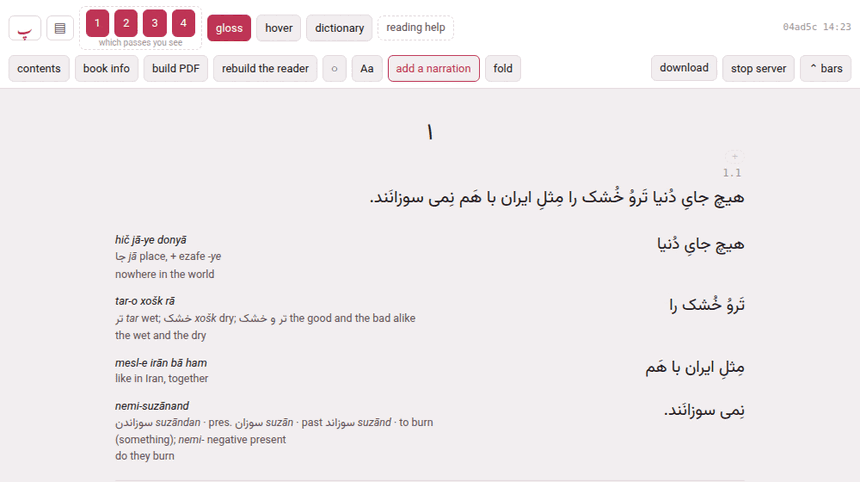

Click a card on the library and the book opens in its **reader**, at
`/books/<language>/<slug>/reader/`. It is one page: a header with the
controls, and the book under it, subparagraph by subparagraph, each set in
the passes its language has.

## The header

The header has two rows (three while the narration's own player shows, in
*edit times* or while nothing is timed yet). What is in it depends on the
book: the playing controls appear only in a book with a recording, and the
reading-help switches only where something is installed for the language.

**The first row** — getting about, playing, and what is shown:

| Control | What it does |
|---|---|
| **پ** | back to the hub |
| **▤** | back to the library |
| **▶** / **‖**, **continuous**, **loop**, **stop at a change**, **listen**, **follow**, **scroll to it**, the speed | playing the narration: [Playing and listening](doc:Playing and listening). Only in a book with a recording. |
| **1 2 3 4** … *which passes you see* | one button per pass; each shows or hides its pass, and its tooltip says which pass it is. The choice is remembered for every book. |
| **gloss** (**G**) | shows or hides the glosses beside the chunks, leaving the chunks themselves |
| **hover** (**H**) | hover mode: the text alone, and a chunk's gloss in a cloud when you point at it (below) |
| **dictionary**, **definitions**, **in *english*** | reading help where nothing is glossed: [Reading a book nobody has glossed](doc:Reading a book nobody has glossed). Shown only when a dictionary, a corpus or a translation model is installed for the language. |
| **reading help** | opens `/lookup/`, where dictionaries, corpora and models are installed |
| the time | in a book with a recording: where it is, `0:42 / 12:05`, and which recording when there are several |
| the build stamp | which build of the reader this is, and when it was made (`04ad5c 14:23`) |
| **draft** | the book is a draft ([Adding a book](doc:Adding a book)) |
| **PDF behind the text — build it** | appears after an edit: the reader shows it, the PDF does not yet. Click it to build the PDF. |

**The second row** — the book's own tools:

| Control | What it does |
|---|---|
| **contents** (**C**) | the table of contents: [Contents, sections and folding](doc:Contents, sections and folding) |
| **book info** | the title, author, year and blurb (below) |
| **build PDF** | builds the PDF, and the reader with it, on the server: [The printed edition](doc:The printed edition) |
| **rebuild the reader** | writes this page again, without LaTeX — what a book built before a new feature needs to gain it |
| **○ ● ◐** | the theme — light, dark, sepia — one choice for the whole toolbox |
| **Aa** | text size and margins (below) |
| **narration** — **add a narration** in a book with none | the recordings of the book: [Adding a narration](doc:Adding a narration) |
| **fold** | folds a run of paragraphs away: [Contents, sections and folding](doc:Contents, sections and folding) |
| **edit times**, **save times (N)**, **discard edits** | fixing the timings by hand: [Fixing the timings](doc:Fixing the timings). Only in a book with a recording. |
| **download** | the book as one zip: [Taking a book away](doc:Taking a book away) |
| **stop server** | stops Parseh. It turns into **really stop?** for four seconds, and a second click stops it — after naming anything still running (a build, an upload) that stopping would cut off. Your place and your speed are saved first. |
| **⌃ bars** | puts the header away (below) |
| **Decompose Kanji** / **Decompose Hanzi** | Japanese and Chinese only (below) |

## Reading place

A click anywhere in a subparagraph makes it the **reading place**, and
highlights it — and, where it has a time in the recording, plays it. The
place is remembered for each book in this browser: open the book again and
the page goes back to it. **→** and **←** move to the next and the previous
subparagraph.

The contents are links, so the address bar carries the paragraph you jumped
to — `…/reader/#par-2-6` — and sending that address to yourself (from a
phone to a computer, say) opens the book at that paragraph.

**One chapter at a time.** A book of several chapters arrives with its first
chapter only; every other chapter is fetched when it is wanted — the
contents jumped into it, the reading place is in it, the narration played
into it, or you simply read on and it came near. Nothing else changes, and
it is what makes a long novel usable over a phone's connection to a
computer at home. The one thing given up: the browser's own find-in-page
sees only the chapters that have arrived. The filter of the contents finds
every paragraph of the book.

## Passes and glosses

The numbered buttons show and hide the passes one by one: turn everything
off but pass 1 to read the sentence alone, or leave only the chunks to work
through the glosses. **gloss** keeps the chunks and hides their glosses, so
you can test yourself against the column of chunks. Every choice is
remembered in this browser.

## Hover mode and the gloss cloud

**hover** (or **H**) strips the glosses out of the page, so you read the
text clean, and shows a chunk's gloss only when you point at it in pass 1.
It is how an edition is meant to be read once a chapter stops being new.
While it is on, the buttons it swallows — the chunks-and-glosses pass, the
alternate face or the vertical pass, and **gloss** — go grey, because
pressing them would change nothing; the text passes keep their buttons.

The **cloud** holds the chunk's reading (in Japanese), its transliteration,
its vocabulary line and its meaning, and under them three buttons:

- **+ card** makes a card of the chunk (below);
- **⨉ copy** copies the chunk's text;
- **✎ edit** opens the chunk for writing ([Writing a chunk](doc:Writing a chunk)).

The cloud stays open while the pointer moves into it, and goes when the
pointer leaves or you click elsewhere. On a touch screen, a **tap** on a
chunk opens its cloud and a second tap closes it.

A chunk that nobody has glossed yet has no vocabulary line, and where
nothing is installed for reading such chunks the cloud says *nothing glossed
here yet* and links to the page that sets it up. Where something is, and the
**dictionary** switch is on, the cloud holds what it found instead
([Reading a book nobody has glossed](doc:Reading a book nobody has glossed)).

## Copying

A plain click sets the reading place and a modifier-click makes a card, so
copying takes a held **Shift**. With Shift held, the chunk under the pointer
is outlined; **Shift-click** it — in any pass — and its text is on the
clipboard. Shift-click beside a chunk and you copy the whole pass, the
sentence. A toast says what was copied. On a touch screen, where there is
no Shift, use **⨉ copy** in the cloud. Readings (the kana over Japanese
words) are never copied with the text.

## Making a card

**Alt-click** (or **Ctrl-click**, or **⌘-click** on a Mac) any word of a
chunk — in pass 1 or in a chunk row — and the card sheet opens with that
word; **+ card** in the cloud does the same for the whole chunk. The sheet
sends the card to **Anki**, to one of the toolbox's **exercise decks**, or
as **markdown** to the clipboard, as a vocabulary, opposites or jolly card,
with a recording cut from the narration if you like (**🔊 cut the audio…**).
The Cards and Anki section of this guide covers the sheet in full; the
narration pauses while it is open.

## Aa: text and margins

**Aa** opens a panel of sliders, remembered in this browser; **reset** puts
back the printed edition's proportions, and **✕** or **Esc** closes it.

| Slider | Range | What it sets |
|---|---|---|
| ***the language*** (Persian, Japanese…) | 14–36 px, 20 to begin with | the size of the text |
| **glosses** | 10–20 px, 12.5 | the size of the glosses |
| **width** | 480–1400 px, 760 | the width of the column |
| **leading** | 0.7–1.6×, 1 | the space between the lines |
| **columns height** | 10–40 em, 22 | Japanese and Chinese: the height of the columns of the vertical pass |
| **character spacing** | 0–1 em, 0 | Japanese and Chinese: space between the characters of the running text |
| **reading contrast** | 0–100 %, 0 | Japanese: how dark the furigana are, from the faint grey of the page's secondary text to the full ink of the text |
| **reading / kanji size** | 10–200 %, 50 | Japanese: the size of the furigana against the characters under them |

The three Japanese and Chinese sliders act on the running text; the cloud
always keeps the full reading.

## Japanese and Chinese

**Readings over the words.** Pass 1 sets each word under its reading — kana
in Japanese, pinyin in Chinese — as the chunk's **word line** divides it
(a chunk without a word line has its kana spread over its kanji as far as
the kana allows). The word line is written in the chunk sheet's words strip
([Writing a chunk](doc:Writing a chunk)).

**I know this.** A reading you no longer need can be hidden. In the gloss
cloud, each word with a reading has a button, **<word>: I know this**;
pressed, it becomes **<word>: show reading**, and the reading of that word
is hidden wherever it appears in this book. A chunk without a word line has
one button per kanji instead — **<kanji>: I know this** — and a compound's
reading hides once all its kanji are known. A word hidden because all its
kanji are marked says so: unmark one of the kanji to see it again. The
choices are kept in this browser, for this book.

**Decompose Kanji** (in a Japanese book) or **Decompose Hanzi** (Chinese), at
the end of the second row, turns on a mode in which every character of the
text is a button: a bar says *Choose a kanji in the text* with **Done** to
leave. Click a character — or **Tab** to it and press **Enter** or
**Space** — and a window shows how it is built: a tree of its components,
each with its meaning from the installed dictionary (or *Meaning
unavailable*), and the way they are put together (*Left and right*, *Top
and bottom*…). Click a component to explore it in turn; **← Back** and
**Return to <character>** walk back. **Esc** closes the window, and a second
**Esc** leaves the mode. The narration pauses while the window is open.

The components come from packs installed once on the **reading help** page
(`/lookup/`, section *Kanji & Hanzi components*): until one is, the button
opens a window saying *Install character components*, with a link to that
page. A character no pack describes says so.

**Kanbun.** A Japanese or Chinese text read out of its written order —
kanbun — can say so in **book info** (below): the words strip then stops
warning that the words' readings, run together, disagree with the chunk's
own reading.

## Book info

**book info** opens a sheet for what the chunks do not reach: **title**, its
**translit.**, the **English** title (the title in the gloss language),
**author** and its **translit.**, **year**, and the **blurb** the library
card shows — and, for Japanese and Chinese, **order: read out of its written
order (kanbun)**. **save** (**Ctrl+↵**) rewrites `book.json`, and the reader
is rebuilt with the new title at once.

The title, the author and their transliterations are also the PDF's title
page, written into `main.tex`, so saving rewrites that too — or refuses the
whole edit, and says why, if a new value cannot sit there (a character LaTeX
reads as an instruction, for instance). The PDF itself catches up at its
next build: **PDF behind the text — build it** appears in the header.
**Esc** closes the sheet without saving; the narration, paused while it is
open, plays on.

## The bars, and a phone

**⌃ bars** puts the whole header away and gives the window to the text; one
faint **⌄ bars** button stays in the corner to bring it back. The choice is
remembered for every book: it is a way of reading, not a property of one
book.

On a phone (a screen 560 pixels wide or less) the header also slides out of
the way by itself as soon as the page moves down, and comes back on the
smallest move up — so no button is ever a chapter's scrolling away. While
the bars are put away by hand, that sliding stands down, and **⌄ bars** is
what brings them back. The reader has no separate version for the toolbox's
**Mobile** mode: it is the same page in both modes, and adapts to the width
of the screen.

## Keys

| Key | Does |
|---|---|
| **Space** | play / pause |
| **→** **←** | next / previous subparagraph |
| **R** | loop this subparagraph |
| **G** | glosses on / off |
| **H** | hover mode on / off |
| **C** | the contents |
| **E** | write the chunk under the pointer (or in the cloud) |
| **Esc** | close whatever is open |
| **Ctrl+↵** | save, in a sheet that has a save button |

None of them fires while you are typing in a box.

**Opened off the disk.** A reader is a file, and can be opened straight from
the disk (`reader/index.html`) to read; everything that writes — editing,
the narration panel, folding, building — needs the page served by Parseh,
and says so instead of failing quietly.
