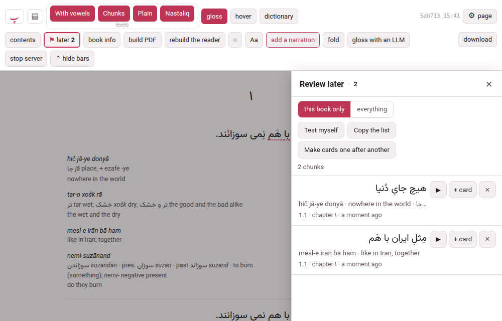
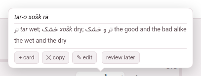
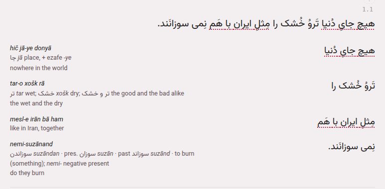
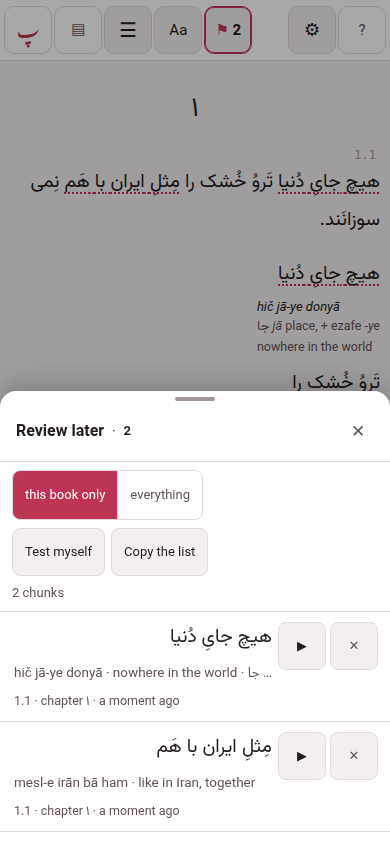
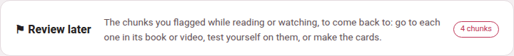
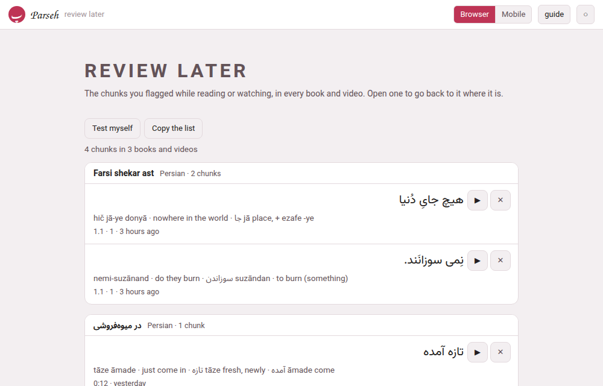

Reading a story, or watching a video, you meet a chunk you want to come
back to — and stopping to make its card breaks the pace that makes reading
worth it. **Review later** is the other way: flag the chunk and go on, and at
the end of the chapter, or the day, open the list and do something with it —
go back to it where it stands, turn it into a card, test yourself on it, or
copy the lot out.

Everything on this page is the same in a book and in a video; where they
differ, it says so.

## Flagging a chunk

There are four ways, so that one is always at hand. All of them flag the
chunk and nothing else — the page does not move and the recording does not
stop, and a line at the bottom says *marked to review later*.

- **The cloud's button.** Open a chunk's gloss cloud — point at it, or tap it —
  and under the gloss, beside **+ card**, **copy** and **edit**, is **review
  later**. Press it and it reads **✓ marked**; press it again and the flag is
  taken off.
- **The L key.** Point at a chunk and press **L**: the chunk under the pointer
  is flagged, or the one whose cloud is open. In a book, with nothing under the
  pointer, it is the chunk the ✎ pencil is on; if there is none, a line at the
  bottom says *point at a chunk first, then press L*. It does nothing while you
  are typing in a box, nothing while a sheet is open over the page, and nothing with
  **Ctrl**, **Alt** or **⌘** held. **L** on a flagged chunk takes the flag off.
- **The ⚑ button.** On a computer, in a book, beside the ✎ pencil that stays
  by a chunk: it flags that chunk, in any level, without hover mode — nothing
  needs to be open. It reads **✓⚑** once the chunk is flagged, and a press then takes
  the flag off. A video has no pencil, and so no **⚑** beside it: it has the other three
  ways.
- **A held finger.** On a touch screen, in a book and in a video, hold your finger on a
  word: the small menu has **Review later: “the chunk”** beside **Copy**, and its last
  row reads **Take “…” off review later** once the chunk is flagged.

{width=45 align=center}

A flagged chunk wears a **quiet dotted line under it, in the page's accent
colour**, in every level of a book that sets the chunk, in a video's phrase and in the
subtitles over a video on the whole screen, so that
you can see what you have flagged as you read on. It is a line, not only a
colour, so it shows in all three themes and to anyone who does not tell colours apart.

A phone can flag, list, go to, test itself on and copy; it never makes a card,
because a phone never edits ([Browser and Mobile](../getting-started/mobile-mode.md)).
It works in every book's reader, however long ago the book was built: nothing needs
to be built again.

**Diacritics changes nothing here.** A flag is made of the book's own text, with its
vowel marks, so a chunk flagged with the marks put away is the same flag as one
flagged with them shown, the list shows it as the book wrote it, and a card made from
it carries the marks ([Levels and their names](levels.md#diacritics)).

## The list

A button in the header, **⚑ later 3** in a book and **⚑ 3** in a video's player — the number is
how many chunks of *this* book or video are flagged — opens the list. In a book it is in the second row,
beside **contents**; in a video's player, in the bar after the title, where on a window
narrower than 1480 pixels it reads just **⚑ 3**; on a phone, on
the first line, once something is flagged — there too it is just **⚑** and the number.

- **On a computer** the list is a panel on the right, under the header, as
  wide as the contents panel. The header stays in reach, so **▶** and the levels
  go on working, and it does not pause the recording. **Esc** or **✕** shuts it,
  and opening it shuts the contents, and the other way about.
- **On a phone** it is a sheet from the bottom edge, as the dictionary's is, and
  the back gesture shuts it.

{width=45 align=center}

The chunks are in **reading order**, this book's or this video's. Each shows the
chunk in its own language and direction, its gloss on one line — press it to
open every part: the reading, the transliteration, the meaning, the
vocabulary, the sentence it was in — where it is (*1.1 · chapter 1* in a book,
*12:41* and the chapter's name in a video) and how long ago you flagged it. Under the header of the
list there are the tools, and on each chunk there are the buttons:

- **▶** — go to the chunk. In a book it loads the chapter if it has not
  arrived, scrolls to the chunk, lights it for a moment and makes it the reading
  place; it does **not** start the recording. In a video it seeks to the caption
  and plays. The list closes behind it.
- **✕** — take it off the list. A line at the bottom says *removed* with
  **Undo** beside it, for six seconds.
- **+ card** — make a card from the chunk. [Below](#making-cards-from-it).
  Computer only.
- **this book only | everything** — which flags the list shows: this book's
  (**this video only** in a player), or every book's and video's, grouped under
  the book or video each is in.
- **Test myself** — see below.
- **Copy the list** — see below.

An empty list says how to flag one — *Point at a chunk and press L, or use
review later in its cloud — on a phone, hold your finger on a word* — and, if
other books have some, offers to show them.

### Test myself

**Test myself** hides the meanings and shows only the chunks. Tap a chunk and
its meaning appears with two buttons: **I know it**, which takes the chunk off
the list (*known · removed from the list*, with the same **Undo**), and
**again**, which hides the meaning and keeps the chunk for next time. The line
above says how many are to go. **Stop testing** goes back to the list.

### Copy the list

**Copy the list** asks which shape — **as a list (markdown)** or **as a table
(tab-separated)** — and puts it on the clipboard, for the chunks the list is
showing. The list is one heading for each book or video and a line for each
chunk with its gloss and place, ready for a note in the studio; the table has
a column each for the chunk, its reading, transliteration, meaning, vocabulary
and sentence, its place, its title, its language and the day it was flagged,
ready for a spreadsheet.

## Making cards from it

**+ card** on a chunk opens the same card sheet **+ card** in the cloud opens,
for that chunk, after loading its chapter if need be: the sheet's remembered
target, deck and type stay as you left them ([Making a
card](../cards-and-anki/making-a-card.md)). The chunk **leaves the list when the
card is saved** — to Anki, to an exercise deck or as Markdown on the clipboard —
with the same line and **Undo**; close the sheet without saving and it stays.

**Make cards one after another** works through the whole list: a strip says
*item 2 of 7* with **Skip** and **Stop**, and after each save the next chunk's
sheet opens. It is for the end of a chapter, when you want the cards made and
not the choosing.

Both are on a computer only.

## A chunk that has moved

A flag remembers where the chunk was — the subparagraph, the place in it, the
chapter — and what the chunk said. If the book was edited since and the chunk
is not there any more, the flag is **adrift**: it stays in the list with the text
and the gloss it was saved with, and says *this chunk is no longer where it
was*. **▶** and **+ card** are shut with that reason; **✕**, **Test myself** and
**Copy the list** still work, so nothing is lost. A chunk that only moved — a
boundary was cut or joined next to it — is found again by its text.

## The hub's door and its page

The hub has a door, **⚑ Review later**, on the browser interface and the mobile
one, with the number of chunks flagged (*nothing marked yet* where there are
none; the language chips count only that language's). It opens a page,
`/later/`, with every chunk you flagged **in every book and video**, grouped under
the book or the video it is in, with its language and count. The list has the
same tools — **Test myself**, **Copy the list**, **✕** — and every chunk's **▶**
opens the book or the video **at that chunk**, with the list open on it.

{width=60 align=center}

The page is one column on both layouts, with rows a finger high under the
mobile one, and it opens on a phone when the computer is away: it shows what
the phone has.

## Where the flags are kept

**They are yours, not the book's.** A flag is kept by the computer Parseh runs
on, in `config/prefs.json` beside the places you were reading, and follows you
to your other devices; it is **never written into a book**, so it is not in
the book's folder, not in a bundle you download or hand on, and not in a
backup of the shelf — [what no backup holds](../getting-started/backups.md#what-no-backup-holds)
names the file.

- **A phone keeps its flags on itself** and sends them to the computer at the
  next chance — when a page loads, when it comes back online, when you come
  back to the page. The list says *1 change will be sent when the computer can
  be reached* until it has.
- **One chunk is one flag**, whatever flagged it: flag the same chunk on the
  phone and on the computer and there is one.
- **The newest change wins.** Remove a flag on the computer and a phone that
  was away, and still has it, cannot bring it back: the removal is remembered for
  90 days.
- **There is room for 5000 flags**; past that the oldest go, and each text is
  cut to a sensible length.

A **video** is flagged the same way and listed the same way: the cloud's
button, the **L** key, the held finger, **⚑ later** in the player's bar, and the
list on the right, where **▶** seeks to the caption and plays it
([The video player](../videos/the-player.md#review-later)).
