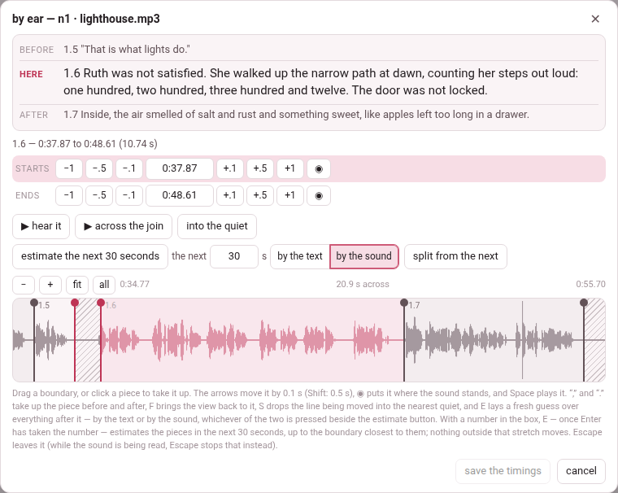

An alignment, or a first guess, times a whole recording at once, and some
of what it does will drift: a subparagraph that starts a word late, one that
swallows the breath before the next. Two tools put that right, and both
save through the same door, so a time moved in one and a time moved in the
other are written, merged and rebuilt by the same code, and both count as
**fixed by hand** — which a later **align** keeps unless told to start over.

## Edit times: one subparagraph at a time

**edit times** in the header (or **edit times by hand** in the narration
panel) turns the reader into a timing editor. The narration's own player
appears as a third row of the header — play it, seek in it — and every
subparagraph shows, under its label:

- **▶**, which plays it, and its length in seconds;
- a **start** row and an **end** row, each: **−1 −.5 −.1**, the time itself
  in a box, **+.1 +.5 +1**, and **◉**, which sets it to where the player's
  playhead is now;
- **undo**, which puts that subparagraph's times back as they were.

How it behaves, and why:

- **You hear every move.** Moving a start plays the first second and a half
  of the subparagraph; moving an end plays its last second and a half. That
  is how you hear whether you have put it right.
- **An end moves the next start with it.** Setting a subparagraph's end moves
  the next one's start to meet it, so the narration has no gap. They stay two
  numbers, so either can be pulled apart again afterwards. Never across two
  recordings: the next start is then a time in another file.
- **A subparagraph with no time yet** is timed by typing its start and its
  end into the boxes; the steps and **◉** move a time that is already there,
  and do nothing on one that has never had one.
- **◉ stamps the file that is playing.** In a book of several recordings, a
  subparagraph in another recording says *that subparagraph is in another
  recording — play it first*.

The changes are kept in this browser, and survive a reload, until you save
them. **save times (N)** — N counts every subparagraph changed, the next
one's start moved by an end included — writes
them into `timings.json` and into the chapter files, and says *saved N to
timings.json and the .tex*. **discard edits** throws them away: it asks
*discard N?* and a second click within four seconds does it. If the save
fails the edits stay in the browser, and the message says why.

On opening, a reader whose `timings.json` holds newer times than the page
was built with takes them (*N timings loaded from timings.json*).

## By ear: boundary by boundary

**by ear**, on a recording's row in the narration panel, opens the
boundaries of that recording over a **picture of its sound** — a waveform,
with every boundary on it as a line you can drag. It answers a different
question from **align**: not *where is each subparagraph*, for the whole
recording at once, but *where does this one stop and the next begin*, for
the one boundary that came out wrong.

The sheet, from the top:

- **before**, **here**, **after** — the text of the subparagraph being timed
  and its two neighbours, so you can see what you are placing;
- the times of the one in hand, and its **starts** and **ends** rows — the
  same six steps as *edit times*, the time in a box (type one and press
  **Enter**), and **◉**, *put it where the sound stands now*;
- **▶ hear it** plays it, from its start to where the next begins; **▶
  across the join** plays the second before the boundary and the second
  after it;
- **into the quiet** (**S**) moves the line into the middle of the nearest
  stretch where the sound drops away — the gap between two words, which is
  where a boundary belongs. How far it looks depends on how far you are
  zoomed in, and a gap shorter than a breath is passed over;
- **estimate the rest** (**E**) lays a fresh guess over everything *after*
  the line in hand — **by the text** or **by the sound**, whichever of the
  two beside it is pressed ([below](#estimate-the-rest-by-the-text-or-by-the-sound)).
  Nothing to the left of the line is touched — that is the point of it: a
  hand works left to right, and by the time the tenth boundary is right, the
  fortieth still carries the first guess's error;
- **split from the next** / **join to the next** (below);
- the zoom: **−** and **+** show more or less of the recording, **fit** goes
  back to the piece in hand and its neighbours, **all** shows the whole
  file; the wheel scrolls, and the wheel with **Shift** or **Ctrl** zooms;
- the waveform, the piece in hand in colour, the others grey.

**A boundary is one act.** The end of one subparagraph and the start of the
next are two numbers in the file, but they are one moment in the recording,
so dragging the line moves both together. Two numbers that should agree are
two chances to be wrong.

**Unless you want them apart.** Some recordings really do pause — a heading
read, a breath, then the text. **split from the next** pulls the two lines
apart and shades the silence between them as said by neither; **join to the
next** puts them together again. An alignment snaps to the silences, so after
one the boundaries often arrive split.

### Estimate the rest: by the text or by the sound

Beside **estimate the rest** sit two buttons that work as a switch, **by the
text** and **by the sound**. The one pressed is how the button, and **E**,
make the guess; pressing the other says so — *“estimate the rest” now goes
by the sound*.

**by the text** is the guess **estimate the rest** has always made: what is
left is shared out in proportion to how much text each subparagraph has, the
way **estimate times** shares out a whole recording, and every boundary after
the line comes back joined. It needs no picture of the sound, and it hears
nothing: every pause the reader took, and every sentence read faster than the
last, pushes it further off.

**by the sound** lays the same subparagraphs through the picture of the
sound instead. A boundary goes into a pause the picture shows, where the
length of the text allows one there; between the pauses the text is shared
out at the pace of the speech, and the pace is followed as it changes. What
it hears is **where the voice stops and starts** — how loud the recording is,
moment by moment, and nothing else. It never hears **which word is which**:
nothing recognises speech, and nothing listens to the words. So it is a
better first guess, not an alignment: play the boundaries and correct what
is off, as you would after **by the text**.

When it is done it says how many boundaries it could put in a pause: *12
pieces after this estimated from the sound — 9 of the 11 boundaries sit in a
pause it heard; nothing to the left of it moved*. A line that sits in a gap
of the waveform is the likeliest to be right. One drawn across the sound
itself fell in continuous speech, where nothing in the picture tells one word
from the next and the length of the text decided: listen to those first.

What it changes, and what it does not:

- **Nothing to the left of the line.** The subparagraph at the line keeps its
  start, and the silence before its first word stays with it. With a
  subparagraph's **end** in hand, the one after it starts at that line, as
  **by the text** would start it.
- **Joined or split, as the sound has it.** A boundary across a pause of half
  a second or more comes back split, a tenth of a second either side of the
  voice, the silence left to neither; across a shorter gap it comes back
  joined, one line at the gap's quietest point.
- **Nothing saved yet.** The guess is written by **save the timings**, like
  any other move. **cancel** leaves without it — and without everything else
  moved since the sheet was opened.

**How long it takes.** It reads the rest of the recording, from the line to
the end, so the time depends on how much is left: a few seconds for an hour,
up to about a minute for four hours, more on a computer busy with something
else. Meanwhile the sheet says *estimating from the sound…* and holds its
lines still, and the work is on the
[**Working…**](../getting-started/working-indicator.md) list — *Estimating
the timings of “Momotarō” by the sound* — where the hub and any other page
see it.

- **Waiting is not a trap.** While it waits, **estimate the rest** reads
  **stop estimating**: it, or **Esc**, gives the wait up — *stopped: nothing
  was estimated, and nothing moved* — and the sheet is yours again, with
  everything you moved by hand still there to save. **cancel** and **✕**
  leave the sheet as ever. An answer that arrives after either is dropped.
- **One at a time.** Only one estimate by the sound runs on the computer at
  once; a second — from another sheet, another page — is refused at once:
  *another estimate by the sound is running: try again when it has
  finished*.
- **A server that never answers.** It is given up after a few minutes —
  two, and a second more for every minute of the stretch: *the server gave
  no answer in 3 minutes, so the estimate was given up — nothing was
  estimated*.
- **Too long for the memory.** On a computer short of memory, a stretch of
  many hours may be refused: *this stretch is too long to estimate by the
  sound at once: estimate from a line nearer the end, or by the text*.

**A text with no punctuation** — a transcript nobody punctuated — is its
weakest case: with no sentence ends to hold on to, a long stretch can drift
by a second or two. Put the full stops in first if you can.

**When by the sound is greyed.** It needs a picture of the sound, and when
there is none its tooltip says why:

- **A reader built before it.** *this reader was built before estimating by
  the sound existed: press “rebuild the reader” in the bar at the top of the
  page, then reload the page*. The rebuild takes a few seconds, without
  LaTeX.
- **No ffmpeg on the computer.** *there is no picture of the sound here to
  estimate by — it is drawn by ffmpeg, on the computer Parseh runs on*. The
  waveform is missing too. The installer's report says whether ffmpeg is
  there ([Installing](../getting-started/installing.md)).
- **The picture on its way.** *waiting for the picture of the sound…*, for
  the moment it takes to draw.

While it is greyed, **by the text** shows pressed and **E** goes by the text.
Your choice is kept all the same, and is back in force as soon as there is a
picture.

**The choice is remembered** in this browser, for books and videos alike:
press **by the sound** once, and every sheet opens with it — a book's **by
ear** and a video's [**the timings**](../videos/the-timings.md). If pressing
**E** then says *estimating by the sound needs numpy, which the Python running
Parseh does not have…*, the environment lacks the one package it needs: run
the installer again ([Updating
Parseh](../reference/daily-loops.md#updating-parseh)), then start Parseh
again.

### The keys

The same few movements, over and over, so they are all under the hand:

| Key | Does |
|---|---|
| **,** and **.** | take up the piece before and the piece after (so do **[** **]** and **PageUp** **PageDown**) |
| **F** | bring the view back onto the piece in hand |
| **S** | drop the line into the nearest quiet |
| **E** | estimate everything after it afresh — by the text or by the sound, whichever is pressed |
| **←** **→** (or **↓** **↑**) | nudge by a tenth of a second; with **Shift**, half a second |
| **Space** | play the piece, or stop |
| **Enter** | save the timings |
| **Esc** | leave without saving |

The comma and the full stop lead because they are unshifted on every
keyboard, where the brackets sit behind **AltGr** on an Italian or a French
one. None of the keys fires while you are typing a time into a box, and
**Ctrl+F** is left to the browser.

**save the timings** writes what moved (*saved N timings*); **cancel**, **✕**
or **Esc** leave without saving. The reader takes the new times at once —
*N boundaries moved and saved*.

The picture of the sound is drawn by the server from the recording (with
ffmpeg). Where there is none, **into the quiet** says *there is no picture
of the sound here to find the quiet in* and does nothing else, and **by the
sound** is greyed ([above](#estimate-the-rest-by-the-text-or-by-the-sound));
the rest of the sheet still works.
