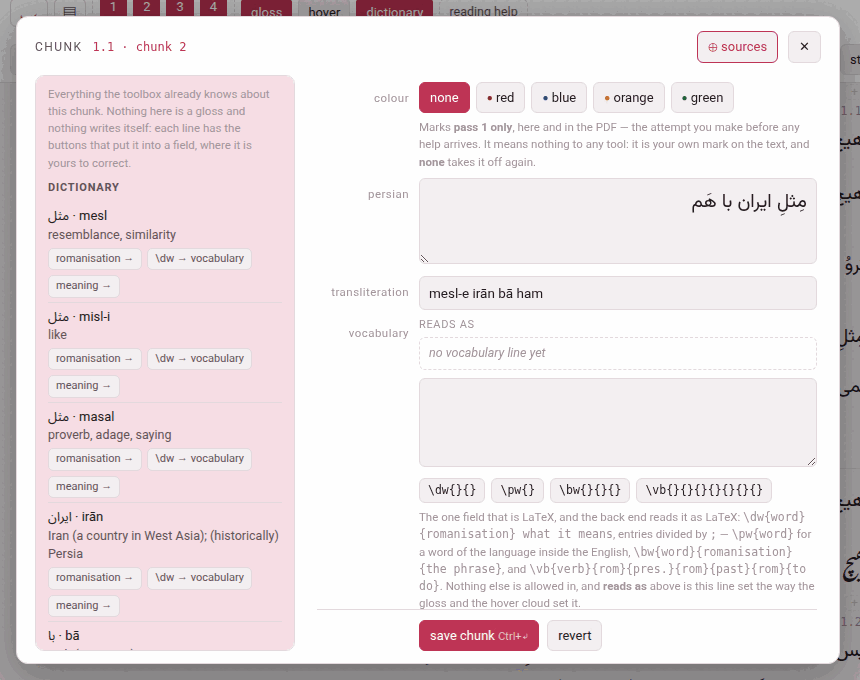

Writing is always on in the reader: there is no editing mode to enter. A
chunk opens for writing from its **pencil**, and what you save is written
straight back into the chapter file the book is built from.

## The pencil

- In hover mode, **✎ edit** in the chunk's gloss cloud.
- Anywhere else — the chunk rows, or any pass with hover mode off — a small
  **✎** appears at the corner of the chunk under the pointer (on a touch
  screen, the chunk last tapped).
- **E** opens whichever of the two the chunk under the pointer has.

A click on the chunk itself still does what it always did — it plays, or
opens the cloud — and so do the modifier-clicks (**Alt** makes a card,
**Shift** copies), so the narration stays within reach while you write.

## The chunk sheet

The sheet shows the chunk **as the chapter file holds it**, not as the page
shows it. That matters in one field, and is the reason the sheet exists: the
gloss you read is the *rendering* of the vocabulary line, and the line
itself is what you edit. Its head names the chunk (*1.1 · chunk 2*), with
**⊕ sources** ([Reading a book nobody has glossed](doc:Reading a book nobody has glossed))
and **✕**.

| Row | What it holds |
|---|---|
| **colour** | **none**, **red**, **blue**, **orange** or **green** (below) |
| ***the language*** (**persian**, **japanese**…) | the chunk's text. Plain text. The one field that can be refused for reasons outside the chunk (below). |
| **words** | Japanese and Chinese: the division of the text into words, with each word's reading — the words strip (below) |
| **kana** | Japanese only: the reading of the whole chunk |
| ***the transliteration*** | named as the language names it: **transliteration** for Persian, Arabic and Hindi, **rōmaji** for Japanese, **pinyin** for Chinese, **pronunciation** for the Latin-script languages. Plain text. |
| **vocabulary** | **the one field that is LaTeX** (below), with **reads as** above the box: the line set exactly as the gloss and the cloud set it |
| ***the gloss language*** (**english**…) | what the chunk means. Plain text, typed in the gloss language's direction. It is called **meaning** in a book glossed in the language it teaches, where two rows both called *english* would say of neither which is which. |
| **the source** | the checkbox **this paragraph need not reproduce `source/paras/`** (below) |
| **where it ends** | **cut this chunk in two…**, **join it to the next…**, **join the previous to it…** — [Cutting and joining chunks](doc:Cutting and joining chunks) |
| **an LLM** | **gloss around here with an LLM…** — the sheet that has an LLM gloss a stretch, opened on this chunk's subparagraph: [Glossing a stretch with an LLM](doc:Glossing a stretch with an LLM) |

A chunk nobody has glossed yet opens like any other, its gloss boxes
empty for you to fill — one at a time, if you like: a meaning saved before
its transliteration is saved as it is. A `\chp` — a chunk with no gloss
slots at all, a colour and its text, written that way in the chapter file
([What a book is made of](doc:What a book is made of)) — opens with only
those two rows, and says so.

**save chunk** (**Ctrl+↵**) sends only the fields you changed. **revert**
puts the boxes back to what the file holds. **delete gloss**, beside them,
takes the whole gloss off (below). **Esc**, **✕** or a click outside close
the sheet without saving; the narration, paused while it is open, plays on.

### Deleting a gloss {#deleting-a-gloss}

**delete gloss** empties the chunk's transliteration, vocabulary and
meaning — and its reading, in Japanese — and saves at once. It asks
nothing first, because it can be undone. The text, the colour and the word
line stay; what is left is a chunk with no gloss, the same macro with its
gloss slots empty. In Japanese and Chinese that is one step emptier than a
chunk nobody has touched: a drafted chunk holds the reading proposed from
its words (the kana, or the pinyin), and delete empties the reading rather
than put that proposal back. The sheet says *gloss deleted*, and an
**undo delete** button appears: it writes the deleted gloss back, down the
same route as a save.

The page keeps the deleted gloss until it is reloaded, not longer: close
the sheet, open the same chunk again later, and **undo delete** is still
there; reload the reader, and it is gone. The button is not offered on a
`\chp`, which has no gloss, and is greyed out on a chunk that has none as
saved — a reading that still says exactly what its words propose is none.

It is how a gloss is written again from nothing — by you, or by an LLM: a
deleted gloss counts as no gloss, so the next prompt of **gloss around here
with an LLM…** asks for this chunk, and the answer may fill it
([Glossing a stretch with an LLM](doc:Glossing a stretch with an LLM)).
It is also the one way to empty a box the language requires: on its own,
that is refused (below).

### The vocabulary line

The vocabulary line is LaTeX, and only this much of it: entries divided by
`;`, and four macros, which the four buttons under the box insert with their
braces in place and the cursor in the first one.

| Button | Writes | Is |
|---|---|---|
| **\dw{}{}** | `\dw{word}{romanisation} what it means` | a dictionary word: two groups, then free text |
| **\pw{}** | `\pw{word}` | a word of the language inside the gloss, kept the right way round |
| **\bw{}{}{}** | `\bw{word}{romanisation}{the phrase}` | the base of a compound: three groups |
| **\vb{}{}{}{}{}{}{}** | `\vb{verb}{rom}{form2}{rom}{form3}{rom}{meaning}` | a verb with its principal parts: seven groups |

What the three forms of a `\vb` are is the language's own, and the
button's tooltip says which:

| Language | The three forms |
|---|---|
| Persian | infinitive · present stem · past stem |
| Arabic | perfect · imperfect · masdar |
| Japanese | dictionary form · *-masu* stem · *-te* form |
| Italian, French | infinitive · first person present · past participle |
| Spanish | infinitive · first person present · third person preterite |
| German | infinitive · preterite · past participle |
| Turkish | infinitive · present in *-iyor* · aorist |
| English | plain form · past · past participle |
| Hindi | infinitive · stem · perfective |
| Chinese | verb · the split form (a separable verb only) · the *can't* form (a verb with a complement only) |

A form that is left empty is not printed at all. Beyond the four macros, `\textit`, `\emph` and
`\nobreak` are allowed, and nothing else spelled with letters.

**⊕ sources** fills whole entries in from the dictionary, the right macro
and all ([Reading a book nobody has glossed](doc:Reading a book nobody has glossed)).

## The four colours

**red**, **blue**, **orange**, **green** — a chunk carries at most one, and
**none** takes it off.

**What they do.** A colour reaches **pass 1 only** — the whole sentence,
before the chunks and their glosses — on screen and in the printed PDF
alike. Pass 1 is your own first attempt at the passage, made before any
help arrives, and a mark in the chunks or the bare pass would give the
answer away.

**What they do not.** Nothing else at all. No tool reads a colour, no card
carries one, no page filters by one: it is your own mark on the text —
*this is the word I did not know*, *this is the construction I keep
missing*. In the chapter file a colour is the chunk's first argument,
`\Cred`, `\Cblue`, `\Corange` or `\Cgreen`.

## What happens when you save

1. The chunk is checked (the refusals below), and **the one chunk** is
   rewritten in its chapter file. Nothing else in the file is touched: your
   comments, your blank lines, a vocabulary line you broke over two lines —
   every byte outside that one chunk stays as it was. The one exception is
   the edit's own: when the opening words of a paragraph change, the
   paragraph's entry in the contents follows them.
2. **The reader is rebuilt** at once — a fraction of a second — and the page
   takes the changed chunk from the new build, so the colour and the
   vocabulary look exactly as they will on the next reload. The answer says
   *saved en, voc into ch1.tex*.
3. **The PDF is not rebuilt**, and the header says so: **PDF behind the text
   — build it**. Click it, or **build PDF**, to build it on the server.
4. Under the answer, in grey, is the check of the whole paragraph against
   its source: *ok: paragraph 3 still reproduces source/paras/ch1_p02.txt*,
   or why it could not be checked. That is news about the chapter rather
   than about the button you pressed, which is why it is set apart.
   Warnings, if any, follow it.

## What it refuses

A refused edit writes nothing: the file is byte for byte as it was, and the
sentence you are shown names the rule. Each begins with where the chunk is
(`ch1.tex:12 chunk 3:`); these are the ones you will meet.

| It says | Which means |
|---|---|
| *'purple' is not a colour — the four are red, blue, orange, green, or '' for none* | there are four and no fifth: a colour must mean the same thing in the book's LaTeX, in the reader and in the video player |
| *en may not contain '%' — LaTeX reads it as an instruction …* | none of `\ { } $ % & # _ ^ ~` may go into the text, the reading, the transliteration or the meaning. They are refused rather than escaped, because no spelling of them satisfies the PDF, the checker and the reader at once. Take the character out, or spell it in words. |
| *voc may not use \foo — the gloss macros are \bw, \dw, \emph, \nobreak, \pw, \textit, \vb* | the vocabulary line is LaTeX, but only that much of it |
| *\vb needs 7 arguments and has 5* | a macro is short of braces; the buttons insert them for you |
| *voc leaves 1 brace open* | a brace is not closed — which would swallow the arguments after it |
| *a glossed chunk needs its meaning — check_batch.py calls an empty en an error; emptying every box of the gloss at once ("delete gloss") takes the whole gloss off* | you emptied, on its own, a field the language requires, which would leave a finished gloss half finished. The same goes for the transliteration where the language romanises every chunk (*Persian romanises every chunk, so tr cannot be emptied on its own*: Persian, Arabic, Japanese, Hindi, Chinese) and for the kana of a Japanese chunk. Emptying **every** box at once is allowed — that is **delete gloss** — and the vocabulary line may always be emptied. A box still empty beside the ones you fill is never a reason to refuse, and one sent blank that was blank already changes nothing. |
| *harakat leaked into tr — the romanisation carries none* | a vowel mark came into the transliteration with a paste |
| *this text would stop paragraph 1 reproducing source/paras/ch1_p00.txt, which verify_book.py checks, at char 4 of 109* | the one worth understanding (below). The message quotes both texts either side of the first difference. |
| *the server did not answer — an edit needs this page served by python3 serve.py; nothing was written* | the reader was opened off the disk, or Parseh is not running |

### Fidelity: why a change of text can be refused

Every paragraph of an edition has a plain-text file of its own under
`source/paras/` — the original, as it was divided. The chunks of a
paragraph, joined back together, must reproduce it: that is the guarantee
the whole edition rests on — whatever the glosses say, the text of the book
is the text of the book.

So **vowelling a chunk is free** (the marks come off both sides before they
are compared), and so is whitespace. **Changing a word is not.** Cutting one
chunk in two, or joining two, is invisible to the check as long as the text
is the same — which is why the chunking can be revised freely and the text
cannot.

If the source itself was wrong, correct `source/paras/` too. And where the
edit is meant and the source is not the thing to change — a paragraph you
are deliberately rewriting, or one whose source was never more than a first
cut — tick **this paragraph need not reproduce `source/paras/`** and save.
That paragraph is then *yours*: an edit that departs from the source is
written instead of refused, and the paragraph is reported as *not checked*
rather than as a fault — *paragraph 13 may now depart from its source*. It
is the whole **paragraph** and not the chunk, because the check joins every
chunk of a paragraph before comparing. Every other paragraph is checked as
before, and the mark is kept in `reading.json`, which travels with the book.
Untick it to put the paragraph back under the check.

## The words strip: Japanese and Chinese

Japanese and Chinese write no space between words, so a chunk of either
carries its words as a line of its own — which the readings over the text,
**I know this** and the dictionary all go by. The line is **proposed** by the
toolbox when the text comes in (by SudachiPy for Japanese, pkuseg and
pypinyin for Chinese, where they are installed); where the chunk already has
its kana or pinyin, each word's reading is cut from that. A machine reads
the way a dictionary does, not always the way the sentence means — 私 comes
back *watakushi* where the speaker says *watashi* — so the **words** row of
the sheet draws the line as a strip, one chip per word, the word on top and
its reading in a box under it, and the strip is where the proposal is put
right:

| To | Do |
|---|---|
| cut a word in two | click between two of its characters, where the scissors appear; the first half keeps the reading, to be shortened |
| join two words | the **⊕** between them; the readings run together |
| move where a word begins | click the word and press **←** or **→**: a character at a time taken from the word before, or given back — never leaving either empty |
| correct a reading | type in the box under the word |
| write the line itself | **edit as text**: the line as it is stored, `山(やま) へ 柴刈り(しばかり) に`, and the chips redrawn whenever what you type can be read |
| start again | **propose** asks the machine once more (and asks you first, if what is there is not its last proposal: *What is written here now is lost*); **divide by hand** starts a chunk that has no words from its whole text as one word |

Under the chips the strip says what is wrong with the line as it stands. An
**error** — the words do not join back into the text, a reading put in
fullwidth brackets — refuses the save, as the checker would. A **warning**
does not: a kanji word with no reading, or the words' readings run together
disagreeing with the chunk's own reading, which in kanbun they rightly do
(the **order** checkbox in **book info** quiets that one). The line is
written with the rest of the chunk, by **save chunk**, and not before.
