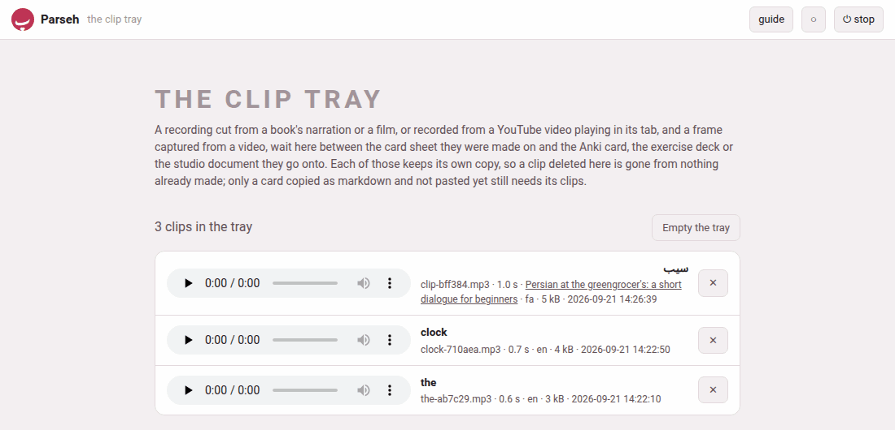

A clip is made where the sentence is — in the book reader, in the video
player — and used somewhere else: on an Anki card, in an exercise deck, in
a studio document. In between it waits in the **clip tray**, the folder
`clips/` at the top of the toolbox: one flat folder of the recordings cut
for cards and of the frames captured for exercise decks and markdown, each
with a small `.json` file beside it saying its language, its words and
where it was cut from. It is yours, like the decks, and never part of the
repository.

## A name no other file has

A clip's name is its word and six random characters:
`wind-47de68.mp3`, `clock-710aea.mp3`. A word in a script a file name
cannot safely carry — Persian, Japanese, Hindi — gives `clip-bff384.mp3`
instead; the word itself is kept in the clip's `.json`, and the tray's
page shows it.

Because no two files in the toolbox share a name, a card can name its
recording simply as `audio/wind-47de68.mp3` wherever it goes. An Anki card,
an exercise deck and a studio document each look in the tray for a file
they are sent and do not have, and **copy** it in. From then on each keeps
its own copy.

## What stays in the tray, and what leaves

The sheets keep the tray tidy by themselves:

- **Kept:** a clip that went onto a card — saved to Anki, added to a
  deck, copied as markdown — and a frame that went into a deck or into
  markdown, since the same file may go to a second place. So does one
  whose card is still on its way: close the sheet the moment after
  **add to deck** and the deck still finds its recording in the tray.
- **Removed:** a clip nobody used — taken off the card with **remove**,
  replaced by another, left on a sheet that was closed (or opened again on
  another word) without saving, adding or copying, or cut in the editor
  and then cancelled — and a frame that was removed, replaced or left on a
  closed sheet in the same way.

## Pasting a card with its clips

**A card copied as markdown** carries only the names. Pasted into a
**saved** studio document, it brings its files in from the tray at once
(*Brought 2 files from the clip tray*), and the preview plays the
recording. Pasted into a deck's **Add exercise…** with **Paste
markdown…**, the files are shown from the tray in the form's preview and
come into the deck when the exercise is added.

A studio document's **Recordings…** also lists the tray's recordings in
the document's language, under *Clips cut from books and videos*: **Add**
puts one in at the cursor and copies it into the document, and **✕**
deletes it from the tray.

## The tray's own page

**✂ The clip tray** on the hub (`/clips/`) lists every clip in the tray,
newest first and in every language: a recording with its player, a frame
as a picture, each with its words, its file name, its length (a
recording's), the film it was cut from (its title, a link back to the
moment), its language, its size and when it was made. The count sits
above the list — *3 clips in the tray*.

| Button | What it does |
|---|---|
| **✕** on a row | deletes that clip, after asking: *Delete “clock-710aea.mp3” from the clip tray? A card, a deck or a document it already went onto keeps its own copy.* |
| **Empty the tray** | deletes every clip, after asking; greyed out when the tray is empty |

Because every place a clip goes keeps its own copy, deleting a clip or
emptying the tray breaks nothing already made. The one thing that still
needs the tray is **a card copied as markdown and not pasted yet** — the
question before **Empty the tray** says so: *a card copied as markdown and
not pasted yet loses its recording and its frame*. And a card still open
on a sheet loses its clip too: its save then says *the recording … is no
longer in the clip tray*, and you cut it again.

The hub's door says how many clips wait — *3 clips*, or *the tray is
empty*.

## What the tray keeps, and in what form

| What | How the tray keeps it |
|---|---|
| a recording cut by the server | the format the machine's ffmpeg writes best — MP3 as a rule |
| a recording made in the browser (no ffmpeg on the server, or a YouTube video) | re-encoded into that format when the server has ffmpeg; kept as the WAV it came as when it has not |
| a frame | the JPEG the capture made |

The tray refuses a recording over 30 MB, a picture over 15 MB, a clip
longer than 300 seconds, and a recording that turns out to hold no sound
at all (*the recording holds no sound*).
