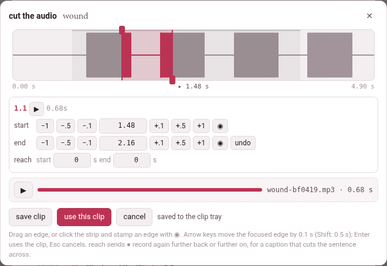

A card can carry the word's own sound. **🔊 cut the audio…**, in the card
sheet's **recording** row, opens the **cut editor** over the page: the
recording around the sentence, with the two edges of the clip already
placed where the word probably is. Move them by ear until the clip holds
the word and nothing else, and use it.

Whatever else was playing on the page stops while the editor is open —
one recording at a time, and it is this one.

{width=100 align=center}

## The editor

**The strip** at the top is the sentence and a second either side of it —
or a second past an edge, when you take an edge further out than that.
The sentence is a faint band; the clip, a tinted one between its two
edges; the playhead, a thin line, with its time under the strip between
the strip's two ends. When the server has **ffmpeg**, the strip shows the
sound itself as a waveform, the bars inside the clip in the accent colour;
without ffmpeg it is plain.

- **Drag an edge** to move it. The start's knob is at the top of its line,
  the end's at the bottom, so two edges close together can still each be
  caught; with the two lines on one another, the way you drag decides —
  left takes the start, right the end — so the clip always widens under
  your hand.
- **Click the strip** to move the playhead there.

**The rows** under it are the book reader's own timing editor, so a hand
that has timed a narration already knows them:

| Row | What is in it |
|---|---|
| the first | the subparagraph's number (a book) or the caption's time (a video), **▶**, which plays the clip (and is **‖** while it plays, to stop it), and the clip's length |
| **start** | **−1** **−.5** **−.1**, the time in seconds, **+.1** **+.5** **+1**, and **◉**, which puts the start at the playhead |
| **end** | the same for the end, and **undo**, which takes both edges back to where they started |
| **reach** | two numbers for **● record again** — it matters only for a YouTube video ([Recording a YouTube video's sound](youtube-sound.md#when-the-caption-is-not-where-the-sentence-is)); a book's and a film's editor show it too, and it does nothing there |

**Every move is heard.** A move of the start plays the first 1.5 seconds
of the clip; a move of the end, its last 1.5 seconds (the whole clip when
it is shorter). The playing stops exactly at the edge, not a moment after,
so what you hear is what the clip will hold.

**Keys:**

| Key | What it does |
|---|---|
| **←** **→** (and **↑** **↓**) | move the edge that has the focus by 0.1 s |
| **Shift** with them | by 0.5 s |
| a time typed in a row, then **Enter** | puts that edge there |
| **Space** | plays from the playhead to the end of the strip, and stops it |
| **Enter** anywhere else | uses the clip (**use this clip**) |
| **Esc** | cancels |
| **Tab** | goes round the editor's buttons and boxes, never out of it |

The editor says what went wrong where it can be put right: *the end must
come after the start*, *the playhead is not before the end* (for **◉** on
the start), *the playhead is not after the start* (on the end).

### Saving and using the clip

| Button | What it does |
|---|---|
| **save clip** | cuts the clip into the [clip tray](clip-tray.md) and plays it back once, with a **▶** of its own, a bar that fills as it plays, and its name and length — `wound-bf0419.mp3 · 0.68 s` |
| **use this clip** | puts the clip on the card and closes the editor — cutting it first, or again, when the edges have moved since it was saved |
| **cancel**, **✕** | closes the editor; whatever was cut in it and not used leaves the tray |

Move an edge after saving and the saved clip is dimmed, with *the edges
moved after saving: “use this clip” cuts the clip again*. A clip cut again
replaces the one before it in the tray.

Back on the card sheet the clip has a player of its own, its name and
length, and a choice of the side it goes on — **on the Persian side** or
**on the English side**, named after the language and the gloss language
(**on the word side** and **on the meaning side** in a book glossed in its
own language; **with the word** and **with the opposite** on a book's
opposites card). The language's side is picked unless you pick the other. **remove** takes it
off the card. On a jolly card it goes into a box instead
([Jolly cards](where-the-card-goes.md#jolly-cards)).

## Where the edges start, and why

The page knows when a sentence is said, not when each word is: a book's
narration is timed by subparagraph, a video by caption. So the edges start
at **the word's share of the sentence's letters**. A word whose letters
begin a third of the way into the sentence's letters is taken to begin a
third of the way into its time. Each edge is then moved out by 0.12 s,
kept within 0.3 s of the sentence, and kept at least 0.2 s apart.

- In a **book** the sentence is the subparagraph, between its two times;
  its letters are counted without the spaces, and without the vowel marks
  in Persian and Arabic, as the narration's timing counts them.
- In a **video** the sentence is the caption, from its start to the next
  caption's (the last one runs to the end of the video); every character
  of the caption counts, the spaces between its words too.
- A card made from the gloss cloud's **+ card** starts at the whole
  chunk's share; a word of a word line is placed by the words of that
  line.

It is a guess, and speech is not even — a long word said quickly, a pause
before the next — which is why the edges are there to move.

## What can be cut

**A book** cuts from its narration, which needs a recording that covers
the subparagraph and times for that subparagraph. Where something is
missing, **🔊 cut the audio…** is greyed out and the reason is written
under it (a phone shows no tooltip, so it is said in the page itself):

| Under the button | What to do |
|---|---|
| this book has no narration file to cut the audio from | add a narration to the book (its **narration** panel) |
| none of this book’s recordings covers 1.2 yet: add one for it, or widen what one covers, under narration | a recording covers other subparagraphs only |
| this subparagraph has no times yet: time it (narration, or edit times) and the audio can be cut | the subparagraph is covered but not timed |
| 1.2 was timed in the recording n2, whose file is not on this machine | the times belong to a file that is not here: bring it back, or time the subparagraph again |
| cutting the audio needs this page opened from the toolbox’s server | the reader was opened as a file, not through Parseh |
| there is no subparagraph under this card to cut its recording from | the card was not opened from a subparagraph of the text |
| the card kit (lib/cardkit.js) did not load: reload the page | the editor's script is missing: reload |

**A film on this machine** — a video added from a file rather than from
YouTube — cuts from the film itself. If the film's file is gone, the
button says *the film of this video is not on this machine any more, so
there is no sound to cut*.

**A YouTube video** has no file anywhere the toolbox can reach, so its
sound is recorded from this browser tab as the video plays: see
[Recording a YouTube video's sound](youtube-sound.md).

### With ffmpeg, and without

With **ffmpeg on the server**, the server cuts the clip out of the
original file — *cutting 1.48–2.16 s…* — with a few milliseconds of fade at
each end so it never clicks, into MP3 (or the best format the machine's
ffmpeg writes), and draws the waveform.

**Without ffmpeg** — a plain strip is the sign — nothing is lost but the
waveform: **save clip** records the clip in the browser instead. The
recording is played through once, silently, from a quarter of a second
before the start to a quarter after the end, captured as it plays,
trimmed to the edges with the same fade, and kept as a WAV. The status
line says what it is doing — *loading the recording to record it*, then
*recording in the browser, silently* with the seconds done — and a pass
that stops to load is thrown away and played again, three passes at most
(*it stopped to load: again, 2 of 3*). If all three stop, the editor says
*the recording kept stopping to load, so no clip was made of it: try
again*. A browser that cannot record a page's sound at all says *this
machine has no ffmpeg to cut with, and this browser cannot record the clip
itself*.

A clip is at most 300 seconds long — a word or a sentence, not a chapter —
and a window past the end of the recording is refused: *there is no sound
at 41.20 s: the recording ends before it*.
