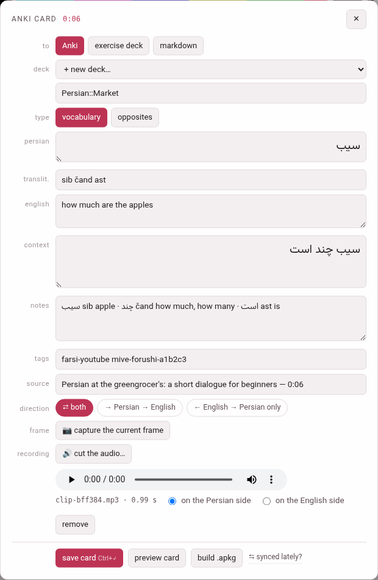
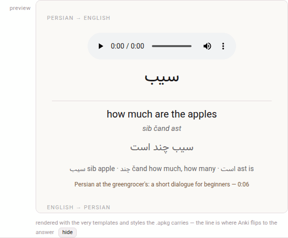

A card is made where the word is: in the book reader or in the video
player, on the **card sheet**. The two sheets are the same sheet, and
everything on this page holds for both unless it says otherwise.

{width=80 align=center}

## Opening the sheet

**In a video.** Hold **Alt** (or **Ctrl**, or **Cmd** on a Mac): the word
under the pointer lights up. **Click it with the key held** and the sheet
opens on that word. The video pauses while the sheet is open, and plays on
when you close it.

**In a book.** The same: a modifier-click on a word of the reader opens the
sheet on it. The narration pauses while the sheet is open, and plays on
when it closes.

**A whole phrase.** A phrase's gloss cloud — the box that opens over a
chunk — has a **+ card** button beside its **copy**: it opens the sheet
on the whole chunk rather than one word of it. On a touch screen, which has
no modifier key, this is the way to make a card: a tap on a chunk opens its
cloud (in the book reader, with its **hover** switch on), and **+ card**
does the rest.

What the click takes as the word:

- The word as the chunk writes it, with the quotation marks and stops it
  was glued to taken off its ends (`«`, `“`, `,`, `?`, `،`, `؟`, `。`…); an
  apostrophe that belongs to the word, as in Italian *po'* or Turkish
  *İstanbul'da*, stays.
- In a book, the fully written form of the word, even in the passes that
  show it bare (a Persian or Arabic word with its vowel marks).
- In a language written without spaces between words (Japanese, Chinese)
  a chunk is one word, so the card is the whole chunk.
- A word of a chunk's **word line** — the words a Japanese or Chinese chunk
  is divided into — is that word, with the reading the line gives it.

## What it fills in

Everything is filled in from the gloss and is yours to change before
saving: the pre-fill is a starting point, not a decision.

| Row | Filled with |
|---|---|
| the language's row (*persian*, *japanese*…) | the word |
| **reading** (Japanese only) | the chunk's kana when the card is the whole chunk; the word line's reading for a word of the line; empty for one word of a chunk, whose reading only you can split |
| **translit.** | the chunk's transliteration — for a word of a Chinese word line, the line's own pinyin for it |
| the meaning's row | the chunk's gloss. The row is labelled with the gloss language (*english*, *italian*), or **meaning** when the book or video is glossed in the language it teaches |
| **context** | for one word, the chunk it sits in; for a whole chunk or a word of a word line, the sentence: the subparagraph in a book, the caption in a video |
| **notes** | the chunk's vocabulary line (and, in a video, its note) |
| **tags** | the language's tag with `-book` or `-youtube`, and the book's slug or the video's id: `farsi-youtube mive-forushi-a1b2c3`, `english-book mini-en` |
| **source** | the book's title and the subparagraph's number (`The Clock and the Wind — 1.1`), or the video's title and the card's moment (`… — 0:06`); on the card it links back there |

The head of the sheet names the card — **anki card**, **exercise card** or
**card markdown**, after where it goes — with the subparagraph's number
or the video's time beside it.

**The card's moment** in a video is where the video stands when you
opened the sheet, if that is inside the caption you clicked (you have just
heard the word); otherwise it is that caption's start, so that a word
picked out of another caption links back to where it is said, not to
wherever the video happened to be.

The sheet follows the language: the word's row is labelled with the
language's name and reads in its direction (a Persian or Arabic word, its
context and its opposite are written right to left), the **reading** row
appears only for a language that has readings, and the meaning and the
notes follow the gloss language's direction — an Arabic meaning runs right
to left inside the sheet too.

## The rows of the sheet

| Row | What it does |
|---|---|
| **to** | where the card goes: **Anki**, **exercise deck** or **markdown** ([Where the card goes](where-the-card-goes.md)) |
| **deck** | the deck it goes into, or **+ new deck…** and a box to name it |
| **type** | **vocabulary** or **opposites** (and **jolly**, for an exercise deck or markdown) |
| the fields | the word, reading, transliteration, meaning, context, notes |
| **tags** | Anki's tags, separated by spaces (Anki only) |
| **source** | the label of the link back |
| **direction** | which cards the note makes ([Note types and directions](note-types.md#direction-which-cards-a-note-makes)) |
| **frame** | a video only: **📷 capture the current frame** ([Recordings and frames](recordings-and-frames.md#a-frame-of-the-video)) |
| **recording** | **🔊 cut the audio…** ([Cutting the audio](cutting-the-audio.md)) |

At the foot: **save card** (with its shortcut, **Ctrl+↵**), **preview
card**, **build .apkg**, and — in a video — **⇆ synced lately?**, a link to
the **Sync with Anki** page for the moment you are about to build
([Building a deck](building-a-deck.md)).

### The deck

For Anki the picker lists every Anki deck in the store, with its number
of cards: this language's decks first, then each other language's under
its own heading marked *(another language)*. Pick one, or pick
**+ new deck…** and type a name in the box under it. The box suggests a
name nested under the language — *name the new deck (use :: to nest,
e.g. Persian::YouTube)* in a video, `…::Books` in a book — because `::`
nests decks in Anki: `Persian::Market` is the deck *Market* inside
*Persian*. The deck is made when its first card is saved.

A card always goes to the deck of **its own** language with the name you
picked ([The card store](card-store.md#a-deck-belongs-to-a-language)).

### Opposites

**opposites** changes the form: the meaning and the context step aside,
and an **opposite** row asks for the opposite word — *…the opposite,
written by you* — with a box for its reading (Japanese) and one for its
transliteration (optional). The opposite is always yours to write: the
gloss does not know it. The direction then offers **⇄ both** and
**→ word → opposite**.

## Saving it

**save card**, or **Ctrl+Enter** (**Cmd+Enter** on a Mac) anywhere in the
sheet, sends the card to the card store. Before it goes, the sheet checks:

| It says | What to do |
|---|---|
| name the new deck first | **+ new deck…** is picked and its name box is empty |
| the Persian side is empty (the language's name) | write the word |
| write the opposite in first — that is the answer side | an opposites card needs its opposite |

When the card is in, the sheet says so and closes itself a moment later:

```text
saved ✓ — “Persian::Market” (Persian) now has 1 card
```

It waits a little longer when the card was filed under another language
than the deck you picked (the answer then says so), and it does not close
while the cut editor is open over it or once you have typed or clicked in
it again.

**The sheet keeps what you pressed.** Everything the card is made of is
read at the moment you press the button, so closing the sheet at once, or
opening it again on another word, changes nothing of what was sent; the
answer then comes as a note over the page, since the sheet that would have
said it is gone.

Closing the sheet — **✕**, **Esc**, or a click outside it — without saving
leaves no card. A recording cut on it and never used leaves the clip tray
with it ([The clip tray](clip-tray.md#what-stays-in-the-tray-and-what-leaves)).

The sheet **remembers** where you sent the last card and the deck you
last used, separately in the books and in the videos, so a run of cards
from one book goes on into the same deck without a click.

## Preview card

**preview card** draws the card below the sheet exactly as Anki will show
it: the answer side of each card the note makes, one under another, each
named — *PERSIAN → ENGLISH*, *ENGLISH → PERSIAN*, *ENGLISH → PERSIAN (THE
ONLY DIRECTION)*, *OPPOSITE OF THE WORD* — with the question above the line
where Anki turns to the answer. A recording on the card plays in it, from
the clip tray, and a captured frame shows.

{width=90 align=center}

It uses the very templates and styling the package will carry — and those
are yours: once a sync has learnt how your note types look in your Anki
collection, the preview shows your styling, not the factory one
([Styling and templates](editing-in-anki.md#styling-and-templates)). It
follows the toolbox's theme, dark included. **hide** puts it away.

For an exercise deck and markdown the preview is the studio's own drawing
of the card instead; see [Where the card goes](where-the-card-goes.md#preview-card-for-a-deck-or-markdown).
