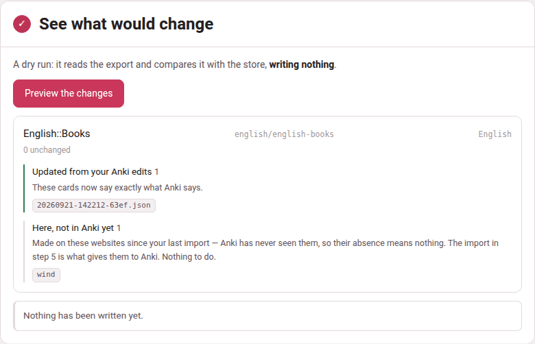

## Why the order matters

Building a package writes every note afresh from the store, and importing
it makes Anki adopt those notes as they are. Anything you changed inside
Anki and did not bring home first is simply **overwritten**. So, once you
edit cards in Anki, every build follows one order:

**export from Anki → sync → rebuild → import**

After a sync the store says exactly what Anki says. The import that
follows therefore only **adds** what is new here and re-asserts identical
content on everything else: nothing you edited can be lost, and nothing
clashes.

## The Sync with Anki page

Open it from **⇆ Anki** on the hub, from **⇆ Sync with Anki** on the
videos page, or from **⇆ synced lately?** on a video's card sheet. It walks
five steps and will not let you take them out of order: each step opens
when the one before it is done, and is ticked when it is.

### 1. Export your deck from Anki

In Anki: **File → Export…**

- **Export format:** Anki Deck Package (`.apkg`).
- **Include:** the deck you study these cards in, or *All Decks* — decks
  the store does not hold are only reported, never touched. Take *All
  Decks* whenever you have moved notes from one deck to another in Anki:
  an export of one deck does not carry a note moved out of it, and the
  sync would take that note for deleted
  ([Moving a note to another deck](editing-in-anki.md#moving-a-note-to-another-deck)).
- **Include media**: tick it if any of your cards have screenshots or
  recordings.
- Scheduling makes no difference either way: it is never read.

Save it anywhere, and press **I have the file →**.

The same step takes **a package built by Parseh** — the `.apkg` the build
button makes, from your other computer or from someone else who made the
cards with Parseh. It cannot be *synced*, but it is brought in
([Bringing decks in](bringing-decks-in.md#a-package-built-by-parseh)).

### 2. Drop it here

Drag the file onto the drop zone — *Drop the `.apkg` here* — or click it
to choose the file. It is saved into the store's inbox,
`youtube/anki/inbox/`, and the page says where: *Saved as
youtube/anki/inbox/20260921-142343-English Books.apkg (64 kB).* Nothing
has changed yet. While a big export goes up, the page's **Working…**
indicator says *Uploading …*.

**Already uploaded:** under the drop zone lists the last five files in
the inbox, so reloading the page loses nothing: pick one to go on with it.

A file that is not an Anki package is refused at once: *that is not an
.apkg (an Anki package is a zip; this file does not start like one)*.

### 3. See what would change

**Preview the changes** is a dry run: it reads the export, compares it
with the store, and **writes nothing**. Read its report before going on
(below). While it reads, the **Working…** indicator says *Reading the
Anki export*.

{width=100 align=center}

### 4. Pull the edits in

**Apply** writes those changes into the store; your Anki collection is not
touched. The button names how many there are — **Apply 3 changes to the
store** — or says **Nothing to apply — the store already matches**, and
asks once more before it writes: *Write these changes into the deck
store?*

If Anki no longer has cards it once had, a checkbox appears above the
button, ticked: *also remove the N card(s) you deleted inside Anki — their
files move to anki/<deck>/deleted/, so this can be undone*
([Deletions](#deletions)). Untick it to keep them for now.

While the changes are written, the **Working…** indicator says *Merging
the Anki export into the card store*.

### 5. Rebuild and import back

One download per deck the sync touched — **Download English::Books.apkg**,
*rebuilt from the store (English) — import this into Anki*. Then in Anki:
**File → Import…** and the file. Notes are matched by their identifier, so
existing cards are **updated in place**: your review history and due
dates are kept.

*That is the whole loop. Do it in this order every time — sync first,
export second — and the two can never fight.*

## What travels, and which way

| What | Build and import: the store → Anki | Export and sync: Anki → the store |
|---|---|---|
| the fields' text, the tags, the direction gates | yes — over what Anki has | yes — over what the store has |
| pictures and recordings | yes | yes, when the export includes media |
| new notes | the cards made on the pages | the notes you made in Anki with Parseh's note types |
| styling and card templates | the ones the store learnt (the factory ones until then) | learnt from the export (**Card appearance**) |
| deletions | never: an import never deletes a note | retired, when you tick the box ([Deletions](#deletions)) |
| a note you took over in Anki (another note type, formatting) | left out of every package | found by the sync, which marks it as Anki's ([Editing inside Anki](editing-in-anki.md#the-mental-model-who-owns-what)) |
| scheduling, reviews, due dates | never | never read |

## Reading the report

The report is grouped by deck, each named with its path in the store and
its language — two languages may hold decks of the same name. Under the
name, how many cards are unchanged, then a group for each kind of change,
with the card files it concerns. A deck with nothing to do says *Nothing to
change — all 42 cards already match Anki.*

| Group | What it means |
|---|---|
| **Card appearance — Frank YouTube Persian** (the note type's name) | the styling or the templates of that note type changed in Anki (or are seen for the first time), and the store learns them, so that a rebuild reproduces your look instead of overwriting it ([Styling and templates](editing-in-anki.md#styling-and-templates)) |
| **Updated from your Anki edits** | you changed these in Anki: fields, tags, the `Reverse` gate, a picture or a sound. The store now says what Anki says |
| **Moved to another deck in Anki** | the note is in another deck the store holds now; it is updated in the store deck whose folder holds its file |
| **New cards you made in Anki** | notes you made in Anki with one of Parseh's note types: added to the store, so they survive the next rebuild |
| **Reclaimed** | back to plain content on a Parseh note type, so the store manages them again |
| **Taken over by Anki (note type changed there)** | you changed the note's type in Anki: it now lives in Anki alone and is left out of every future package ([Change Note Type](editing-in-anki.md#change-note-type-and-being-taken-over)) |
| **Kept in Anki (formatting the store cannot hold)** | bold, colour or extra HTML typed into a field: left to Anki too, until you strip the formatting there ([Formatting](editing-in-anki.md#formatting-bold-colour-and-why-it-is-kept-in-anki)) |
| **New notes of another type** | notes of a note type that is not Parseh's: mirrored for the record, left out of packages |
| **Images and recordings edited in Anki** | their new versions were copied into the deck |
| **Images and recordings not in this export** | cards name them but the export does not carry them: export again with **Include media** ticked, or they go missing from the cards |
| **Deleted inside Anki** | Anki has held these before and no longer does ([Deletions](#deletions)) |
| **Here, not in Anki yet** | made on the pages since your last import: Anki has never seen them, so their absence means nothing. Nothing to do: step 5 gives them to Anki |

A deck of the export the store does not hold is named apart — *… is not
in the store yet (12 notes). Syncing only updates decks the store already
holds.* — with **Bring this deck in for the first time**
([Bringing decks in](bringing-decks-in.md)). Before you press it, make
sure the deck really is new to the store: a deck made on the pages that
you renamed in Anki alone, or one Anki made by merging two languages'
decks of one name, is named here too, and bringing it in would write a
second file for every note
([Renaming a deck](editing-in-anki.md#renaming-a-deck)).

After a dry run the report ends *Nothing has been written yet.*

When the export cannot be read the page says why: *that file is not an
Anki deck export -- export with File > Export > Anki Deck Package (.apkg)*.
Anki's newest exports are compressed, and reading them needs the
`zstandard` package, which the installer puts in; should it be missing,
exporting again with **Support older Anki versions** ticked gives a
package any copy of Parseh reads.

## Deletions

A card the store holds and the export does not carry is genuinely
ambiguous. Either you deleted the note in Anki, or the card was made on the
pages since your last import and Anki has simply never been given it.
Deleting the second kind would throw away new work, so the sync tells them
apart before it acts.

It asks whether Anki has ever **confirmed** the note. Every real sync
writes down every note the export carried, in the store's `seen.json`; and
a card that came out of an Anki export in the first place is filed as
`apkg-<guid>.json`. A card with either witness that is missing from the
export is **Deleted inside Anki**; a card with neither has only ever lived
here, is **Here, not in Anki yet**, and is never removed.

A note missing from the deck you synced but present anywhere else in the
export is **never a deletion** — moved into the parent deck of a nested
deck, say. It is reported and updated as a **move** only when that other
deck is one the store holds; in a deck the store does not hold it is left
alone, neither synced nor deleted
([Moving a note to another deck](editing-in-anki.md#moving-a-note-to-another-deck)).
A note moved into a deck the export does not include is not in the
export at all, so it does read as deleted: export *All Decks* after
moving notes.

When you apply with the checkbox ticked, a deleted card is **retired, not
destroyed**: its file is stamped with when and why and **moved** to the
deck's `deleted/` folder. Builds read only `cards/`, so the note stops
being put in packages at once. After applying, the group says so: *Removed
from the deck here too. Their files moved to anki/…/deleted/ — move one back
to undo.*

> **To undo a retirement**, move the file back from `deleted/` to
> `cards/`. It returns with its guid and its history, so Anki takes it for
> the same note, not a copy. And if the note simply comes back in a later
> Anki export — you undid the deletion in Anki — the sync brings its file
> back out of `deleted/` by itself, rather than making a second one.

Leave the box unticked and nothing is retired: the report goes on listing
the cards, and the next import puts them back into Anki.


The page is a front end for one script, run from the `youtube/` folder:

```bash
python3 lib/sync_apkg.py "../Persian CI.apkg" --dry-run         # step 3: look first
python3 lib/sync_apkg.py "../Persian CI.apkg"                   # step 4: merge
python3 lib/sync_apkg.py "../Persian CI.apkg" --delete-missing  # step 4, with the checkbox ticked
python3 lib/anki_export.py anki/persian/persian-ci-old-flashcards  # step 5: rebuild
```

Its report is the same as the page's, and it also lists a card brought
back from `deleted/` (*back in Anki, so restored here from deleted/*),
which the page counts among the changes to apply without listing it.

