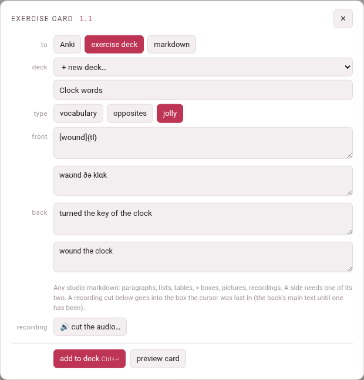

The row at the top of the card sheet, **to**, says where the card goes.
The same fields make all three; the rows one destination has no use for
step aside, and the sheet's button changes with the choice — and so does
its head, which reads **anki card**, **exercise card** or **card
markdown**.

| **to** | The button | What becomes of the card |
|---|---|---|
| **Anki** | **save card** | a note in the card store, built into an `.apkg` for Anki ([Making a card](making-a-card.md)) |
| **exercise deck** | **add to deck** | a flashcard exercise in one of the toolbox's exercise decks, studied on the deck's page |
| **markdown** | **copy markdown** | one `:::exercise flashcard` block on the clipboard, for a studio document or a deck's **Add exercise…** |

Your choice is remembered from one card to the next — separately in the
books and in the videos. **Ctrl+Enter** presses whichever button is
showing.

## An exercise deck

The picker lists the exercise decks **of the book's or the video's
language** — an exercise deck reads its exercises in its own language, so
no other deck could take this card — each with its number of exercises,
and **+ new deck…** at its foot, with a box: *name the new exercise deck*.
A new deck is made when the card is added, and picked, so a second card
goes into it rather than making another. The name you typed for a new
Anki deck and the one for a new exercise deck are kept apart while the
sheet is open: switching the destination does not carry one into the other.

**tags** and **build .apkg** belong to Anki and are hidden here; so is
**⇆ synced lately?**. In a video a note under **to** says what happens:
*an exercise in the deck, studied on its page; the recording and the frame
go in with it*.

**add to deck** writes the card as a studio flashcard — the word, its
reading and transliteration, the meaning, the context, the notes and the
source, with the direction kept as a preference — and adds it. The sheet
then says what went in and where, with a link to the deck, and stays
open:

```text
added ✓ — a vocabulary card for “سیب”, with its recording and its frame, to “Market words” — open the deck
```

Any warning the deck gives is listed under it, one to a line — a picture
or a recording it could not find, say.

**A card the deck already holds** is not refused outright: the sheet says
*this exercise is already in "Market words" — press “add it again” to add
a second one*, and the button now reads **add it again**. Press it and a
second copy goes in. Change anything first — a field, the deck, the type,
the recording, the frame — and the button goes back to **add to deck**,
and the deck is asked again.

**The deck remembers where the card was made.** On the deck's page the
exercise says it comes *from* the book's or the video's title, with the
subparagraph's number or the time, and the link opens the reader at that
paragraph or the player at that second.

## Markdown

**copy markdown** writes the same card and puts it **on the clipboard**;
nothing is stored anywhere. The sheet says what it copied:

```text
copied ✓ — a vocabulary card for “clock”. Paste it into a studio document or a deck’s “Add exercise”: the recording comes along from the clip tray when it is pasted there
```

Paste it into a studio document to keep it with your notes, or open a
deck's page, press **Add exercise…**, and use **Paste markdown…** — or
press **Ctrl+V** on the grid of exercise types — to open it in the form as
a new exercise, ready to look over before it is added.

When the browser will not let the page write to the clipboard, the sheet
says *not copied — the browser would not put it on the clipboard: the
markdown is below, to copy by hand*, and shows the block in a **markdown**
box, already selected, to copy yourself.

What the clipboard receives is one exercise block, exactly as you would
write it in the studio:

```markdown
:::exercise flashcard
card-type: vocab
target: [clock]{tl}
transliteration: klɑk
meaning: the thing on a wall that tells the time
context: wound the clock
source: [The Clock and the Wind — 1.1](https://…/books/english/mini-en/reader/#par-1-1)
front-audio: audio/clock-710aea.mp3
bidirectional: true
:::
```

A card made in a video names the video and the moment instead, with a
link that opens it there — the player's own address for a film on your
computer, YouTube's for a YouTube video — and a captured frame goes in
just above the recording:

```markdown
source: [Market day — 0:12](https://www.youtube.com/watch?v=…&t=12s)
back-image: images/clock-frame-3fa9c2.jpg
front-audio: audio/clock-710aea.mp3
```

- A word of a language written in the Latin alphabet is marked as the
  target's, `[clock]{tl}`, since its letters alone cannot say which
  language it is in; a Persian, Japanese or Hindi word needs no mark.
- A field of several lines is written as `key: |` with its lines under it.
- The direction is `bidirectional: true` for **both**, `direction:
  reverse` for the reverse-only card, and nothing for the forward one.
- The recording and the frame (from a video only: a book has no frame
  to capture) are named by their names in the [clip tray](clip-tray.md),
  `audio/…` and `images/…`; a document or a deck the block is pasted into
  copies them in from there.

The block, drawn as the studio draws it — click the card to turn it:

```parseh-example
:::exercise flashcard
card-type: vocab
target: سیب
transliteration: sib
meaning: apple
context: سیب چند است
notes: سیب sib apple · چند čand how much, how many
bidirectional: true
:::
```

## Jolly cards

An exercise deck and markdown offer a third type beside **vocabulary** and
**opposites**: **jolly**, a card whose front and back are yours. Each side
has a main text and a smaller one under it — **front**, **front, small**
(in a book, the second box under **front**), **back**, **back, small** —
and each of the four boxes takes **any studio markdown**: paragraphs,
lists, tables, `>` boxes, pictures, recordings. A side needs one of its
two boxes filled; the sheet says *the front is empty: write in one of its
two fields* (or *the back*) when one is not.

{width=80 align=center}

The first time you pick **jolly**, the boxes are filled from the card: the
word on the front — marked `[…]{tl}` in a Latin-alphabet language — its
reading and transliteration under it, joined by `·`, the meaning on the
back and the context under that. Once you have typed in them they are left
as you wrote them. The word's own rows step aside while jolly is on, and
come back when you pick another type.

Anki has no jolly note type, so **jolly** is not offered for **Anki**, and
switching to **Anki** turns a jolly card back into a vocabulary one.

**A recording or a frame on a jolly card** is a line of its own in one of
the boxes — ``, `` — rather than a
side of the card. It goes into **the box the cursor was last in**, whether
or not you typed there, after the line the cursor was on; before any box
has had the cursor, at the end of the back's main text. Under the sheet's
recording the note *in the jolly box the cursor was last in (the back's
main text until one has been)* reminds you. A clip cut before you picked
**jolly** goes in the same way when you pick it.

The line goes in **once**. Delete it, and the card goes without that
recording or frame — the button's answer then says so: *the recording is
not on the card: its line was taken out of the fields*. A clip cut again
replaces the old one, line and all.

The same card, as markdown:

````markdown
:::exercise flashcard
card-type: jolly
front-primary: [clock]{tl}
front-secondary: klɑk
back-primary: |
  the thing on a wall that tells the time
  
back-secondary: wound the clock
:::
````

```parseh-example
---
target: en
---
:::exercise flashcard
card-type: jolly
front-primary: [clock]{tl}
front-secondary: klɑk
back-primary: |
  the thing on a wall that **tells the time**
  - on a wall
  - on a tower
back-secondary: wound the clock
:::
```

## Preview card, for a deck or markdown

For these two destinations **preview card** draws the card as a deck's
page and a studio document draw it — the studio's own renderer, its
recordings and pictures played and shown from the clip tray — and a click
on it turns it, as on the deck's page. **⤢ Enlarge** in the card's head
opens the same card, only bigger. The line under it says so, in words
that differ a little from place to place:

| Where | The line under the card |
|---|---|
| a book, to an exercise deck | *drawn by the studio, as the deck’s page draws it — click the card to turn it* |
| a book, to markdown | *drawn by the studio, as a document and a deck draw it — click the card to turn it* |
| a video, either way | *drawn as a deck and a studio document draw it — click the card to turn it* |

## What the sheet says when the card kit is missing

The exercise deck, markdown and the cut editor all come from one script,
the **card kit** (`lib/cardkit.js`). Should it not load, each of them says
*the card kit (lib/cardkit.js) did not load: reload the page*; the Anki
destination still works.
