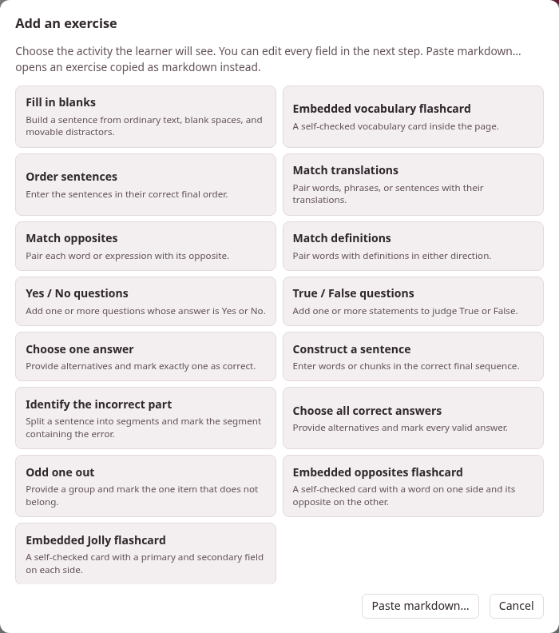

A studio document can hold exercises: a sentence with blanks to fill,
words to match, statements to judge, flashcards to turn. Each is a block of
Markdown between `:::exercise` and `:::`, written in the same text as the
rest of the page, and each is drawn three ways from that one text:

- on the page, where the learner answers it and **Check exercises** at
  the end of the page marks it;
- on paper, in the document's PDF, laid out to be answered with a pen;
- in an exercise deck, where it comes back when it is due, as a card does
  in Anki.

This section is the reference for that block. Every example in it is
live: answer it, then press **Check exercises** at the foot of the page.

```parseh-example
---
target: it
---
:::exercise single-choice
prompt: Which word means *house*?
- [ ] [libro]{tl}
- [x] [casa]{tl}
- [ ] [acqua]{tl}
explanation-correct: [casa]{tl} = *house*; [libro]{tl} is a book, [acqua]{tl} is water.
:::
```

## The thirteen types

The word after `:::exercise` names the type. The types come in four
families, and the members of a family share their machinery — how their
rows are written, how they are answered and how they are checked — while
the type says what the exercise is *for*. The table goes family by
family: three [placement](placement.md) types, three
[matching](matching.md), six [choice](choice.md), and the
[flashcard](flashcards.md). Each type leads to its own section.

| Type | The learner… | Its label on the page |
|---|---|---|
| [`fill-blanks`](placement.md#fill-blanks) | drags words into the blanks of a sentence | Fill the blanks |
| [`order-sentences`](placement.md#order-sentences) | puts sentences in order | Order the sentences |
| [`construct-sentence`](placement.md#construct-sentence) | builds a sentence from its words | Construct the sentence |
| [`match-translations`](matching.md#match-translations) | joins each word to its translation | Match translations |
| [`match-opposites`](matching.md#match-opposites) | joins each word to its opposite | Match opposites |
| [`match-definitions`](matching.md#match-definitions) | joins each word to its definition | Match words and definitions |
| [`yes-no`](choice.md#yes-no) | answers each question Yes or No | Yes or no |
| [`true-false`](choice.md#true-false) | judges each statement True or False | True or false |
| [`single-choice`](choice.md#single-choice) | picks the one right answer | Choose one answer |
| [`incorrect-part`](choice.md#incorrect-part) | picks the part of a sentence that is wrong | Identify the incorrect part |
| [`choose-all`](choice.md#choose-all) | picks every right answer | Choose all correct answers |
| [`odd-one-out`](choice.md#odd-one-out) | picks the one that does not belong | Odd one out |
| [`flashcard`](flashcards.md) | turns a card over | Flashcard |

The PDF heads each exercise with the same label, except three that it
shortens: **Match definitions** for `match-definitions`, **Yes / No** for
`yes-no` and **True / False** for `true-false`.

Twelve are **scored**: **Check exercises** marks them right or wrong and
counts them in the page's score. A flashcard is not: the learner turns it
and judges for themselves, and a card comes in three kinds of its own
(`card-type: vocab`, `opposites` and `jolly`).

## Three ways to write one

You never have to type the Markdown yourself, although you always may.

1. **The form.** In the studio's editor, **Exercises ▾ → Add exercise…**
   opens a grid of the activities — the thirteen types, with the flashcard
   as its three kinds: **Embedded vocabulary flashcard**, **Embedded
   opposites flashcard** and **Embedded Jolly flashcard**. Choose one and a
   form opens with every field the type takes, a live **Preview** at its
   foot, and **Insert exercise**, which writes the block into the document
   at the cursor, on lines of its own. The form checks what the parser
   would refuse before it lets you insert it — a blank with no answer, a
   choice with no right one — and says what is missing. In the editor's
   preview every exercise has **✎ Edit**, which reopens it in the same form,
   and **Save exercise** puts it back where it was — except one inside a
   `>` box, which has no **✎ Edit** and is edited in the Markdown. The
   form writes the exercise afresh as it saves: a fill-in exercise's own
   blank names and row order [do not survive it](placement.md#form-rewrites).
2. **Pasting.** **Paste markdown…**, under the grid, takes one `:::exercise`
   block — copied from another document, or from a book's or a video's card
   sheet — and opens it in the form to look over; Ctrl+V on the grid does the
   same at once. **Exercises ▾ → Load from a deck…** puts an exercise from
   one of your decks into the page, with its pictures and recordings.
3. **An LLM.** **Exercises ▾ → Generate with LLM…** copies a prompt that
   teaches this whole dialect to a language model, with your page after it
   (and, if you tick them, the words your Anki decks already hold): press
   **Copy complete prompt** and give it to the model. It answers with the
   whole page, exercises added after the material they test; paste that
   into the editor in place of the old text, and look it over.

{width=90 align=center}

Every text box in the form has its own **⇤ RTL** / **⇥ LTR** button, which
turns the box to write right to left or left to right; it changes only how
you type in it, not the exercise. **∑ Maths…** writes a formula into the
field you were last in.

## A page to start from

**+ New**, in the studio's library, starts a document from the starter page
of the language the toolbox is set to, and each of the eleven starters has
a section
*Exercises* holding every type and all three kinds of card, written in
that language — the quickest way to see how an exercise in Arabic, Hindi
or Japanese is written. Several of its exercises show the starters'
pictures, an apple and a house, and four play a chime — one with its
question, one once it is answered, and two cards: the same files this
section's examples use. They become the document's own when it is saved.
Keep the exercises you need and delete the rest.

## Where to read on

- [The exercise block](container.md): the grammar every type shares — the
  opening line, fields, rows, blanks, comments — and what happens when
  something is wrong.
- [Fields every exercise takes](common-fields.md): the prompt, the
  explanations, a picture and a recording for the question and for the
  answer, and the direction the activity is laid out in.
- One page per family, every type on it with its syntax, a live example,
  how it is checked, what the PDF shows and how it goes into a deck:
  [placement](placement.md), [matching](matching.md), [choice](choice.md)
  and [flashcards](flashcards.md).
- [Exercises on paper](on-paper.md): the PDF, its print sizes for readers
  with low vision, black and white for the photocopier, and the layouts a
  student writes on.
- [Exercises in a deck](in-a-deck.md): from a page into an exercise deck
  and back, and how each family is studied there.

The same pages of the guide can hold exercises of their own, and that is
how the examples here are made: see
[the Parseh dialect](../writing-this-guide/parseh-dialect.md#exercises) in
*Writing this guide*.
