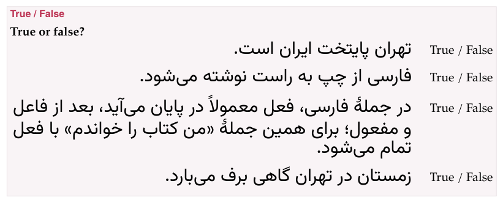

In a choice exercise the learner **picks**: one answer, several, or Yes or
No for each question. Six types share the machinery, and come in two
shapes:

| Type | The learner picks | Rows |
|---|---|---|
| [`yes-no`](#yes-no) | Yes or No, for each question | `- question => yes` |
| [`true-false`](#true-false) | True or False, for each statement | `- statement => false` |
| [`single-choice`](#single-choice) | the one right answer | `- [x] right`, `- [ ] wrong` |
| [`incorrect-part`](#incorrect-part) | the one wrong part of a sentence | `- [x] wrong part`, `- [ ] part` |
| [`choose-all`](#choose-all) | every right answer | `- [x] right`, `- [x] right`, `- [ ] wrong` |
| [`odd-one-out`](#odd-one-out) | the one that does not belong | `- [x] odd one`, `- [ ] …` |

The first two hold **several questions** in one exercise, each answered
on its own; the other four are **one question** with several answers.

## Marking the answers

In `yes-no` and `true-false` each row is the question or statement, `=>`,
and its answer: `yes` or `no`, `true` or `false`, in any case. An arrow
inside the statement is written `\=>`.

In the other four each row is an answer with a mark in brackets before
it: `[x]` for right, `[ ]` for wrong (`[yes]`, `[true]` and `[correct]`
count as right too, and anything else as wrong). `single-choice`,
`incorrect-part` and `odd-one-out` need **exactly one** right answer;
`choose-all` needs **at least one**. A row that begins with a
target-language mark still needs its own bracket first: `- [ ] [سلام]{tl}`.

## On the page

- **Yes / No and True / False.** Each question has two buttons, **Yes**
  and **No** (or **True** and **False**); press one per question. The
  questions stay in the order written.
- **One answer** (`single-choice`, `incorrect-part`, `odd-one-out`).
  Pressing an answer selects it, and pressing another moves the choice.
- **All answers** (`choose-all`). Each press selects or unselects an
  answer, independently.
- **The order.** The answers of `single-choice`, `choose-all` and
  `odd-one-out` are shuffled afresh each time the page opens, so the right
  one is never always first. The parts of an `incorrect-part` sentence are
  not — they are the sentence — and sit close together, as its pieces.

**Check exercises** then marks the answers: a chosen right answer ✓, a
chosen wrong one ✕, and a right answer that was not chosen with a dashed
frame and *• correct answer* — so a choice exercise always shows what it
wanted. The exercise is right when exactly the right answers were chosen:
for `choose-all`, all of them and nothing else; for Yes / No and True /
False, every question's.

## On paper

**Yes / No and True / False** are laid out for a pen. Each statement has
a column of its own and wraps inside it, and the marks — *Yes / No* or
*True / False* — sit in a column at the right that nothing else enters:
one unbroken piece, level with the statement's first line, **at the same
place on every row**, so the student circles one of two words that stand
one under the other all the way down. A statement in a right-to-left
language is set flush right, next to the marks. (Before this layout, a
long statement ran under the marks, and "/ False" could drop onto a line
of its own.) Nothing runs under the marks at any print size: a word too
long for the column is hyphenated there, and what cannot break at all is
set smaller until it fits.

{width=80 align=center}

**The other four** print their answers as a list, a box □ before each to
tick — **in the order written**, not shuffled. On paper the position of
the right answer is therefore yours: when you write for a worksheet, do
not always put it first. Nothing is marked: paper is the unsolved
exercise.

## Yes or no {#yes-no}

**What it is for:** quick questions about a text, a picture or a
recording.

```parseh-example
---
target: hi
---
:::exercise yes-no
prompt: Look at the picture and answer each question.
image: images/starter-apple.svg {width=30 align=center}
- क्या यह एक सेब है? => yes
- क्या यह एक घर है? => no
- क्या यह लाल है? => yes
explanation-correct: सेब *seb* is an apple, and this one is लाल *lāl*, red.
:::
```

## True or false {#true-false}

**What it is for:** statements about a reading passage or a rule — true,
or not.

```parseh-example
:::exercise true-false
prompt: True or false?
- [تهران پایتخت ایران است.]{tl} => true
- [فارسی از چپ به راست نوشته می‌شود.]{tl} => false
- [در جملهٔ فارسی، فعل معمولاً در پایان می‌آید، بعد از فاعل و مفعول؛ برای همین جملهٔ «من کتاب را خواندم» با فعل تمام می‌شود.]{tl} => true
explanation-correct: Tehran is the capital; Persian is written from right to left; and the verb comes last.
:::
```

## Choose one answer {#single-choice}

**What it is for:** the one right answer among a few — a meaning, a
reading, a form.

```parseh-example
---
target: ja
---
:::exercise single-choice
prompt: Which is the reading of 学校, *school*?
- [x] がっこう
- [ ] がくせい
- [ ] せんせい
explanation-correct: 学校 is がっこう *gakkō*; がくせい is 学生, a student, and せんせい 先生, a teacher.
:::
```

## Identify the incorrect part {#incorrect-part}

**What it is for:** finding the mistake in a sentence. The rows are the
sentence's parts, in order, and the one with the mistake is marked `[x]`;
put the whole sentence in the prompt as well, so it can be read in one
piece, and say in the explanation what the error was.

```parseh-example
---
target: fr
---
:::exercise incorrect-part
prompt: One part of this sentence is wrong. Which one?⏎[[Hier, je vais au marché avec ma sœur.]{tl}]{no-bold}
- [ ] [Hier,]{tl}
- [x] [je vais]{tl}
- [ ] [au marché]{tl}
- [ ] [avec ma sœur.]{tl}
explanation-correct: [Hier]{tl}, *yesterday*, asks for the past: [je suis allé]{tl}, or [je suis allée]{tl}.
:::
```

## Choose all correct answers {#choose-all}

**What it is for:** sorting — every word of a kind, every valid
translation.

```parseh-example
---
target: zh
---
:::exercise choose-all
prompt: Choose every word that names a food.
- [x] 苹果
- [ ] 书
- [x] 米饭
- [ ] 桌子
- [x] 面包
explanation-correct: 苹果 *píngguǒ* an apple, 米饭 *mǐfàn* rice and 面包 *miànbāo* bread; 书 *shū* is a book, 桌子 *zhuōzi* a table.
:::
```

## Odd one out {#odd-one-out}

**What it is for:** a group and the one item that does not belong to it —
a word family, a set of forms.

```parseh-example
---
target: it
---
:::exercise odd-one-out
prompt: Which word does not belong with the others?
- [ ] [lunedì]{tl}
- [ ] [martedì]{tl}
- [x] [gennaio]{tl}
- [ ] [venerdì]{tl}
explanation-correct: [gennaio]{tl} is a month, January; the others are days of the week.
:::
```

## In the form

- For **Yes / No questions** and **True / False questions**: *Questions
  and answers* (or *Statements and answers*), each *Question* (or
  *Statement*) with its *Correct answer* chosen from a list, ↑ ↓ and
  **Delete**, and **+ Add question** (or **+ Add statement**).
- For **Choose one answer**, **Odd one out** and **Identify the incorrect
  part**: *Answer choices* (for the last, *Sentence segments*), each
  *Choice* (or *Sentence segment*) with a round button, *Correct answer*
  (*This is the incorrect segment*), of which one can be on; **+ Add
  choice** (**+ Add segment**).
- For **Choose all correct answers**: the same with a tick box, *Correct
  answer*, on as many choices as are right.

## In a deck

**+ Deck** copies a choice exercise into an exercise deck as it is
written. On the study page it is answered the same way and checked with
**Check** or Enter — or Enter straight after clicking an answer. A choice
marks the answer it wanted when it is checked, so it needs no solution
shown under it. [Exercises in a deck](in-a-deck.md) has the rest.
