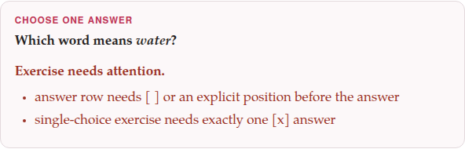

Every exercise, whatever its type, is written the same way: an opening
line, some **fields** (`name: value`), some **rows** (lines starting with
`-`), and a closing line. The body deliberately looks like ordinary
Markdown, so that it reads well as plain text too.

```parseh-example
---
target: en
---
:::exercise true-false
prompt: Decide whether each statement is true or false.
- [The Earth goes round the Sun.]{tl} => true
- [A week has eight days.]{tl} => false
explanation-correct: [A week has seven days.]{tl}
:::
```

## The opening and closing lines

The block opens with `:::exercise` and the type, alone on a line:
`:::exercise fill-blanks`. Case does not matter — `:::Exercise Fill-Blanks`
is the same exercise. **Nothing may follow the type**: a line such as
`:::exercise fill-blanks for lesson 3` is not an exercise at all, and is
drawn as a line of text.

The type may instead go in a field of its own, `type:`, with the opening
line left bare. A `type:` field counts only when the opening line names no
type; after `:::exercise yes-no` it is an unknown field, and ignored.

```parseh-example
---
target: de
---
:::exercise
type: odd-one-out
prompt: Which word is not a colour?
- [ ] [rot]{tl}
- [ ] [blau]{tl}
- [x] [Buch]{tl}
- [ ] [grün]{tl}
:::
```

The block ends at the first line that is `:::` and nothing else, however
far it is indented. Everything in between belongs to the exercise and to
nothing else: a `##` there is not a heading, and a `-` line is a row, not a
list. An exercise whose `:::` is missing runs to the end of the document,
swallowing everything after it, and says so (below).

## Fields

A field is a name, a colon and a value: `prompt: Choose the right word.`
The name starts with a letter and holds letters, digits and hyphens; its
case does not matter. Each type takes its own fields (its page lists them),
and [some every exercise takes](common-fields.md).

- **One line.** A value is the rest of its line. To break a line inside
  it, write `⏎`: `prompt: Read the sentence.⏎Then choose a word.`
- **Several lines: `name: |`.** A value of `|` alone takes the lines
  indented under it (two spaces are enough), blank lines included, until a
  line that is not indented. Each line of the block becomes a line of the
  value — a prompt written this way keeps its line breaks. This is what the
  form writes whenever a field holds more than one line.
- **A Jolly card's fields go on by themselves.** On a Jolly flashcard the
  four text fields may also simply continue on the lines under them, until
  the next field or the closing `:::`: see [Flashcards](flashcards.md#jolly-cards).
- **A field written twice** counts once: the second one.
- **An unknown field is ignored**, and nothing says so. That lets a newer
  field sit in an older document, but it also means a misspelt name —
  `promt:` — does nothing and says nothing: if a field seems to have no
  effect, check its spelling.

```parseh-example
---
target: fr
---
:::exercise single-choice
prompt: |
  Read the sentence, then choose the missing word.
  [Je ___ au marché tous les samedis.]{tl}
- [x] [vais]{tl}
- [ ] [va]{tl}
- [ ] [allons]{tl}
explanation-correct: With [je]{tl}, *I*: [je vais]{tl}.
:::
```

## Rows

A row is a line starting with `-`. What comes after the dash depends on
the family:

| Family | A row | Example |
|---|---|---|
| choice (`single-choice`, `choose-all`, `incorrect-part`, `odd-one-out`) | a mark in brackets, then the answer: `[x]` right, `[ ]` wrong | `- [x] casa` |
| choice (`yes-no`, `true-false`) | the question or statement, `=>`, the answer | `- It is Monday. => false` |
| matching | the left side, `=>`, the right side | `- casa => house` |
| `fill-blanks` | the name of the blank it fills, in brackets, then the word; `[ ]` for a distractor | `- [verb] read` |
| `order-sentences`, `construct-sentence` | the position, in brackets, then the text | `- [1] Good morning.` |
| `flashcard` | no rows at all | |

A few rules hold for every row:

- **The mark is a bracket of its own, before the text.** A choice or a
  placement row that starts with a target-language mark still needs its
  own bracket first: `- [ ] [سلام]{tl}`. A row such as `- [سلام]{tl}` is
  refused rather than read, because its first bracket is plainly the
  word's, not a mark — reading it as a mark would have lost the word.
- **A right answer is `[x]`.** `[yes]`, `[true]` and `[correct]` (in any
  case) are read as right too; anything else in the brackets — `[ ]`,
  `[-]`, `[no]` — is a wrong answer.
- **`=>` splits a row at its first arrow.** To write an arrow inside one
  side, escape it: `\=>` is shown as `=>` and splits nothing.
- **A yes/no or true/false answer** may be written in any case: `YES`,
  `True`.

```parseh-example
---
target: it
---
:::exercise match-translations
prompt: Match each verb and its past participle with their translations.
- [andare \=> andato]{tl} => to go \=> gone
- [vedere \=> visto]{tl} => to see \=> seen
- [fare \=> fatto]{tl} => to do \=> done
:::
```

## Blanks: `[[name]]`

A fill-in exercise's sentence marks each blank with its name in double
brackets, `[[verb]]`, and the row `- [verb] …` gives the word that belongs
there. The name is anything without a bracket in it — `[[1]]`,
`[[noun]]`, `[[a b]]` — and every blank's name must have a row, and every
named row a blank.

Give each blank a name of its own and one row. The parser does not catch
a name used twice, and says nothing about it; but two blanks of one name
share one block, so the exercise can never be marked right, and of two
rows naming one blank only the last counts.

A blank may sit inside a target-language mark, so a sentence of the
language being learned is written as one sentence, blanks and all:
`text: [من [[verb]] کتاب را]{tl}`. It may not sit inside a formula.
[Placement](placement.md#fill-blanks) has the details.

## Blank lines and comments

Blank lines between the fields and rows are ignored; space an exercise out
as you like. A line that starts with `<!--` is a comment and is left out —
one line only: the lines of a comment that runs on are read as text, and
refused.

```markdown
:::exercise yes-no
<!-- Lesson 4: check the colours before the reading passage -->
prompt: Answer each question.

- Is the sky blue on a clear day? => yes
- Is snow black? => no
:::
```

Any other line — one that is neither a field, nor a row, nor blank, nor a
comment — is an error: a sentence that was meant as the second line of a
prompt, for example. Write such a prompt with `prompt: |`, or with `⏎`.

## What a field or a row may hold

Everything inside a line of the dialect: `[…]{tl}` for the target language
(in a language written in the Latin alphabet, every word of it must be
marked; in a language with a script of its own, the script is found by
itself), colours, `{translit:…}` and `{kana:…}`, `*italic*` and
`**bold**`, links and `[label](doc:Name)` links to other documents,
footnotes (`[^1]`, `^[…]`), `✗` and `✅`, `⏎` for a line break,
`[x^2]{math}` for a formula, and a picture: ``
anywhere in a prompt, a row, a pair, a sentence, an explanation or a card.
[Fields every exercise takes](common-fields.md) has more on each.

**Right-to-left languages, one rule.** Inside one target-language run —
`[من کتاب را خواندم]{tl}` — the text is in its natural order, as you would
type it. But when a left-to-right line holds *several* separate
right-to-left pieces, each piece is one box in a left-to-right row of
boxes: write the boxes in the order you want them seen, from left to
right, and leave the text inside each box as it is. The Persian word
دانشگاه, read from the right as *dān + -eš + -gāh*, is written in an
English answer as `[گاه]{translit:-gāh} + [ش]{translit:-eš} + [دان]{translit:dān}`.

## Where an exercise may sit

Anywhere a paragraph may, on lines of its own — and inside a `>` box,
where every line of it, the opening and closing ones included, starts with
`>`:

```parseh-example
---
target: zh
---
> **Review.** The numbers from one to three.
>
> :::exercise match-translations
> prompt: Match each number with its word.
> - 一 => one
> - 二 => two
> - 三 => three
> :::
```

An exercise in a box has no **✎ Edit** in the editor's preview: it
cannot be reopened in the form, and is edited in the Markdown. It has its
**+ Deck** button on the reading view like any other.

An exercise cannot sit inside another exercise, nor inside a Jolly card's
field (the card says `back-primary cannot hold an exercise`).

## When something is wrong {#needs-attention}

An exercise the parser cannot read is not dropped: it is drawn as a box
headed **Exercise needs attention.**, listing what is wrong, in its place
on the page. It is not scored, and has no **+ Deck** button and no
**⤢ Enlarge**; on paper it is one line, *Exercise needs attention in the
Markdown source.*, in red (in bold black when the PDF is printed in black
and white). A deck will not take it: **+ Add all exercises** leaves it out
and says how many it left out. Should a deck ever hold such an exercise,
its list marks it *needs attention*, and when it comes up for study it
offers only **✎ Edit** and **Skip**. This guide's compiler says each such
message too, with its file and line.

{width=80 align=center}

```markdown
:::exercise single-choice
prompt: Which word means *water*?
- آب
- [ ] نان
- [ ] سیب
:::
```

What each message means, and what to do about it:

| Message | What is wrong |
|---|---|
| `exercise is missing its closing ::: line` | no `:::` line after the exercise: it ran to the end of the document |
| `exercise type is missing` | a bare `:::exercise` and no `type:` field |
| `unknown exercise type: …` | the type is misspelt, or is not one of the thirteen |
| `unrecognized line: …` | a line that is not a field, a row, a blank line or a comment |
| `answer row needs [ ] or an explicit position before the answer` | a choice or placement row with no mark of its own before its text |
| `pair row needs left => right` | a matching, yes/no or true/false row without `=>`, or with nothing on one side |
| `choice exercise has no alternatives` | a choice exercise with no rows |
| `single-choice exercise needs exactly one [x] answer` | `single-choice`, `incorrect-part` or `odd-one-out` with no right answer, or with more than one |
| `choose-all needs at least one [x] answer` | `choose-all` with nothing marked right |
| `boolean exercise has no questions` | `yes-no` or `true-false` with no rows |
| `yes-no answer must be no or yes`, `true-false answer must be false or true` | an answer after `=>` that is not one of the two |
| `fill-blanks text needs at least one [[slot]]` | `text:` has no blank |
| `fill-blanks slots and [slot] answer rows differ` | a blank with no row that names it, or a named row with no blank |
| `ordering rows need numeric positions such as [1]` | an `order-sentences` or `construct-sentence` exercise with no rows, or a row whose mark is not a number |
| `ordering positions must be unique` | two rows with the same position |
| `answer-direction must be rtl or ltr` | anything else in `answer-direction:` |
| `matching exercise has no pairs` | a matching exercise with no rows |
| `image must name a file under images/ (e.g. images/map.png)` | and the same for `image-answer` |
| `audio must name a file under audio/ (e.g. audio/word.mp3)` | and the same for `audio-answer`, `front-audio`, `back-audio` |
| `unknown flashcard card-type: …` | a `card-type` other than `vocab`, `opposites` and `jolly` |
| `a vocab flashcard needs front or target` | a vocabulary card with no word on its front |
| `an opposites flashcard needs target and opposite` | one of the two words is missing |
| `a Jolly flashcard needs a front field and a back field` | a side with neither of its two fields |
| `… cannot hold an exercise` | a Jolly field with an `:::exercise` in it |
| `a flashcard's pictures are front-image and back-image, not image` | and the same for `image-answer` |
| `a flashcard's recordings are front-audio and back-audio, not audio` | and the same for `audio-answer` |
| `a flashcard has no answer rows: …` | a `-` line on a card: put a list inside a field instead |

The last one is worth a word: on a card, a line starting with `-` would be
an answer row on any other exercise, and a card has no answers. Rather than
let the list vanish, the card refuses it and tells you to write it inside a
field — `notes: |` on a vocabulary card, `front-primary: |` on a Jolly one —
with its lines indented under it.
