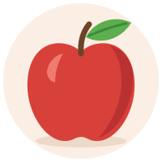

A flashcard is a card with a front and a back, turned by a click. It is
the one exercise that is **not scored**: the learner turns it and judges
for themselves, and **Check exercises** leaves it out of the page's score.
It comes in three kinds, set by `card-type:`:

| `card-type:` | The card | Needs |
|---|---|---|
| [`vocab`](#vocabulary-cards) (the default) | a word, its reading and transliteration; its meaning, an example, notes | `target` (or `front`) |
| [`opposites`](#opposites-cards) | a word; its opposite | `target` and `opposite` |
| [`jolly`](#jolly-cards) | two free fields a side, holding anything a page holds | one field on each side |

```text
:::exercise flashcard
card-type: vocab | opposites | jolly
…the card's fields…
direction: forward | reverse | both-random | both-repeat          (optional)
:::
```

A card has **no rows**: a line starting with `-` is refused, and a list
goes inside a field instead. Nor does it take the question's picture and
recording (`image:`, `audio:`) — a card's pictures and recordings are its
sides' own, below. It may take a `prompt:`, drawn above the card, although
the form offers none.

## Vocabulary cards {#vocabulary-cards}

| Side | Field | What it holds |
|---|---|---|
| front | `target` | the word or expression — the card's main text |
| front | `reading` | its reading, as kana for a Japanese word |
| front | `transliteration` | its transliteration |
| front | `front-image`, `front-audio` | a picture and a recording |
| back | `meaning` | its meaning — the back's main text |
| [answer](#where-the-extras-go) | `context` | an example, or the context it was met in |
| [answer](#where-the-extras-go) | `notes` | anything else |
| [answer](#where-the-extras-go) | `source` | where it comes from |
| back | `back-image`, `back-audio` | a picture and a recording |
| front | `front` | a custom front, which replaces `target`, `reading` and `transliteration` |
| back | `back` | a custom back, which replaces `meaning`, `context`, `notes` and `source` |

On each side the picture comes first, then the recording, then the text.
The **answer** is the side the card turns to, so `context`, `notes` and
`source` are on the back of a card that shows its front first, and on the
front of a card that shows its back first — [where the example, the notes
and the source go](#where-the-extras-go) says why, and how to change it.

```parseh-example
---
target: ja
---
:::exercise flashcard
card-type: vocab
target: 家
reading: いえ
transliteration: ie
meaning: house, home
context: これは私の家です。
notes: Also read うち *uchi*, one's own home.
front-image: images/starter-house.svg
:::
```

A card with a `transliteration` shows **Hide transliterations** in its
head. Pressing it hides the transliteration fields of **every** exercise
flashcard in view — in documents, in a deck's list, on the study page —
and the button becomes **Show transliterations**; the choice is remembered
across pages in that browser. Readings and the other fields stay.

`front:` and `back:` make a card of any two texts, while keeping the
card's pictures and recordings:

```parseh-example
---
target: es
---
:::exercise flashcard
card-type: vocab
front: [la campana]{tl}
front-audio: audio/starter-chime.mp3
back: *a bell*, and the sound it makes
:::
```

## Opposites cards {#opposites-cards}

| Side | Fields |
|---|---|
| front | `target`, `reading`, `transliteration`, `front-image`, `front-audio` |
| back | `opposite`, `opposite-reading`, `opposite-transliteration`, `back-image`, `back-audio` |
| [answer](#where-the-extras-go) | `notes`, `source` |

```parseh-example
---
target: ar
---
:::exercise flashcard
card-type: opposites
target: كبير
transliteration: kabīr
opposite: صغير
opposite-transliteration: ṣaghīr
notes: *big* and *small*
direction: reverse
:::
```

This card shows صغير first: `direction: reverse` has turned it round, and
its notes are on the other side, with the word, which is the answer.

## Jolly cards {#jolly-cards}

A Jolly card has four free fields, two a side — `front-primary`,
`front-secondary`, `back-primary`, `back-secondary` — and each side needs
one of its two. A field holds **anything a page holds**, drawn the way the
page draws it: paragraphs, lists, tables, `>` boxes, `###` headings, lemma
headings, target-language blocks with their direction, face, tint and
vertical setting, Latin blocks with their width and side, pictures,
recordings, videos, glosses, colour and reading marks, and footnotes.

A field may be written three ways:

- **On one line.** `front-primary: 苹果`.
- **As a block.** `back-secondary: |`, then its lines, each indented under
  it (two spaces), blank lines included — what the form writes.
- **Simply going on.** The lines under a field, until the next field or
  the closing `:::`, belong to it. A line that begins with a word and a
  colon (`note: …`) is the next field, and a line starting with `-` ends
  the field too (it would be a row, which a card refuses): write a list in
  a `|` block.

A field that is **one paragraph** is a line of text at the card's own
size and in its place, and keeps its line breaks — each line of it is a
line on the card. A field of **several blocks** — a second paragraph after
a blank line, a table, a list, a box — takes the card's width at the page's
text size, and there, as everywhere in the dialect, the lines of a
paragraph join: write `⏎` to break one.

```parseh-example
---
target: zh
---
:::exercise flashcard
card-type: jolly
front-primary: |
  {width=35 align=center}
front-secondary: What is it called in Chinese?
back-primary: 苹果
back-primary-size: 200
back-secondary: |
  *píngguǒ*, an apple

  | 汉字 | pinyin | meaning |
  |---|---|---|
  | 苹果 | píngguǒ | apple |
  | 吃 | chī | to eat |

  [我每天吃一个苹果。]{tl bg=rose}

  {width=60 align=center}
back-secondary-shade: muted
:::
```

```parseh-example
---
target: hi
---
:::exercise flashcard
card-type: jolly
front-primary: नमस्ते
front-primary-size: 180
front-secondary: When is it said,
and how is it answered?
back-primary: *namaste*: on meeting and on leaving
back-secondary: It is answered with नमस्ते too,
often with the palms joined.
:::
```

A few things a card does differently from a page, each for a reason:

- **A heading on a card** is not numbered and is not in the page's
  contents: it is a label on the card.
- **A footnote written on a card** is one of the document's notes, and a
  front field may cite a note written at the card's end.
- **A recording on a card** is an ordinary player: a click on it plays it
  and does not turn the card.
- **A picture, recording or video on a card** has no layout panel in the
  studio, so its size and place are written by hand, `{width=… align=…}`.
- **A field drawn as blocks** is not offered to the studio's hover tools —
  no colour palette, no transliteration cloud, no editor on its target or
  Latin blocks. A field that is one paragraph keeps them.
- **A field cannot hold an exercise.** And a line that is only `:::` ends
  the exercise, however far it is indented — so a formula on a card is
  written in a line, `[…]{math}`, not as a `:::math` block. A
  [LaTeX drawing](../dialect/latex-drawings.md) may stand in a field: its
  fence has four colons, `::::latex` … `::::`, and does not end the
  exercise.
- **`front-image` and the other picture and recording fields** belong to
  the other two kinds; a Jolly card ignores them. Put a picture or a
  recording in a field, as a line of its own.

## Size and shade

Every text field of every kind takes two more fields named after it:
`<field>-size`, a percentage of the surrounding text from 50 to 250, and
`<field>-shade`, its colour:

| `-shade` | The text is |
|---|---|
| `primary` | in the page's ink |
| `subdued` | grey |
| `muted` | a paler grey |
| `accent` | in the accent colour |
| `#RRGGBB` | in that colour |

The main fields — `target`, `meaning`, `opposite`, `front`, `back`,
`front-primary`, `back-primary` — start at `120` and `primary`; the others
at `88` and `subdued`. A size outside 50–250 is taken as 50 or 250,
whichever is nearer, and one that is not a number leaves the field at its
own size; a shade the card does not know is the page's ink. Both hold on
paper too ([On paper](#on-paper)), where black and white prints every shade
black. The three fields that go with the answer — `context`, `notes` and
`source` — take a third, `<field>-side`, which is not about looks: [it says
which side they go on](#where-the-extras-go).

In the form, every text field has **Text appearance** under it: *Text size
(%)*, and *Color treatment* — **Primary text**, **Subdued**, **Muted**,
**Accent color**, or **Custom color** with a colour picker. The form
refuses a size outside 50–250, and writes a size or a shade into the
Markdown only when it differs from the field's own. Under *Example or
context*, *Notes* and *Source* the same fold holds a box of another kind,
**Show on the side shown first** (below).

## Pictures and recordings

On a vocabulary or opposites card, `front-image` and `back-image` name a
picture under `images/`, and `front-audio` and `back-audio` a recording
under `audio/` (MP3, M4A, AAC, Ogg, Opus, WAV, FLAC or WebM; any other
value is an error). A card's recording is a **🔊** button: a click plays
it, a second click stops it, and it never turns the card; only one card's
recording plays at a time. On a Jolly card, write the picture or the
recording as a line in a field — `{width=40
align=center}`, `` — where a recording is a
player with its controls.

In the form, a picture or recording field has **Upload…**, which stores the
file in the document's own `images/` or `audio/` and fills in the path, and
a recording field has **▶** to hear it; a Jolly field has **Image…** and
**Recording…**, which upload a file and put its line into the field at the
cursor. The document must have been saved once before anything can be
uploaded into it.

## Which side comes first {#which-side-comes-first}

`direction:` says which side the card shows first, and whether a deck asks
the other side too. In the form it is *Which side appears first*:

| `direction:` | In the form | The card |
|---|---|---|
| `forward` (the default) | **Front** | shows the front first |
| `reverse` | **Back** | shows the back first: the word from its meaning, where the front is the word; its example, notes and source are on the front, with the word ([they go with the answer](#where-the-extras-go)) |
| `both-random` | **Both (random)** | shows the front or the back first, drawn afresh each time the card is shown |
| `both-repeat` | **Both (repeat)** | shows the front first, and in a deck is asked from both sides |

The value is read in any case (`Both-Repeat` is `both-repeat`); a card whose
`direction:` is anything else shows *Exercise needs attention* and the
line `direction must be forward, reverse, both-random or both-repeat`.

- **Both (random).** The page decides when the card is drawn, not when the
  document is saved: every time a page with the card opens, and every time
  a practice brings the card up, the front or the back is first, half the
  time each. It works the same in a document, on the study page, in a
  cram, on a phone's study pack and in an exported page, and the
  turning, the recordings that play when a side appears and **⤢ Enlarge**
  all follow the side that came first, and so do the example, the notes
  and the source, which the draw puts on the side it did not show first.
  The editor's preview shows both sides at once, so it draws nothing.
- **Both (repeat).** The card is drawn front first, as `forward`, and the
  exercise's head says so in small grey type, right after the magenta
  *FLASHCARD*: *When exported to a deck, both sides will be asked.* The
  line is above the card and not on it, so it never touches what the card
  says, and a click on it does not turn the card. Where the head is too
  narrow to hold it beside *FLASHCARD* and the buttons — on a phone, in
  the editor's preview — it has a line of its own under them. It is in the
  studio's own drawings of the card: a document's page, on a computer or a
  phone, the editor's preview and this guide. It is not in an [exported web
  page](../studio/web-page.md), which has no deck to export to, nor on
  paper, nor in a deck.

```parseh-example
---
target: ar
---
:::exercise flashcard
card-type: vocab
target: كتاب
transliteration: kitāb
meaning: a book
direction: both-repeat
:::
```

**In a deck** the two are kept as they say, and what is kept is a **snapshot
taken when the card is added**. A card put into a deck with `both-random`
is one card of the deck, and the study page and the cram draw which side
comes first each time it is asked. A card put into a deck with `both-repeat`
becomes **two cards**, one that shows the front first and one
that shows the back first, each scheduled and rated on its own — and the
deck keeps the two **linked**. When you edit or delete one of the two, the
deck asks whether to do the same to both (they stay linked, or both are
deleted) or to unlink them and change only the one. A card sheet in a book
or a video writes **⇄ both** as `both-repeat`; [where the
card goes](../cards-and-anki/where-the-card-goes.md) has the sheet.

Because a deck's card is a snapshot, **editing the card in the document
afterwards never changes the deck's cards**, nor the deck's the document's:
they are copies of each other from the moment of adding, and a change is
made in the place that holds the card.

A `bidirectional:` field, which older card sheets wrote, is kept as it is
and changes nothing here.

## Where the example, the notes and the source go {#where-the-extras-go}

On a vocabulary card `context`, `notes` and `source` — on an opposites card
`notes` and `source` — go **on the side the card turns to**, the answer: the
side that is not shown first. A card that shows its front first has them on
its back, with the meaning. A card turned round opens on its meaning alone,
so that an example, the notes or the source never give the word away on the
side that asks for it, and turns to the word, its reading and its
transliteration, and under them the example, the notes and the source, in
that order and each at its own size and shade.

| `direction:` | Shown first | The example, notes and source are on |
|---|---|---|
| `forward` (the default), `both-repeat` | the front, the word | the back, with the meaning |
| `reverse` | the back, the meaning | the front, with the word |
| `both-random` | either, drawn each time | the side the draw does not show first |

`context-side`, `notes-side` and `source-side` say otherwise for one field
each. Two values: `answer` — the side the card turns to, which is what a
field does when it says nothing — and `question`, the side shown first:

```parseh-example
---
target: en
---
:::exercise flashcard
card-type: vocab
target: [bank]{tl}
meaning: the sloping side of a river
context: She sat on the river bank.
context-side: question
:::
```

Here the sentence is on the side that asks, a cue to the word's sense, and
the meaning alone is on the answer. A card turned round gives its example,
notes and source to the word:

```parseh-example
---
target: de
---
:::exercise flashcard
card-type: vocab
target: [das Eichhörnchen]{tl}
meaning: squirrel
context: [Im Herbst sammelt es Nüsse.]{tl}
notes: Neuter, as its ending *-chen* says.
direction: reverse
:::
```

Click it: the card opens on *squirrel*, and the word, the example and the
notes are on the other side.

- **Relative, not fixed.** `answer` and `question` mean the same on every
  card, whatever `direction:` says, which is why they are not `front` and
  `back`. Say `question` on all three of a card turned round and it is
  drawn as such cards always were.
- **Each in its place.** The side that receives them puts them after its own
  fields — the main text, the reading, the transliteration, or the meaning
  — as `context`, `notes`, `source`, whichever of them are there. The
  pictures and recordings stay on the side that names them (`front-image`,
  `back-audio`).
- **Both (random).** The card is drawn first, and the page moves the three
  with the draw, so that the ones that say `answer` are always on the side
  that was not shown first. The same on the study page, in a cram and in
  an exported page.
- **In a deck.** A card put in with **Both (repeat)** becomes two cards, and
  each follows its own direction: the example, notes and source of the one
  that shows the front first are on its back, and of the one that shows the
  back first on its front. A `-side` line is copied to both.
- **A custom front, a custom back.** `back:` replaces the meaning, the
  example, the notes and the source, so none of the three is drawn on
  either side, whatever a `-side` says. `front:` replaces only the word and
  its reading, so they stay and follow it.
- **A Jolly card** has no such fields: its four fields are said where they
  stand, and a `-side` on it does nothing. Nor does `context-side` on an
  opposites card, which has no `context`.
- **A value that is neither** shows *Exercise needs attention* and
  `notes-side must be answer or question` (or `context-side`, or
  `source-side`), on any kind of card. It is read in any case, `Question`
  as `question`.
- **Cards written before.** A card that shows its front first looks as it
  did. A card turned round that has an example, notes or a source now has
  them with the word; `question` on each puts them back.

In the form, a box under each of *Example or context*, *Notes* and *Source*,
in the fold called *Text appearance* — shut, like the size and the colour —
**Show on the side shown first** writes the line `notes-side: question`,
and nothing when it is not ticked. The form's preview moves the field as
the box is ticked. An opposites card has the box under *Notes* and *Source*
only, and a Jolly card none.

## In the form

The grid has one tile per kind: **Embedded vocabulary flashcard**,
**Embedded opposites flashcard** and **Embedded Jolly flashcard**. The
form's *Card content* has a box for each field, named for what it holds:
*Word or expression*, *Reading*, *Transliteration*, *Meaning*, *Example or
context*, *Notes*, *Source*, *Custom front (replaces the word fields)*,
*Custom back (replaces the meaning fields)*, *Front image path* and the
rest on a vocabulary card; *Opposite*, *Opposite reading* and *Opposite
transliteration* on an opposites card; *Front — primary text* to *Back —
secondary text* on a Jolly card, each a box of several lines that takes
any studio Markdown. Then *Which side appears first*: **Front**, **Back**,
**Both (random)** or **Both (repeat)**. A card has no prompt, pictures of
the question or explanations in the form.

## On the page

A click anywhere on the card turns it — except on something that does its
own thing there: a player, a link, a button (the 🔊 among them), a footnote's
mark or its cloud. Enter or Space turns a card that has the focus, and
turning a card stops whatever was playing on the side that goes out of
sight. The editor's preview shows both sides at once.

**⤢ Enlarge**, in the head of every card, opens **the same card, only
bigger**, in a window over the page: laid out exactly as on the page — its
width, its text size, the page's typography and the exercise's direction,
every line breaking where it breaks there — and then magnified as much as
the window holds, at least half as large again where the screen has room;
a card taller than the window is drawn that large and scrolls.

On a phone, where the card already fills the width, it is laid out a
little narrower and magnified to the window's width, as much as the
window's height holds, up to twice as large — but never so narrow that a
picture or a player comes out smaller beside the words than on the page,
or that a line breaks that is whole on the page: a field, a paragraph or a
line of a Jolly field that is one line on the page is one line enlarged,
and only a paragraph that already wraps there may wrap at other words.
Where that would make the card hardly larger than magnifying it whole —
less than a tenth — it is magnified whole instead, every line as on the
page. A card too tall for the window at any width, like a long dialogue,
is magnified whole, as far as the window's width allows (a third larger or
so), and scrolls.

A click on the enlarged card, Space or Enter turns it — and the card on
the page with it; Escape or ✕ closes the window.

## On paper

A card prints as **a card to cut out and fold**: a frame with round
corners, the card's **front in its left half** and its **back in the
right**, and a dashed line exactly between the two. Cut along the frame —
the ✂ on it says so — and fold on the dashed line, the print outside: the
halves are back to back, a card in the hand with the front on one face and
the back on the other, both the right way up. It is the one exercise whose
answer is on the paper.

{width=80 align=center}

- **Each half holds its side as the page draws it.** The picture first,
  then the recording, then the fields, one under another in the middle of
  the half: the main field bold and larger, the others smaller and grey,
  each at its own `-size` and in its own `-shade` — in black and white,
  every shade is black. A recording cannot be played from paper, so it is
  ♪ and its file's name.
- A **vocabulary** card prints every field it shows on the page, each
  where the page puts it: `target` (or `front`) with its reading and
  transliteration, `meaning` (or `back`), and the context, notes and source
  [on the answer's half](#where-the-extras-go) — and its pictures. An
  **opposites** card prints the word and its opposite, with their
  readings, transliterations, notes and source.
- A **Jolly** field of one paragraph is a line of its own in the middle of
  its half; a field of blocks — a table, a list, a box, a picture — is laid
  out from the start of the line, at the page's size, and a table too wide
  for its half is made to fit it.
- **`direction: reverse` turns the card round on paper too.** The side the
  card shows first is the left half, so the meaning is alone on it and the
  example, notes and source are in the right half, with the word.
  `both-random` and `both-repeat` print as `forward`, the front in the left
  half and the example, notes and source in the right, and the paper says
  nothing of decks.
- **Nothing crosses the fold**, at any print size: a long word is
  hyphenated inside its half, a phrase of the target language wraps, and
  what cannot break is set smaller until it fits.
- The card is as tall as its taller side, and never less than three fifths
  of a half's width, the shape of an index card; its label and its prompt
  stand above the frame. **A card is never split between two pages**, which
  could not be folded: one taller than a page — a Jolly card holding a
  table, a list and a picture, in large print — is printed smaller, whole,
  on one page.

## Where cards come from

Besides the form and the Markdown:

- **From a book or a video.** A modifier-click on a word in the book reader
  or the video player opens a card sheet; its **exercise deck** destination
  adds the word to a deck as a vocabulary, opposites or Jolly card — with a
  recording cut from the book's narration or the video, and a frame of the
  video as its picture — and its **markdown** destination copies the same
  card, to paste into a document with **Paste markdown…** (or Ctrl+V on the
  form's grid).
- **From a document's glosses.** **+ Add all exercises**, on a document's
  reading view, has **Show gloss flashcards**, which offers every
  `word = *gloss*` of the document as a vocabulary card, readings and
  transliterations included.

## In a deck

On the study page a card is turned with **Show answer**, Enter, or a click
— on the enlarged card too — and then rated **Again**, **Hard**, **Good**
or **Easy**: nothing checks a card for you. It plays its recordings as
Anki plays a card's sound: when the card appears, the first recording on
its front plays once, and when it is turned, the first on its back — a
`front-audio` or `back-audio` field or a recording line in a Jolly field,
whichever comes first on that side, and only its clip when it has one.
[Exercises in a deck](in-a-deck.md) has the rest.
