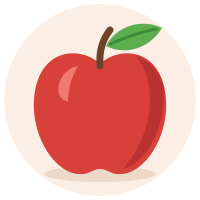
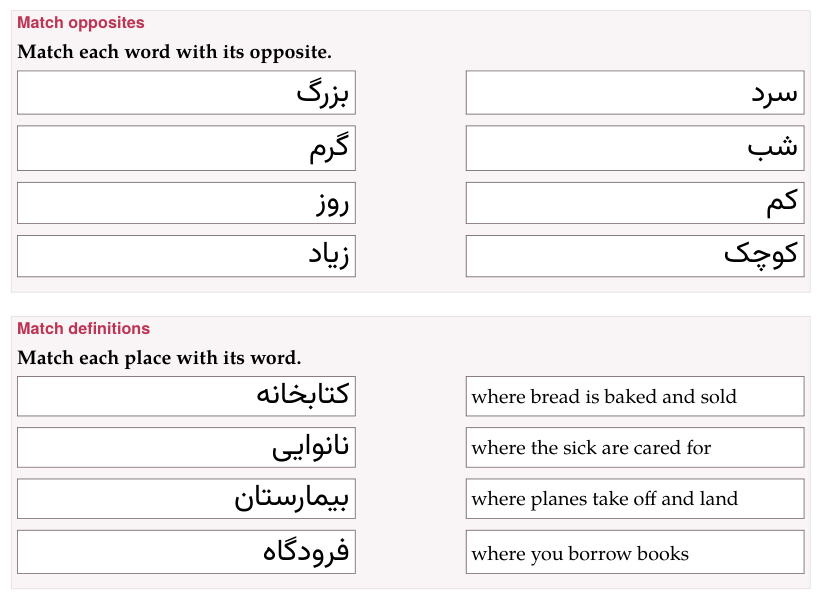

A matching exercise is a set of **pairs**. One side of each pair stays in
place, in a column; the other sides are mixed into a row of blocks, and
the learner puts each block beside its partner. Three types share the
machinery, and differ in what the pairs are:

| Type | A pair | `direction` |
|---|---|---|
| [`match-translations`](#match-translations) | a word, phrase or sentence and its translation | `target-to-translation` or `translation-to-target` |
| [`match-opposites`](#match-opposites) | a word or expression and its opposite | — |
| [`match-definitions`](#match-definitions) | a word and its definition | `word-to-definition` or `definition-to-word` |

```text
:::exercise match-translations
prompt: …
direction: target-to-translation      (optional)
- left side => right side
- …
:::
```

Each row is one pair, its two sides split by `=>`. To write an arrow
inside a side, escape it: `\=>`. Both sides may hold anything a line of the
dialect holds — target-language marks, a formula, and pictures:
`-  => [برف]{tl}`. Give every row a different
block side: two blocks that read the same are still two blocks, and each
is right only beside its own partner.

## Which side is shown {#which-side-is-shown}

Written as `word => translation`, the pair shows the **left side in the
column** and makes the **right side the block** to move. `direction:`
turns that round for the two types that have one:

| `direction:` | In the column | The blocks |
|---|---|---|
| `target-to-translation` (the default) | the left side | the right side |
| `translation-to-target` | the right side | the left side |
| `word-to-definition` (the default) | the left side | the right side |
| `definition-to-word` | the right side | the left side |

So the rows can always be written word first, and one field decides
whether the learner looks for the translation of a word or for the word of
a translation. In the form this is *What the learner sees on the left*:
**Word or sentence** or **Translation** for translations, **Word** or
**Definition** for definitions; a new exercise of either type writes its
default into the Markdown. `direction:` changes nothing on paper, where the
left side of each row is always the left column.

## Match translations {#match-translations}

**What it is for:** vocabulary, and whole sentences with their meaning.

```parseh-example
---
target: ja
---
:::exercise match-translations
prompt: Match each word with its picture or its meaning.
- りんご => 
- 家 => 
- 本 => a book
- 水 => water
explanation-correct: りんご *ringo*, an apple; 家 *ie*, a house; 本 *hon*, a book; 水 *mizu*, water.
:::
```

## Match opposites {#match-opposites}

**What it is for:** pairs of antonyms — big and small, early and late —
which are learnt best together.

```parseh-example
---
target: ar
---
:::exercise match-opposites
prompt: Match each word with its opposite.
- كبير => صغير
- طويل => قصير
- حار => بارد
- جديد => قديم
explanation-correct: *big, small; long, short; hot, cold; new, old.*
:::
```

## Match definitions {#match-definitions}

**What it is for:** a word from its description, or the other way round —
the way a monolingual dictionary teaches.

```parseh-example
---
target: es
---
:::exercise match-definitions
prompt: Match each place with its word.
direction: definition-to-word
- [la biblioteca]{tl} => where you borrow books
- [la panadería]{tl} => where bread is baked and sold
- [el hospital]{tl} => where the sick are cared for
- [el aeropuerto]{tl} => where planes take off and land
:::
```

## On the page

Each row is the fixed side with an empty box beside it, and under the rows
is the row of blocks, shuffled afresh each time the page opens. Drag a
block into a box, or tap the block and then the box; a box holds one
block, and a block dropped on a full box sends the one that was there
back to the row. From the keyboard, Tab reaches a block and Enter or Space
picks it and puts it down. There are no arrows here, and the **✥
dragging** switch never applies: a matching exercise can always be
dragged.

**Check exercises** marks each box: ✓ where it holds the partner of its
row, ✕ where it holds another block; a box left empty is framed red and
still says *drop match here*. The exercise is right when every box is.

## On paper

Every entry of both columns sits **in a frame of its own**, so it is plain
what is to be joined to what: the student draws a line from a frame on
the left to one on the right.

- The two columns are **equally wide**, with a gap between them for the
  line.
- The two frames of a row are **equally tall**, the taller entry deciding,
  and level with each other; rows are spaced so that frames never touch.
- The right column is **mixed** by moving it round by one row — each entry
  goes up one row, and the first goes to the bottom — the same on every
  build, so every copy of a worksheet is alike.
- An entry in a right-to-left language is set **flush right**, its
  continuation lines too; anything else flush left.
- A picture in an entry is printed in its frame, at most an eighth or so of
  the page high.
- **Nothing crosses a frame**, at any print size: a word too long for its
  frame is hyphenated there — even the first word of the entry — and a
  line may end after a slash; what cannot break at all, a long number
  say, is set smaller until it fits.

{width=80 align=center}

In large print the frames grow heavier with the text; in black and white
they are black.

## In the form

*Pairs* lists them as *Pair 1*, *Pair 2*…, each with its two fields —
*Word, phrase, or sentence* and *Translation*, *Word or expression* and
*Its opposite*, *Word* and *Its definition* — with ↑ ↓ and **Delete**, and
**+ Add pair**. An arrow typed in either field is escaped for you.

## In a deck

**+ Deck** copies a matching exercise into an exercise deck as it is
written. On the study page it is answered the same way and checked with
**Check** or Enter; when it was wrong, *Correct answer* shows it solved
underneath. [Exercises in a deck](in-a-deck.md) has the rest.
