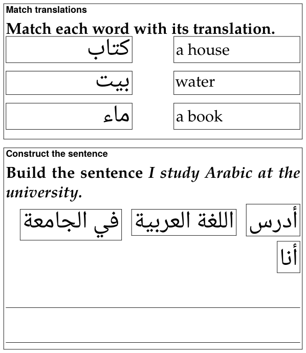

A studio document's PDF prints its exercises **unsolved**, as a worksheet:
no blank is filled, no answer ticked, no statement marked true or false,
and the explanations are left out, as are the answer's picture and
recording. A flashcard is the exception, since it is there to study from:
it prints both its sides.

## Making the PDF

On a document's reading view, **Build PDF** makes the PDF, **View PDF**
shows it in place of the page, and **Download ▾ → PDF** saves it. Beside
**Build PDF**, **PDF options ▾** says how the next build prints the
document — options of the build, not of the Markdown, so one worksheet
prints both ways:

| Option | Choices | For |
|---|---|---|
| **Print size** | **Normal · 11 pt**, **Large · 14 pt**, **Extra large · 17 pt**, **Maximum · 20 pt** | readers with low vision: *the exercises are set a step larger still, with more room to write* |
| **Colour** | **Black and white — no colour, no grey (pictures keep their colours)** | photocopies: *tints and grey text come out as smudges on a copier* |

The choice is kept for that document, in that browser. The build badge,
in the bar under the page's buttons, says what the PDF was built with —
*PDF ✓ 3 pages · scale 1.52 · 17 pt · B&W* — and when the options have
been changed since, a second
badge, **built with other options — rebuild**, says the PDF on the server
is not the one the menu now describes. It is not a fault: press **Build
PDF** again.

## Every exercise

Each exercise is a framed box with its label at the top — the type's name
on paper: *Fill the blanks*, *Match definitions*, *True / False*,
*Yes / No* and so on — then the prompt, bold except its `{no-bold}`
passages (a right-to-left line of it set flush right), then the question's
picture, then the question's recording as a small card: ♪, *audio*, the
file's name and the stretch its clip plays. Then the exercise itself:

| Type | On paper |
|---|---|
| `fill-blanks` | the sentence, a line for each blank (a right-to-left sentence flush right), then *Blocks:* and every row's word, answers and distractors, in the order written |
| `order-sentences` | the sentences as a list, moved round by one place (the second first, the first last) |
| `construct-sentence` | the chunks in a row, each framed, moved round by one place and flowing the way the answer is read; under them, **lines to write the sentence on** |
| `match-translations`, `match-opposites`, `match-definitions` | **every entry in a frame**, two equal columns with a gap for the line the student draws, the right column moved round by one row |
| `yes-no`, `true-false` | **each statement in a column of its own, the marks *Yes / No* or *True / False* aligned in a column at the right** |
| `single-choice`, `incorrect-part`, `choose-all`, `odd-one-out` | the answers as a list, a □ before each, in the order written |
| `flashcard` | *Front:* and *Back:*, both printed |
| an exercise that needs attention | *Exercise needs attention in the Markdown source.* in red |

An exercise that fits the page goes to the next one whole when it does not
fit what is left of this one. One **taller than a page** — ten pictures to
match, each in its frame, or at 20 pt a reading passage and its questions —
**starts a page and goes on over as many as it needs**, with a frame on
each, instead of being cut off at the foot of one: at every print size.
Straight after a heading, an exercise that a page could not hold together
with its heading starts right under it instead, so a heading is never left
alone at the foot of a page, nor pushed with its exercise off the next.

Each "moved round by one place" is the same on every build, so every copy
of a worksheet is alike — and none of it depends on the page's shuffling,
which paper cannot do. Where the order is *as written*, the order is yours:
put the answers of a fill-in's rows, or the right answer of a choice, where
they do not give themselves away.

## The layouts made for a pen

Three layouts are made to be written on, and each page of this section
shows its own: [matching](matching.md#on-paper) (framed entries),
[construct the sentence](placement.md#construct-sentence) (writing lines)
and [true / false](choice.md#on-paper) (aligned marks). What they share:

- **Nothing crosses a frame or runs under the marks**, whatever the print
  size. A word too long for its frame or its column is hyphenated there, even
  when it is the first word; a line may end after a slash
  (`socioeconomic/political`); and what cannot break at all, such as a long
  number, is set smaller until it fits.
- **Right-to-left entries are set flush right**, and so are their
  continuation lines, in their own order; anything else is flush left.
- **A construct-the-sentence exercise gets as many writing lines as one and
  a half times its sentence fills** — and never fewer than one. TeX measures the
  sentence as it sets it, chunk by chunk in its own fonts, so the count is
  right at 11 pt and at 20, in Persian and in Japanese.

## Large print

The three larger sizes set the whole document larger, not only its
exercises: the headings, the target script and every space grow with the
text, the lemma headings by the same ratio, and the margins give a little
to keep the lines long enough to read. The exercises are set **a step
larger still** than the text round them — they are what the reader holds
closest, and writes on — and their blanks, frames and writing lines grow
heavier, the writing lines further apart.

At 20 pt a reading passage and its questions can be taller than a page,
and goes on over pages as any exercise taller than a page does
([above](#every-exercise)). A table wider than the line is scaled down to
the line, and a vertical (tategaki) column is never longer than the page.

Large print needs a TeX package, *extsizes*. It is one of the TeX packages
the installer adds when it is asked to set up PDF building on a TeX Live
that lacks them; a TeX without it stops a large-print build with a message
that names the package, and the Normal size builds without it.

## Black and white

For the photocopier: **no colour and no grey anywhere**, except in the
pictures, which keep their colours. Every ink — headings, frames, rules,
links, coloured words, `{#8E2B34}` marks, a coloured lemma — prints black;
every tint prints white, and a tinted panel (an exercise's box, a `>` box,
a tinted target block, a recording's card) keeps a thin black frame
instead, so it is still set off from the page. The red line of an
exercise that needs attention prints in bold black.

{width=80 align=center}


Everything above is done from the document's page. The same build is also
a command, `markdown/exlex/exlex.py build`, which takes the same two
options — `--size` with 11, 14, 17 or 20, and `--mono` for black and white
— and writes the same `.tex`:

```bash
python3 markdown/exlex/exlex.py build lesson.md -o lesson-pdf --size 17 --mono
```

