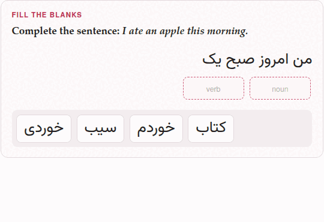
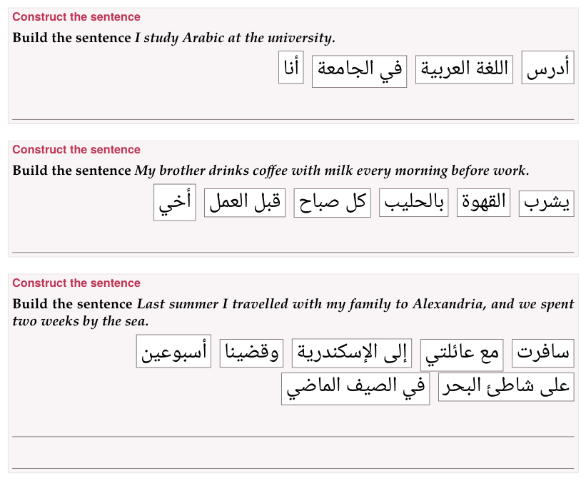

In a placement exercise the learner moves **blocks** — words, chunks,
whole sentences — into their places. Three types share the machinery:

| Type | The blocks go… | Rows |
|---|---|---|
| [`fill-blanks`](#fill-blanks) | into the blanks of a sentence | `- [name] word`, `- [ ] distractor` |
| [`order-sentences`](#order-sentences) | into order, one under another | `- [1] first sentence`, `- [2] …` |
| [`construct-sentence`](#construct-sentence) | into order, in a line that makes a sentence | `- [1] first word`, `- [2] …` |

## Moving the blocks

There are three ways to move a block:

- **drag it** to where it goes — into a blank, or, in an ordering
  exercise, onto the block it should stand beside (on that block's first
  half it goes before it, on its second half after it);
- **tap it, then tap where it goes** — a blank, or the row of spare
  blocks. A tapped block is marked as picked; tap it again to put it down.
  This is the way on a touch screen, and from the keyboard, where Tab
  reaches a block and Enter or Space picks it and places it. In an
  ordering exercise a picked block tapped onto its line goes to the end of
  the line, which is rarely where it belongs: use the arrows there;
- in an ordering exercise, **its arrows** (below).

A blank holds one block: a block dropped on a full blank sends the one
that was there back to the row of spare blocks, and a block taken out of
a blank goes back there too when you drop it, or tap it, on that row.

**Every block of an ordering exercise carries two arrows**, and each moves
it one place: **↑** and **↓** in a list of sentences, **←** and **→** in a
line of words — and the other way round where that line runs right to
left, so an arrow always points where the block will go. The block at
either end has the arrow it cannot use dimmed. Tab reaches the arrows,
and Space or Enter presses them. They are there because dragging is what
a mouse does well and a finger does badly: a phone reports a drag as a
drag only sometimes.

**Where the pointer is a finger, dragging an ordering exercise's blocks
starts turned off**, and the arrows alone move them. That is a guess about
the machine, so each such exercise has a switch in its head — **✥ dragging
on** / **✥ dragging off** — which says which it is and changes it, for every
ordering exercise on every page that browser opens afterwards (in a private
window, for as long as the page is open). The switch governs dragging and
tap-to-place; the arrows are always there. A fill-in exercise has no
arrows, has no switch, and can always be dragged.

## Fill the blanks {#fill-blanks}

**What it is for:** a word in its context — a verb's ending, a
preposition, an article, the word a sentence needs.

```text
:::exercise fill-blanks
prompt: …
text: the sentence, with each blank as [[its name]]
- [its name] the word that goes there
- [ ] a distractor
:::
```

`text:` is the sentence, and each blank in it is a name in double
brackets. Each blank's row gives its word: `- [verb] read` fills
`[[verb]]`. Rows marked `[ ]` are **distractors**: blocks that fit no
blank. The name is anything without a bracket in it; every blank needs
a row that names it, and every named row a blank.

**Give each blank a name of its own, and one row.** The parser checks
only that the names in the sentence and the names on the rows are the
same names; it does not count them, so a name used twice shows no error.
Two blanks of one name share a single block, and the exercise can never
be marked right; of two rows naming one blank, only the last is its
answer, and the other is left over as a distractor.

**A blank may sit inside a target-language mark**, so a sentence of the
language being learned is written as one sentence:
`text: [من امروز صبح یک [[noun]] [[verb]]]{tl}`. The mark is spread over
the pieces round each blank when the document is read, and every
renderer then sees marks it knows. A blank at the very start is written
the same way — `text: [[[who]] کتاب را خواند.]{tl}`: the first bracket
opens the mark and `[[who]]` is the blank.

**Such a sentence is laid out in its own language's direction**, on the
page and on paper, with no `content-direction` needed: a sentence that is
the target's throughout — every run of it marked, or nothing in it but the
target's own script — runs the target's way, and the blanks fall where
they are read. In Persian, a blank after a word is to its *left*. A
sentence that mixes languages is left as it is, and so is an exercise
that sets `content-direction` itself.

```parseh-example
:::exercise fill-blanks
prompt: Complete the sentence: *I ate an apple this morning.*
text: [من امروز صبح یک [[noun]] [[verb]]]{tl}
- [noun] سیب
- [verb] خوردم
- [ ] خوردی
- [ ] کتاب
explanation-correct: سیب *sib*, an apple; with من *man*, I, the verb ends in *-am*: خوردم.
explanation-incorrect: With من *man*, I, the verb ends in *-am* — خوردم; خوردی is *you ate*.
:::
```

```parseh-example
---
target: de
---
:::exercise fill-blanks
prompt: Complete the sentence.
text: [Ich [[verb]] jeden Tag mit dem Bus [[prep]] Arbeit.]{tl}
- [verb] [fahre]{tl}
- [prep] [zur]{tl}
- [ ] [fährst]{tl}
- [ ] [zum]{tl}
explanation-correct: [ich fahre]{tl}; and [zur]{tl} is [zu der]{tl}, because [Arbeit]{tl} is feminine.
:::
```

The sentence need not be in the target language: `text: I [[verb]] the
[[noun]].` works as well, with the blocks in whatever language you like.

**On the page.** The sentence shows a box for each blank, and under it the
row of blocks — the answers and the distractors, shuffled afresh each time
the page opens. An empty box shows the blank's **name**, faintly: the name
is a hint the learner reads, so `[[verb]]` says that a verb goes there, and
the form's `blank1`, `blank2` say nothing at all. **Check exercises**
marks each blank: ✓ where it holds its own word, ✕ where it holds
another; a blank left empty is framed red and still shows its name. The
exercise is right when every blank is; a distractor left in the row
counts for nothing.

{width=70 align=center}

**On paper.** The sentence with a line for each blank, right to left and
flush right when the sentence is a right-to-left target's (or when
`content-direction` says `rtl`). Under it, *Blocks:* and every row's word —
answers and distractors alike — **in the order the rows are written**. The
form writes the answers first, blank by blank, and the distractors after
them; for a worksheet, reorder the rows in the Markdown so the answers are
not given away by their order — and do it after the last time the form
has had the exercise ([below](#form-rewrites)). (On the page the order of
the rows does not matter: the blocks are shuffled.)

**In the form.** *Sentence and blanks* builds the sentence piece by piece:
**+ Add sentence text** adds a stretch of *Text that stays visible* (spaces
and punctuation exactly as they should appear), **+ Add blank** a blank
with its *Correct movable word or chunk*; ↑ ↓ and **Delete** on each piece.
*Extra movable blocks (optional distractors)* has **+ Add distractor**.
The form names the blanks `blank1`, `blank2`, … in the Markdown it writes.

### What the form undoes {#form-rewrites}

The form writes the Markdown afresh each time it saves, from what its
boxes hold, and the names of the blanks and the order of the rows are not
among them. So a fill-in exercise that goes through the form — reopened
with **✎ Edit** and saved with **Save exercise**, in the editor's preview
or in a deck, or pasted with **Paste markdown…** — comes out with its
blanks renamed `blank1`, `blank2`, … and its answers before its
distractors again, and nothing says so. Give the blanks their names, and
put the rows in worksheet order, in the Markdown itself, after the last
edit in the form.

## Order the sentences {#order-sentences}

**What it is for:** the order of events in a story, the lines of a
dialogue, the steps of an explanation.

```text
:::exercise order-sentences
prompt: …
- [1] the first sentence
- [2] the second sentence
- [3] …
:::
```

Each row is a sentence with its **position** in brackets. Positions are
numbers and must all differ; they need not follow the order of the rows,
nor one another — `[1]`, `[3]`, `[7]` is a valid order — but the natural
way is to write the rows in the right order and number them 1, 2, 3.

```parseh-example
---
target: zh
---
:::exercise order-sentences
prompt: Put the day in order.
- [1] 我早上七点起床。
- [2] 然后我吃早饭。
- [3] 八点我去学校。
- [4] 晚上我回家。
explanation-correct: *I get up at seven; then I have breakfast; at eight I go to school; in the evening I go home.*
:::
```

**On the page.** The sentences are shuffled each time the page opens, one
under another, each with its ↑ ↓ arrows. **Check exercises** marks each
sentence ✓ where it stands in its place and ✕ where it does not; the
exercise is right when all are.

**On paper.** A list of the sentences, each after a bullet, moved round by
one place — the second first, the first last — the same on every build,
so every copy of a worksheet is alike. Nothing is printed to write a
number in: the student writes one beside each sentence.

**In the form.** *Sentences in the correct order*: a *Sentence* for each
*Correct position*, **+ Add sentence**, and ↑ ↓ **Delete** on each. The
positions are written for you, in the order the form shows.

## Construct the sentence {#construct-sentence}

**What it is for:** word order — where the verb goes, where the adjective
goes, how the pieces of a phrase chain together.

```text
:::exercise construct-sentence
prompt: …
answer-direction: rtl | ltr        (optional)
- [1] first word or chunk
- [2] …
:::
```

The rows are the words or chunks of the sentence, numbered in **reading
order** — in Persian or Arabic too: `[1]` is the word read first, on the
right. A chunk may be several words that stay together.

**`answer-direction`** is the way the row of chunks runs, and wraps: from
the right in `rtl`, from the left in `ltr`. Left out, it is the target
language's own direction, which is nearly always what you want; use it for
the one answer that needs the other. It is separate from
`content-direction`, which sets the direction of the whole activity.
Older right-to-left exercises that numbered their chunks backwards, to work
round an answer row that once always ran left to right, should be
renumbered in reading order — the form's **Reverse order** does it in one
press.

```parseh-example
---
target: ar
---
:::exercise construct-sentence
prompt: Build the sentence *I study Arabic at the university.*
- [1] أنا
- [2] أدرس
- [3] اللغة العربية
- [4] في الجامعة
explanation-correct: أنا أدرس اللغة العربية في الجامعة.
:::
```

```parseh-example
---
target: ja
---
:::exercise construct-sentence
prompt: Build the sentence *I study Japanese every day.*
- [1] 私は
- [2] 毎日
- [3] 日本語を
- [4] 勉強します。
explanation-correct: 私は毎日日本語を勉強します。 The verb comes last.
:::
```

**On the page.** The chunks are shuffled into a line that runs the
answer's way and wraps from the same side, each chunk with its two
arrows. **Check exercises** marks each chunk ✓ in its place or ✕ out of it.

**On paper** — the layout made for a pen. The chunks are printed in a
row, as the page shows them, each in a frame of its own, moved round by
one place as the sentences of `order-sentences` are, and flowing the way
the answer is read: a Persian or Arabic row starts at the right. Under the
row are **lines to write the whole sentence on**, as wide as the
exercise's box, as many as it takes to hold one and a half times the
sentence, and never fewer than one. TeX measures the sentence as it sets
it — the chunks end to end, a space between each, in their own fonts and
sizes — so the count is right at any print size and in any script. A
chunk too long for a line is framed as wide as the line, and wraps inside
its frame. In large print the lines are heavier and further apart.

{width=80 align=center}

**In the form.** *Words or chunks in the correct order*: a *Word or chunk*
for each *Correct position*, **+ Add word or chunk**, ↑ ↓ and **Delete**,
and **Reverse order**, which turns the whole order round (the positions
are renumbered with it) — for an answer typed in the opposite reading
order. *Direction of the answer (including wrapped lines)* is
`answer-direction`: **Automatic** (it says which way that is, *right to
left* or *left to right*), **Right to left**, **Left to right**.

## In a deck

All three go into an exercise deck with the **+ Deck** button every
exercise has on a document's reading view, and come back there when they
are due. On the deck's study page a placement exercise is answered the
same way, and **Check** (or Enter) marks it; when the answer was wrong,
*Correct answer* shows it solved underneath. The **✥ dragging** switch is
on the study page too. [Exercises in a deck](in-a-deck.md) has the rest.
