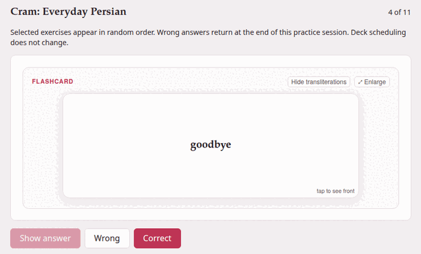
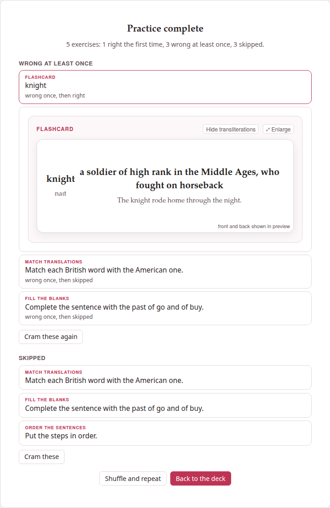

Studying follows the scheduler: it shows what is due, and nothing else.
Sometimes you want the opposite — every exercise of tomorrow's lesson, now,
however recently you saw them, and again until you get them all. That is
**cram mode**. It never changes a schedule or a history, so you can cram as
often as you like without upsetting what the deck has learned about you.

## Starting

1. On [the deck's page](deck-page.md), select the exercises to practise —
   ticked one by one, **Select shown** after a filter, **Select by tag**, or
   **Select all** (see [Selecting many exercises](selecting.md)).
2. Press **Cram 12 exercises** — the button counts what is selected, and
   reads **Cram exercises**, dimmed, while nothing is.

The cram page opens with a reminder of the rules: *Selected exercises appear
in random order. Wrong answers return at the end of this practice session.
Deck scheduling does not change.*

## Practising

At the top right, `3 of 12` says where you are. The exercises come in a
random order, one at a time and unsolved, as on the study page:

- **An exercise with an answer**: answer it and press **Check**. It says
  **Correct** or **Not quite**, shows its explanations and, for a matching or
  placement exercise answered wrong, its **Correct answer** underneath. Then
  **Next exercise** — or **Finish** on the last one.
- **A flashcard**: **Show answer** (or a click on the card) turns it; then
  say how it went with **Wrong** or **Correct**, which moves on at once. The
  card plays its front's recording when it is shown and its back's when it
  is turned, as on the study page, and **⤢ Enlarge** works here too.
- **An exercise that needs attention** has only **Next exercise**, and the
  end counts it among the skipped.

**Skip** leaves an exercise unanswered and moves on. It does not come back
in this practice — nor does the turn a wrong answer earlier put back for it
— and the end names it among the skipped. It is there until the exercise is
answered: once **Check** has said Correct or Not quite, only **Next
exercise** goes on; a flashcard turned but not yet marked can still be
skipped.

**A wrong answer comes back.** A scored exercise you got wrong, and a card
you called **Wrong**, goes to the end of the queue, and `3 of 12` becomes
`3 of 13`. It keeps coming back, each time at the end, until you get it
right — or skip it — which is the whole point of cramming.

There is no rating here, and nothing is saved: not the answers, not the
results. Cram as often as you like.

## The end

*Practice complete*, and how it went: *12 exercises: 8 right the first
time, 3 wrong at least once, 1 skipped.* Under it, what to look at again,
each list only when it has something in it:

- **Wrong at least once**: every exercise you got wrong, in the order they
  came up, each saying how many times, and whether you then got it right or
  skipped it.
- **Skipped**: every exercise you skipped.

Click one to see it solved, under it; click again to put it away. **Cram
these again** under the first list, and **Cram these** under the second,
start a practice of just those.

{width=75 align=center}

- **Shuffle and repeat** starts again with the same exercises, in a new
  random order.
- **Back to the deck** — or **← Deck** at the top at any moment — returns to
  the deck's page, where your selection is still ticked, ready for another
  round or for something else.

Opened with nothing selected, the cram page only says *Select exercises in
Browse, then choose Cram exercises.*

## Cram or study?

| | Study | Cram |
|---|---|---|
| Which exercises | the ones that are due | the ones you selected |
| In what order | learning, reviews, new ([more](studying.md#what-comes-next)) | random |
| After an answer | you rate it: Again, Hard, Good, Easy | right or wrong only |
| A wrong answer | comes back after its learning step | comes back at the end of this session |
| The schedule | moves on | never changes |
| The daily limits | apply | do not apply |

The two go well together: study every day, and cram a lesson's exercises on
the evening before you need them.

## As a page for a website {#as-a-page-for-a-website}

**Export selected to HTML**, beside **Cram exercises** on the deck's page,
makes the selected exercises **one HTML file that crams them**, for
students who have no Parseh: put it on your class's website, or send it.
Select the exercises (the button is dimmed while nothing is selected) and
press it. The file downloads, named after the deck
(`persian-practice.html`), and a message says how many went: *12 exercises
exported: persian-practice.html*.

The page is this cram page, less the way back to a deck that is not there:

- the exercises in random order, one at a time, with **Check**, **Show
  answer**, **Wrong** and **Correct**, and **Skip**; a wrong answer comes
  back at the end;
- *Practice complete*, its tally and its two lists, each exercise opening
  solved, **Cram these again** and **Shuffle and repeat**;
- their pictures and recordings inside the file, and their formulas; a
  recording played only in part is cut down to that stretch where ffmpeg is
  installed;
- **Aa**, for the size of the text and the theme, and at its foot *This
  page was exported from Parseh*, with links to Parseh on GitHub and to this
  guide.

Only the exercises go into it, as they are shown: not their Markdown, their
tags or their history. It schedules nothing, and the deck is not touched.
Like a document's page for a website, it keeps nothing and sends nothing:
what a student does on it is forgotten when the tab closes.
[A page for a website](../studio/web-page.md) says the rest, which is the
same for both.

The button is in the Browser layout of the deck's page only
([Browser and Mobile](../getting-started/mobile-mode.md)).
