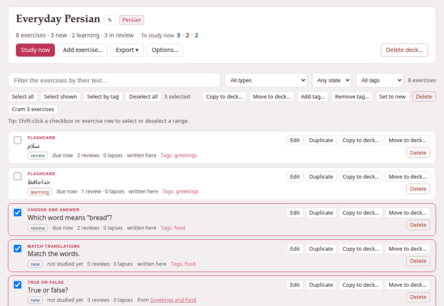

**Browse** on a deck's card, or the deck's name, opens the deck's page. The
top of it is the deck; below is every exercise it holds.

## The deck's head

- **The name**, with **✎** beside it to rename the deck, and the deck's
  language.
- **The counts**: `8 exercises · 3 new · 2 learning · 3 in review` — every
  exercise the deck holds, by where it stands (*learning* counts the ones
  relearning after a lapse too).
- **To study now**, the same three coloured numbers as on
  [the decks page](decks-page.md#a-decks-card) — or, when nothing is due,
  when the next exercise is.

And its buttons:

| Button | What it does |
|---|---|
| **Study now** | [Studies](studying.md) what is due. Dimmed when nothing is. |
| **Add exercise…** | The exercise form, to write an exercise straight into the deck ([more](filling-a-deck.md#in-the-deck-add-exercise)). |
| **Export ▾** | **With scheduling** or **Without scheduling**: the deck as a zip ([more](export-import-backup.md#exporting-a-deck)). |
| **Options…** | Daily limits, learning steps and intervals: [Deck options](options.md). |
| **Delete deck…** | Moves the deck to `exercises/.trash/`, after asking. |

**← All decks** in the top bar goes back to the decks page.

### Renaming a deck

**✎** asks for the new name — *Only the name changes: the deck's address,
exercises and scheduling stay.* The deck's address is made from its first
name and never changes, so a bookmark of the deck, or of its study page,
keeps working after a rename.

### Deleting a deck

**Delete deck…** says what will happen before it happens: *Its 8 exercises
and their scheduling are moved to exercises/.trash/ in the Parseh folder, not
erased: move the folder back to restore the deck.* **Delete deck** does it
and takes you back to the decks page. In the trash the deck's folder is
named after its language, its address and the moment it was deleted —
`persian--everyday-persian--20260921-143012` — and moving it back to
`exercises/persian/everyday-persian` restores it whole.

## The list

Each exercise is a row, in the order they were added:

- **What kind it is** — *Flashcard*, *Choose one answer*, *Match
  translations* … — and, for one that no longer works, a red **needs
  attention**; point at it to read why.
- **Its opening words**: the prompt, a card's front, or the first answer.
- **Where it stands**: `new`, `learning`, `relearning` or `review`, then
  when it is due — `not studied yet`, `due now`, `due in 7m`, `due
  tomorrow`, `due in 4d`.
- **Its history**: `2 reviews · 0 lapses` — how many times you answered it,
  and how many times you forgot it once it was a review.
- **Where it came from**: *from* and the document it was copied from, linked
  (or the note beside a book or a video); *from* and the book or the video
  a card was made in, with the place — its link opens the reader at that
  paragraph, or the player at that second; *written here* for an exercise
  added on this page; and a copy made with **Duplicate** says so, *(a
  duplicate)*.
- **Its tags**: `Tags: food, lesson-1`.

**Click a row** to see the exercise drawn **solved** under it — the right
answers marked, the explanations shown, a flashcard's front and back side by
side; click it again to close it. Several can be open at once. The
buttons, the links and the checkbox of a row keep their own clicks, and
Shift with a click selects instead (see
[Selecting many exercises](selecting.md)).

## Finding exercises: the filters

The bar above the list narrows it:

| Filter | What it keeps |
|---|---|
| **Filter the exercises by their text…** | exercises whose text or markdown holds what you type, whatever its case |
| **All types** | one kind of exercise; each kind is listed with how many there are, `Flashcard (2)` |
| **Any state** | **New**, **Learning** (relearning included), **Review**, or **Due now**: the reviews and learning steps due at this moment |
| **All tags** | the exercises with one tag, `food (4)` |

They work together, and the count at the end of the bar says how many rows
are left: `3 of 8`, or `8 exercises` with no filter on. When nothing
matches, the list says *No exercise matches these filters.*

**Due now** leaves out the new exercises (they are under **New**); a review
counts as due for the whole of the day it falls on, and a learning step from
the minute it falls due. An exercise whose markdown is no longer an exercise
at all is listed under the type **Unreadable**.

## Each exercise's own buttons

| Button | What it does |
|---|---|
| **Edit** | Opens the exercise in the form, as the editor does; **Save exercise** saves it. |
| **Duplicate** | Adds a copy of it, which starts as new: *Duplicated: the copy starts as new*. |
| **Copy to deck…** | Copies it into another deck of the same language ([more](selecting.md#copying-and-moving-to-another-deck)). |
| **Move to deck…** | Moves it there, with its schedule. |
| **Delete** | Removes it, and its history, for good. |

**Edit keeps the schedule.** Correcting a typo does not make an exercise new
again, and does not change where it came from: the schedule belongs to
you, not to the words. An exercise the form cannot show — one that needs
attention, say — opens as its markdown instead (*Edit the exercise as
markdown*), so it can still be put right from here. If the edited exercise
names a picture or a recording the deck does not have, it is saved all the
same, and the message says which file is missing.

**Delete** asks first — *“Match the words.” and its scheduling (1 review)
leave the deck for good* — and then **Delete exercise**. Unlike a
deck, a deleted exercise does not go to the trash.

## An empty deck

A deck with no exercises says how to fill one: **Add exercise…** above, or
**+ Deck** beside an exercise on a [studio document](filling-a-deck.md) in
the deck's language; the readers of books and the players of videos add the
cards made there, with their recordings.
