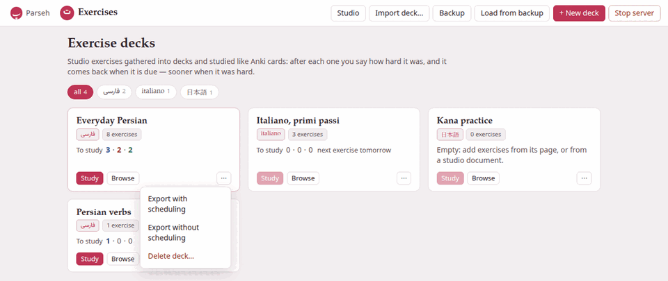

The hub's **Exercises** door opens the decks page: every deck you have, as a
card, with what each one has for you to study now.

## The bar along the top

| Button | What it does |
|---|---|
| **Studio** | Opens the studio, where documents and their exercises are written. |
| **Import deck…** | Adds a deck somebody exported from Parseh — a `.zip` — as a new deck. See [Export, import and backup](export-import-backup.md#importing-a-deck). |
| **Backup** | Downloads every deck at once, as one zip, scheduling and all. |
| **Load from backup** | Puts such a backup back. |
| **+ New deck** | Makes an empty deck (below). |
| **Stop server** | Stops Parseh. It asks first, and names anything the server is still working on, since stopping cuts it off. |

**Parseh** at the far left goes back to the hub, and **Exercises** beside it
always brings you back here.

## A deck's card

Each card says, from the top:

- **The deck's name** — a link to [the deck's page](deck-page.md).
- **Its language**, in that language's own writing: فارسی, italiano, 日本語.
- **How many exercises it holds**: `8 exercises`.
- **To study**, then three numbers: the **new** exercises, the ones
  **learning** and the ones **to review** that you can study now, coloured as
  Anki colours its three queues — blue, red, green. A number that is zero is
  greyed.

When nothing is left to study, the card says when the next exercise is due:

| It says | Meaning |
|---|---|
| `next exercise in 45m` | in 45 minutes — a learning step more than twenty minutes away (a nearer one already counts as to study), or the start of the next day, when it is less than an hour off |
| `next exercise in 3h` | later today — a learning step hours long |
| `next exercise tomorrow` | from the start of tomorrow |
| `next exercise in 5d` | in five days (then `1.5mo`, `2y` as the waits grow) |
| `no exercises scheduled` | nothing is waiting at all |

With the default options you will mostly see the last three: every
learning step is then at most a quarter of an hour away, so it always
counts as to study (below). The minutes and hours come from longer learning
steps — `1 10 60`, say, in the deck's
[options](options.md#some-settings-worth-knowing) — or, in minutes, from
the next day starting within the hour.

An empty deck says so instead: *Empty: add exercises from its page, or from
a studio document.*

What counts as "to study now" is what the study page would really show you
now: the reviews and learning steps that are due, and the new exercises the
day still has room for. A deck with 60 new exercises and the default limit
of 20 a day says `20` new, not `60` — the other forty come on the next
days. A learning step due in the next twenty minutes already counts, since
the study page brings it forward when nothing else is left (see
[the scheduler](scheduler.md#what-comes-next)).

### Its buttons

- **Study** starts [studying](studying.md) that deck at once. It is dimmed
  when there is nothing to study, and pointing at it says how many
  exercises are waiting.
- **Browse** opens [the deck's page](deck-page.md): the list of its
  exercises, the filters, the options.
- **⋯** opens a small menu:
  - **Export with scheduling** and **Export without scheduling** download
    the deck as a zip — the first for your own other machine, the second
    for somebody else ([more](export-import-backup.md#exporting-a-deck)).
  - **Delete deck…** asks first, then moves the deck to the `exercises/.trash/`
    folder inside Parseh. Nothing is erased: moving its folder back brings
    the deck back, answers and all. A deck is months of answers, so it is
    never thrown away by one click.

## Making a deck

**+ New deck** asks for two things:

- **Name** — anything you like, up to 200 characters (extra spaces are
  dropped). Two decks may have the same name; each still has its own
  address.
- **Language** — one of the eleven, each written `Persian — فارسی`,
  `Italian — italiano`, and so on. It starts on the language of the chip you
  picked, or on the first of the list when you picked **all**. *Every
  exercise of a deck is in its language*, as the dialog reminds you: this
  cannot be changed afterwards.

**Create deck** makes it and opens its page, where you can start filling it
(**Create deck** with no name only says *Give the deck a name*). Most decks
are made on the way, though: the studio's **+ Deck** and **+ Add all
exercises** dialogs end their list of decks with **+ New deck…**, and the
card sheet of a book or a video with **+ new deck…** — see
[Filling a deck](filling-a-deck.md). (A deck page's **Copy to deck…** and
**Move to deck…** only list the decks you already have.)

## The language chips

The row of chips under the title is the same row every index page of Parseh
has: **all** with the number of decks, then one chip for each language you
have a deck in, with how many. A click on a chip shows only that language's
decks; **all** shows them all again.

The choice is the whole toolbox's, not this page's: pick Italian here and the
hub, the libraries and the studio open on Italian too, and the other way
round. A language you picked elsewhere that has no deck here has no chip
here either, so the page opens on **all** instead of showing nothing — and
the toolbox's choice goes back to **all** with it.

## When there are no decks

A new Parseh has no decks, and the page says how one fills: press **+ Deck**
beside an exercise on a studio document to copy it into a deck, or open a
deck and use **Add exercise…**, the same form the studio editor uses. A
**+ New deck** button waits under the explanation.

## On a phone

The Exercises pages are the same pages on a phone, laid out narrower: the
cards stack in one column, and the buttons of the top bar are stacked in a
column beside the **Parseh** and **Exercises** links, above the page's
title. In the hub's **Mobile** mode the Exercises door is one of
its four doors, with the same two counts, and every Exercises page has a
mobile layout of its own: the decks with **Study** and **Open**, a deck with
**Study now**, **Cram all** and its exercises to pick a cram of your own
from — all, the ones a filter shows, by tag, one by one — and studying with
no bar over the exercise, **Next** in the place **Check** was, and the
ratings at the foot of the screen, or down its right edge held sideways —
and nothing that makes, edits, tags, exports or imports.
[Browser and Mobile](../getting-started/mobile-mode.md#the-exercise-decks)
says more.


*Stop the Parseh server?* — and, when something is still running (a deck
being imported, a backup being restored, a book being built elsewhere), how
many tasks are running and the first five of them by name, with **Stop
server anyway**. Every Parseh page stops answering until Parseh is started
again.

