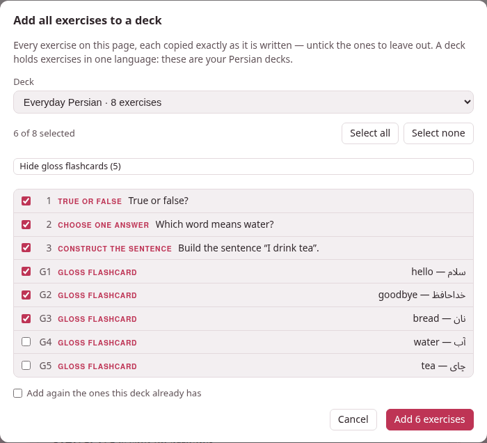

There are five ways into a deck, and they all arrive at the same place: one
exercise, in the deck's language, new, waiting to be studied.

## One exercise from a document: + Deck

On a studio document's page — the reading view, not the editor — every
exercise carries a **+ Deck** button in its head. An exercise inside a `>`
box has one too. Press it and a small dialog asks where the exercise goes:

- It names what you are copying — *True or false — copied exactly as it is
  written here* — and reminds you that a deck holds exercises in one
  language: the list shows only **your decks in the document's language**.
- **Deck** is that list, each deck with how many exercises it holds
  (`Everyday Persian · 8 exercises`). The deck you used last for this
  language is already chosen.
- **+ New deck…**, at the foot of the list, makes a deck on the way: choose
  it and a **Name of the new deck** field appears. With no deck yet in this
  language, that is where the list starts.

**Copy** puts the exercise into the deck and says *Copied into “Everyday
Persian”*.

What goes in is **the exercise exactly as it is written**, and everything
it needs to be read on its own:

- **The footnotes it calls.** Their definitions come along, and only those.
- **Every picture and recording it names**, wherever it names them: a card's
  `front-image` or `back-audio`, an exercise's `image:` or `audio-answer:`,
  a picture or recording line inside a jolly card's field, a picture inside
  an answer or a footnote. They are copied into the deck's own `images/`
  and `audio/` folders.
- **The document's tags**, which become the exercise's tags in the deck —
  handy later, to [pick them out again](selecting.md#by-tag).
- **Where it came from.** The deck's list says *from* and the document's
  title, linked to it.

A picture whose name the deck already uses **for a different file** is
stored under another name — `cat-2.png`, then `cat-3.png` — and the
exercise's reference to it is rewritten to match, so neither picture is
lost. The same file already in the deck is not copied a second time. A
picture or recording the document itself has lost keeps its path in the
exercise, and the confirmation says which: the exercise still goes in, and
you can upload the file to the deck later.

### When the copy asks, or refuses

- **The same exercise is already in that deck.** The browser asks *This
  exercise is already in “Everyday Persian” — add it again?*. OK adds a
  second copy; Cancel adds nothing.
- **The document was saved since this page was loaded** — in the editor in
  another tab, say. The copy is refused with *This page is out of date —
  reload it, then copy*, because the button counts exercises on the page
  you see, and the saved document may have them in another order: the copy
  could otherwise take the wrong one. Reload the page and press the button
  again.
- **An exercise that shows an error** (a missing answer, an unknown field)
  has no **+ Deck** button at all: a deck only takes exercises that work.
  Put it right in the editor first.
- If a deck you made with **+ New deck…** could not take the exercise after
  all, it is removed again, so a failed copy leaves no empty deck behind.

The editor's preview has no **+ Deck** buttons; the reading view does. And
**notes** — a studio document opened beside a book or a video — have them
too: the deck's list then links back to that note, on its book or video.

## A whole page at once: + Add all exercises

At the top of a document's reading view, beside **Edit**, **+ Add all
exercises** copies as many of the page's exercises as you like in one go.
It appears when the page has at least one exercise, or at least one gloss,
to copy.



The dialog lists every exercise that has a **+ Deck** button, in the page's
order, numbered as they come and each with its kind and first words — all
of them ticked:

- Untick the ones to leave out. **Select all** and **Select none** tick and
  untick the whole list, and the line above it counts `3 of 3 selected`.
- Choose the deck, or **+ New deck…** and a name, as for **+ Deck**.
- **Add again the ones this deck already has**: without the tick, an
  exercise the deck already holds is left out and counted; with it, it goes
  in a second time.
- The button says how many will go in: **Add 3 exercises**. They are copied
  one after the other, exactly as **+ Deck** copies one, while the dialog
  counts *Adding 2 of 3…*.

When it is done, one message says what happened: *Added 3 exercises to
“Everyday Persian”*, and after it how many were already there and left out,
how many the deck refused and why (the first reason), and any picture that
was missing. One exercise refused does not stop the others. If **nothing**
went in — every one already in the deck, say — the dialog stays open and
tells you, so you can tick **Add again**, or pick another deck. And if the
document was saved elsewhere since the page loaded, the run stops at once
and asks you to reload: every exercise after that point could be the wrong
one. A deck made with **+ New deck…** for a run that then added nothing is
removed again.

An exercise that shows an error is not offered, and the dialog says how
many were left out that way.

### Gloss flashcards

A document's **glosses** — a target word followed by its meaning, the ones
the **⇄ Glosses** table of the page lists — can come into the deck too, each
as a vocabulary flashcard. **Show gloss flashcards (5)** adds them to the
list, numbered `G1`, `G2`…, with the word and its meaning, ticked like the
rest; **Hide gloss flashcards** takes them out of the list again (and out of
what is added).

Written like this in the document:

```parseh-example
The greeting [سلام]{translit:salâm} = *hello* is said on arriving, and
[خداحافظ]{translit:xodâhâfez} = *goodbye* on leaving.
```

the first gloss comes into the deck as this card:

```parseh-example
:::exercise flashcard
card-type: vocab
target: سلام
transliteration: salâm
meaning: hello
:::
```

The card takes the word, its reading (the kana of a Japanese word) and its
transliteration when the document gives them, and the meaning; like the
other exercises it takes the document's tags and links back to the
document. It is made on the server from the document as saved — never from
what the page happens to show — and a card the deck already has is left out
as an exercise would be.

## In the deck: Add exercise…

On [a deck's page](deck-page.md), **Add exercise…** opens the same form the
studio editor's **Exercises ▾ → Add exercise…** opens: the grid of exercise
types, then a form for the one you pick, with its preview drawn below — in
the deck's language, solved, so that you see what you are writing.
**Add to deck** saves it.

- **Paste markdown…**, under the grid, takes an exercise copied as markdown —
  the **copy markdown** of a card sheet in a book or a video gives one, and
  so does any `:::exercise` block you copy out of a document. Paste it in the
  box and **Open in the form** (or Ctrl+Enter): it opens in the form as a new
  exercise, to look over before **Add to deck**. Pressing Ctrl+V on the grid
  itself does both at once. Words around the block are left out; text with
  no exercise in it, or with two, is refused with a note saying so.
- **Pictures and recordings.** A flashcard's picture and recording fields
  have **Upload…**, which stores the file in the deck and fills in its path;
  a recording field has a ▶ to hear it. A jolly card's field has **Image…**
  and **Recording…**, which upload a file and put its line in at the cursor.
  Pictures may be PNG, JPEG, SVG or PDF, up to 15 MB; recordings MP3, M4A,
  AAC, Ogg, Opus, WAV, FLAC or WebM, up to 30 MB, and a recording that holds
  no sound is refused. A large upload shows on the **Working…** pill while
  it goes up.
- **What a deck takes** is exactly one `:::exercise` block, with nothing
  around it and no errors — the form writes one; a hand-written one that is
  not is refused with the reason (*this is not one exercise: it holds 2*,
  *the exercise needs attention: …*).
- **Already there?** An exercise the deck already holds asks *Already in
  this deck … Add it a second time?* — **Add again**, or Cancel, and the form
  stays open so you can still change it.
- **A picture or recording it names that the deck does not have** does not
  stop the save: the exercise is added, and the message says which file is
  missing — *images/cat.png is not among this deck's pictures: upload it, or
  the card shows a broken picture*.

## From a book or a video

The card sheet that a modifier-click on a word opens — in a book's reader and
in a video's player — makes cards for three places, chosen at its top:
**Anki**, **exercise deck** and **markdown**. With **exercise deck**:

- **deck** lists the exercise decks in the book's or the video's language,
  with **+ new deck…** at the end;
- the card is a **vocabulary** or **opposites** flashcard made from the word,
  or a **jolly** card whose four fields start from it;
- a recording cut with **🔊 cut the audio…** goes in as the card's
  `front-audio` or `back-audio` (on a jolly card, as a line in a field), and
  a frame captured from a video as its `front-image` or `back-image`;
- **add to deck** adds it. A card the deck already holds is refused once,
  and the button becomes **add it again**.

The deck remembers where the card was made, and its list links back to that
moment: the book's reader at the paragraph, labelled with the book's title
and the subparagraph's number, or the video's player at the card's second.
The **markdown** destination puts the same card on the clipboard instead,
ready for **Paste markdown…** above. The card sheet itself is explained with
the books and the videos, in the section on cards and Anki.

## From the clip tray

A recording you cut in a book or a video, and a frame you capture from a
video for an exercise deck or for markdown, wait in the toolbox's **clip
tray** under a name no other file in the toolbox has. When an exercise is
added to a deck, or saved in it, and it names such a file that the deck
does not have, the file is copied in from the tray. That is how a card
copied as markdown and pasted into **Add exercise… → Paste markdown…**
arrives with its sound: the form's preview already plays it from the tray,
and saving brings it into the deck.

The tray keeps its own copy, and the deck keeps its own: emptying the tray
afterwards (the hub's **The clip tray**, **✕** on a clip or **Empty the
tray**) takes nothing away from the deck.

## Links to documents in a deck's exercise

An exercise may link to a studio document by its name,
`[the plural](doc:Persian plurals)`, as a document does. In a deck the link
still opens that document from the studio's library — and when the
document is renamed, the link in the deck's exercise follows the new name,
as the links in the documents themselves do.
