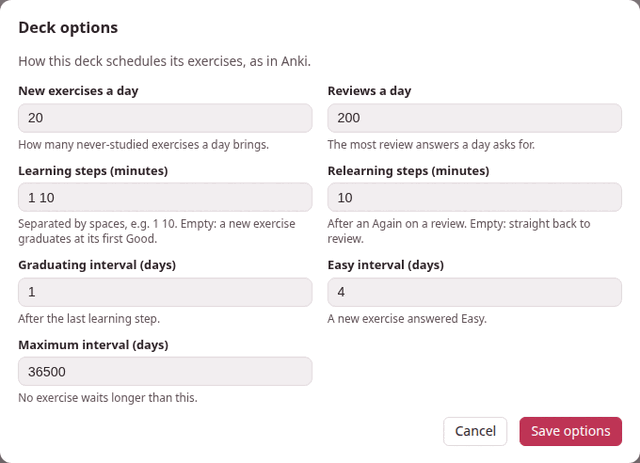

Each deck schedules its exercises with its own options. **Options…** on
[the deck's page](deck-page.md) opens them — *How this deck schedules its
exercises, as in Anki.* A new deck starts with Anki's defaults, and most
decks never need anything else.



## The dialog

| Field | Default | What it sets |
|---|---|---|
| **New exercises a day** | 20 | How many never-studied exercises a day brings. |
| **Reviews a day** | 200 | The most review answers a day asks for. |
| **Learning steps (minutes)** | 1 10 | The waits of a new exercise before it graduates, in minutes. Empty: a new exercise graduates at its first Good. |
| **Relearning steps (minutes)** | 10 | The waits after an Again on a review. Empty: straight back to review. |
| **Graduating interval (days)** | 1 | The first wait of an exercise that has just graduated, after its last learning step. |
| **Easy interval (days)** | 4 | The first wait of a new exercise answered Easy. |
| **Maximum interval (days)** | 36500 | No exercise waits longer than this. |

The first two, and the three intervals, are **whole numbers**; a step list
is **minutes above zero**, separated by spaces (a comma or a semicolon
works too, and so does a fraction of a minute: `0.5 5 20`). **Save
options** checks them before anything is saved: *Learning steps (minutes):
minutes above zero, separated by spaces* says which field is wrong, and a
number out of range is refused with its range — *new_per_day must be a whole
number from 0 to 9999*. Saved, the page says *Options saved*, and the next
answer already uses them.

Changing the options changes what comes **next**: the waits already given
stay as they were, and each exercise moves to the new rules at its next
answer. The counts on the page follow the new limits at once.

[The scheduler](scheduler.md) explains what each number does to an
exercise.

## Some settings worth knowing

- **Catching up after a holiday.** Set **New exercises a day** to 0 for a
  while: the deck brings only what you already know, until the reviews are
  back under control.
- **Hard material.** More, longer learning steps — `1 10 60` — keep a new
  exercise coming back twice more on its first day, after 10 minutes and
  then after an hour, before it waits a day. (Good moves an exercise on to
  the next step, so the first step, 1 minute, is where Again sends it
  back.) While it waits that hour with nothing else left, the decks page
  says *next exercise in 1h*.
- **An exam in a month.** A **Maximum interval** of 30 makes sure nothing
  waits longer than a month — at the price of more reviews.
- **A deck that only reviews** — say, one filled from an old deck's
  export — has **New exercises a day** at 0 until you want the new ones.

## Every setting

The dialog shows seven of the scheduler's sixteen settings. The other nine
keep Anki's defaults; they can be changed by hand (see below).

| Setting | Default | Allowed | Meaning |
|---|---|---|---|
| `new_per_day` | 20 | 0–9999 | new exercises a day |
| `reviews_per_day` | 200 | 0–9999 | review answers a day |
| `learning_steps` | `[1, 10]` | up to 50 steps, each above 0 minutes | minutes; empty means a new exercise graduates at its first Good |
| `relearning_steps` | `[10]` | the same | minutes; empty means a lapse goes straight back to review |
| `graduating_interval` | 1 | 1–36500 | days, after the last learning step |
| `easy_interval` | 4 | 1–36500 | days, for a new exercise answered Easy |
| `maximum_interval` | 36500 | 1–36500 | days; no interval is longer; never below `minimum_interval` |
| `starting_ease` | 2.5 | 1–10 | the ease a graduating exercise starts with; never below `minimum_ease` |
| `minimum_ease` | 1.3 | 1–10 | the ease never drops below this |
| `easy_bonus` | 1.3 | 1–10 | Easy's extra multiplier |
| `hard_multiplier` | 1.2 | 0–10 | Hard's multiplier |
| `interval_modifier` | 1.0 | 0.01–10 | scales every review interval |
| `new_interval` | 0 | 0–1 | the part of the interval a lapse keeps |
| `minimum_interval` | 1 | 1–36500 | days; no interval is shorter |
| `rollover_hour` | 4 | 0–23 | the hour a new day starts |
| `learn_ahead_minutes` | 20 | 0–1440 | how early a learning step may be shown when nothing else is left |

The first seven are the dialog's.


A deck is a folder, `exercises/<language>/<deck>/` inside Parseh, and its
options are in its `deck.json`, under `settings` — only the ones that differ
from the defaults. To change one the dialog does not show, open that file in
any text editor and add it there; the deck reads the file afresh every
time, so reloading the deck's page is enough.

```json
{
  "format": "parseh-exercise-deck/1",
  "id": "e6d64ae5ae04",
  "name": "Everyday Persian",
  "lang": "fa",
  "created": "2026-09-21T14:31:05.430148+02:00",
  "updated": "2026-09-21T14:31:05.432885+02:00",
  "settings": {"new_per_day": 10, "rollover_hour": 6, "learn_ahead_minutes": 0}
}
```

Leave `id` alone: it is what the deck is recognised by when it is imported
or restored from a backup.

The dialog keeps what you set by hand when it saves its own seven. If a
value in `settings` cannot be used — a word where a number goes, a number
out of its range — the deck falls back to **all** the defaults rather than
become unreadable, and the dialog then shows the defaults.


The options travel with the deck: an export carries them, and so does a
backup ([Export, import and backup](export-import-backup.md)).
