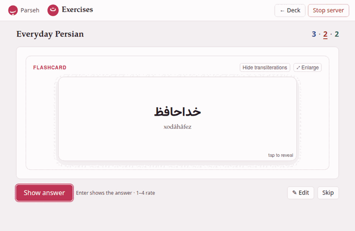
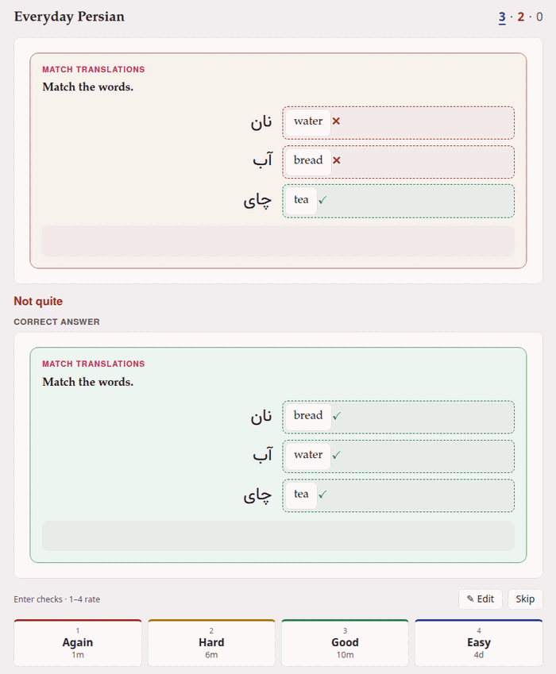

**Study now** on a deck's page, or **Study** on its card, opens the study
page. It shows the exercises that are due, **one at a time and unsolved**,
and after each one it asks how it went.

At the top, beside the deck's name, the three coloured numbers say what is
left — new, learning, to review — and the queue the exercise on screen comes
from is underlined.

## Answering

**An exercise with an answer** — blanks, choices, pairs, sentences, true or
false — you do as on any page, then press **Check**, or Enter. The result
reads **Correct** or **Not quite**, the explanations appear, and the
exercise is locked as you answered it. When you got a matching or a
placement exercise wrong (pairs, blanks, a sentence or a list to put in
order), its **Correct answer** is drawn under the result, since those only
mark what was right and wrong; a choice shows the answer it wanted by
itself.

Enter right after a click on an answer checks the exercise. On an answer you
reached with Tab, Enter does what it does on the page — picks that answer,
presses that arrow — so the whole exercise can be done from the keyboard,
and a click on **Check** (or Tab to it) checks.

**A flashcard** you turn with **Show answer**, with Enter, or with a click on
the card (*tap to reveal*, it says in its corner). A click on the card's
🔊, on a player, a link or a footnote's mark does what that thing does and
does not turn it. **⤢ Enlarge** opens the same card large, over the page —
the way to see a picture on a card properly — and turning the enlarged card
(a click, Space or Enter) turns the card and counts as showing the answer;
Escape closes it. The window closes by itself when the next exercise comes.

**An exercise that needs attention** — one that no longer reads as an
exercise — shows its errors and offers only **✎ Edit** and **Skip**.

### Recordings

A flashcard plays its recordings as Anki plays a card's sound: when the card
is shown, the **first recording on its front** plays, once; when it is
turned, the **first on its back**. A recording is a `front-audio` or
`back-audio` field, or a recording line inside a jolly card's field —
whichever comes first on that side — and one laid out with a clip plays only
its clip. With **⤢ Enlarge** open, the enlarged card plays and the one under
it keeps still. Whatever is playing stops when you rate or skip, or when the
next exercise comes.

A browser that lets no page make a sound before it has been clicked plays
nothing by itself until then (in Chrome, arriving by the **Study now**
button counts as a click). The 🔊 and the players are always there to press.

An exercise's own recordings — the `audio:` of a question — never play by
themselves: they are there to press, as on a page.

## Rating

After the check or the turn, four buttons ask how it went. Each shows how
long the exercise will wait if you press it:

| Button | Key | Press it when | For example |
|---|---|---|---|
| **Again** | 1 | you did not know it | `1m` |
| **Hard** | 2 | you got there, with effort | `6m` |
| **Good** | 3 | you knew it | `10m` |
| **Easy** | 4 | it was too easy | `4d` |

(The examples are a new exercise's, with the deck's default options. A
review you know well shows days, months, years.)

**The check never rates for you.** A wrong answer only puts the focus on
**Again**, and a right one on **Good** — press Enter or Space to take that
suggestion, or any other button or key. Only you know whether a right answer
was a guess, or a wrong one a slip of the finger. The rating and whether the
check found you right are both saved in the exercise's history.

The interval on each button is **exactly** what pressing it will give:
the small spread the scheduler adds to longer intervals is worked out in
advance, not drawn by lot. [The scheduler](scheduler.md) explains where the
numbers come from.

The rating is saved at once, and the next exercise follows.

## Editing and skipping

**✎ Edit** opens the exercise in the form (or as markdown, if the form cannot
show it). Save it and the corrected exercise is shown again, unanswered, in
the same place in the queue — *Exercise saved: its scheduling is
unchanged*. A typo found while studying is mended on the spot, and costs the
exercise nothing.

**Skip** sets the exercise aside, unanswered and unscheduled, for as long as
the page stays open: it will not come back in this session, and it keeps
its place in the deck for the next one — reload the page and it is there
again.

## When there is nothing left

*Nothing more to study now*, the page says, and under it when the next
exercise is due — *Next exercise in 45m*, *tomorrow*, *in 5d* — or *No
exercises scheduled*. (With the default options a learning step never waits
long enough to end up here: the page shows it at once, by
[learning ahead](#what-comes-next). Minutes and hours here mean longer
learning steps, or — in minutes — the new day starting within the hour.)
**Back to the deck** returns to the deck's page.

If you skipped any, it says how many — *2 exercises skipped this time.* —
and **Study the skipped ones** brings them back.

If the next exercise falls due within twenty minutes, leave the page open:
it brings that exercise by itself when it does. That happens in the last
twenty minutes before the new day starts at four o'clock, when the new day
has exercises for you, and with a deck whose `learn_ahead_minutes` you have
lowered by hand ([Deck options](options.md#every-setting)): its nearer
learning steps then wait here too.

## What comes next {#what-comes-next}

The study page asks the deck, after every answer, what to show:

1. **A learning step that is due** — an exercise you answered a few minutes
   ago, coming back as it was told to.
2. **A review that is due**, the one that has waited longest first.
3. **A new exercise**, in the order they were added to the deck.
4. **Learning ahead**: when nothing else is left for today, a learning step
   due within the next twenty minutes is shown now rather than making you
   wait — as Anki does.

The daily limits (by default 20 new exercises and 200 reviews a day) hold
the rest back until tomorrow; see [Deck options](options.md).

## Studying in two tabs

An exercise answered in one tab is not scheduled a second time from
another. If you answer, in a second tab (or on a page brought back from the
browser's history), an exercise the deck has already had an answer for, the
answer is refused — *This exercise was already answered — showing what
comes next* — and the page moves on. Without that, the second answer would
multiply an interval already multiplied, far past the label you pressed.

If an answer cannot reach the server, the page says *The answer may not have
been saved* and asks the deck again: it shows the same exercise if the
answer was lost, and the next one if it was saved after all.

## Keys

| Key | What it does |
|---|---|
| Enter | checks an answered exercise; shows a flashcard's answer |
| 1 2 3 4 | Again, Hard, Good, Easy, once the rating buttons are shown |
| Space, Enter | on the enlarged card: turns it |
| Escape | closes the enlarged card, or a dialog |

The keys wait while a dialog or the exercise form is open, and while you
type in a field.


Exercises whose blocks are put in order — a sentence to build, a list to
order — carry arrows on every block, and a switch in their head,
**✥ dragging on** / **✥ dragging off**. Where the pointer is a finger,
dragging starts turned off and the arrows move the blocks; the switch turns
dragging on, and is remembered by the browser for every page, the study page
included.

