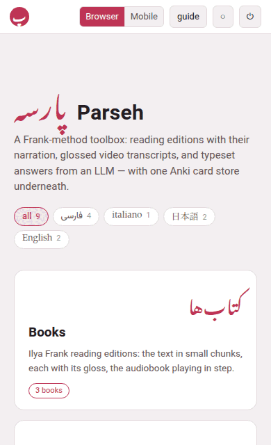

Parseh has two interfaces, and a switch at the top of the hub picks
between them.

- **Browser** is every page as it has always been, with everything that
  makes and changes things on it: adding a book, editing a chunk, writing a
  document, building a PDF.
- **Mobile** is a second set of pages made to be *read* on a phone:
  streamlined, one column, targets big enough for a finger, and no editing
  controls at all. It is for looking at what is there — reading a book,
  watching a video, reading a note, studying a deck — never for writing it.

{width=75 align=center}

## The switch

**Browser** and **Mobile** sit side by side in the hub's top bar, the one
in force filled in, and they are there in both layouts. A tap switches at
once — no reload — and the choice holds: on every page, after a reload,
the next time you open Parseh. Another tab open on Parseh follows the
switch as soon as you make it.

The choice belongs to the browser it was made in, as the theme does: a
phone can be in the mobile interface while the computer stays in the
browser one.

## The mobile hub

The hub was the first page with a mobile version; the books and the
exercise decks have theirs too ([below](#the-books)). In the mobile
interface the hub has:

- a slim top bar: **پ Parseh**, the switch and **◐** — nothing else;
- the name, and one line: *A Frank-method toolbox: read, watch, study.*;
- the language chips in a single row that scrolls sideways, which always
  brings the picked chip into view (with a mouse, where nothing can be
  swiped, they wrap into rows instead);
- the four doors, one under the other, large, each with its counts — the
  same counts as the browser hub's, following the chips in the same way;
- **Guide**, *How the toolbox works*, which opens this guide;
- and **As an app**, which installs the mobile interface on the phone, with
  an icon of its own and the whole screen for the page
  ([Parseh as an app](#parseh-as-an-app)). Inside the app it is not shown.

| Door | What it says under its name |
|---|---|
| **Books** | Reading editions, the narration in step |
| **Videos** | The transcript under the video, every line glossed |
| **Studio** | Notes on the language, to read |
| **Exercises** | Decks to study, each card when it is due |
| **Guide** | How the toolbox works |
| **As an app** | On the home screen, on the whole screen |

What it leaves out is everything that administers the toolbox: the
**⏻ stop** button, the Anki door, the clip tray, the dictionaries' door,
and the list of addresses at the foot. They are all still in the browser
interface, one tap away on the switch. The **Working…** panel appears in
both.

With the phone held sideways — or on a tablet, or a computer in the mobile
interface — the column is wider and the doors go two to a row
([Held sideways](#held-sideways)).

## Where the doors lead

Every mobile page is written one at a time. Until a page has its mobile
version, its door opens **the browser page, as it always has** — that is
the fallback, and nothing is ever a dead end. As the mobile versions
arrive, the same doors lead to them in the mobile interface, whether you
tap, open in a new tab, or long-press a link.

| Browser page | Its mobile version |
|---|---|
| the hub | **done**: the page above |
| the books' library, and a book's reader | **done**: the shelf, and the reader as a reader only ([The books](#the-books)) |
| the videos, a channel, and the player | to come: the index, and the player with its transcript and glosses |
| the studio's library, and a document | to come: the notes, to read |
| the exercise decks, a deck, and studying it | **done**: the decks, studying what is due, and cramming what you pick ([The exercise decks](#the-exercise-decks)) |

A few pages will stay browser pages only, because what they are for is
making or administering something: adding a book or a video, the studio's
editor, the Anki sync, the clip tray, the dictionaries' page. A link to one
of them opens it in its browser version, in either interface.

## The books

The **Books** door opens the **shelf**: every book, grouped by language
under the chips, which filter it as the hub's do. A book's card says what
the library's says — its title and author in the book's own script, the
title in Latin letters, a few lines about it, how many chapters, and
whether it is narrated — and the whole card opens its reader. A book read
on this phone says how far you have got (**read on · 40%**, and a line
along the foot of its card) and opens where you stopped. A book whose
reader has never been built opens nothing: it is built in the browser
interface, from its card in the library.

The **reader** is the same page in both interfaces — the text, the passes,
the glosses, the narration in step — with its header laid out again for a
thumb:

| Button | What it does |
|---|---|
| **پ** | the hub |
| **▤** | back to the shelf |
| **↺ 10** | the narration back ten seconds (a narrated book only) |
| **▶** | play the narration, and pause it |
| **10 ↻** | the narration on ten seconds |
| **☰** | the contents, to jump to a paragraph |
| **Aa** | the size of the text and the glosses |
| **⋯** | the rest, a group to a line |

On a narrated book, **↺ ▶ ↻** and where the narration has got to (*0:12 /
3:40*) are a line of their own under the first when the phone is upright,
and all of it is one line when it is held sideways. ↺ and ↻ take the
reading place along: the mark moves to the subparagraph the narration lands
in, and playing stops at that one's end, as always. How far they move is
set under **⋯**, **Listening**: **skip by … seconds**, any number from 1 to
600, kept for every book on this phone.

Under **⋯**: the **passes** (and **gloss** and **hover** — in hover mode a
tap on a chunk opens its gloss), the **listening** (continuous, loop, stop
at a change, the speed, how far ↺ and ↻ move, listening without following
the text), **looking a word up** where a dictionary is installed, and
**this page**: the theme, putting the bars away, and the **Browser |
Mobile** switch.

The header slides away as you read down and comes back on the smallest move
up — held sideways too — and stays put while **⋯** is open, or while you
press ↺ and ↻ again and again.

What writes the book is not there: book info, building the PDF or the
reader, the narration's panel, folding, the timings, the download, the
pencil over a chunk, making a card, writing a note between two lines, naming
a chapter. The notes that are there open to be read. On a computer in the
mobile interface, an Alt-click on a word makes no card and **E** opens no
editor; switch to **Browser** and they do again, on the same page.

## The exercise decks

The **Exercises** door opens the **decks**, one to a line (two, held
sideways), each saying what is due in it, with its two buttons: **Study**
and **Open**.

A deck's page says what is in it and what is due, and has two buttons:

- **Study now**, for what is due;
- **Cram all**: every exercise of the deck, in random order, until each is
  right — the scheduling as it was. It is the way to practise when nothing
  is due.

Under them, **Cram a few**: the deck's exercises, to pick the ones to cram.
Filter them by their text, their type, their state (new, learning, review,
due now) or a tag, and pick with **Select all**, **Select shown** (the ones
the filters leave), **Select by tag** or one by one, with the box beside
each; a tap on the rest of an exercise shows it solved. While anything is
picked, **Cram N exercises** waits at the foot of the screen: that is a cram
of your own — a tag, the ones you keep getting wrong, the ones with a word
in them — and like every cram it leaves the scheduling as it was.

Studying, the exercise has the screen: no bar over it, only the deck's name
and what is left, with **‹** back to the deck. **Check** or **Show answer**
answers it, and then **Next** takes its very place: it rates the exercise
as the answer says — **Good** when it was right or a card was turned,
**Again** when it was wrong, the label saying which and when it comes back
— so you go through a deck tapping one spot. The four ratings are beside it
for any other. With the phone upright they are a bar at the foot of the
screen; held sideways, a column down the right edge, where the thumb holding
the phone is, and the exercise has the whole height beside it. Cramming
works the same way: **Check** then **Next exercise**, **Show answer** then
**Wrong** or **Correct**, with **Skip** beside them — and at the end, the
exercises you got wrong at least once and the ones you skipped, each shown
solved at a tap ([Cram mode](../exercises/cram.md#the-end)). The answers and blocks inside an exercise are big
enough for a finger, and the arrows move a block where a mouse would drag
it. **A blank, and a matching exercise's box, are filled the other way
round**: tap the blank or the box, and a cloud offers the words the bank
below holds — tap one and it is in; tap a filled one to change it or empty
it ([Placement](../dialect-exercises/placement.md#moving-the-blocks),
[Matching](../dialect-exercises/matching.md#on-the-page)).

Making a deck, adding, correcting, tagging or moving an exercise, setting
one back to new, the deck's options, exporting, importing and backing up are
the browser interface's; so is the server's stop button. **◐** at the top
of the decks and a deck turns the theme for the whole toolbox — in the
studio too.

## Held sideways

A phone is held sideways as often as upright, and a sideways screen is short
and wide, so the mobile interface uses the width to spare the height: the
column widens, the hub's doors, the shelf's books and the decks go two to a
row, a reader's buttons take one line, and studying puts its buttons down the
right edge. Every bar slides away as you scroll down and comes back on the
smallest move up. A tablet, and a computer in the mobile interface, get the
same wider layout.

## Parseh as an app

Installed as an app, the mobile interface opens from an icon on the phone's
home screen, on the whole screen: no address bar over the page, no browser
around it. It is still Parseh on your computer — the app opens wherever the
computer can be reached, at home or anywhere over Tailscale, and says
**Parseh cannot be reached** when it cannot (the computer asleep or off),
with **Try again**.

The mobile hub's **As an app** door opens the page that installs it. Its top
line says where the phone stands, and it has two steps:

1. **This phone trusts Parseh.** Parseh makes its own certificate — that is
   the warning a browser shows the first time — and an app, unlike a
   browser tab, does not go on past it. **Download the certificate**, then:
    - *Android*: open **Settings**, search for **CA certificate** (under
      *Security*, *Encryption & credentials*, *Install a certificate*),
      choose **CA certificate**, **Install anyway**, and pick
      *Parseh-CA.crt* from the downloads. Close the tab and open Parseh
      again.
    - *iPhone, iPad*: allow the download; in **Settings**, open **Profile
      Downloaded** and **Install** it; then **General**, **About**,
      **Certificate Trust Settings**, and turn on full trust for *Parseh
      local authority*.

   It is told once: every certificate Parseh makes afterwards is trusted
   too. It can vouch for your computer and nothing else — only its own
   name and its local and Tailscale addresses — and it comes off the phone
   in the same settings it went on in.
2. **Install it.** On Android, in Chrome: **Install Parseh** on that page,
   once the browser offers it, or the browser's **⋮** menu, **Install app**.
   On an iPhone, in Safari: the **Share** button, **Add to Home Screen**.

The app opens on the mobile hub, in the mobile interface. The **Browser |
Mobile** switch is there as everywhere, and the next time the app opens it
is the mobile interface again.

## What it is not

**It is not a lock.** Nothing is refused in the mobile interface. A browser
page reached by its address or a bookmark opens and works as it always
does, editing and all; the mobile pages simply do not *show* what edits.

**It is not the way pages fit a small screen.** Every page already adapts
to a phone's width, in either interface: the top bar slides away as you
scroll down and comes back on the smallest move up, and the layouts
rearrange themselves for the narrow screen. That goes on exactly as
before, whichever interface you are in (in the mobile interface the bars
slide away on a wide screen too, a phone held sideways among them). The mobile interface is a choice
you make, not a width.
