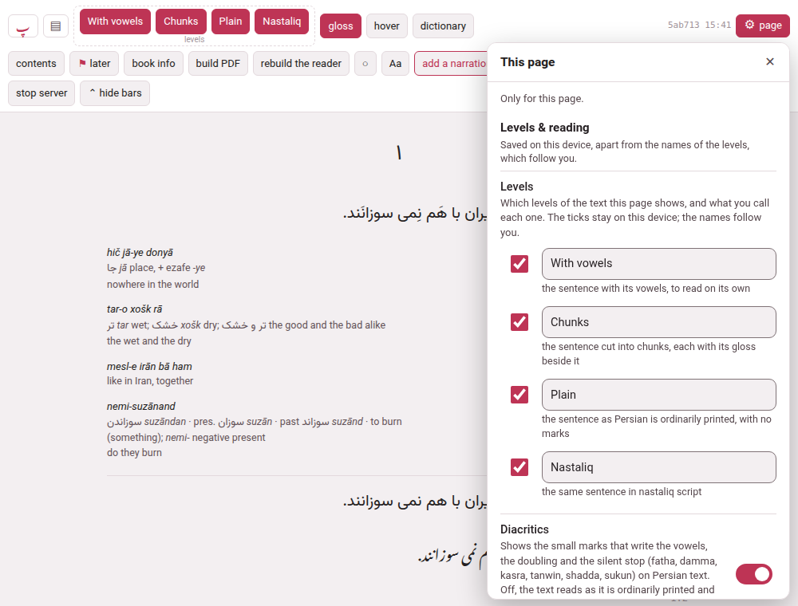
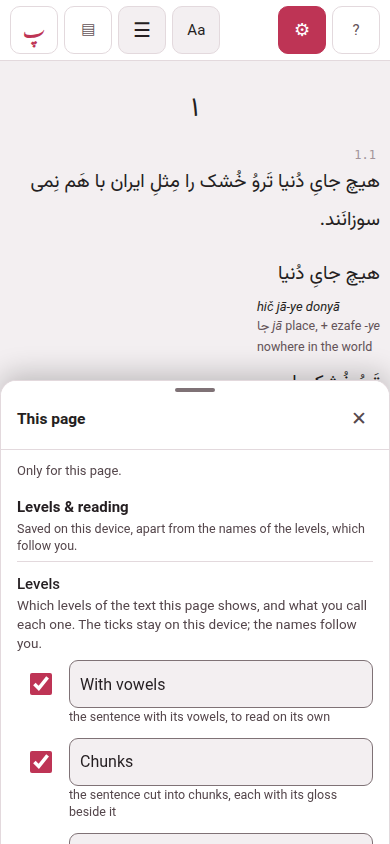
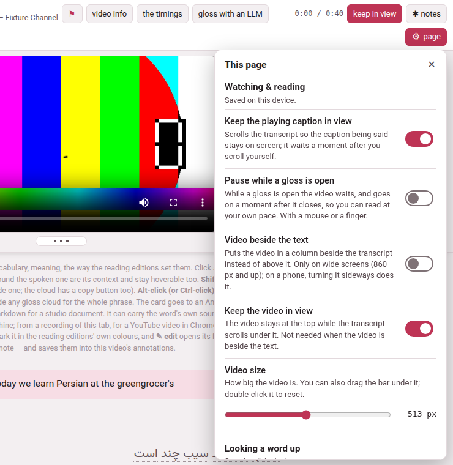
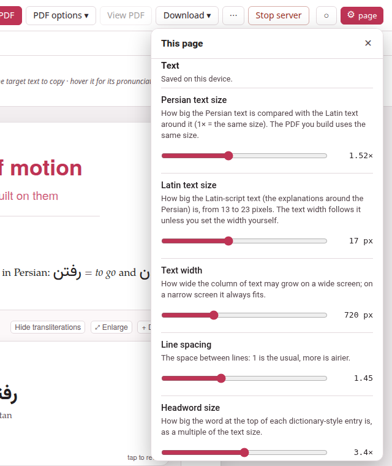
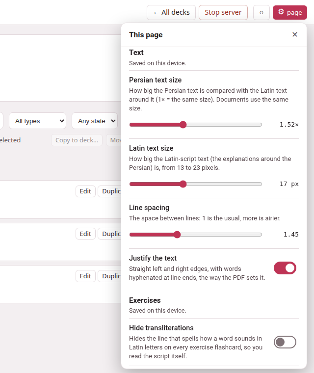
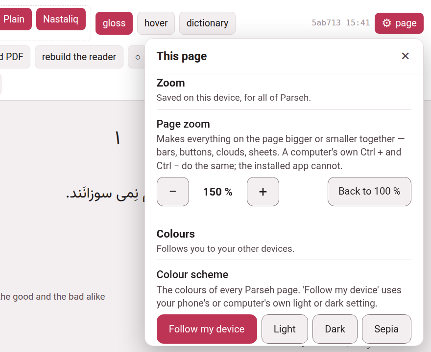

Every page where you read, watch or study has one small button in its top
bar, **⚙ page**, and one panel behind it with **every setting of that page**:
how big the text is, how a gloss opens, how the recording plays, what the
colours are, how big the whole page is. A row is its name, one sentence
saying what it does, and the control — a switch, a slider, a menu. Nothing is
hidden in a tooltip. The buttons that stay on the page are the very same
switches as the panel's rows: press either, and the other follows.

## What it is, and what it is not

The gear is for **the page you are on**. Parseh's **⚙ Settings** — one of the
doors of the hub, which opens a page of its own — is for Parseh
itself: the network and the devices let in, updating, the dictionaries and
models, the pictograms. They are two different places, and they look
different:

| | The gear of a page | The hub's **⚙ Settings** |
|---|---|---|
| Where | in the top bar of a book, a video, a document, the editor and a deck, with the word **page** beside it | a door on the hub, and the Settings pages it opens |
| What it opens | a panel over the page, titled **This page**, whose first line says *Only for this page.* | a page of its own: **Reading help**, **Network**, **Updating Parseh** |
| What is in it | how this page looks, reads and zooms | what Parseh does on this computer |

The two lead to each other: the foot of the panel says **Parseh's own
settings (network, updating, dictionaries)** and goes to the hub's Settings,
and a dictionary row in the panel — **Get a dictionary for this language →**
— goes to the page that installs one.

## Where it is

| Page | The gear stands |
|---|---|
| A book's reader | at the end of the header's first row, after the build stamp |
| A video's player | at the right end of the bar |
| A studio document, the editor, a deck, studying a deck, cramming it | at the right end of the bar, after **◐** |
| The same pages on a phone | **⚙** alone, in the bar — on a book or a video, on the first line, after **Aa**; on studying and cramming, which have no bar on a phone, in the row of the exercise's title |

On a computer the button reads **⚙ page**; on a phone, and in any window
narrower than 600 pixels, only **⚙**, a finger's width. Pointing at it says
*Settings of this page: how it looks, how it reads, how it zooms*.

The hub, the shelves and the Settings pages have no gear of
their own — they have nothing page-shaped to set. They do follow the
[zoom](#page-zoom) set on any page, and the hub keeps its own **◐** and its
**Browser | Mobile** switch in its bar. This guide has no gear and is not zoomed by
Parseh's: use the browser's own zoom there.

## Opening and closing it

- **On a computer** the panel opens under the button: a column about 380
  pixels wide, as tall as the window allows, scrolling inside itself, over the
  page and not instead of it. **✕**, **Esc**, or a click anywhere outside shuts it.
- **On a phone** — and in any window 560 pixels wide or narrower — it opens as a **sheet from the
  bottom edge, half the screen high**. The text stays on show above it, and it is not a dialog that
  blocks the page: change a size and the text changes where you can see it.
  **✕**, the phone's back gesture, or **Esc** with a keyboard shuts it. Every
  row on a phone is at least a finger high.
- **Esc** is spent on the panel first, so that whatever is under it — a gloss
  cloud, a list — does not shut as well.

{width=45 align=center}

A group with nothing to show on this page or this book is not drawn: a book
with no recording has no **Listening**, a book in English has no
**Diacritics**. A row that cannot be used just now is greyed, with the
reason under it — *Turn the dictionary on first.*

## Where a setting is kept

Under the name of each group the panel says where its settings are kept:

- **Saved on this device.** — in this browser, on this device. A phone and a
  computer can have different ones, which is on purpose: the screen you set
  up at a desk is not the one you want in bed.
- **Follows you to your other devices.** — kept by the computer Parseh runs on, so
  that every device that reaches it takes the same: the playback speed, the
  skip distance, the pause between repeats, **Wait at each new chapter**,
  **Keep playing into the next line**, the names of the levels and the colour
  scheme. Change one on the phone and the computer has it at its next load.

A group that holds both says which rows are the odd ones — for instance
*Saved on this device, apart from the names of the levels, which follow you* —
and a row of such a group wears a small tag, *follows you*, beside its name.

## A book's gear

The groups, in this order. A row that needs a recording, a dictionary or a
Persian, Arabic, Japanese or Chinese book is drawn only where there is one;
the names are what the panel says.

| Group | Row | What it does |
|---|---|---|
| **Levels & reading** — this device; the names follow you | **Levels** | one line for each level of the book: a tick that shows or hides it, a field for its name, and a sentence saying what it shows ([Levels and their names](../books/levels.md)) |
| | **Diacritics** | Persian and Arabic: shows or hides the small vowel marks on levels 1 and 2 ([Levels and their names](../books/levels.md#diacritics)) |
| | **Glosses** | the meaning beside each chunk, on or off — the **G** key |
| | **Glosses in a cloud** | reading the text clean, with a chunk's gloss in a cloud when you point at it or tap it — the **H** key. While it is on, the chunks level and **Glosses** rest |
| | **Pause while a gloss is open** | under the cloud's row, in a book with a recording: the recording waits while a cloud is open |
| | **Hide the bars** | puts the header away; a small **⌄** in the corner brings it back |
| **Listening** — follows you; repeating and listening on its own are not remembered. Only in a book with a recording | **Playback speed** | 0.25× to 2×; **[** and **]** step it |
| | **Skip distance** | how many seconds **↺** and **↻** move: 1, 2, 5, 10, 15, 30 or 60 — **Shift+←** and **Shift+→** too |
| | **Keep playing into the next line** | on to begin with: at the end of a line the next one plays |
| | **Repeat this line** | the **R** key; off each time you open the book |
| | **Pause between repeats** | under it: none to 5 seconds; greyed until the repeat is on |
| | **Wait at each new chapter** | playing holds where a new chapter or section begins, until you press **▶** |
| | **Listen on its own** | the recording plays by itself, with nothing highlighted or scrolled and a seek bar to start anywhere; not remembered |
| **Looking a word up** — this device, for this book | **Look words up in a dictionary** | where a chunk has no gloss, a click or a tap looks its words up in the installed dictionary |
| | **Show the dictionary's definitions** | under each word it finds, the dictionary's own definition |
| | **Translate the definitions into** *the gloss language* | each definition put into it by the translation model on this computer |
| | **Get a dictionary for this language →** | a link to Settings → Reading help; drawn even where nothing is installed |
| **Text** — this device | ***Persian* text size** (*the book's language*) | how big the words you are learning are |
| | **Gloss size** | the meanings and notes beside each chunk and in the cloud |
| | **Text width** | how wide the column of text may grow on a wide screen |
| | **Line spacing** | 1 is the usual, more is airier |
| | **Height of vertical columns** | Japanese and Chinese: how tall each vertical column is |
| | **Space between characters** | Japanese and Chinese: extra room between them |
| | **Furigana contrast**, **Furigana size** | Japanese: how strongly, and how big, the small kana over the kanji are drawn |
| | **Put the text back to normal** | sets only the sliders above back to their usual values |
| **Zoom** — this device, for all of Parseh | **Page zoom** | [below](#page-zoom) |
| **Colours** — follows you | **Colour scheme** | [below](#colours) |
| **Interface** — this device | **Browser or mobile pages** | [below](#interface) |

On a phone the last group also holds **Away from the computer**, which keeps
the book on the phone for when the computer cannot be reached ([Browser and
Mobile](mobile-mode.md#the-books)).

The page's own header keeps the buttons you reach for while reading —
the levels, **gloss**, **hover**, **contents**, **⚑ later**, **loop**, **listen** and the
speed — so that the common things are one press; what is rarer is only in the
panel. [The reader](../books/reader.md) lists the header.

## A video's gear

| Group | Row | What it does |
|---|---|---|
| **Watching & reading** — this device | **Keep the playing caption in view** | the transcript scrolls so that the caption being said stays on screen; it waits a moment after you scroll yourself |
| | **Pause while a gloss is open** | the video waits while a cloud is open, and goes on a moment after it closes |
| | **Show only the reading** | Japanese and Chinese: each phrase drawn as its kana or pinyin alone, the text in the cloud |
| | **Diacritics** | drawn only when the video's lines hold vowel marks (Persian, Arabic): shows or hides them |
| | **Video beside the text** | the video in a column beside the transcript; on a screen 860 pixels wide or more, and not for a sound. On a phone it rests, and says that turning the phone sideways does it |
| | **Keep the video in view** | the video stays at the top while the transcript scrolls under it; it rests when the video is beside the text |
| | **Video size** | 0 to 100 % of what this window allows, with the width in pixels beside it; the bar under the video does the same |
| | **Show the lines around** | the phone's whole-screen video: the caption before above, the caption after below |
| **Looking a word up** — this device, all videos | the same four rows as a book's | |
| **Playback** — this device; the skip distance follows you | **Skip distance** | how many seconds **Shift+←** and **Shift+→** move; on a phone, **↺** and **↻** too |
| | **Playback speed** | on a phone: the speeds the player offers, as the chip in the dock at the foot does |
| **Text** — this device | ***Persian* text size**, **Subtitle size**, **Gloss size**, **Text width**, **Line spacing**, **Space between characters**, **Furigana contrast**, **Furigana size** | as a book's; **Subtitle size** is only on a phone's layout, and is the size of the subtitles over a video that fills the screen |
| | **Put the text back to normal** | the sizes, the width and the spacing |
| **Zoom**, **Colours**, **Interface** | | as a book's. On a phone, **Interface** also holds **Use it without the computer** |

## A document's gear, and the editor's

| Group | Row | What it does |
|---|---|---|
| **Text** — this device | ***Persian* text size** | how big the Persian text is against the Latin text around it (1× is the same size, 0.8 to 2.6); **the PDF you build uses the same size** |
| | **Latin text size** | 13 to 23 pixels; the text width follows it unless you set the width yourself |
| | **Text width** | 420 to 1400 pixels |
| | **Line spacing** | 1.15 to 2 |
| | **Headword size** | how big the word at the top of a dictionary-style entry is, as a multiple of the text size |
| | **Justify the text** | straight left and right edges, with words hyphenated at line ends, the way the PDF sets it |
| | **Put the text back to normal** | every size goes back to the one the PDF starts from |
| **Exercises** | **Hide transliterations** | hides the line that spells how a word sounds in Latin letters on every flashcard |
| | **Drag to answer** | lets you drag words into place where an exercise offers it; off to begin with on a touch screen |
| **Page** | **Hide the bars** | the three bars away, a small **⌄** in the corner to bring them back |
| **Zoom**, **Colours**, **Interface** | | as a book's |

The **editor** has **Text**, **Zoom** and **Colours**, and a group of its own,
**Editor**, with **Write the source right to left** — the direction of the
source box, for a right-to-left language, remembered for this document. It has
no phone layout, so no **Interface**.

## An exercise deck's gear

A deck's page, studying it and cramming it have **Text**, **Exercises**,
**Zoom**, **Colours** and **Interface**. **Text** has four rows — ***Persian*
text size**, **Latin text size**, **Line spacing** and **Justify the text** —
and they are the *same* four as a document's: one stored value, so what you
set on a document is read on the deck's pages, and the other way about.
**Exercises** is **Hide transliterations** and **Drag to answer**, as on a
document, and the buttons on an exercise's own sheet are the panel's rows
under another roof: turn one, and the other follows. The drag button on the
sheet reads **✥ dragging on**.

## Aa

**Aa** stays where it was on a page that has it — the header of a book and of
a video, the toolbar of a document — and now opens the panel, scrolled to its
**Text** group: one set of sliders, not two. Press it again and the panel
shuts. The values are the same ones as ever, so what you set before is still
set.

On a phone held sideways with the video on the whole screen, **Aa** is the one
exception: there is no gear on that screen, and its small panel has the size
of the subtitles and of the glosses and nothing else.

## Page zoom

**Zoom → Page zoom** makes **everything on the page bigger or smaller
together**: the bars, the buttons, the clouds, the sheets, the subtitles. It
is one number for the whole of Parseh on this device, and it takes the steps a
browser takes: **70, 80, 90, 100, 110, 125, 150, 175 and 200 %**. **−** and
**+** move one step; **Back to 100 %** is a press away.

- **On this device.** It is a fact about this screen, so it is kept on this
  device and never follows you to another. It is applied to the hub, the
  shelves, Settings and the eight pages alike, before the page is drawn, so
  that it does not jump.
- **Never narrower than 320 pixels.** A step is refused — greyed, with the
  reason *this screen is too narrow for more* — when the page would be
  narrower than 320 pixels in its own, bigger, units. That is why a window as
  wide as a laptop's goes to 200 % and a phone held upright (about 390 pixels
  wide) stops at **110 %**: at 125 % the page would be 312 pixels wide, and
  would not fit. Turn the phone sideways, 844 pixels wide, and every step is
  open. What you chose is kept as you chose it, and what is in force is the
  largest step the window allows: a phone turned upright and back is at the
  size it was left at, and the row says so — *Set to 150 %, but this window has
  room for 110 %.* Making things smaller is never refused.
- **Ctrl + and Ctrl − do the same, on a computer.** A browser has its own
  zoom, on its own keys, and it makes the same thing: the whole page larger.
  Parseh's is for the places that have no such keys — **the installed app,
  and a phone**. The two are independent, so using both makes the page as big
  as both together; the 320-pixel rule counts the browser's own zoom as well.
- **Printing is not zoomed.** A page is printed at its own size.
- **The guide is not zoomed.** This guide's pages, and the bare page of a note,
  load none of it; use the browser's own zoom there.
- **What it was tried in.** The page zoom was built and checked in Chromium,
  the engine Chrome and Edge are made on. It has not been tried yet in Firefox or in
  Safari, an iPhone's or an iPad's; a browser that cannot do it refuses the steps with *this
  browser cannot zoom the page* and leaves the page exactly as it was.

## Colours

**Colours → Colour scheme** is **Follow my device**, **Light**, **Dark** or
**Sepia**. It is one choice for every Parseh page, and it follows you:
**Follow my device** uses your phone's or computer's own light or dark
setting. The **◐** button in a bar steps through the same choices, and the two
always agree. The studio's pages — a document, the editor, a deck — follow
you too, and a document's sheet is painted at once when you change it.

## Interface

**Interface → Browser or mobile pages** is the **Browser | Mobile** switch,
moved here from the bar on every page that has the gear — the hub keeps its
own in its bar. **Browser** is every page, with everything that edits;
**Mobile** is the pages made for a phone, to read and to study, with nothing
that edits. The mode is a choice, never a lock: [Browser and
Mobile](mobile-mode.md) says what each shows.
