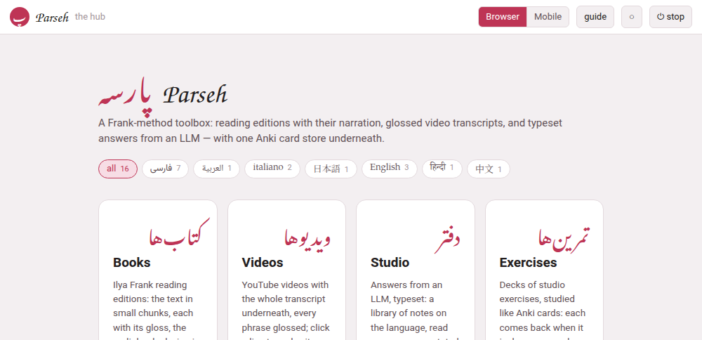
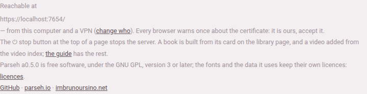

The hub is the page at the root of Parseh's address, `https://localhost:7654/`,
and the one the home link in the top-left corner of Parseh's pages leads
back to — a **پ**, the first letter of the toolbox's Persian name, on most
of them. It shows what there is and lets you pick where to go.

{width=100 align=center}

It is made afresh each time you open it, so its counts are always today's:
come back to it, or reload it, after adding something.

## The top bar

From the left:

| In the bar | What it is |
|---|---|
| **پ Parseh** | this page — the name is set in TeX Gyre Chorus, in the bar of every page of Parseh and in the hub's title |
| *the hub* | where you are |
| **Browser** **Mobile** | the two interfaces: which one Parseh is in, and the switch between them ([Browser and Mobile](mobile-mode.md)) |
| **guide** | this guide ([This guide](this-guide.md)) |
| **◐** | the theme, below |
| **⏻ stop** | stops the server, after asking ([Starting and stopping](starting-and-stopping.md#stopping-it)) |

On a phone the bar sheds words to stay on one row — *the hub* and the
*stop* after ⏻ go first, then the name beside پ — and keeps every button. A
screen reader still hears *Parseh* and *stop*; *the hub* is dropped
altogether, since the name under the bar says it.

## The language chips

Under the name, one chip for each language you have something in — its
name in its own script, فارسی, 日本語, italiano, with how many books,
videos, documents and decks it has — and **all** for everything.

Picking a chip does two things:

- The doors' counts follow it: with فارسی picked, the Books door says
  how many Persian books there are, the Videos door how many Persian
  videos, and so on — 0 for a door with nothing in Persian;
- It is remembered, by this browser, for the whole toolbox: the books,
  the videos, the studio's library and the exercise decks each have the
  same row of chips, and they open showing the language you picked last,
  whichever page you picked it on.

A language only has a chip on a page while there is something of it
there. A page with nothing in the language you picked — the video index,
when all your videos are in other languages — shows everything, and the
choice goes back to **all**.

## The doors

Four large doors, one for each part of the toolbox, each with its name in
Persian above it — the toolbox's own language, whatever you are learning:

| Door | Leads to | What its count says |
|---|---|---|
| **Books** | the library of reading editions, `/books/` | how many books |
| **Videos** | the index of videos, `/youtube/` | how many videos, and how many channels they come from |
| **Studio** | the studio's library of documents, `/studio/` | how many documents |
| **Exercises** | the exercise decks, `/exercises/` | how many decks, and how many exercises are due today |

and five wide ones under them, for the work around the four:

| Door | Leads to | What it says |
|---|---|---|
| **⚑ Review later** | the chunks you flagged while reading or watching, `/later/` ([Review later](../books/review-later.md)) | how many chunks are flagged — for the language picked, when a chip is — or *nothing marked yet* |
| **⇆ Anki** | the card store and its sync with Anki, `/anki/sync/` | how many cards and decks the store holds — one store for every language |
| **✂ The clip tray** | the recordings and pictures cut for cards, `/clips/` | how many clips wait there, or *the tray is empty* |
| **🔍 Reading what nobody has glossed** | the dictionaries and the rest, in Settings, `/settings/reading-help/` | how many languages have a dictionary, and which, or *no dictionary yet* |
| **⚙ Settings** | what this Parseh is set to, `/settings/`: which version it is, and its doors — **Reading help**, **Network**, **Updating Parseh** ([Updating Parseh](updating.md)), **LaTeX drawings** **Speech to text** ([Speech to text](../lookup-and-languages/speech-to-text.md)) **LLM Integration** ([LLM Integration](../lookup-and-languages/llm-integration.md)), **LM likelihood** ([LM likelihood](../lookup-and-languages/lm-likelihood.md)), **Your prompts** ([Your own prompts](../studio/your-prompts.md)), **Pictograms (ARASAAC)** ([Pictograms](../studio/pictograms.md)), **Skills for your chatbot** ([Skills for your chatbot](../studio/skills.md)) and **About** ([About Parseh](about.md)), and under them the two links of the foot, below | who may reach it — this computer, a VPN, the Wi-Fi ([From a phone or another computer](other-devices.md)) |

A door that says 0, *nothing marked yet* or *no dictionary yet* is doing its job: it tells you
there is something there you have not started using.

**⚙ Settings is not the ⚙ of a page.** The door opens Parseh's own settings. The
button **⚙ page** in the bar of a book, a video, a document or a deck opens a panel for
that page alone, which ends with a link back to these Settings
([The ⚙ settings of a page](page-settings.md)).

## The foot

{width=80 align=center}

At the bottom of the hub:

- **Reachable at**, and every address the server can be reached at — the
  ones to type on a phone — followed by who may reach it and a link that
  changes that ([From a phone or another computer](other-devices.md));
- a reminder that every browser warns once about the certificate, which is
  Parseh's own;
- that the **⏻ stop** button stops the server, that a book is built from
  its card on the books' library page and a video added from the video
  index — and that **the guide** has the rest;
- which version of Parseh this is, and that it is free software, with a
  link to its **licences** ([Licences and credits](../reference/licences.md));
- three links, **GitHub**, **parseh.io** and **imbrunoursino.net**: the
  first leads to Parseh's own repository on GitHub, the second to Parseh's
  website, the third to the website of Bruno Ursino, who made Parseh. They
  are only links: each opens in a tab of its own when you click it, and
  nothing is fetched from any of the addresses before that, so the foot
  looks the same with no connection.

The mobile hub says the licence and the version on two lines at its very
foot, the version on the second, and has the three links on a third.
[What's new](../reference/whats-new.md) says what each version brought.
**Settings** ends with the same three links, and so does every page of this
guide.

## The theme

The **◐** button, at the top of the hub and of every page that has a bar, changes the
colours of the whole toolbox. Each click goes on to the next of three
palettes:

| Palette | The button shows | What it is |
|---|---|---|
| light | ○ | dark ink on a pale ground |
| dark | ● | pale ink on a dark ground |
| sepia | ◐ | the warm paper the studio has always read on |

Until you first click it, Parseh follows the computer's own setting —
light or dark — and the button's tooltip says *following the system*. From
the first click the choice is yours, and it holds everywhere: every page
with the button — the books and their reader, the videos and their player,
the Anki page, the clip tray, the dictionaries' page —, the studio's and
the exercises' pages — a document, the editor, a deck, studying it and cramming it — and
this guide when Parseh serves it. The colours follow you: they are kept by
the computer Parseh runs on, so every device that reaches it wears the same, and the
**⚙ page** panel's **Colours** group, **Colour scheme**, sets them
the same way — **Follow my device**, **Light**, **Dark** or **Sepia**. The language, by contrast, is remembered by
each browser for itself.

**The studio wears the same colours.** A document's sheet, the editor and the
exercise pages have no theme of their own: they are painted with the colour scheme
everything else has, at once, when ◐ or the panel's **Colour scheme** changes it.

The **Working…** panel appears at the top of the hub, above its name,
whenever the server is busy — [The Working… indicator](working-indicator.md)
says what it shows.
