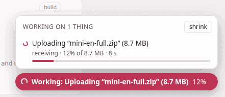
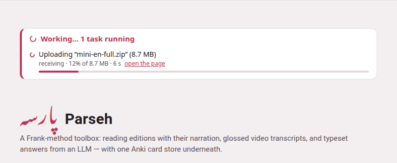

Some of what Parseh does takes a while: building a book's PDF takes
minutes, and a backup of a shelf of narrated books is gigabytes going
through one request. Whatever takes a while is shown **on every page,
until it is over** — on the page you started it from, on the hub, and on
any other page of Parseh open in any tab or on any device.

## What counts as work

| What | Said as, for example |
|---|---|
| building a book: its PDF and reader, or the reader alone | *Building the PDF of “Momotarō”*, *Rebuilding the reader of “Momotarō”* |
| a book, a video, a note or a document going out as a zip, and a PDF being sent | *Packing “Momotarō” to download (all of it)* |
| a whole shelf backed up, or put back from a backup | *Packing the backup of every book*, *Restoring the decks from “decks-backup.zip” (3.2 MB)* |
| a bundle coming back in, a deck imported or exported | *Uploading “mini-en-full.zip” (8.7 MB)*, *Exporting the deck “First words”* |
| a book's narration: a recording uploaded, aligned, spread over its stretch, moved, taken off or put back, a transcript or hand-set times saved | *Aligning the narration of “Momotarō”* |
| the timings of a book or a video estimated by the sound | *Estimating the timings of “Momotarō” by the sound*, *Estimating a video's timings by the sound* |
| a studio document's PDF | *Building the PDF of “Greetings”* |
| a video added, from YouTube or from a file on the computer, and its prompt prepared | *Adding a video from a file on this machine* |
| text added to a book, a new empty book | *Adding text to “Momotarō”* |
| an Anki deck built; an Anki export uploaded, synced or brought in | *Syncing an Anki export with the card store* |
| a dictionary, sentences, a translation model or a character pack being fetched | *Getting the Persian dictionary* |
| a picture or a recording bigger than 4 MB going into a document or a deck | *Uploading “street.jpg” (6.1 MB) into the studio library* |
| this guide being compiled, from its front page | *Compiling the guide* |

A file's name and size and a book's title are in the words, so a long list
still says which is which.

Every page of the toolbox shows it — the hub, the libraries, the reader
and the player, the studio and the exercise decks, the Anki, clip tray and
dictionary pages, and these guide pages when Parseh serves them. Opened
from the disk, or read on the web, the guide has no server to ask, and
shows no list; served, it first asks whether the server is Parseh, and
only then loads the list — with the way back to the hub. A compile of the
guide started from its front page ([This guide](this-guide.md)) is on the
list like any other work, and the hub shows it too.

## The pill

In the bottom-right corner of the page, a coloured pill with a spinner
says **Working:** and what — with how far it has got, *12%*, when the bytes
are being counted, and **+2 more** when there is more than one thing going
on.

{width=76 align=center}

**Click it** for the whole list, *Working on 1 thing*: one row a task, with
what it is doing now (*receiving*, *sending*, the last line of a build), how
far the bytes have got and of how many, how long it has been running, and a
bar that fills as it goes. A task started on another page has an
**open the page** link, back to where it began. Escape, or a click anywhere
else, closes the list.

**shrink**, at the top of the list, folds the pill down to its spinner —
on a phone, where the pill sits on whatever is at the bottom of the screen
— until the work now running is over. Click the spinner and **full size**
undoes it.

The pill never covers a control: it stays under every menu, panel and
dialog, and above the pages' own fixed bars.

## On the page that started it

The page you pressed the button on shows the pill **at once**, before the
server has even been asked — so there is never a moment when nothing seems
to be happening. That holds even when the page is dimmed behind something:
work started from inside a note opened over a book, from a book's narration
panel, or from one of the studio's dialogs shows its pill over the dimmed
page.

## On the hub

The hub, the page you come back to between two things, shows the list in
the page too, in a panel at the top above its name — **Working… 1 task
running**, and a row for each — in the browser and the mobile interface
alike. While that panel is on the screen the pill steps aside, since it
would only say the same thing; scroll the panel away and the pill comes
back.

{width=100 align=center}

The hub open in another tab hears of new work within a moment of its being
started, and every page asks the server again every second and a half while
something runs — every five seconds when nothing does, and not at all
while its tab is hidden.

## Downloads

A download still goes to your browser's own downloads, with its own
progress. What the pill adds is the time before that — while the server
packs the zip, which for a shelf of books can be long: it says *Preparing
the download…* (or *Packing the backup…*, *Exporting the deck…*, *Packing
the narration…*, *Building the Anki deck…*) the moment you click, follows
the server's own entry while it packs and sends, and goes once the file has
been sent.

## When it is over

The pill turns into a tick and says **Done:** and what, for a few seconds,
and the hub's panel says the same; then both go. An error is not said here:
the page that started the work says it, in its own words, as it always has.

The **⏻ stop** button reads the same list: stopping the server while
something is on it cuts that work off, so the button names it and asks you
first ([Starting and stopping](starting-and-stopping.md#stopping-it)).
