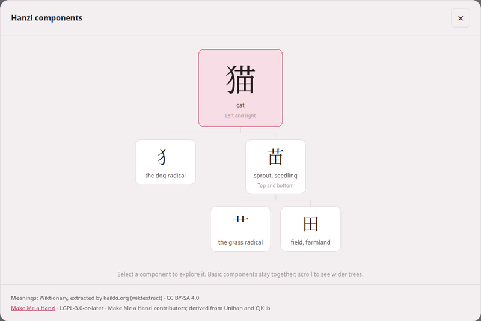

A kanji or a hanzi is rarely one indivisible shape: 猫 *cat* is 犭 *the dog
radical* beside 苗 *sprout*, and 苗 is 艹 *grass* over 田 *field*. Seeing the
parts is how the characters stop being a wall of strokes. Every Japanese and
Chinese book reader and video player can take any character of its text
apart into a tree of its components, from data you install once and then
read offline.



## The three packs

The data comes in **component packs**, from three independent projects. You
install them in the **Kanji & Hanzi components** section of the
[reading-help page](reading-help.md) — the second section, straight after the
dictionaries — with the same **get it**, **rebuild** and **remove** buttons
as everywhere on that page.

| Pack | For | Download | Licence | What is taken from it |
|---|---|---|---|---|
| **KanjiVG** | Japanese: the preferred pack | about 24 MB | CC BY-SA 3.0 | the named component groups of each character's drawing |
| **Make Me a Hanzi** | Chinese: the preferred pack | about 3 MB | LGPL-3.0-or-later | each character's decomposition, and nothing else |
| **CJKVI-IDS** | both, **optional**: a fallback where the preferred pack has no entry | about 3 MB | GPL-2.0 | the component description of each character, choosing the Japanese or the Chinese shape |

Each row's name links to its project. A row not yet installed says what it
is for (*Japanese component trees*, *Chinese component trees*, *Optional
fallback for both languages*) and its licence; an installed one says how
many entries it holds, its size and its licence, and offers **rebuild** and
**remove** (which asks: *Remove this component pack? You can install it
again at any time.*).

The download is pinned: a fixed revision of each project, whose checksum is
checked before anything is built — a download that does not match is
refused. Only the structure is kept: **no drawings, stroke paths, meanings,
readings or pronunciations** are imported from any of the three. The pack is
built in a temporary file and swapped in whole, so a failed rebuild keeps
the pack you had. Removing a pack leaves your books, videos and dictionaries
exactly as they were.

**The meanings under each component come from your dictionary**, the one
you installed for that language in the section above. The packs work
without a dictionary; the tree simply says *Meaning unavailable* under each
part and points you to the dictionary.

## Taking a character apart

1. In a **Japanese** book reader or video player, press **Decompose Kanji**;
   in a **Chinese** one, **Decompose Hanzi**. In a book it is the last
   button of the header's second row; in the player, the last button of
   the header. No other language shows it, and it is there whether or not
   a pack is installed.
2. The button turns on, and a bar at the foot of the window says *Choose a
   kanji in the text.* (or *hanzi*) with a **Done** button. Every kanji or
   hanzi of the text is outlined with a dotted line; kana, punctuation and
   Latin letters are not.
3. Click (or tap) a character. The dialog opens, titled **Kanji
   components** or **Hanzi components**, with the character's tree.

If no pack for that language is installed, pressing the button opens the
dialog with *Install character components — Add a component pack once, then
explore characters offline.* and a link, **Open dictionary & component
setup**, to the page's components section.

### Reading the tree

The character stands at the top, large, with its meaning under it and how
its parts are laid out (*Left and right*, *Top and bottom*, *Full
enclosure*, *Enclosed from above*, *Three stacked*, *Overlapping parts* and
the rest). Below it hang its components, each with its own meaning — and
their components below them, as far as the data goes.

- **Click a component** to make it the top of a new tree. **← Back** returns
  to the one before; **Return to 猫** (the character you started from)
  goes straight back to the first.
- **Familiar components stay whole.** Pieces a learner knows as units —
  木, 目, 心, 口, 田, 人 and their like — are not taken further, to keep
  trees readable; click one to see its own finer structure.
- A component shown as *Select to explore further* was cut short because
  the tree was getting too deep or too wide; click it to continue.
- *Partial form* marks a component that appears in a shortened shape;
  *Form of 水*, where a variant has no meaning of its own, names the full
  character it stands for;
  *Unlabelled component* is a part the source has no character for.
- A wide tree scrolls sideways, and opens centred on its top.
- *This character is a basic component in this source.* — it has no parts
  to show. *No component decomposition is available for this character.* —
  none of your packs has it; the link under it,
  **Manage component packs and fallback coverage**, leads to where
  **CJKVI-IDS** can be added as a fallback.
- *Loading components…* shows under the character while its tree is
  fetched. When it cannot be, the dialog says *Could not load 苗* (the
  character you asked for) with the reason under it and a **Try again**
  button — and, if you had come down from another character, **Return to
  猫** as well. When the mode itself could not start (the server did not
  answer, say), pressing **Decompose** gives *Could not load component
  data* and its own **Try again**.
- *The local component data could not be read. Reinstall it from setup.*
  is that reason when the pack file on this machine is damaged: press
  **rebuild** on its row of the [reading-help page](reading-help.md) (or
  **get it**, if the row no longer knows the pack).

The foot of the dialog credits what was used: *Meanings:* and the
dictionary's source and licence (or *Install the Chinese dictionary to show
component meanings.* with **Open setup**), then every pack that supplied a
part of this tree, fallback included, with its licence and attribution.
Where a character carries a variation selector and the pack has only its
base form, the dialog says *Showing the default character structure for
this glyph variant.*

### Keyboard, playback and leaving

- **Keyboard**: in selection mode, **Tab** moves from character to
  character and **Enter** or **Space** opens one.
- **Escape** closes the dialog; pressed again, it leaves selection mode.
  Clicking outside the dialog, or its **×**, also closes it.
- **Closing the dialog keeps the mode on**, so you can open the next
  character straight away. **Done**, or the **Decompose** button again,
  leaves it, and the outlines go.
- While you are choosing, clicks in the text do nothing else — no gloss
  cloud, no copy, no card, no jump in the recording — so a click meant for a
  character never sets anything else going. Opening a tree **pauses** the
  narration or the video; start it again with the reader's own controls.
- The furigana and pinyin over the text are left alone, and the text is
  exactly as it was when the mode ends.


A book reader is a page built from the book, and one built by an older
Parseh has no **Decompose** button. Press **rebuild the reader** in the
book's header to give it one. Video pages pick up the new button when they
are reloaded; if Parseh was running while it was updated, restart it first.



```bash
python3 lib/getdecomposition.py kanjivg
python3 lib/getdecomposition.py makemeahanzi
python3 lib/getdecomposition.py cjkvi
# offline, from a copy you downloaded yourself: KanjiVG's repository ZIP,
# Make Me a Hanzi's dictionary.txt, or CJKVI's ids.txt
python3 lib/getdecomposition.py makemeahanzi --input path/to/dictionary.txt
```

A pack built from a local file is labelled *local import* and keeps its
checksum; keep the project's notice files beside the text file (`COPYING`
and `LGPL` for Make Me a Hanzi, `README.md` for CJKVI) and they are stored
in the pack with it.

