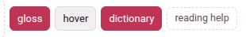
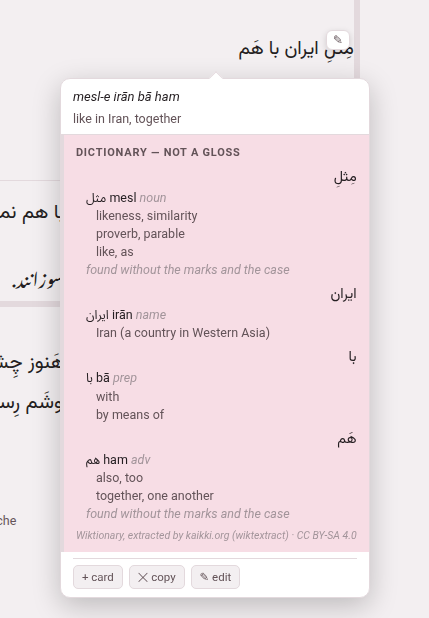

A dictionary is the first thing to install for a language you are reading
before its glosses exist. It looks up the words of a chunk nobody has
glossed and shows, under that chunk, what each one can mean — in a panel
that says plainly it is **not a gloss**.

## Getting one

1. Open the [reading-help page](reading-help.md) (`/lookup/`). Its first
   section, **A dictionary**, has a row for each of the eleven languages.
2. Press **get it** beside the language you are reading.
3. Watch the row. Parseh downloads Wiktionary's own extract for that
   language, from kaikki.org, and builds a database out of it, saying as it
   goes how far it has got. The download is 30 MB for a small language and
   half a gigabyte for a large one; a minute or two on a fast line, longer
   for the large ones.

When it is done the row says how many entries it holds, its size, where it
came from and when it was built — Persian's is about 21 MB built, German's
over 300 — and from then on a reader or player of that language, opened or
reloaded, has a **dictionary** switch in its header.

**rebuild** fetches it again: that is how you pick up a year of Wiktionary's
edits, and how a dictionary built by an older Parseh gains what a newer one
reads from it (the labels that put the likely sense first, the forms a verb
entry is made from). The old file keeps working until the new one is whole.
**remove** deletes the file, after asking.

## The switch



**dictionary** sits in the header of every book reader and every video
player — after **gloss** and **hover** in a book, after **follow** and
**hover ⏸** in the player. Three rules govern it:

- **It is there only when something is behind it.** A reader asks the
  server once, when it opens, whether this language has a dictionary or a
  corpus for its gloss language, and checks whether a translation model is
  installed for the pair. With none of the three, there is no switch and no
  further request. With any one of them, the switch appears, and its
  tooltip names what it will do: *look the words up, show a sentence
  somebody translated, translate the line — where nothing is glossed*,
  shortened to whatever is actually installed.
- **It is off until you turn it on.** Off, the page draws nothing new,
  looks nothing up and hands no sentence to a translation model (the one
  thing it may still fetch is the [synonym table](synonyms.md), about a
  megabyte, when a model is installed for the pair). On, it is coloured like the other
  switches that are on.
- **It is remembered.** A book reader remembers it for that book; the video
  player remembers one setting for every video.

## The panel

**The panel is drawn only for a chunk nobody has written a vocabulary line
for**, so a finished edition looks exactly as it did. With the switch on:

- **click such a chunk** in the chunks-and-glosses pass, whatever mode the
  reader is in, and its cloud opens on it (without the switch, the same
  click plays the subparagraph, as it always did; a chunk that has a
  vocabulary line still does);
- or, in **hover** mode, point at the chunk in pass 1, and its cloud opens
  as always.

Under what is written, the cloud then holds a tinted panel:



It is headed **dictionary — not a gloss**, and for each word of the chunk,
in order, it gives:

- the word as the text writes it (with its reading beside it, in a
  Japanese or Chinese chunk that has a word line);
- each entry it found: the headword as the book spells it (a simplified
  Chinese book shows 帮忙, not the 幫忙 Wiktionary files it under — point at
  it to be told), its romanisation, its part of speech in grey, a note
  where the entry carries one;
- for a verb, **its principal parts** on a line of their own, under the
  language's own labels — Italian *vado*, found under *andare*, gets
  *pres. vado · p.p. andato · aux. essere*. Where the forms belong to
  another verb than the headword, the line starts with an arrow to it:
  German *stand* in a sentence that ends *… von seinem Stuhl auf.* leads
  to *→ aufstehen*, because the sentence the chunk sits in is sent along
  with it;
- up to **three senses**, the likeliest first (below);
- in grey, **how the word was reached** when it was not found as written —
  *found without the marks and the case* for a vowelled Persian word, or
  the ending that had to come off first;
- or, when nothing was found, *not found (tried …)*, naming every form it
  looked for, so that “not in the dictionary” is never confused with
  “never asked”.

A line at the foot names the source and its licence: *Wiktionary,
extracted by kaikki.org (wiktextract) · CC BY-SA 4.0*.

The panel opens at once saying *looking it up…* and fills a moment later;
the cloud is placed again when it does, so it never hangs over the chunk it
is about. Other things it can say: *the dictionary has nothing for these
words*, and *the dictionary could not be reached* when the server did not
answer. Under the dictionary's block come the other two kinds of help, when
they are installed, each ruled off from the one before: [a machine's
reading](translation-model.md) and [a sentence somebody
translated](translated-sentences.md).

In the video player the same panel appears in a phrase's cloud, under
whatever the phrase has written, and says *phrase* where the book says
*chunk*.

### The likely sense first

A word may carry a dozen senses and only three fit. Wiktionary cannot say
which one your sentence wants, but it does label some senses, and the
dictionary keeps those labels: the panel puts **plain senses first**, then
the **marked** ones (figurative, dialectal, regional, slang, vulgar,
humorous and the like), then the **stale** ones (obsolete, archaic,
historical, dated, rare, nonstandard, misspellings). The order is otherwise
Wiktionary's. *Literary* and *poetic* are deliberately not pushed down —
this toolbox is pointed at literature — and neither is *colloquial*.

Where a [corpus](translated-sentences.md) is installed, it breaks one more
kind of tie: when one written word reaches two different headwords, the one
more of the corpus's sentences actually use is listed first.

A dictionary built before these labels existed still works; it simply gives
its senses in Wiktionary's order until you press **rebuild**.

### How a form is found

A dictionary is filed by headword and a chunk is running text, so most of
the work is getting from one to the other:

- **Inflected forms.** Wiktionary lists the forms of a word, and the
  dictionary keeps them as pointers to their headword — most of the
  morphology of every language here.
- **What is written onto a word.** Some languages need rules of their own,
  and have them: Persian's and Japanese's affixes, Arabic's conjunctions,
  one-letter prepositions and object pronouns written onto the word,
  French and Italian elisions (*n'avait*, *l'uomo*), Italian's pronouns
  hung on an infinitive. Up to two pieces come off at once, the shallowest
  first, so a word the dictionary has is always found as itself.
- **A Persian prefix typed apart.** *mi-* and *nemi-* are written with a
  joiner, but often typed with a space; standing alone, they are looked up
  joined to the verb after them, and the panel shows the two as one entry.
- **Chinese spellings.** A simplified spelling is the word itself, not a
  form of it, and senses belonging to Cantonese or Hokkien are listed after
  Mandarin's.
- **Japanese and Chinese words.** A text written without spaces has to be
  cut before anything can be looked up. Where the chunk has a **word
  line** — the division into words a person checked — each word is looked
  up as written and its row goes under that word. Where it has none, the
  chunk is cut by longest match against the dictionary's own word list,
  with the inflection rules consulted as it goes (住んで reaches 住む). That
  cut is greedy and now and then visibly wrong; a wrong entry is easy to
  spot, which is why nothing cleverer is tried silently.

### English, explained in English

Every dictionary here is the English Wiktionary's, and it explains the
words of every language in English. For Persian or Italian that is a
translation. For English itself it is a **definition**, written in the
language you are learning. So a reader or player of **English** has one more
switch, **definitions**, beside **dictionary** (greyed while **dictionary**
is off), and it is **off** until you turn it on:

- **Off.** An entry still gives the headword, how it is said, its part of
  speech, how the word was reached and a verb's parts, and the panel says
  once where the definitions are: *the dictionary explains these words in
  English: “definitions”, in the header, shows what it says*.
- **On.** Each entry gives Wiktionary's definitions with the labels
  Wiktionary puts on them — *(intransitive)*, *(countable)*, *(slang)* — the
  first three at once, and the rest behind a **2 more definitions** button
  (it counts them).
- **A third switch** appears where a translation model reads English into
  the language the glosses are written in: it is named after that language
  — **in italian**, **in persian** — and puts each definition into it,
  underneath, as a machine's reading. It is greyed until **definitions**
  is on.

All three are remembered like the dictionary's own.

### It gets ahead of you

While you are not asking anything, the reader looks up the unglossed chunks
of the next **ten** sentences — subparagraphs in a book, captions in a
video — so the panel opens already filled when you get there. One lookup at
a time, only after a moment's quiet (a scroll, a key or a click puts it
off), and never while a cloud is open: the lookup you are waiting for is
never queued behind ten you are not. It needs no setting; it happens
whenever the **dictionary** switch is on.

## Taking it into a gloss

The reading panel has no buttons that write: nothing in it becomes a gloss.
Where you **write** a chunk's gloss — the chunk sheet in a book reader
(**✎ edit**), the edit cloud in the player — the header has **⊕ sources**.
It opens a column beside the fields with the same dictionary rows, the
machine's reading and the translated sentences, and here every line has
buttons that put it into a field: **meaning →**, **romanisation →**,
**\dw → vocabulary** for a word, a whole **\vb → vocabulary** for a verb the
language's recipe recognises (in the player, **→ vocabulary**). They only
fill the box; nothing reaches the book or the video until you save the
chunk, down the ordinary edit route with its ordinary checks.

The same column ends with an *external chatbot* block built from what the
dictionary and the corpus found: **Ask LLM** copies a prompt holding the
sentence, the sentences around it, the dictionary's rows and every
translated sentence the corpus has for the chunk — never the local model's
reading — for you to paste into any chatbot you like; paste its answer into
the box under it and **Use translation** marks the chunk's share of it the
way the machine's reading is marked. The Books and Videos sections of this
guide say the rest about editing.


```bash
python3 lib/getdict.py               # which dictionaries are installed, and which are not
python3 lib/getdict.py hi            # fetch Hindi's and build dict/hi.db
python3 lib/getdict.py --all         # every language the toolbox teaches
python3 lib/lookup.py zh "我喜欢喝茶"  # what a reader would be shown for a phrase
```

