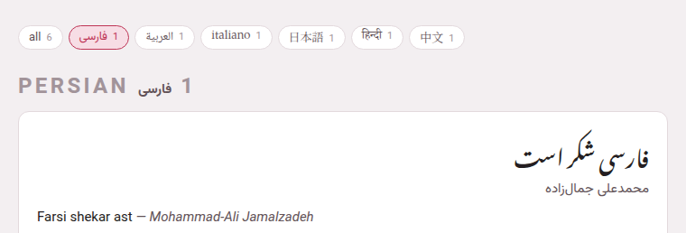

Most people study one language at a time, even when Parseh holds several.
So every page that lists things has a row of **language chips** at its top,
and picking one chip picks that language everywhere.

## Where they are

- **The hub** — in both layouts. In the **Mobile** layout the chips sit in
  one line that scrolls sideways and always brings the picked chip into
  view; opened with a mouse, the line wraps instead, so nothing needs a
  swipe to reach.
- **The book library** — `/books/`, and the mobile interface's shelf,
  whose chips sit in one line as the mobile hub's do.
- **The videos** — `/youtube/`.
- **The studio's library** — `/studio/`.
- **The exercise decks** — `/exercises/`.

## What a row shows

**all** comes first, with the number of everything on the page. Then one
chip for each language that has anything there, in the registry's order,
showing the language's **own name** in its own script — فارسی, 日本語,
हिन्दी — with its count; point at a chip for its English name. A language
with nothing on that page has no chip on it: the rows are about what you
have, not about what Parseh could teach.

## What picking one does

- **On a library** (books, videos, studio, decks), it hides everything of
  the other languages, and a language's heading goes with its cards. The
  counts in the studio's row follow its search.
- **On the hub** it hides nothing — the hub is one screen of doors — but
  the doors' counts change to that language's: *3 books*, *1 video*, its
  channels, documents and decks, and how many of its exercises are due.
  The hub's own chips count everything a language has behind its four
  doors — books, videos, documents and decks — together.
- **Everywhere else** it is the language a new thing starts in: the
  **Language** select of **Add a book** and **Add a video**, the target of
  the studio's LLM prompt page, the language of a **New exercise deck**, a
  new studio document's `target:`, and the target offered when a Markdown
  file without a header is brought into the studio.

**all** shows everything again.

## One choice, remembered

There is one choice for the whole toolbox, not one per page: pick
*日本語* on the hub, and the book library, the videos, the studio and the
decks all open on Japanese. The choice is kept by your browser, so a phone
and a computer each keep their own, and it survives restarting Parseh.

A choice no chip on the page offers any more — a language whose last book
you removed, say — would hide everything and mark nothing, so it is read as
**all**, and put back to **all**.
