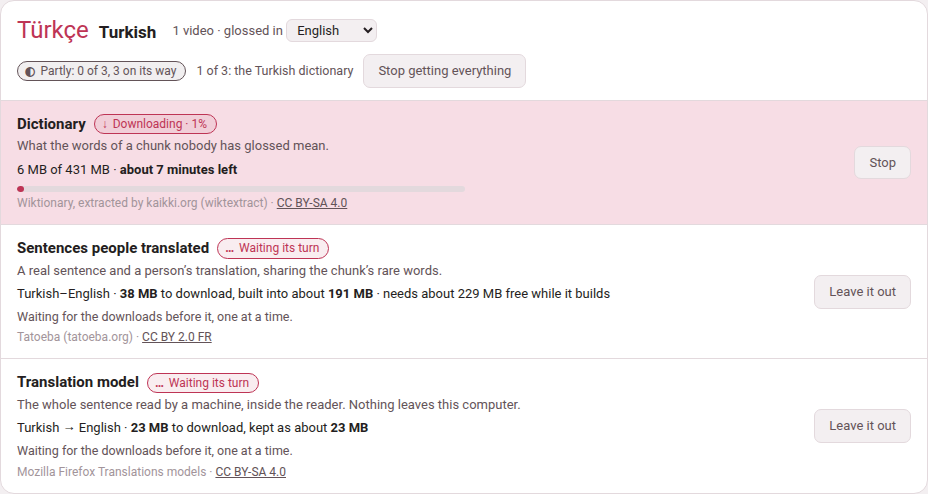

Between pasting a text in and finishing its glosses lie weeks, and during
those weeks most chunks of a book or a video have nothing under them. The
page **Reading help**, in **Settings**, sets up everything Parseh can offer
in the meantime. It is the same page for books and for videos, and it is
laid out by language: a card for each language on your shelf, saying what
it has and what it could have.


## Getting there

| From | What you press |
|---|---|
| The hub (the Browser layout) | the door **🔍 Reading what nobody has glossed**. Its tags say what you have: **no dictionary yet**, or **1 dictionary**, **3 dictionaries**… followed by the code of every language that has one. |
| Settings | the door **Reading help**, beside **Network**. |
| Any book reader or video player | **reading help**, in the header, just after the **dictionary** switch (which is only there once something is installed for that language). |
| A chunk nobody has glossed | when nothing at all is installed for its language, the cloud of a chunk without a vocabulary line (in a book's **hover** mode) says *nothing glossed here yet*, and under it: “A dictionary can look these words up, a corpus can show a sentence somebody translated, and a model can read the line. **Set any of them up** — it takes a couple of minutes.” The link opens this page. The player says the same under *nothing glossed yet*, in the cloud of any phrase of the video's language that nobody has glossed. |
| **Decompose Kanji** or **Decompose Hanzi** | the dialog's **Open dictionary & component setup**, **Manage component packs and fallback coverage** and **Open setup** links, which open the page at the character components of Japanese (or of Chinese, when that is the one on your shelf) |
| The address bar | `/settings/reading-help/` on the server |

On a Parseh started on this machine with its defaults, the whole address is
`https://localhost:7654/settings/reading-help/`.

**The old address still works.** The page used to live at `/lookup/`,
and every reader built before then carries that address in its **reading
help** link, as does every copy a phone keeps. `/lookup/` now opens this
page — and `/lookup/#character-components` opens it at the character
components — so nothing has to be rebuilt for those links to keep working.

**On a phone** the page opens with the phone's own bar, as its sibling
Network does. The Mobile layout's hub has no door to it — the hub on a phone
is for reading and studying — but the reading help link of a reader, and the
**Set any of them up** of a cloud, open it wherever you are.

## Who may use it

**Any device that has been let in** may get, stop and remove anything on
this page: a phone on the Wi-Fi as much as the computer. None of it changes
who may reach Parseh, what Parseh exposes or what it runs — it puts other
people's data on this computer's disk, or takes it off again — so none of it
is kept for the computer alone. The band at the top of the page says which
device you are on and what you may do. The **Network** settings are the
other kind: each of them decides who may reach Parseh, and a phone sees them
but may not change them ([From a phone or another computer](../getting-started/other-devices.md)).

## A card per language

**Your languages** come first: every language you have a book or a video
in, the one with the most first. Each card's header has:

- **the language**, in its own script and in English, and how many books
  and videos you have in it;
- **glossed in**, a picker: the sentences somebody translated and the
  translation model are *pairs* of languages, and the card shows the pair
  your books and videos are glossed in (English for most). Pick another to
  see — and get — that pair instead;
- **how much of it is here**: *Everything Persian can have*, *Partly: 2 of
  4*, or *Nothing yet*, and the space it keeps;
- **Get everything for Turkish** (or **Get the rest**), with what that
  costs said beside it — *at least 491 MB to download · about 520 MB kept*.

**Other languages** follow, one line each — what they have, and the sizes
that are known — with **Open** to see the whole card.

**Shared by every language** is the last card: the translation engine every
model runs in (it comes with the first model), the English synonyms, and
CJKVI-IDS, the component pack both Japanese and Chinese fall back on.

Each language can have up to four things, and each is installed on its own:

| Row | What it gives you | What it costs, and where it is kept |
|---|---|---|
| **Dictionary**, one per language | every word of the chunk looked up: headword, how it is said, part of speech, senses, and how the word on the page was reached from it | a download of 30 MB for a small language to over a gigabyte for a large one; `dict/<code>.db` |
| **Character components**, Japanese (KanjiVG) and Chinese (Make Me a Hanzi) | a character taken apart, as a tree | KanjiVG about 24 MB, the others about 3 MB each; `components/<pack>.db` |
| **Sentences people translated**, one per pair of languages | a real sentence and a person's translation of it, chosen because it shares the chunk's rare words | from a few megabytes (Persian–English) to 180 MB (Italian–English); `corpus/<code>-<gloss>.db` |
| **Translation model**, one per pair, always to or from English | the whole sentence read by a machine, inside the reader, with the chunk's share of it marked | 20 to 55 MB a pair, plus a 5 MB engine once; `mt/<code>-<gloss>/` and `mt/engine/` |
| **English synonyms**, one file for every language | a table that helps the model's mark find its words | about a megabyte, from a 16 MB download; `mt/synonyms.en.json` |

The dictionary is the one to get first: it is what the panel is built
around, the components use it for their meanings, the sentences of a
language written without spaces (Japanese, Chinese) cannot be cut into words
without it, and the model's mark is worked out from what it says. **Get
everything** fetches it first for that reason. But each stands on its own —
a corpus without a dictionary, or a model alone, is enough for the reader
to offer its **dictionary** switch.

Each has a page of its own in this guide:
[Dictionaries](dictionaries.md),
[Kanji and Hanzi components](character-components.md),
[Sentences somebody translated](translated-sentences.md),
[A translation model in the page](translation-model.md) and
[Synonyms for the machine's reading](synonyms.md).

## A row, and what it says

Every row says what it is for in one line, what it holds or would cost, and
whose work it is — the source and its licence, linked — on its last line.
Its state is a pill with a sign and a word, never a colour alone:

| Pill | What it means |
|---|---|
| **✓ Installed** | here, and read by every reader and player of the language. The row says what it holds — *16,942 entries · 21 MB · built 2 September 2026*. |
| **↻ Built by an older Parseh** | a dictionary built before its index was added: it reads correctly, only more slowly. Its **Rebuild** button is the one to press. |
| **↓ Downloading · 62%** (then **↻ Building**) | on its way: a bar, how much has come of how much, and the time left — *34 of 55 MB · about 40 seconds left*. |
| **… Waiting its turn** | part of a **Get everything**, waiting for the downloads before it. |
| **○ Not yet** | not here. Beside it, a small example of what it would add, drawn the way the reader draws it, in the card's own language. |
| **! Stopped** | a download that did not finish, with why, in words — the line dropped, the source had nothing, you pressed **Stop**. |
| **– Not available** or **– No model** | this cannot exist, and why: Mozilla trains its models to and from English, so Persian glossed in Italian has none; a language glossed in itself has no sentences to translate. |

### Sizes before anything is fetched

A row not yet installed says what it would cost before you press anything:
*431 MB to download, built into about 306 MB · needs about 737 MB free while
it builds*. These are sizes measured when Parseh was made, and each says
*about*, because the sources grow.

Where nobody has measured one, the row says so — *size not measured:
Parseh says how big before it starts* — and **Get it** asks the source first,
then says, in the row, how big the download is and how much room there is,
and asks you: **Get it** or **Not now**.

**Parseh never starts what the disk has no room for.** When the space free is
less than the download needs while it is fetched and built, the row says so
instead of starting — *There is not enough room on this computer: the
Turkish dictionary needs about 737 MB free while it is fetched and built, and
412 MB are free.*

### The buttons

| Button | What it does |
|---|---|
| **Get it** | Downloads it and builds it, on this machine, in the background. Pressing it twice does not fetch it twice. |
| **Stop** | Stops a download on its way. What had come is kept: **Carry on** fetches only the rest, where the source allows it. |
| **Carry on** / **Try again** | On a stopped row: gets it again, from where it stopped when it can. |
| **Rebuild** | Fetches it again and builds it afresh — Wiktionary's edits of the past year, the sentences Tatoeba has gained since, the index a newer Parseh writes. The new file is built **beside** the old one and moved over it only when it is whole, so a rebuild that stops half-way leaves the old one working. A translation model has none: it is a fixed version and would come back identical. |
| **Remove…** | Asks first, in the row — *Remove the Turkish dictionary? It frees 306 MB; getting it back is a 431 MB download.* — then deletes the file (a model: its folder). It is refused while that same thing is being fetched. Nothing else changes: books, videos, glosses and cards never depended on it. |
| **Get everything for Turkish** / **Get the rest** | Says first what it will fetch and what that costs in all, then fetches each thing the language can have and does not, one after another. |
| **Stop getting everything** | Stops the one on its way and leaves the rest out. |
| **Leave it out** | On a row waiting its turn: takes it out of **Get everything**. |



### While it runs

A dictionary is minutes of work and the page does not have to stay open.
The downloads run on the server — **Get everything** too, one at a time, so
a phone may lock its screen — and you can go and read, and come back to find
the row where it has got to. Every page of Parseh says so in the meantime:
the **Working…** pill in its bottom corner reads, for example, *Working:
Getting the Persian dictionary*, and the hub's panel lists it with the
others —

| Row | On the Working list |
|---|---|
| a dictionary | *Getting the Persian dictionary* |
| a component pack | *Getting the KanjiVG component pack* |
| sentences people translated | *Getting the Persian–English parallel sentences* |
| a model | *Getting the Persian–English translation model* |
| the synonym table | *Getting the synonym table* |
| **Get everything** | *Getting everything for Turkish*, and which of its steps it is on |

— each with how far it has got and, seen from any other page, a link back
to this one. When it ends, a page that saw it running says *Done:* and the
same words. A failure, or a download you stopped, is not said there: it is
said in the row, in words.

## What travels, and what does not

- **Only the download goes out.** It comes from these places, and from
  nowhere else: kaikki.org for Wiktionary, Tatoeba's export site
  (`downloads.tatoeba.org`), GitHub for the three component sources,
  Mozilla's model service (the one Firefox gets its own models from), the
  jsDelivr CDN for the engine's pinned npm release, and Princeton
  (`wordnetcode.princeton.edu`) for WordNet. **Nothing about what you read
  is ever sent anywhere**: a lookup reads a file on this machine, and the
  translation model runs inside the page. Opening this page sends nothing
  either: the sizes it shows are Parseh's own; the source is asked only when
  you press **Get it** on a row whose size nobody measured.
- **What runs is pinned.** The engine is code that runs inside the reader,
  so its files are checked against the digests this version of Parseh
  carries, and refused if they differ; so are the component packs.
- **None of it is in Parseh.** The files are other people's work under
  other people's licences, and tens or hundreds of megabytes each, so the
  toolbox ships none of them: `dict/`, `corpus/`, `mt/` and `components/`
  are left out of git, and a fresh installation has an empty page.
- **Each file carries its own licence.** Every row on the page names it,
  and every place that shows what a file says credits it underneath: the
  dictionary's entries, each translated sentence, the machine's reading, the
  components dialog.

## Whose work it is

| What | Source | Licence |
|---|---|---|
| Dictionaries | [Wiktionary](https://www.wiktionary.org/), extracted by [kaikki.org](https://kaikki.org/) (wiktextract) | CC BY-SA 4.0 |
| KanjiVG | [KanjiVG](https://kanjivg.tagaini.net/), Ulrich Apel and contributors | CC BY-SA 3.0 |
| Make Me a Hanzi | [Make Me a Hanzi](https://github.com/skishore/makemeahanzi) contributors; derived from Unihan and CJKlib | LGPL-3.0-or-later |
| CJKVI-IDS | [CJKVI Database](https://github.com/cjkvi/cjkvi-ids), based on the CHISE IDS Database | GPL-2.0 |
| Translated sentences | [Tatoeba](https://tatoeba.org)'s contributors | CC BY 2.0 FR |
| Translation models | Mozilla Firefox Translations models | CC BY-SA 4.0 |
| Translation engine | [bergamot-translator](https://github.com/browsermt/bergamot-translator) 0.4.9 | MPL 2.0 |
| Synonyms | [WordNet 3.1](https://wordnet.princeton.edu/) (Princeton University) | the WordNet 3.0 licence: free redistribution and modification, its notice kept |

A component pack keeps its own licence, attribution, upstream revision,
source address, checksum and notices inside it; those terms go on applying
to the converted data, so keep them if you pass a pack on.

## How the reading help works

What the dictionary shows is **every sense a word can carry**, which is not
the same as the one your sentence wants: it is a reference to read past a
chunk with, never a gloss. It appears in its own panel, only where nobody
has written a vocabulary line. One switch in the header of every reader and
every player turns the help on — it is there as soon as any one of the
dictionary, the sentences or the model is installed for that language — and
it can be turned off there without coming back here. A reader without any
of it is exactly the reader it has always been.

**Why a dictionary is not enough.** A dictionary lists every sense a word can
carry and cannot say which one your sentence means — شیر is lion, faucet, tiger and milk. So the panel can also
show a **whole sentence** that a person wrote and another person translated,
picked because it shares the rare words of the chunk you are looking at. It
is not a translation of your line and never pretends to be: both sides are
shown, with the words they share named under them. Coverage is very uneven,
and so is the size: Italian–English is 719 000 sentence pairs and 180 MB,
Spanish–English 283 123, Persian–English 8 454 and a few megabytes — two
orders of magnitude between the ends of that list, and a thin pair simply
finds a sentence to show you less often.

**A machine reads the sentence itself.** Where the dictionary reads the
words and the corpus finds a sentence like yours, a **translation model**
reads your sentence. It is not a chat model and there is nothing to
configure: one job, no prompt, no address, no key, and the same answer
every time. It runs as WebAssembly *inside the reader*, so the line being
translated never leaves this machine and Parseh gains no dependency to run
it. The engine is bergamot-translator, the one Firefox's own translations
use, and the models are Mozilla's — tens of megabytes a pair, against
gigabytes for a general model.

**It reads the whole sentence, not the chunk.** A chunk is a fragment by
construction, and a fragment translated alone comes back as one —
مثل ایران با هم on its own gave “The
parable of Iran with Hem”, three words each defensible and a sentence about
nothing, while the sentence holding دوباره
می‌سازمت، وطن came back “I will rebuild you, my country…” — the near
future and the attached *you* that the fragment lost. So the sentence is
shown entire, with the words of it that look like your chunk's marked inside
it and named under it — a guess, since the engine offers no word alignment,
and drawn as one. Nothing is pressed: the reading is already in the panel
when it opens, because the sentences ahead of you were translated while you
read. It is labelled *a machine's reading*, and is never written into a
book. Mozilla trains its pairs **against English** rather than against each
other, so Persian glossed in English has a model and the same book glossed
in Italian has none — a pair that cannot exist is never offered one.

**Which words of a reading are the chunk's.** The engine gives no word
alignment, so the panel's guess at which words of a machine's reading are
this chunk's works from what the dictionary says the chunk's words mean.
Where the model chose a different word for the same idea — *begin* where
the dictionary says *start* — nothing in the reading matched, and the guess
used to say nothing at all. The synonym table is the same idea one step
further: which English words are synonyms of which, from WordNet. A synonym
is real evidence and is used, but weaker than the word itself — an exact
match always wins over one — and it is admitted alone only from a word's
own first, most common sense, never a stray one three senses down.

**A character taken apart.** The component packs hold only the trees of
Japanese and Chinese characters — which parts a character is written with,
and the parts of those parts. Meanings come from your dictionary; without
one, the trees still work. KanjiVG is the one for Japanese and Make Me a
Hanzi the one for Chinese; CJKVI-IDS is the fallback both use where the
preferred pack has no entry. Downloads happen once, and taking a character
apart works offline.


Every **Get it** and **Rebuild** above is also a script, and does exactly
what the button does; running it again for something already installed is
the **Rebuild** (the synonym table wants `--rebuild` for that, since without
it the script only says the table is there). Run them from Parseh's folder
with the Python Parseh runs on:

```bash
python3 lib/getdict.py                     # which dictionaries are installed
python3 lib/getdict.py fa                  # get Persian's (the button "Get it")
python3 lib/getdict.py --all               # every language's
python3 lib/getdecomposition.py kanjivg    # or makemeahanzi, or cjkvi
python3 lib/getcorpus.py fa it             # Persian sentences glossed in Italian
python3 lib/getmt.py fa en                 # the Persian-to-English model
python3 lib/getsyn.py                      # the synonym table (--rebuild, --remove)
```

**Remove…** is a button only, apart from the synonym table's `--remove`.
Otherwise it is the same as deleting the file yourself while nothing is
fetching it: `dict/<code>.db`, `components/<pack>.db`,
`corpus/<code>-<gloss>.db`, or a model's whole folder `mt/<code>-<gloss>/`.

