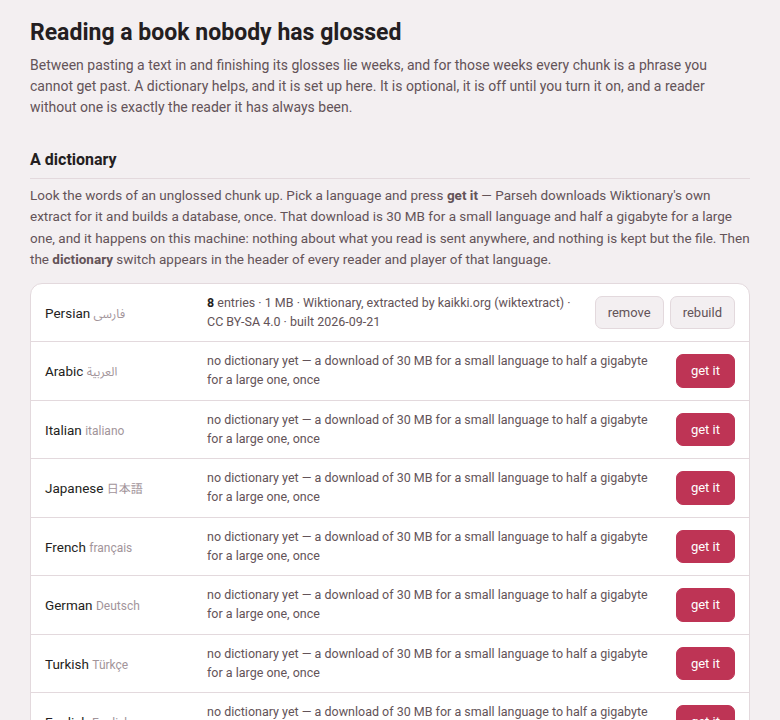

Between pasting a text in and finishing its glosses lie weeks, and during
those weeks most chunks of a book or a video have nothing under them. The
page at **`/lookup/`** sets up everything Parseh can offer in the meantime.
It is titled **Reading a book nobody has glossed**, it is the same page for
books and for videos, and every language has a row on it.



## Getting there

| From | What you press |
|---|---|
| The hub (the Browser layout) | its last door, **🔍 Reading what nobody has glossed**. Its tags say what you have: **no dictionary yet**, or **1 dictionary**, **3 dictionaries**… followed by the code of every language that has one. |
| Any book reader or video player | **reading help**, in the header, just after the **dictionary** switch (which is only there once something is installed for that language). |
| A chunk nobody has glossed | when nothing at all is installed for its language, the cloud of a chunk without a vocabulary line (in a book's **hover** mode) says *nothing glossed here yet*, and under it: “A dictionary can look these words up, a corpus can show a sentence somebody translated, and a model can read the line. **Set any of them up** — it takes a couple of minutes.” The link opens this page. The player says the same under *nothing glossed yet*, in the cloud of any phrase of the video's language that nobody has glossed. |
| **Decompose Kanji** or **Decompose Hanzi** | the dialog's **Open dictionary & component setup**, **Manage component packs and fallback coverage** and **Open setup** links, which open the page at its components section |
| The address bar | `/lookup/` on the server |

The components section has an address of its own,
`/lookup/#character-components`. On a Parseh started on this machine with
its defaults, the whole address of the page is
`https://localhost:7654/lookup/`.

The page belongs to the **Browser** layout. The **Mobile** layout is for
reading and studying and leaves out every page that installs or administers
something, so its hub has no door for it; a link to `/lookup/` from anywhere
still opens it, in its browser version. It works on a narrow screen all the
same: each row stacks its name, its description and its buttons.

## The five sections

One unglossed chunk raises several different questions, and no single
download answers all of them — so the page has five sections, each
installed on its own:

| Section on the page | What it gives you | What it costs, and where it is kept |
|---|---|---|
| **A dictionary**, one per language | every word of the chunk looked up: headword, how it is said, part of speech, senses, and how the word on the page was reached from it | a download of 30 MB for a small language to half a gigabyte for a large one; `dict/<code>.db` |
| **Kanji & Hanzi components**, three packs | a Japanese or Chinese character taken apart, as a tree | KanjiVG about 24 MB, the other two about 3 MB each; `components/<pack>.db` |
| **Sentences somebody has already translated**, one per pair of languages | a real sentence and a person's translation of it, chosen because it shares the chunk's rare words | from 3 MB (Persian–English) to 182 MB (Italian–English); `corpus/<code>-<gloss>.db` |
| **A translation model, in the page**, one per pair, always to or from English | the whole sentence read by a machine, inside the reader, with the chunk's share of it marked | about 20 MB a pair, plus a 5 MB engine once; `mt/<code>-<gloss>/` and `mt/engine/` |
| **Which words of a reading are the chunk's**, one file | a table of English synonyms that helps the model's mark find its words | about a megabyte; `mt/synonyms.en.json` |

The dictionary is the one to get first: it is what the panel is built
around, the components use it for their meanings, the corpus of a language
written without spaces cannot be built without it, and the model's mark is
worked out from what it says. But each of the five stands on its own — a
corpus without a dictionary, or a model alone, is enough for the reader to
offer its **dictionary** switch.

Each section has a page of its own in this guide:
[Dictionaries](dictionaries.md),
[Kanji and Hanzi components](character-components.md),
[Sentences somebody translated](translated-sentences.md),
[A translation model in the page](translation-model.md) and
[Synonyms for the machine's reading](synonyms.md).

## A row, and what it says

Every section is a list of rows, one per language — or one per pack for the
components, and a single row, **synonyms**, for the synonym table. A row
says one of four things:

- **Nothing yet.** A line with what the download will cost (*no dictionary
  yet — a download of 30 MB for a small language to half a gigabyte for a
  large one, once*), and a red **get it** button.
- **Working.** The row is tinted, a bar slides under it, and the line above
  the bar is the latest thing the download said — how many megabytes have
  come, then *building dict/fa.db*, then how many entries it holds. The
  row's buttons are hidden until it is done.
- **Installed.** What it holds and where it came from — for a dictionary,
  say, *16,942 entries · 21 MB · Wiktionary, extracted by kaikki.org
  (wiktextract) · CC BY-SA 4.0 · built 2026-09-10* — and beside it
  **remove** and **rebuild**.
- **Failed.** The server's own sentence, in red, in the row — a download
  that broke off, or a source that has nothing for this language. Press
  **get it** again when you have fixed what it says.

While anything is being fetched the page asks the server every second or
so, and stops asking when nothing is.

### The buttons

| Button | What it does |
|---|---|
| **get it** | Downloads the thing and builds it, on this machine, in the background. Pressing it twice does not fetch it twice. On the corpus and model rows a picker beside it chooses the other language of the pair. |
| **rebuild** | Fetches it again and builds it afresh — Wiktionary's edits of the past year, the sentences Tatoeba has gained since, the columns a newer Parseh reads (the sense labels, the verb forms). The new file is built **beside** the old one and moved over it only when it is whole, so a rebuild that fails half-way leaves the old one working. Dictionaries, component packs, corpora and the synonym table have it; a translation model does not, because a model is a fixed version and would come back identical. |
| **remove** | Asks first — *Remove the Persian dictionary? The file is deleted. You can get it again whenever you like.* — then deletes the file (a model: its folder). It is refused while that same thing is being built, because deleting a file being written would leave a half-built one that reports itself whole. Nothing else changes: books, videos, glosses and cards never depended on it. |

### While it runs

A dictionary is minutes of work and the page does not have to stay open.
The download runs on the server; you can go and read, and come back to
`/lookup/` to find the row where it has got to. Every page of Parseh says
so in the meantime: the **Working…** pill in its bottom corner reads, for
example, *Working: Getting the Persian dictionary*, and the hub's panel
lists it with the others —

| Row | On the Working list |
|---|---|
| a dictionary | *Getting the Persian dictionary* |
| a component pack | *Getting the KanjiVG component pack* |
| a corpus | *Getting the Persian–English parallel sentences* |
| a model | *Getting the Persian–English translation model* |
| the synonym table | *Getting the synonym table* |

— each with the line the row shows and, seen from any other page, a link
back to this one. When it ends, a page that saw it running says *Done:* and
the same words. A failure is not said there:
it is said in the row, in the server's own words.

## What travels, and what does not

- **Only the download goes out.** It comes from these places, and from
  nowhere else: kaikki.org for Wiktionary, Tatoeba's export site
  (`downloads.tatoeba.org`), GitHub for the three component sources,
  Mozilla's model service (the one Firefox gets its own models from), the
  jsDelivr CDN for the engine's pinned npm release, and Princeton
  (`wordnetcode.princeton.edu`) for WordNet. **Nothing about what you read
  is ever sent anywhere**: a lookup reads a file on this machine, and the
  translation model runs inside the page.
- **None of it is in Parseh.** The files are other people's work under
  other people's licences, and tens or hundreds of megabytes each, so the
  toolbox ships none of them: `dict/`, `corpus/`, `mt/` and `components/`
  are left out of git, and a fresh installation has an empty page.
- **Each file carries its own licence.** Every place that shows what a
  file says credits it underneath: the dictionary's entries, each translated
  sentence, the machine's reading, the components dialog.

## Whose work it is

| What | Source | Licence |
|---|---|---|
| Dictionaries | [Wiktionary](https://www.wiktionary.org/), extracted by [kaikki.org](https://kaikki.org/) (wiktextract) | CC BY-SA 4.0 |
| KanjiVG | [KanjiVG](https://kanjivg.tagaini.net/), Ulrich Apel and contributors | CC BY-SA 3.0 |
| Make Me a Hanzi | [Make Me a Hanzi](https://github.com/skishore/makemeahanzi) contributors; derived from Unihan and CJKlib | LGPL-3.0-or-later |
| CJKVI-IDS | [CJKVI Database](https://github.com/cjkvi/cjkvi-ids), based on the CHISE IDS Database | GPL-2.0 |
| Translated sentences | [Tatoeba](https://tatoeba.org)'s contributors | CC BY 2.0 FR |
| Translation models | Mozilla Firefox Translations models | CC BY-SA 4.0 |
| Translation engine | [bergamot-translator](https://github.com/browsermt/bergamot-translator) 0.4.9 | MPL 2.0 |
| Synonyms | [WordNet 3.1](https://wordnet.princeton.edu/) (Princeton University) | the WordNet 3.0 licence: free redistribution and modification, its notice kept |

A component pack keeps its own licence, attribution, upstream revision,
source address, checksum and notices inside it; those terms go on applying
to the converted data, so keep them if you pass a pack on.


Every **get it** and **rebuild** above is also a script, and does exactly
what the button does; running it again for something already installed is
the **rebuild** (the synonym table wants `--rebuild` for that, since without
it the script only says the table is there). Run them from Parseh's folder
with the Python Parseh runs on:

```bash
python3 lib/getdict.py                     # which dictionaries are installed
python3 lib/getdict.py fa                  # get Persian's (the button "get it")
python3 lib/getdict.py --all               # every language's
python3 lib/getdecomposition.py kanjivg    # or makemeahanzi, or cjkvi
python3 lib/getcorpus.py fa it             # Persian sentences glossed in Italian
python3 lib/getmt.py fa en                 # the Persian-to-English model
python3 lib/getsyn.py                      # the synonym table (--rebuild, --remove)
```

**remove** is a button only, apart from the synonym table's `--remove`.
Otherwise it is the same as deleting the file yourself while nothing is
fetching it: `dict/<code>.db`, `components/<pack>.db`,
`corpus/<code>-<gloss>.db`, or a model's whole folder `mt/<code>-<gloss>/`.

