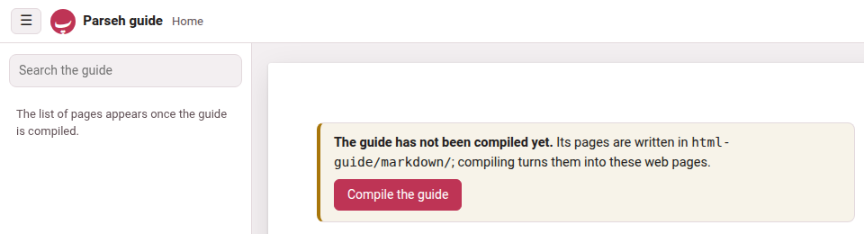

Parseh says what went wrong in words, on the page where it happened: in a
note under a greyed-out button, in a message at the foot of the window, in
a badge beside a build, in a dialog. The tables below quote those words as
the pages show them, so you can find yours with the guide's search box or
your browser's find-in-page, and say what each one means and what to do
next. A message in *italics* is what a page says, one in `code` what a
terminal prints; a label in **bold** is a button or a link.

When a message is not here, read it twice: most of them name the file,
the rule or the button they are about.

## Starting Parseh and installing it

| What you see | What it means, and what to do |
|---|---|
| The browser says the connection is not private, or the certificate is not trusted. | Expected, once per browser. Parseh makes its own certificate the first time it starts, and nobody else vouches for it — it is your server on your network. Choose **Advanced** and go on to the address. If the machine's addresses have changed (a new network, a new Tailscale address) and a device refuses the old certificate, make a fresh one: `./serve.sh cert` (Windows: `serve.bat cert`), then restart. |
| A page will not load at all. | The server is not running, or it runs on another port. On Linux and macOS, `./serve.sh status` says `running: pid …, https port …` or `not running`, and `./serve.sh log` shows its last lines. On Windows the server runs in its own window: that window is the log. Start it again with `./serve.sh`, **Parseh.command** on a Mac, or a double-click on **serve.bat**. |
| *Parseh stopped. Start it again with ./serve.sh in the project directory and reload this page.* (the studio says *Server stopped*) | Somebody pressed a stop button: **⏻ stop** on the hub, ⏻ in the video player, **stop server** in a book's reader, **Stop server** in the studio and the exercises. Nothing is lost. Start Parseh again as above — on Windows with a double-click on **serve.bat** — and reload the page. |
| Stopping asks *1 task is still running* (or *N tasks are*) and lists them. | The server is still doing something you started — a build, an upload, a backup, a download being packed. Stopping now cuts it off. Answer **Cancel**, wait for the **Working…** pill to go, then stop. |
| `./serve.sh` says `already running: pid … on port …` | A server is already up. Use it, or `./serve.sh restart` to replace it (after changing a file of Parseh's by hand, say; an update from Settings restarts it by itself). |
| `./serve.sh` says `failed to start -- the log says:` and quotes the log. | Usually the port is taken by another program (`Address already in use`). Start on another port — `./serve.sh 9000`, `serve.bat 9000` — or stop the other program. |
| `note: no 'ilya-frank' environment -- serving with …` | Serving works with any Python 3, but rebuilding books, dividing Japanese and Chinese into words and opening a modern Anki export need the packages of the environment. Run the installer once: `./install.sh`, **Parseh.command** on a Mac, **install.bat** on Windows. |
| Screen capture (the frame button on a card) does nothing, or copying to the clipboard fails. | The page is not on a secure address. Browsers only allow both on `https://` pages and on `localhost`. Use one of the `https://` addresses Parseh printed when it started. An old `http://` bookmark on the same port is sent to the `https://` address by itself; a server started with `--http` — or on Windows with no `openssl` to make a certificate, which the setup wizard says — serves plain http, where both work on `localhost` only. |
| The installer ends with `N checks passed, M missing.` | *M* counts the `MISS` lines, and each says what is missing and what it is for. Several matter for one job only: `ffmpeg` snaps a narration's timings to its silences and cuts a card's recording on the server, with its waveform — without it the timings are not snapped and the clip is recorded in the browser instead, as a WAV; `pdftotext` only re-extracts a book's source. Something optional that is simply not there — LuaLaTeX, a dictionary, a parallel corpus, a translation model, a word analyzer — is a `--` line, and is not counted as missing. What serving needs is in the first part of the report, `required to serve the reader`. |
| *The installation did not finish -- the messages above say why.* (**install.bat**; **Parseh.command** and `./install.sh` say *…the lines above say why*) | A step failed on the way, and the lines above it say which and why — often it was only the network, during a download. Mend what they name and double-click **install.bat** (or **Parseh.command**) again. |
| *Parseh needs Python 3, and this computer does not have it.* (**serve.bat**) | Windows found no Python 3.8 or newer. The simplest answer is the one it gives first: close the window and double-click **install.bat**, which brings its own Python with everything else Parseh needs. Or answer **Y** to *Install Python 3.12 now?* and winget installs it; where there is no winget, the download page of python.org opens. |
| *Python was installed but cannot be found from here yet: close this window and double-click serve.bat again.* | Just that: the window was opened before Python was there, and cannot see it. Close it and double-click **serve.bat** again. |
| `python3 does not run here (…).` (`./serve.sh`, usually on a Mac) | The Mac's `python3` is only a stub until Apple's command line tools are installed, and Parseh has no environment of its own yet. Double-click **Parseh.command**: the first time, it installs Parseh's environment, with a Python of its own. |
| `openssl is needed to make the certificate (apt install openssl), or run with --http to serve without TLS` (quoted by `./serve.sh` after `failed to start`) | Parseh makes its certificate with `openssl`, and this machine has none. Install it with the system's package manager, then start again; meanwhile `python3 serve.py --http` serves plain http. **serve.bat** never stops here: without `openssl` it serves plain http by itself, and its wizard offers to install one (**Install OpenSSL with winget now?**). |
| The installer says `no micromamba for …: install Python 3, or conda and then ./install.sh --conda` | There is no ready-made micromamba for this kind of machine. Install Python 3 (or conda) yourself and run the installer again; with conda, `./install.sh --conda` makes the environment with it. |
| `no Noto Serif CJK JP — a Japanese page falls back to another face …` (or the same for Chinese) | You have Japanese or Chinese content, and the font its pages and PDFs are set in is not on the machine. Install the Noto CJK fonts with your system's package manager (the line says how); the pages work meanwhile, a PDF cannot build. |
| `tex: 'ngerman' is in no language.dat, so its books break at ENGLISH points` (or another language) | The hyphenation patterns are installed but TeX cannot see them, so a book in that language would break its words at English points. Run the two commands the line gives, then `./install.sh --pdf` again. |
| *Parseh refused this: it came from another site …* or *… it came from a page with no address of its own …* | A page that is not one of Parseh's own — a page on another site, open in the same browser, or a page opened from the disk — tried to change something in Parseh, and nothing was changed: only Parseh's own pages may. Reading is never refused. If it happened on a page you meant to use, open that page from Parseh itself — the hub, or one of the addresses Parseh printed when it started — and not from a copy saved to the disk, then press the button again. |

More in [Installing Parseh](../getting-started/installing.md) and
[Starting and stopping](../getting-started/starting-and-stopping.md).

## Updating Parseh

| What you see | What it means, and what to do |
|---|---|
| Which version am I running? | The foot of the hub says it (on a phone, on the very last line), and so does **⚙ Settings**, and the first line the server writes when it starts. Give it in any report of a fault. |
| *This Parseh has no list of its own files (.parseh-release.json): it was installed before Parseh could update itself, or unpacked by hand.* | An update will not guess which files are Parseh's and which are yours. Move into a fresh install once, by hand — a few folders — and from then on it updates from Settings ([Moving into a fresh install, once](../getting-started/updating.md#moving-into-a-fresh-install-once)). |
| *This Parseh is a copy of its source code (a git checkout), not an install made from a release.* | Git keeps that folder's files, so Settings leaves them alone: bring it up to date with git, or install a release and move your things into it, as the row above. |
| *No release of Parseh has been published on GitHub yet.* | There is nothing newer to fetch. A release's zip you have can still be chosen under **A zip of your own**. |
| *GitHub could not be reached: …* or *GitHub asks Parseh to wait before asking again …* | The computer has no network, or GitHub is refusing questions from this address for a while (it answers some sixty an hour). Nothing was changed; **Check now** again later. |
| *That zip is not a release of Parseh …*, *That zip is damaged, or was changed after it was built: …* | The file chosen is not a release's zip, or a file in it does not match the zip's own list. Download the release again from the releases page — the `parseh-<version>.zip` under *Assets*, not the *Source code* archive. |
| The button stays grey, under *What may not survive going back.* | Going back to that version would leave some of your data in a shape it may read wrongly. Read the list; if you still want to go back, tick *I understand, and want to go back anyway*: a copy of the small files of your books, videos, decks and settings is kept first. |
| A phone shows the page with a lock, and no button to install. | Installing another version changes what Parseh runs, so it is done on the computer Parseh runs on. The phone may still **Check now**. |
| The page says an update was *undone*. | The update was cut off and could not be finished, or the new version did not start: Parseh put back every file it had replaced, from the copies it keeps in `.parseh-update/`, and started the version you had. The report says what happened; nothing of yours was touched. |
| *The update to … did not happen. It stopped while …* | Something on this computer stopped it, and everything was put back as it was. The sentence names the step and what went wrong — *the disk is full*, *this computer did not let it change a file*, *the release's zip could not be read* — so mend that (make room, give Parseh's folder back to your user, download the zip again) and press the button again. The line in small type beneath is the technical one: copy it into a report of the fault. |
| *Yours once, and not put back: … the copy it kept is gone* | A file of yours that an update replaced goes back when a version without that name is installed, from the copy that update kept. Only the last three updates keep theirs, and the one that replaced this file is older than that: Parseh's file of that name is deleted like any other the new version does not ship, and yours can come back only from a backup of your own ([Backups](../getting-started/backups.md)). |

More in [Updating Parseh](../getting-started/updating.md).

## The guide

{width=100 align=center}

| What you see | What it means, and what to do |
|---|---|
| The front page says *The guide has not been compiled yet.* | The pages you are reading are Markdown until they are compiled into web pages. When Parseh serves the guide (the hub's **guide** button), the same notice has a **Compile the guide** button: press it, and the new pages open when it is done. Opened from the disk, the guide cannot compile itself: run the installer, which compiles it every time (`./install.sh --guide` compiles only the guide). |
| *The guide was compiled from older pages. Compile it again to see the newest.* | A page of the guide changed since the last compile — after an update, say. Press **Compile the guide again**. |
| *The last compile failed. What it said is below.* or *The compile ended with errors. Opening the pages it wrote…* | The compile wrote every page it could and stopped on an error: each `warning:` or `error:` line below names the page and the line. That is a fault in a page of the guide, not in your content; the other pages work. |
| *The search needs the compiled guide (site/search-index.js), and it is not there yet.* and *The list of pages appears once the guide is compiled.* | The same thing: nothing has been compiled yet. See the first row. |
| `https://<user>.github.io/Parseh/` answers *404* or still shows older pages. | GitHub Pages publishes what is committed on `main`: switch it on once (**Settings → Pages → Source: Deploy from a branch**, branch **main**, folder **/ (root)**, **Save**) and give it a minute or two; a changed page appears after it is compiled and `html-guide/site/` committed and pushed. [Compiling and publishing](../writing-this-guide/compiling.md) has the whole setup. |
| `build.py` says `error: … is not empty and … nothing was touched` and exits with status 2. | A compile replaces its folder whole, so `--out`, `--pages` and `--export` only go into a folder that is new, empty or one they made themselves before; each says it in its own words — `--out`: `does not hold an earlier compile of the guide (no build.json of its own)`; `--pages`: `was not laid out by --pages (no .parseh-guide-pages in it)`; `--export`: `does not hold an exported guide`. Name another folder. |

More in [Compiling and publishing](../writing-this-guide/compiling.md).

## Books

| What you see | What it means, and what to do |
|---|---|
| **PDF behind the text — build it** in the reader's header. | You edited a chunk. The reader was rebuilt with your edit at once; the PDF is LaTeX, and is built only when you ask. Click the notice, or **build PDF**, and follow the build to its end. |
| *…: the build failed — …* after **build PDF**, **build** or **rebuild** on a card. | The message quotes the first error TeX gave (a line starting with `!`), or the line saying what could not run. *no lualatex on this machine: the PDF needs TeX Live (or MiKTeX); building the reader alone* means just that: the reader is built, the PDF needs TeX. `./install.sh --pdf` adds the TeX packages a PDF needs; on Windows, your TeX's own package manager does. |
| The reader refuses to empty a box: *… a glossed chunk needs its meaning …; emptying every box of the gloss at once ("delete gloss") takes the whole gloss off* | A box the language requires — the meaning, the transliteration where every chunk is romanised, a Japanese chunk's kana — cannot be emptied on its own, since that would leave a finished gloss half finished. To start the chunk again, press **delete gloss** in the chunk sheet, which empties every box at once (and **undo delete** puts it back). See [Deleting a gloss](../books/writing.md#deleting-a-gloss). |
| **fill from the answer**, in the reader's **gloss with an LLM** sheet, lists a chunk under *kept* or *dropped* | *kept*: the answer tried to change something an answer may not, and that part was left as it is — the line says which: a gloss already there, the word line, the colour, a note, the free mark, or a plain chunk. It is not always a chunk left untouched: a chunk the answer filled is listed too when the answer also changed its word line or its colour — the gloss went in, the other change did not. To have an answer replace a gloss already there, tick **re-gloss what is already glossed** before you paste (or press **delete gloss** on the chunk first). *dropped*: the answer could not be written there, and the line says why — its text or its division differs from the book's, it lies outside the stretch you picked (a folded paragraph among them), it would leave the chunk half glossed, or the chunk sheet's own check refused a value. See [Glossing a stretch with an LLM](../books/glossing-with-an-llm.md#the-report). |
| The reader refuses an edit: *this text would stop paragraph N reproducing source/paras/…, which verify_book.py checks* | A book's chunks, joined, must still say what the text it was made from says. Adding vowels, harakat or punctuation is free; changing a word is not. If the change is meant — you are correcting the source itself — tick **this paragraph need not reproduce `source/paras/`** in the chunk sheet: the check then stands aside for that paragraph alone. |
| A feature this guide describes is missing from a reader, or the **download** sheet sizes **all of it** as far smaller than it is. | What a reader can do is written into the page when it is built, so a book built before a feature has not got it — and a reader built before the size fix says the size of the first recording only. Press **rebuild the reader** in its header (a few seconds, no LaTeX), or **rebuild** on its card in the library. |
| The library card says **no audio yet** for a book that has a narration. | The book came in from a bundle made with **everything but the recording**, which leaves the recording itself out. Put its `audio/` folder back in the book's own folder, or add the narration again from the reader's **narration** panel. |
| An upload on the **Bring a book back** panel says *that is not a Parseh bundle: it carries no parseh-bundle.json. The download button makes one; a zip of a folder is not one.* | Only a zip made by **download** (or by **Backup every book**) carries the manifest that lets Parseh check it. Unzip, edit, and zip the same folder again with its `parseh-bundle.json` at the top, or download the book afresh. |
| *the bundle is damaged or locked and cannot be read* | The download was cut short, or the zip has a password. Download it again. |
| An upload is refused with *verify_book refused this book*, *the text no longer reproduces its own source paragraphs*, or *… does not parse* | The bundle was checked before anything was written, and one of its chapters breaks a rule: the message quotes the place. Fix it in the files and upload again; nothing on the shelf was touched. |
| An upload answers that the book is already here, with a choice to replace it. | A bundle never overwrites a book by surprise. Replace it, or cancel and keep the one on the shelf. |
| **cut the audio…** is greyed out, with a reason under it. | The reason is the answer: *this book has no narration file to cut the audio from*; *this subparagraph has no times yet: time it (narration, or edit times) and the audio can be cut*; *none of this book's recordings covers … yet*; *… was timed in the recording …, whose file is not on this machine*; *cutting the audio needs this page opened from the toolbox's server*. |
| The cut editor draws no waveform, and the clip comes out as a `.wav`. | The machine serving Parseh has no `ffmpeg`, so the clip is recorded in the browser instead of cut by the server. It still works. Install `ffmpeg` (the installer's report says whether it is there) for the waveform and MP3 clips. |
| **by the sound**, beside **estimate the rest** in a recording's **by ear**, is greyed out. | Its tooltip says why. *this reader was built before estimating by the sound existed…*: press **rebuild the reader** in the header (a few seconds, no LaTeX), then reload the page. *there is no picture of the sound here to estimate by — it is drawn by ffmpeg, on the computer Parseh runs on*: the machine serving Parseh has no `ffmpeg` (the installer's report says whether it is there). **by the text** works either way ([Fixing the timings](../books/timings.md#estimate-the-rest-by-the-text-or-by-the-sound)). |
| **estimate the rest** by the sound, in a book or a video, says *estimating by the sound needs numpy, which the Python running Parseh does not have…* | The environment lacks one package. Run the installer again (it adds what an environment lacks), then start Parseh again. Until then **by the text** works. |
| **estimate the rest** by the sound says *another estimate by the sound is running: try again when it has finished* | One runs on the computer at a time, and one is running — perhaps one you gave up with **stop estimating**, which the computer still finishes. Wait a little and press **E** again (its **Working…** entry is gone when it is done), or go **by the text**. |
| … or *this stretch is too long to estimate by the sound at once: estimate from a line nearer the end, or by the text* | The computer ran short of memory for a stretch that long. Estimate a shorter stretch — from a line further on — or by the text. |
| The server's console says `!! … declares a narration at …, which is missing` | `book.json` names a recording that is not in the book's `audio/`. Put the file back, or open the reader's **narration** panel, which says the same and lets you add it again. |
| A book taken off the shelf with ✕ is gone from the library. | Nothing was deleted: the whole folder was moved to `books/.trash/`, named after the book and the minute. Move it back into `books/<language>/` and write the library page again: **rebuild** on any book's card does, or `python3 lib/make_index.py`. |

More in [Books](../books/_index.md).

## Videos

| What you see | What it means, and what to do |
|---|---|
| **cut the audio…** is greyed out on a YouTube video: *only Chrome and Edge, on a computer, can record the sound of a tab* (or *this browser cannot read the sound of a shared tab*) | A YouTube video's sound reaches no script, so the clip is recorded from the tab as it plays — which only Chrome and Edge on a computer can do, and not a very old version of them (the second message). Open the video in an up-to-date one. On a phone the button is always grey. A film on this machine has none of this: its clip is cut from the file, in any browser. |
| *recording this tab needs the page opened at the toolbox's https address, in Chrome or Edge* | Open the page at one of the `https://` addresses Parseh printed. |
| *the tab was shared without its sound: press “record” and, when Chrome asks, leave “Also allow tab audio” turned on* | In Chrome's question, the switch that shares the tab's sound was off. Press **record** again and leave it on. |
| *no sound was captured — is the video muted? Turn its sound on and record again* | Nothing but near-silence was recorded between the two ends. Check the video can be heard there, and record again. |
| **by the sound**, beside **estimate the rest** in **the timings**, is greyed out on a YouTube video: *draw the sound first (“● draw the sound”, above the picture): there is no picture of it here yet to estimate by* | A YouTube video has no picture of its sound until one is recorded from the tab. Press **● draw the sound** in the same sheet; once it is drawn, **by the sound** can be pressed. Where the browser cannot draw it, the tooltip says so and why ([The timings](../videos/the-timings.md#the-picture-of-the-sound)). A film on this machine needs only `ffmpeg`, as a book does. |
| Saving a phrase in the player is refused: *… chunks do not reproduce the text*, with the text and the chunks under it. | A caption's phrases, joined, must give back the caption word for word, and the caption must say what its line of `transcript.txt` says: that check is what stops a model, or a careless edit, quietly rewriting the video. So adding vowel marks is free, and changing a word is refused. If the change was a slip, undo it. If the transcript itself is wrong — YouTube misheard a name, dropped a particle — tick **this phrase need not reproduce `transcript.txt`** at the foot of the phrase's **✎ edit** form (the refusal scrolls it into view) and save again with the correction: the edit is written, the caption's text follows its phrases, and that caption is no longer checked against the transcript. See [When YouTube heard wrong](../videos/editing-a-phrase.md#when-youtube-heard-wrong). |
| Unticking **this phrase need not reproduce `transcript.txt`** is refused: *segment N: text differs from transcript.txt* | The caption still says something its line of the transcript does not. Put its words back as the transcript has them in the same save as the untick, or leave the box ticked. |
| The video checker warns `N captions not checked against transcript.txt: a chunk of each is marked as departing from it` | Not a fault: it counts the captions freed with the box above, so that none is forgotten. |
| A caption cannot be cut, joined or deleted in the player. | On purpose. The captions are what the checker holds a video's two files to, caption for caption, so once the video is added only a caption's **start** moves (**the timings**, in the player's bar). Its phrases can still be cut and joined — **✂ cut in two**, **join next**, **join previous** in the ✎ form — and its words corrected as above. To re-cut the captions themselves, mend the transcript before adding (**Edit the transcript…** on the add page), or download the video with **⤓** in the player's bar, edit the files, and bring the zip back through **Bring a video back** on the video index. |
| The video checker says `segment N (start S) chunk C: missing 'tr'` (or `'en'`, `'kana'`), and `note: N of M chunks have no gloss yet` | The first is a phrase **half** glossed — something written in it, something its language requires still empty: an error to the checker, though the ✎ form saves it on the way. Fill the missing box in the player. The note only counts the phrases nobody has glossed yet, which are legal in every video ([A video still being glossed](../videos/video-info-and-drafts.md#drafts)). A `"draft": true` in an older `video.json` changes none of this: nothing reads it. |
| Emptying a box in the ✎ form is refused: *… a glossed phrase needs its meaning …; empty every box of the gloss ("delete gloss") to take the whole gloss off* | A box the language requires cannot be emptied on its own, since that would leave a finished gloss half finished. To start the phrase again, press **delete gloss**, which empties every box at once — and **undo delete** if that was not what you meant. See [Deleting a gloss](../videos/editing-a-phrase.md#deleting-a-gloss). |
| **fill from the answer**, in the player's **gloss with an LLM** panel, lists a phrase under *kept* or *dropped* | *kept*: the answer tried to change something an answer may not, and that part was left as it is — the line says which: a gloss already there, the word line, the colour, a note, the free mark, or a plain phrase. It is not always a phrase left untouched: a phrase the answer filled is listed too when the answer also changed its word line, its colour or its note — the gloss went in, the other change did not (a correction of the caption belongs in the meaning or the vocabulary line). To have an answer replace a gloss already there, tick **re-gloss what is already glossed** before you paste (or press **delete gloss** on the phrase first). *dropped*: the answer could not be written there, and the line says why — its text or its division differs from the player's, its start is another caption's, or it would leave the phrase half glossed. See [Glossing captions with an LLM](../videos/glossing-with-an-llm.md#the-report). |
| A colour or a gloss you wrote by hand into a video's annotations file has gone. | This cannot happen to a video added on or after 23 September 2026: the batches are folded in once, while the video is being added, and then dropped ([parts/ is retired](../videos/the-files.md#parts)). On an older video that still carries `parts/`, `merge_parts.py` run by hand rebuilt the file from batches that never had your edit — it now refuses instead, naming what it would lose. If it is already gone, the copy in `.trash/` or a download made with **⤓** is where to find it. |
| A video taken off the index with ✕ is gone. | Nothing was deleted: it was moved to the `.trash/` folder under `youtube/videos/`, named after the video and the minute. Move it back into its language's folder beside `.trash/`. |

More in [Videos](../videos/_index.md).

## Cards, clips and Anki

| What you see | What it means, and what to do |
|---|---|
| An edit you made inside Anki is gone. | A rebuilt deck was imported without syncing first: the build writes every card as the store has it. Redo the edit in Anki, then always sync first (**Anki** on the hub, steps 1–4) before you rebuild and import. |
| The sync wizard says *A package built by Parseh … not an export from Anki. It says nothing about what Anki holds, so there is nothing to sync* | You dropped the `.apkg` the build button made, not an export from Anki. It can still be brought in (**Bring this deck in**, **Add the N new cards**), but to sync, export the deck from Anki: **File → Export…**, *Anki Deck Package (.apkg)*. |
| The sync says `that file is not an Anki deck export -- export with File > Export > Anki Deck Package (.apkg)` | The file is not a deck package. Export again from Anki as the message says. |
| *this export is in Anki's modern compressed format, which needs the zstandard package* | The environment lacks one package. Run the installer again (it adds what an environment lacks), or export from Anki again with **Support older Anki versions** ticked. |
| Building a deck refuses: *the note type … in your Anki collection has fields …, but this exporter writes …* | The note type gained or lost a field inside Anki. Building now would fork a second note type and orphan your review history, so it refuses. The exporter has to be taught the new shape first: the card store's own `README.md`, in `youtube/anki/`, says how. |
| **Here, not in Anki yet** in the sync's preview. | Harmless: cards made on these pages since your last import. Anki has never seen them; step 5's import gives them to it. |
| **Images and recordings not in this export** | Export from Anki again with **Include media** ticked, or those pictures and recordings go missing from the cards. |
| A card vanished from a deck here. | Look in the deck's `deleted/` folder, in the card store (`youtube/anki/`, then the language and the deck): a sync that removed cards you deleted inside Anki moves their files there. Move a file back into `cards/` beside it to undo. |
| A card pasted into a document as markdown shows no picture or plays nothing. | Its files wait in the clip tray, and come into a document when it is saved. Save the document. If the clip was deleted from the tray (**The clip tray** on the hub) in the meantime, cut it again. |

More in [The round trip with Anki](../cards-and-anki/round-trip.md)
and [The clip tray](../cards-and-anki/clip-tray.md).

## Reading help: dictionaries, sentences, the translation model

| What you see | What it means, and what to do |
|---|---|
| No **dictionary** switch in a reader's header. | Nothing is installed for that language yet. Open **reading help** in the header (or **Settings → Reading help**) and press **Get it** on the language's dictionary. |
| The panel gives dictionary entries but never a sentence. | No parallel corpus is installed for that pair of languages, or nothing in it shares a rare word with your chunk. Coverage is very uneven; a thin pair finds a sentence less often. Get one on the language's card of the reading-help page, the row **Sentences people translated**; Japanese and Chinese need their dictionary first. |
| The panel never shows a machine's reading. | There is no button for it: it is drawn when the panel opens or not at all. Either no model is installed for the pair — models go to and from English only — or the **dictionary** switch is off, which is the switch the reading rides on. |
| *the model could not be run* | The model's files are incomplete, or the page is served by something other than Parseh (which names `.wasm` files as the browser requires). On the reading-help page, **Remove…** the model and **Get it** again. |
| The sources sidebar offers a verb as `\dw`, not `\vb`. | Its language's recipe did not take that hit for a verb it can fill in — a Chinese verb that neither splits nor takes a complement, a word the dictionary lists only as another verb's form — or the dictionary predates the recipes. Press **Rebuild** on the language's dictionary, on the reading-help page. |
| A character chosen after **Decompose Kanji** (or **Decompose Hanzi**) says *Install character components*. | No component pack is installed. **Open dictionary & component setup** leads to the language's **Character components** row on the reading-help page: **Get it** on KanjiVG (Japanese), Make Me a Hanzi (Chinese) or CJKVI-IDS (both, on the card every language shares). |
| The tree says *No component decomposition is available for this character.* | The installed packs do not cover it. The fallback pack, CJKVI-IDS, covers the most; **Manage component packs and fallback coverage** leads there. |
| The tree's foot says *Install the Japanese dictionary to show component meanings.* (or Chinese) | The tree works without a dictionary; the meanings of the components come from it. **Open setup** and **Get it** on the language's dictionary. |

More in [The reading-help page](../lookup-and-languages/reading-help.md).

## Studio

{width=100 align=center}

| What you see | What it means, and what to do |
|---|---|
| A dialog: *This name is already in use* | A link names a document by its title, so no two documents of one library may share one. The dialog shows each clash with two fields — **Rename the document already in the library** (with **open it ↗** to look at it first) and **Rename the document being saved** (or *added*). Change either or both and press **Use these names**; every link to a renamed document follows it. **Cancel** writes nothing, and the editor keeps your text. It opens on **Save**, **Save & view**, Ctrl+S, a new document's first save, **Paste LLM answer**, **Upload .md / .zip** and **Load from backup**. |
| Under a field: *“X” is already the name of another document — choose another name* | The name you typed is taken too. Type another; the dialog stays open. |
| *A document needs a name — give it one* or *A name cannot hold “\|”: a link to it in a table would split the cell — choose another name* (dialog: *This name cannot be used*) | A name may not be empty, and may not hold a `|`. Give another. |
| A link drawn in red and dashed, whose tooltip says *No document named “X” in this library — create or upload one with this name and this link will work again* | The document it names was deleted, renamed outside Parseh, or not written yet. Links are never removed: make or upload a document with that title, or rename one to it, and the link works again with nothing rewritten. |
| A document's title now ends in a number — *A note 2*, *A note 3* — and you did not rename it. | Names became unique with links by name, and a library written before could hold two documents of one name — a book's notes were all called *A note*. The first time the server met each library after the update (the studio's when it started, a book's or a video's notes when they were first opened), it kept the name for the oldest document and put 2, 3… after the name of each later one, in its header; the server's console said so. Links that named it still find the oldest. Rename it as you like — change its `title:` line in the editor and save — and see [Links written before names](../studio/names-and-links.md#links-written-before-names). |
| An exercise drawn as a box: *Exercise needs attention.* with a list under it. | The list names each problem in the exercise's markdown — a field that is not known, a missing answer, a picture that is not under `images/`. Fix them in the editor; **✎ Edit** on the exercise in the preview reopens its form. Such an exercise has no **+ Deck** button until it is fixed. |
| The build badge says **build failed — see message**. | Point at the badge to read what LaTeX said. *xelatex not found — install TeX Live* means just that. *fonts not provisioned yet* happens only in the first moments after the server starts: wait a moment and build again. |
| *Large print needs the TeX package extsizes (extarticle.cls), which this TeX installation does not have.* | The larger print sizes need one TeX package. On Linux and macOS, `./install.sh --pdf` installs it. On Windows, where that script does not run, add the package `extsizes` with your TeX's own package manager — the **Packages** page of MiKTeX Console, or the TeX Live Manager. Meanwhile build at **Normal · 11 pt**. |
| **source changed — rebuild** beside a PDF. | The markdown changed after the PDF was built — perhaps only because another document was renamed and a link in this one followed it. **Build PDF** again. |
| **built with other options — rebuild** | **PDF options ▾** now says another print size or colour than the PDF was built with. **Build PDF** again to use them. |
| **N RTL FAIL** (or **N text FAIL**), **not verified**, **N overfull** | The PDF was checked against the markdown: the first lists the strings of the target language that did not come out right in the PDF; **not verified** means PyMuPDF, which does the check, is not installed (run the installer); **overfull** counts lines that stick out into the margin. |
| An upload opens a dialog saying *Its header has no …* | A studio document's header needs `title`, `subtitle`, `note`, `lang` and `target`. The dialog asks for exactly the missing ones and adds them; the rest of the file stays as it is. |
| **Load from backup** says *that zip holds no library* (or *that is not a zip file*) | The file is not a library backup: that is what **Backup** writes. A single document's zip goes in through **Upload .md / .zip** instead. |
| A picture or a recording is refused on upload: *only PNG, JPEG, SVG and PDF figures are supported*, *image larger than 15 MB*, *only … recordings are supported* | The studio takes those picture formats, and the recording formats the message lists (MP3, M4A, AAC, Ogg, Opus, WAV, FLAC, WebM). Convert the file and upload again. |
| A starter's picture or chime you deleted shows as missing, and is not copied back. | By design: once deleted, a starter's file stays deleted for that document. Delete the line that names it, or upload a file of your own under that name. |
| A page made with **Download ▾ → HTML page, for a website**, opened from the disk, shows *Video player configuration error* where its video should be. | YouTube plays nothing for a player that does not say which site it is on, and a file opened from the disk is on no site. The line under it says so too, and **watch it on YouTube** opens the video there. Put the page on a website and the video plays in the page; everything else on the page works from the disk as well. See [A page for a website](../studio/web-page.md). |
| The editor writes right to left and you did not ask for it. | The document's `lang:` is a right-to-left language, so the editor opened in that direction. Press **⇥ LTR editor** to switch; the choice is remembered for this document. |

More in [Names and links](../studio/names-and-links.md),
[Printing to PDF](../studio/pdf.md) and [A page for a website](../studio/web-page.md).

## Exercises

| What you see | What it means, and what to do |
|---|---|
| *this exercise was already answered — showing what comes next* | You answered the same exercise in another tab (or a request was sent twice). It is not scheduled a second time; the page simply moves on. |
| *the document has changed since the page was loaded: reload it, then copy* | The document was saved elsewhere after this page loaded, so **+ Deck** could pick the wrong exercise. Reload the page and copy again. |
| *this exercise is in X, but the deck "Y" is for Z* | A deck has one language. Choose (or make) a deck of the exercise's language. **Move to deck…** says *the destination deck must have the same language* for the same reason. |
| **Import deck…** says *this is not a deck export: parseh-exercise-deck.json is missing* or *the file is not a zip* | **Import deck…** takes the zip a deck's **Export** makes. A zip of every deck, made by **Backup** on the Exercises page, goes back through **Load from backup** beside it. |
| *… is not a recording: only … recordings can be imported*, *the zip is larger than 512 MB uncompressed* | The import checks every file before it writes anything. Remove the offending file from the zip, or export the deck again. |
| An exercise has no **+ Deck** button. | It shows errors (fix them first), or you are in the editor's preview, which has none: open the document's reading view. |
| A flashcard does not play its recording by itself. | Many browsers let a page make no sound until you have clicked on it. Click the card's 🔊 once; from then on the recordings play. |
| **Study now** shows *next exercise in …* or *no exercises scheduled* | Nothing is due. That is the scheduler working: come back then, or use **Cram exercises** on the deck's page, which never changes the schedule. |

More in [Studying](../exercises/studying.md) and [Export, import and
backup](../exercises/export-import-backup.md).

## Working…, and the Browser | Mobile switch

{width=70 align=center}

| What you see | What it means, and what to do |
|---|---|
| The **Working:** pill in the corner stays on *Preparing the download…* | The server is packing the zip — a book with its recordings, a whole shelf — before it can send it. The pill goes once the file has been sent; the file itself arrives in your browser's downloads, as always. |
| The pill says **Working:** but nothing seems to happen on the page. | The work may have been started on another page or in another tab: the pill shows everything the server is doing. Click it for the list; **open the page** goes to the page each one was started from. |
| Something was refused, and the pill said nothing. | On purpose: the pill says only what is running. A refusal is said by the page that asked, as a message or a dialog. |
| In **Mobile** mode a door opens the ordinary page. | The hub, the books and the exercise decks have their mobile versions; the videos and the studio's notes open their browser pages until their own mobile pages are written. |
| In **Mobile** mode a book's reader has no **book info**, **build**, **narration** or pencil, and an Alt-click makes no card. | On purpose: the mobile reader is for reading. Press **Browser** under **⋯** and they are all back, on the same page. |
| The mobile shelf says a book is *not built yet*, and its card opens nothing. | Its reader has never been built. Build it from its card in the library, in the **Browser** interface. |
| The hub has no Anki, clip tray, reading help or stop button any more. | The hub is in **Mobile** mode, which leaves out everything that edits or administers. Press **Browser** in its top bar. |
| Studying in **Mobile** mode, there is no bar at the top and no **Deck** button. | On purpose: the exercise has the screen. **‹** beside the deck's name goes back to the deck. |
| **As an app** says the phone does not trust Parseh's certificate yet, or the phone's menu only offers a shortcut that opens with an address bar. | The phone has to be told once to trust Parseh's certificate: step 1 on the **As an app** page — download it, install it in the phone's settings (on an iPhone, turn on full trust for it as well), then open Parseh again. |
| The app says **Parseh cannot be reached**. | The phone cannot reach your computer: it is asleep or off, Parseh is not started on it, or the phone is away from its network (and from Tailscale, if that is how it reaches it). Start Parseh on the computer, then **Try again**. |
| A page says **offline** although the computer is on. | Press **↻** beside the chip, or pull the page down from the top: a refreshed page asks again, and opens online if the computer answers. A page that went offline stays so while it is open, so that a book does not change under you — and Parseh says *offline* only when the phone has no network, when the computer refuses (Parseh not running on it), or after 45 seconds without any answer. |
| **checking…** stands where the offline chip goes. | The computer is slow to answer, not gone: the page goes on as usual, and the words go as soon as it answers. Only if nothing answers for 45 seconds does it say *offline*. |
| Keeping a book says *Chrome will not download for Parseh in the background — turn on Automatic downloads for this site in Chrome’s Site settings.* | Chrome refused to bring the book by the phone's own download. Nothing was fetched. Allow **Automatic downloads** for Parseh in Chrome's **Site settings**, then keep it again. |
| A keep ends with *…: stopped from the notification — what had come is on this phone*, *…: 2 of its files are no longer on the computer* or *…: no room on this phone for 2 of its files* | The book's download stopped part-way, for the reason it names: **Cancel** on its notification (or **Stop** on *Kept on this phone*, which says *stopped on this phone*), files the computer no longer has, or a phone that filled up. What had come stays, and the book is kept with it; *Change what is kept* shows what is missing, unticked. Tick it and **Save** to fetch the rest — after giving some room back on *Kept on this phone*, if it was the room; a file the computer no longer has cannot be fetched again, from here or anywhere. After a first keep, *— nothing of it had come yet* means the book was not kept at all: press *Keep on this phone* again. |
| Keeping a book says *… was already coming onto this phone — change what is kept once it is in* | Another tab had started keeping the same book after this one's list was opened. That keep carries on, and what it brings is kept; what was ticked here was not fetched, and nothing was given back. Once it is in, open *Change what is kept* again. |
| The button says *Waiting for … — you can leave this page* | Another book is coming onto the phone, and this one waits behind it and starts by itself once that one is in. Nothing to do. With two already coming, one more may be refused instead: *Two books are already coming onto this phone — keep this one once one of them is in.* |
| The button says *Keeping… 43% — waiting for the computer* | The computer stopped answering in the middle of a keep: asleep, off, or out of the phone's reach. The download waits, and carries on by itself when the computer answers again; a book waiting behind it waits too. Wake the computer, or start Parseh on it. |
| After an update, every browser warns about Parseh's certificate once more. | An update from Settings keeps the certificate, `.tls/`, as it was, so this is the one-time change of a Parseh from before the certificate had an authority of its own, which a phone can be told to trust: the first start after it made the new one. Accept it once, as before — or, on a phone, trust it for good from **As an app**. A fresh install that did not get the old folder's `.tls/` makes a certificate of its own too ([Moving into a fresh install, once](../getting-started/updating.md#moving-into-a-fresh-install-once)). |

More in [The Working… indicator](../getting-started/working-indicator.md)
and [Browser and Mobile](../getting-started/mobile-mode.md).

