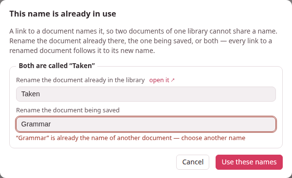
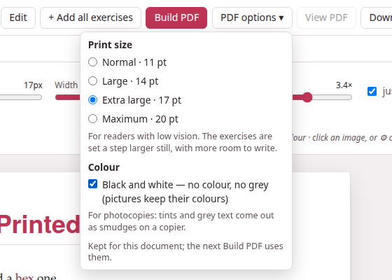
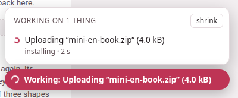
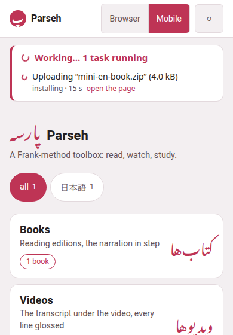

The features below arrived together, in September 2026. Each has a line
or two here on what it does and a link to the page that explains it in
full. After updating, run the installer once more
([After updating Parseh](daily-loops.md#after-updating-parseh)): it
compiles this guide and rebuilds the readers.

## Links between documents, by name

A link from one studio document to another used to name the target by a
code nobody could read. It now names it by its **name** — its title,
exactly as its `title:` line spells it:

```markdown
[the companion piece](doc:Verbs of motion)
[](doc:The shape of a Persian word)
```

The second, with nothing between its brackets, shows the other
document's title as it is now. What follows from that:

- **Names are unique.** No two documents of one library — the studio's,
  or the notes of one book or one video — share one. Whenever a save, a new document, **Paste LLM answer**,
  **Upload .md / .zip** or **Load from backup** would take a name already in
  use, nothing is written and a dialog opens, *This name is already in
  use*, with a field to rename the document already there, a field to
  rename the one coming in, or both. A name still taken is said under its
  field, and the dialog stays open.
- **Renames follow into every link.** As in Obsidian, change a document's
  title and every link that named it — in other documents, in itself, in
  the exercise decks — is rewritten to the new name, its shown text kept.
- **A link to a deleted document is left hanging.** It is drawn red and
  dashed, and works again the moment a document of that name exists — made,
  uploaded, restored or renamed.
- **↩ Linked from (N).** Beside **☰ Contents** on a document's page, it
  opens a drawer listing every document that links to this one, each with
  a few words around the link.
- **Doc link…** in the editor writes the link for you. Links written the
  old way still work, and were rewritten by name the first time the server
  met each library — the studio's when it started, a book's or a video's
  notes when they were first opened.
- **Two documents that shared a name were told apart then too.** Nothing
  forbade it before — a book's notes were all called *A note* — so that
  same first time, the oldest kept the name and each later one got a
  number after it, in its header: *A note 2*, *A note 3* and so on. A
  title that suddenly ends in a number is one of those: rename it as you
  like.

{width=100 align=center}

All of it: [Names and links](../studio/names-and-links.md).

## The enlarged flashcard

**⤢ Enlarge** on a flashcard opens the same card over the page, laid out
exactly as it is on the page — every field where it sits there, a
right-to-left paragraph on the right, a Latin block to its side, every
line breaking where it breaks there — and then magnified as much as the
window allows. On a phone it is laid out a little narrower instead, so it
can be up to twice as large, though a line that is whole on the page stays
whole: only a paragraph that already wraps there may wrap at other words.
A click, Space or Enter turns it; Escape closes it. See
[Flashcards](../dialect-exercises/flashcards.md) and
[Studying](../exercises/studying.md).

## The RTL editor

For a document whose prose is a right-to-left language — a Persian
teaching English to Persians — **⇤ RTL editor** in the editor's bar sets
the whole source right to left, in the face of that language, every line
of it, a `prompt:` or `meaning:` with a Persian sentence included (a line
of Latin letters alone then reads as any right-to-left editor draws it);
**⇥ LTR editor** turns it back.
A document whose `lang:` is Persian or Arabic opens right to left by
itself, and the choice you make is remembered for each document. Only
the source box changes; the preview is drawn as before. See [Writing in
the editor](../studio/editor.md).

## Large print, and black and white

**PDF options ▾**, beside **Build PDF** on a document's page:

| Option | For |
|---|---|
| **Print size**: Normal · 11 pt, Large · 14 pt, Extra large · 17 pt, Maximum · 20 pt | Readers with low vision. Everything grows with the text, and the exercises a step larger still, with more room to write. |
| **Black and white — no colour, no grey (pictures keep their colours)** | Photocopies: the tints go white, coloured words print black. |

{width=95 align=center}

The choice is kept for each document, and the build badge says what a PDF
was built with (*17 pt · B&W*), and **built with other options —
rebuild** when the menu now says otherwise. Large print needs the TeX
package `extsizes`, which `./install.sh --pdf` installs (on Windows, your
TeX's package manager: MiKTeX Console, or the TeX Live Manager). See
[Printing to PDF](../studio/pdf.md).

## Exercises laid out for a pen

On paper, and only on paper:

- **Matching** — every entry of both columns in a frame of its own, the
  columns equally wide, with a gap between them for the line the student
  draws.
- **Construct the sentence** — the chunks in a row, each framed, and under
  them lines to write the whole sentence on: as many as it takes to hold
  one and a half times the sentence, measured as it is set.
- **True / false and yes / no** — each statement wraps in a column of its
  own, and the marks sit in a column at the right, level and aligned on
  every row.

See [Exercises on paper](../dialect-exercises/on-paper.md).

## Working…

Whatever takes a while — a book being built, an upload, a download being
packed, a backup, a restore, a narration being aligned, a studio PDF, a
dictionary being fetched — now shows on every page until it is over: a
pill in the corner says **Working:** and what, with **+N more** when there
are several. Click it for the list, each with its time, its progress where
it is counted and **open the page** it was started from; **shrink** folds
it to its spinner. The hub lists the same in a **Working…** panel under
its bar, and every stop button says what is still running before it stops
the server.

{width=70 align=center}

See [The Working… indicator](../getting-started/working-indicator.md).

## The size of “all of it”

A narrated book's **download** sheet now says how big each of its three
shapes is, and **all of it** counts every recording — a book read in nine
parts carries nine files — where it used to count only the first. A
reader built before this says the old figure until **rebuild the reader**.
The player's **⤓** says the same of a film on this machine. See [Taking a
book away](../books/download.md).

## Browser | Mobile

The hub's top bar has a new switch. **Browser** is every page as it has
always been. **Mobile** is a streamlined set of pages for reading on a
phone, with no editing on them: a single column, big doors with their
counts, the language chips in one row, and the guide — and nothing that
edits or administers. The choice holds on every page and after a reload.
The hub was the first mobile page; the books — a shelf, and every book's
reader as a reader only, with **↺ ↻** to move the narration by ten seconds
(or as many as you set) — and the exercise decks have followed: a cram of
your own picked from a deck, by tag or one by one, and **Next** in the very
place **Check** was. Every mobile page is made for a phone held sideways as
well as upright. And the mobile interface installs **as an app**: an icon on
the home screen, the whole screen for the page, no address bar
([Parseh as an app](../getting-started/mobile-mode.md#parseh-as-an-app)).
The videos and the studio's notes open their browser pages until their own
mobile ones are written.

On a phone, a fill-in's blank and a matching exercise's box are filled the
other way round: tap the blank or the box, and a cloud offers the words of
the bank below ([Placement](../dialect-exercises/placement.md#moving-the-blocks),
[Matching](../dialect-exercises/matching.md#on-the-page)).

Cram mode has **Skip** too, as studying has, and its end now says how it
went and lists the exercises you got wrong at least once and the ones you
skipped — each shown solved at a click, and crammed again at one
([Cram mode](../exercises/cram.md#the-end)).

{width=60 align=center}

See [Browser and Mobile](../getting-started/mobile-mode.md).

## This guide

The hub's **guide** button now opens these pages, at `/guide/`, rather
than the PDF manual — which stays, one click away, as **PDF manual** at
the top of every page. The pages have a list on the left, a search box
that finds any word on any page, the three themes, and working examples
of everything the studio's Markdown can hold.

- The installers compile the guide every time they run;
  `./install.sh --guide` compiles it alone.
- When Parseh serves it and the pages are missing, the front page offers
  **Compile the guide**; when they are older than their Markdown,
  **Compile the guide again**.
- Opened straight from the disk (`html-guide/index.html`), it needs no
  server at all.
- It can be published on GitHub Pages, and taken into a project of its
  own.

[Writing this guide](../writing-this-guide/_index.md) explains how the
pages are written, and [Compiling and
publishing](../writing-this-guide/compiling.md) how they are compiled and
published.

## New starter pages

**+ New** in the studio opens a new document on a page written afresh for
each of the eleven languages: a guided tour, in English, of everything a
document can hold — boxes, headings, target-language runs and blocks,
readings and colours, lemma headings, tables, footnotes, links by name,
formulas, pictures, a recording, a video, and one exercise of every kind —
with correct examples in that language. It ships with two pictures and a
short chime, which become the document's own when it is saved; delete what
you do not need. See [The library page](../studio/library.md) and [The
Markdown dialect](../dialect/_index.md).
