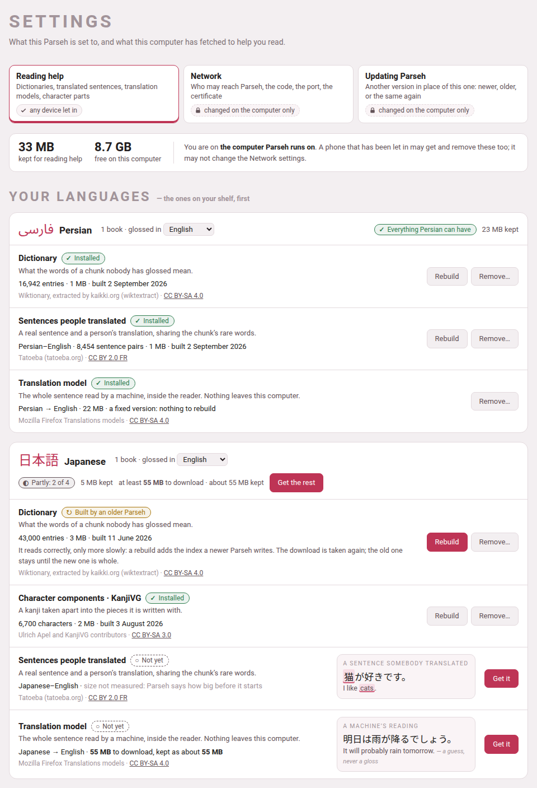

Every version of Parseh, the newest first, with the day it was released —
the one still being made says *not yet released* — and under it what it
brought: a line or two on each thing, and a link to the page that explains
it in full. The version you are running is written at the foot of the
[hub](../getting-started/the-hub.md#the-foot). `CHANGELOG.md`, at the top
of Parseh's folder, lists the same versions in fewer words, change by
change. A new version comes in from **Settings → Updating Parseh**
([Updating Parseh](../getting-started/updating.md)), which compiles this
guide and rebuilds the readers by itself.

## a0.3.2 — 25 September 2026

### Updating Parseh from Settings

**Settings → Updating Parseh** puts another version of Parseh in place of
the one you have, and keeps everything that is yours: the books, the
videos, the documents, the decks with every answer ever given, the Anki
cards and clips, the dictionaries and models, your settings, the
certificate and the devices you let in. **Check now** asks GitHub for the
newest release, and **Download** fetches it, checked against its checksum;
or choose a release's zip you already have. **Look once a day** asks by
itself, and is off until you tick it.

Before anything happens the page says **which way it goes** — newer, older
(*going back*), or the same version again, all three allowed — which files
it writes and deletes, and any file of Parseh's that was changed by hand,
which is kept in a backup and listed. **A file of yours that an update
replaced** — one you had put where the new version ships a file of the same
name — goes back where it was, byte for byte, when you later install a
version without that name (going back, most often); the page lists it under
*Yours, put back*. Going back to a version that would
read some of your data in an older shape waits until you tick that you
understand, and copies the small files of your content first. While it
runs the page shows each step; afterwards the report stands at the top,
with **Back to where you were**. An update that fails puts everything back
and says in words which step it stopped in and why, with the technical line
beneath in small type. An update that is interrupted is finished
or undone the next time Parseh starts. Only the computer installs one: a
phone may look, and is told why it may not. A Parseh installed before this
version cannot update itself yet — install this one afresh from its zip,
once ([Updating Parseh](../getting-started/updating.md)).

**The app on a phone is told.** The next time it reaches the computer it
takes the new version and says so once, in a line at its foot — *Parseh
was updated to*, and the number — and nothing you kept is lost. *Change
what is kept* calls the files an update changed *updated*, not damaged,
and fetches nothing again for them
([Browser and Mobile](../getting-started/mobile-mode.md#the-books)).

### Releases, and the version on the hub

Each version of Parseh is now a **release** on GitHub: one zip,
`parseh-<version>.zip`, holding the program and nothing else — no tests,
no content — with a list of its own files inside, which is what an update
reads. That zip is how Parseh is installed now
([Installing Parseh](../getting-started/installing.md)). And Parseh says
**which version it is**: at the foot of the [hub](../getting-started/the-hub.md#the-foot)
(on a phone, on a line of its own at the very foot), on **Settings**, and
in the first line the server writes as it starts. A book or a video
downloaded as one file names the version that wrote it.

### The reading help moves into Settings

The page that fetches dictionaries, translated sentences, translation
models and character components is now **Settings → Reading help**, at
`/settings/reading-help/`. The old address still opens it, so a reader
built before, or a page kept on a phone, needs no rebuild.

{width=90 align=center}

It is laid out **by language**: a card for each language on your shelf,
saying what it has and what it could have, with **Get everything** and what
that costs; the other languages one line each; and a card for what they
all share. Each row's state is a sign and a word — *Installed*, *Built by an
older Parseh*, *Not yet* and the rest — with the licence of what it holds
and, not yet installed, a small example of what it would add. Sizes are said
**before** anything is fetched, and nothing starts that the disk has no room
for. A download shows a bar with **the time left**, has a **Stop**, and
**carries on** from where it stopped. **Get everything** runs on the
computer, one download after another, so a phone may lock its screen.

**Who may change what** is now a property of each setting: one that decides
who may reach Parseh, what it exposes or what it runs is changed on the
computer only. So a phone let in may get and remove a dictionary, but not
touch **Network** or update Parseh — each says why, with a lock — and the
pairing code is shown on the computer alone
([The reading-help page](../lookup-and-languages/reading-help.md),
[From a phone or another computer](../getting-started/other-devices.md)).

### A language you add is yours

A language added with `lib/newlang.py` is kept in `config/languages.json`,
beside your settings, where an update cannot take it away, and its Anki
note types take ids Parseh's own languages never use
([Adding a language](../lookup-and-languages/adding-a-language.md)).

### Only Parseh's own pages change anything

A page on another site, open in the same browser, could make the browser
send Parseh a request that changed something — stop it, delete a book,
empty the clip tray. Now anything that changes Parseh must come from one of
Parseh's own pages; any other request is refused, in words, and changes
nothing. Reading is as it was: a link from anywhere still opens a Parseh
page, and `./serve.sh stop` still stops it
([Troubleshooting](troubleshooting.md#starting-parseh-and-installing-it)).

### Offline only when the computer is really gone

Parseh says **offline** only when it is sure the computer cannot be reached:
at once when the phone has no network, within a few seconds when the
computer refuses, and after 45 seconds of silence when it answers nothing at
all — which is what a computer that is off or asleep looks like over
Tailscale. A slow answer is never offline: while one is late, a quiet
**checking…** stands where the chip would and everything goes on as usual.
**Refreshing a page always asks again** — the browser's reload, a pull down
from the top, or the new **↻** beside the *offline* chip, which in the app
on an iPhone or an iPad, with neither of the other two, is the only refresh
there is ([Browser and Mobile](../getting-started/mobile-mode.md#the-books)).

### Estimating the rest by the sound

**estimate the rest** (**E**) — on the sheet that moves a book's boundaries
by ear, and on a video's **the timings** — has a switch beside it: **by the
text** or **by the sound**. **by the text** is the guess it always made, a
slice of what is left for each piece in proportion to its text. **by the
sound** reads the picture of the sound instead and puts each boundary in a
pause it shows, where the length of the text allows, following the pace of
the speech as it changes. It hears where the voice stops and starts, never
which word is which: a better first guess to correct by ear, not an
alignment. When it is done it says how many boundaries sit in a pause it
heard. It takes a few seconds for an hour of recording, and up to about a
minute for four; meanwhile **stop estimating** (or Esc) gives the wait up
and keeps whatever you moved by hand.

It needs a picture of the sound, and is greyed where there is none, saying
why: on a YouTube video, draw the sound first; a book's reader built before
it gains it with **rebuild the reader**. It also needs one more package,
NumPy, which the installer adds, and so does an update from Settings that
brings it. The choice is
remembered in this browser, for books and videos alike
([Fixing the timings](../books/timings.md#estimate-the-rest-by-the-text-or-by-the-sound),
[The timings](../videos/the-timings.md#estimate-the-rest-by-the-text-or-by-the-sound)).

### A page for a website opens on Sepia

A document, or a deck's exercises, exported as **one HTML page** now opens
on **Sepia**, the warm paper made for reading, whatever the studio was
showing when you made it and whatever the student's computer or phone
prefers, even opened straight from the disk. That is only where it starts:
**Aa** still offers **Paper**, **Sepia** and **Dark**, and the page forgets
the choice when its tab is closed
([A page for a website](../studio/web-page.md#what-the-page-has)).

### The dictionary in a sheet, on a phone

On a phone, the dictionary no longer opens inside the gloss cloud, where it
was a small box scrolling inside the page and over the word. It rises from
the foot of the screen in a **sheet**, as *Keep on this phone* does: as tall
as the entry, up to most of the screen — even under a video pinned at the
top — and only the sheet scrolls. The word you looked up stays marked:
where there is room above the sheet the page moves it there, and where there
is not the sheet covers it, and closing the sheet shows it again. Each
word's senses are
**numbered, one to a line**, its part of speech a small label beside it; and
Persian, Arabic and every other language are set in their own type and
direction. **Swipe it down, tap beside it, or go back** to close it, and
nothing is left open. A video, or a book being read aloud, waits, paused,
while it is up; on the whole screen the sheet covers the subtitles, and
going back closes the sheet and leaves the video where it was.

The gloss cloud is the gloss, as it always was, and a chunk is glossed when
anything is written under it — a meaning, a transliteration or a vocabulary
line: it opens its gloss beside the word, and **dictionary**, beside *copy*,
opens the sheet. With the dictionary switched on, only a chunk with nothing
written under it opens the sheet at a tap, with no cloud. And a book or a
video with **few glosses** — fewer than half of all its chunks — shows which
chunks are glossed, so you can tell which a tap will gloss: where every
phrase already has a faint dotted line (a video's transcript, a book's first
pass in hover mode) the glossed ones have it darker, elsewhere in a book the
glossed chunks get a faint dotted line, and over the whole-screen subtitles
the glossed phrase's line is almost white. The cloud's **copy** and
**dictionary** are a finger's size now; a video's cloud on a phone no longer
offers the colour marks, which wrote into the video, and its transcript no
longer shows the **+** between captions that writes a note
([Browser and Mobile](../getting-started/mobile-mode.md#the-dictionary-on-a-phone)).

## a0.3.1 — 24 September 2026

### A blank's cloud in the browser too

A fill-in's blank and a matching exercise's box open **the cloud of the
bank's words** in the browser interface as well, as they do on a phone: click
the blank, then the word. Dragging is still there, and so is a word clicked
and then its blank — which puts the word there and opens no cloud. On a
document's page, in a deck, and in a page exported for a website
([Placement](../dialect-exercises/placement.md#moving-the-blocks),
[Matching](../dialect-exercises/matching.md#on-the-page)).

### The lines around a subtitle, and the dictionary under any gloss

On a phone, a video on the whole screen can show **the caption before and
the caption after** the one being said, above and below it in the same
cloud, a little smaller and greyer; every phrase in them opens its gloss at
a tap. The button beside the ⛶ in the corner turns them on and off, and the
choice is kept. And the gloss cloud of a book and of a video has
**dictionary** beside *copy*: it opens the dictionary for a phrase that has
a gloss too, which the cloud never did by itself — and, a version later, in
a sheet of its own ([The dictionary in a sheet, on a phone](#the-dictionary-in-a-sheet-on-a-phone);
[Browser and Mobile](../getting-started/mobile-mode.md#the-videos)).

### Flashcards to cut out and fold

In a document's PDF a flashcard is **a card to cut out and fold**: a frame
with round corners, its front in the left half and its back in the right,
drawn as the page draws them — the picture, the recording, the main field
bold and the others grey — and a dashed line between the two to fold it on
([Flashcards](../dialect-exercises/flashcards.md#on-paper)).

## a0.3.0 — 23 September 2026

### A book that comes onto the phone by itself

On Android, in Chrome, **Keep on this phone** no longer needs you to stay on
the page. A book now comes by **the phone's own download** — its text first,
then its recordings — with Android's notification saying how far it has got,
and the button says *Keeping… 43% — you can leave this page*: go to another
page, close Parseh, lock the phone. **Cancel** on the notification stops the
whole keep and leaves what had come; a second book waits for the first and
says so; a book that needs, for a moment, more room than the phone has free
says so before it starts, with **Keep it anyway** and **Not now**. If it
finishes while Parseh is closed, the notification says so, a tap on it opens
the book, and the next page you open says it once at its foot. *Kept on this
phone* lists a book still coming as *coming — 43%*, with **Stop**. And a keep
that stops part-way keeps what had come and says why, each reason in its own
words: stopped, a file the computer no longer has, or no room.

**The button no longer goes back to *Keep on this phone* in the middle of a
keep**, on any phone: it says *Keeping…* until the keep is over. On the iPad,
and in a browser without that download of its own, keeping is as it was: stay
on the page until it says the book is on this phone
([Browser and Mobile](../getting-started/mobile-mode.md#the-books)).

### The videos and the studio's pages on a phone

The mobile interface ([Browser | Mobile](#browser--mobile), below) now has
**the videos and the studio's pages** too: a shelf of **channels**, with a
channel's videos one tap inside it — the browser's own shape, instead of one
long list of every video of every channel — the player itself with its
transcript and glosses (the video at the left and the transcript at the right
when the phone is turned, with a divider you drag, and a full-screen button
that lays the line being said over the video — tap a phrase in it and its
gloss opens), and the studio's library and documents, to read, with their
exercises still answerable.

**The narration is moved from the foot of the screen.** ↺, ⏯ and ↻ float in
the corners a thumb reaches, with the speed beside them; they fade when you
stop touching the screen. Hold ↺ or ↻ to choose how far they carry (1 · 2 ·
5 · 10 · 15 · 30 · 60 seconds — one and two for going back over the phrase
you have just heard, in a video as in a book), and tap the speed to choose
how fast the narration plays. The computer's reader has ↺ ↻ now too, with **Shift+←** and
**Shift+→** — and **the speed no longer falls back to 1× by itself** when the
recording changes. The controls **keep their order in a book that reads right
to left**: time does not run backwards in Persian, so ↺ stays behind and ↻
stays ahead, wherever the words go. ⏯ shows **‖** and **▶** — the marks the
rest of Parseh uses, and not the one an Android phone drew as an orange
emoji. **A video keeps its own speed** now, apart
from a book's — watching and listening are different habits — and the speed
you tap is the speed shown **at once**, instead of a change late.

**The whole screen, on a video, is Parseh's own.** ⛶ used to hand the screen
to YouTube's frame, which took it whole: no subtitles could be drawn over it
and the way out was a bar that would not answer. Now the **page** goes full
screen and Parseh lays the video out on it — the picture on black, the line
being said at its foot, the controls where your thumb left them — and there
are **three ways out**, so nobody is shut in: the ⛶ in the corner, your
phone's back gesture, and a tap on the black beside the picture. A tap on a
word of the subtitle opens its gloss **over the subtitle**, where your finger
is. Where a phone refuses the whole screen, you get the same layout with the
browser's own bars, and it says so rather than doing nothing.

**A finger reaches what a key reached**: hold a finger on a word for *Card for
“word”*, *Copy the chunk*, *Copy the sentence*. And a **?** in the bar, on a
phone or a tablet, says what any button does when you tap it — the
explanations that only a mouse could read before.

**Parseh keeps your place.** The reading place of each book, the narration's
speed, the gap, the seconds and the theme are the computer's now, so a phone
goes on where the desk stopped — and it never moves you without asking.

### With the computer away

**It works with the computer away.** Keep a book, a video, a deck or a
document **on this phone**, and it opens, reads and plays with the computer
asleep, off, or a train away — the narration seeks as it always did.
*Kept on this phone* lists what you keep and gives the room back. Studying a
deck away is a **check-out**: take the deck out, study it on the train, and
every answer is sent home and scheduled as soon as the computer is there
([the mobile pages](../getting-started/mobile-mode.md)).

**Keeping was mended where it had never really worked.** A kept book would
open half-drawn in airplane mode and stop: one script every reader loads was
in no list, and the page never reached its text. A kept deck never showed an
exercise, because its exercises were asked for in a way no phone is allowed
to keep — now they come **with the deck**, with their pictures and their
recordings, one tick and nothing to choose, so *Cram all* works on a train.
A fully narrated book offered you no recording to keep at all where its
narration was written the older way, or was a `.webm`. And a kept book played
to the times it was built with rather than the ones you had corrected.

**A tick now means the file is really there.** *Change what is kept* looks at
**every file on the phone** before it draws a tick — the computer sends a
checksum with each one — and says so: *Looked at file by file: what is ticked
is whole on this phone.* A download cut off by a tunnel, or a refusal the
phone kept by mistake, is **unticked** and says *kept, but no longer whole —
tick it to fetch it again*. Beside it, *Change what is kept* and *Remove from
this phone* now share one line, half each. The recordings in that list say
**which chapters and sections** they cover, not only their paragraph numbers,
and the lines are narrower and against the left so there is room to scroll
with a thumb.

**And Parseh remembers that the computer was away.** Open a page after one
that said *offline* and it starts offline too, instead of pretending for a
few seconds that all is well. It still asks every time and puts itself right
at once if the computer is there.

**And the app says when it is ready.** Installing it puts the icon on the
home screen at once; Parseh then fetches the pages it needs to open with the
computer away, and says how far it has got — **Getting ready — 12 of 46** —
on the install page, which says **Ready** when they are all there, and on the
mobile hub, which says nothing once there is nothing left to fetch. On the
hub that line stands **at the foot, under the doors**, so it never pushes
them down and lets them spring back under your thumb
([Parseh as an app](../getting-started/mobile-mode.md#parseh-as-an-app)).

### Settings, and a phone let in with a code

The hub has a **⚙ Settings** door, and its first page is **Network**: who
may reach Parseh — this computer, a VPN, the Wi-Fi — the port it answers on,
and a certificate of your own, each changed with a button and taking effect
at once, with no terminal. A phone on the Wi-Fi is **let in once**, with a
short code shown on the computer
([Who may reach Parseh](../getting-started/other-devices.md#who-may-reach-parseh),
[Letting a phone in](../getting-started/other-devices.md#letting-a-phone-in)).

### Notes open at once, keep a folded run, and travel with the book

A note used to open the studio's whole document page inside the reader —
editor, scripts and all, about a megabyte of them, every time, and again for
every book. Now it opens as **the note and nothing else**: the studio's own
sheet, with its face, its colours and its marks, and no machinery behind it.
The reader and the player also **fetch the notes within a screen of where you
are**, so a mark opens the moment you press it, even from another room over a
slow connection. **Open in the studio** is in the window's head when the full
page is wanted, and a note that **holds an exercise** opens that full page
straight away, so nothing unanswerable is ever shown.

**A folded run no longer swallows its notes.** Folding a run of paragraphs
hid the seams and the marks in them. The fold bar now carries **a row of the
marks of every note inside the run** — the first three, then *+N more* — and
the row goes away when you open the run.

**And your notes go onto the phone with the book.** Keeping a book or a video
used to keep the text and the recordings and leave every note you had written
behind, so on a train each seam opened on nothing. *Keep on this phone* now
has **one line for all of them** — *its notes · 34 · about 280 kB* — ticked
unless you untick it: the marks are in their seams, the notes open looking
exactly as they look at the desk, and one that holds an **exercise** can be
answered away from the computer. The pictures in your notes come with them;
their recordings are a line of their own beside the narrations, so nothing
heavy is kept by surprise. Write a note at the desk afterwards and its mark is
there the next time the phone can reach the computer; delete one and the phone
gives the room back the next time you save that list, saying how many first
([Notes in the seams](../books/notes.md),
[Browser and Mobile](../getting-started/mobile-mode.md)).

### A frame off a film, and a video that will not play

**A film on this machine gives its frame straight away.** The picture is read
off the film itself, so there is no question about sharing the screen, nothing
to allow and no window to keep in view — and it works on a phone as on the
computer. A **YouTube** video's frame is still taken from a share of this tab,
which is a computer's affair: no phone browser shares a tab, and on a phone
the button now says exactly that instead of failing for a reason that was
never the real one
([Recordings and frames](../cards-and-anki/recordings-and-frames.md)).

**A video YouTube will not play says why.** A video that is gone, private, or
whose owner does not allow it to be played outside YouTube used to leave an
empty black box; now it says which of those it is, and what you can do.

**And it no longer says that on a phone that is online.** The player used to
put up *the video needs an internet connection* after six seconds, whatever
had really happened — and on a phone it happened often, because the app had
started fetching its own pages the instant any page loaded and was taking the
bandwidth YouTube's player needed. The fetching waits for the page now, and
keeps out of its way; the player waits for the video's own answer, gives it a
real chance, and then says what actually went wrong, with **Try again** and a
way out to YouTube.

### Picking a part of the book

The fold sheet, the sections sheet and a recording's **covers** used to
offer every paragraph of the book — or every subparagraph — in long lists,
twice over. They now show the book as an outline: its chapters, their
sections, and their paragraphs by number and first words. A click takes a
whole chapter, section or paragraph; **Shift**-click, or **stretch it to…**,
takes everything in between; and the pick is said in words (*chapter 2 · The
Wind · 14 paragraphs*). In the sections sheet you pick what you want to
name: a chapter, a paragraph, or a section's heading to rename or remove it.

What a recording covers is now written with its chapter (`2:1.1`), since
every chapter has a `1.1`. A recording of chapter 2 used to answer for
chapter 1's subparagraphs of the same numbers too. A recording saved before,
without the chapter, is read from its first label to the first matching
label after it — so in a book whose chapters each number from 1, a
recording of chapter 1 stays in chapter 1, where it used to run on into
every later chapter. See [Picking a part of
the book](../books/contents.md#picking-a-part-of-the-book).

### Licences

The foot of the hub, in both interfaces, now leads to **Licences**
(`/licences/`): what Parseh is under — the GNU GPL, version 3 or any later
version — with the licence's text, and, work by work, the fonts, MathJax
and the data the reading help downloads, each under its own licence. See
[Licences and credits](licences.md).

### These pages are the whole manual

The PDF manual that came before these pages is gone: they are the whole
manual now, and its old address, `/guide.pdf`, opens them instead
([This guide](#this-guide), below).

### Glossing a stretch with an LLM

A book's reader has **gloss with an LLM** in its header (and **gloss around
here with an LLM…** in the chunk sheet), and a video's player the same in
its bar. Pick a stretch — subparagraphs in the book's outline, or a first
and a last caption clicked in the transcript — and **copy the prompt**: it
carries the stretch as it stands, the chunks nobody has glossed marked to
do, the glossed ones as context, and the language's own conventions. Paste
the chatbot's reply back and press **fill from the answer**: the chunks are
written one by one, through the same door as a hand edit, and the report
says what was **filled**, **completed** and **replaced**, and what was
**kept**, **dropped** or left **unanswered**.

What is already glossed is never changed by an answer, whatever it says:
Parseh works that out itself, from the files as they are when you paste.
Two checkboxes widen it — **re-gloss what is already glossed** (which asks
you to press twice before it replaces anything) and **also fill the empty
boxes of partly glossed chunks** (which asks for every empty box of a chunk
that has a gloss, a vocabulary line left empty on purpose included) — and
an answer never writes half a gloss.
See [Glossing a stretch with an LLM](../books/glossing-with-an-llm.md) and
[Glossing captions with an LLM](../videos/glossing-with-an-llm.md).

### Deleting a gloss

**delete gloss**, in the chunk sheet and in the player's ✎ form, takes a
chunk's whole gloss off in one click — the text, the colour and the word
line stay — and **undo delete** puts it back, for as long as the page is
open. A deleted gloss counts as no gloss, so the next LLM prompt asks for
it: delete, copy, paste is how one chunk is glossed again. See
[Deleting a gloss](../books/writing.md#deleting-a-gloss) and, in the player,
[Deleting a gloss](../videos/editing-a-phrase.md#deleting-a-gloss).

### A blank gloss is legal everywhere

A chunk nobody has glossed used to be legal only in a book or a video
marked a draft, by a line in its `book.json` or `video.json` that had to be
taken out by hand at the end. There is no such mark any more: a blank chunk
is legal in every book and every video, for good. The checkers count blank
chunks in one note (*3 of 12 chunks have no gloss yet*) and list a chunk
half glossed as an error. The chunk sheet and the ✎ form save a gloss one
box at a time, and refuse only to empty, on its own, a box the language
requires — emptying every box is **delete gloss**. A cut or a join may leave
halves blank or half glossed, and a video bundle brought back with a half
glossed phrase is taken in, with a note. The **draft** tags on the cards and
the **draft** marks in the reader and the player are gone; a `"draft": true`
still in an older file is simply not read. See [Glosses still to
write](../books/adding.md#glosses-still-to-write) and [A video still being
glossed](../videos/video-info-and-drafts.md#drafts).

### A page for a website

A document, or a deck's chosen exercises, can now be **one HTML file** to
put on a website for students who have no Parseh, or to send: **Download ▾
→ HTML page, for a website (.html)** on a document's page, and **Export
selected to HTML** beside **Cram exercises** on a deck's page. The file
works with no server behind it, even opened from the disk. A document's
exercises can be answered and checked; a deck's page crams its exercises
as the cram page does. Pictures and recordings travel inside the file, a
clip cut down to its stretch where ffmpeg is installed, and a video stays
YouTube's player (which plays only on a website: opened from the disk, a
line under it says so and opens it on YouTube). **Aa** sets the size of the text and the theme. The page
holds none of the Markdown and nothing that edits, keeps nothing and sends
nothing, and its foot says it was exported from Parseh, with links to
Parseh on GitHub and to this guide. See [A page for a
website](../studio/web-page.md) and [Cram mode](../exercises/cram.md#as-a-page-for-a-website).

## a0.2.0 — 22 September 2026

### The books and the exercise decks on a phone, and as an app

The hub was the first mobile page; the books — a shelf, and every book's
reader as a reader only, with **↺ ↻** to move the narration by ten seconds
(or as many as you set) — and the exercise decks have followed: a cram of
your own picked from a deck, by tag or one by one, and **Next** in the very
place **Check** was. Every mobile page is made for a phone held sideways as
well as upright. And the mobile interface installs **as an app**: an icon on
the home screen, the whole screen for the page, no address bar
([Parseh as an app](../getting-started/mobile-mode.md#parseh-as-an-app)).

On a phone, a fill-in's blank and a matching exercise's box are filled the
other way round: tap the blank or the box, and a cloud offers the words of
the bank below ([Placement](../dialect-exercises/placement.md#moving-the-blocks),
[Matching](../dialect-exercises/matching.md#on-the-page)).

### Cram mode's Skip, and how it went

Cram mode has **Skip** too, as studying has, and its end now says how it
went and lists the exercises you got wrong at least once and the ones you
skipped — each shown solved at a click, and crammed again at one
([Cram mode](../exercises/cram.md#the-end)).

## Before a0.2.0

What was new when Parseh was first published, on 21 September 2026, before
it had a version number.

### Links between documents, by name

A link from one studio document to another used to name the target by a
code nobody could read. It now names it by its **name** — its title,
exactly as its `title:` line spells it:

```markdown
[the companion piece](doc:Verbs of motion)
[](doc:The shape of a Persian word)
```

The second, with nothing between its brackets, shows the other
document's title as it is now. What follows from that:

- **Names are unique.** No two documents of one library — the studio's,
  or the notes of one book or one video — share one. Whenever a save, a new document, **Paste LLM answer**,
  **Upload .md / .zip** or **Load from backup** would take a name already in
  use, nothing is written and a dialog opens, *This name is already in
  use*, with a field to rename the document already there, a field to
  rename the one coming in, or both. A name still taken is said under its
  field, and the dialog stays open.
- **Renames follow into every link.** As in Obsidian, change a document's
  title and every link that named it — in other documents, in itself, in
  the exercise decks — is rewritten to the new name, its shown text kept.
- **A link to a deleted document is left hanging.** It is drawn red and
  dashed, and works again the moment a document of that name exists — made,
  uploaded, restored or renamed.
- **↩ Linked from (N).** Beside **☰ Contents** on a document's page, it
  opens a drawer listing every document that links to this one, each with
  a few words around the link.
- **Doc link…** in the editor writes the link for you. Links written the
  old way still work, and were rewritten by name the first time the server
  met each library — the studio's when it started, a book's or a video's
  notes when they were first opened.
- **Two documents that shared a name were told apart then too.** Nothing
  forbade it before — a book's notes were all called *A note* — so that
  same first time, the oldest kept the name and each later one got a
  number after it, in its header: *A note 2*, *A note 3* and so on. A
  title that suddenly ends in a number is one of those: rename it as you
  like.

{width=100 align=center}

All of it: [Names and links](../studio/names-and-links.md).

### The enlarged flashcard

**⤢ Enlarge** on a flashcard opens the same card over the page, laid out
exactly as it is on the page — every field where it sits there, a
right-to-left paragraph on the right, a Latin block to its side, every
line breaking where it breaks there — and then magnified as much as the
window allows. On a phone it is laid out a little narrower instead, so it
can be up to twice as large, though a line that is whole on the page stays
whole: only a paragraph that already wraps there may wrap at other words.
A click, Space or Enter turns it; Escape closes it. See
[Flashcards](../dialect-exercises/flashcards.md) and
[Studying](../exercises/studying.md).

### The RTL editor

For a document whose prose is a right-to-left language — a Persian
teaching English to Persians — **⇤ RTL editor** in the editor's bar sets
the whole source right to left, in the face of that language, every line
of it, a `prompt:` or `meaning:` with a Persian sentence included (a line
of Latin letters alone then reads as any right-to-left editor draws it);
**⇥ LTR editor** turns it back.
A document whose `lang:` is Persian or Arabic opens right to left by
itself, and the choice you make is remembered for each document. Only
the source box changes; the preview is drawn as before. See [Writing in
the editor](../studio/editor.md).

### Large print, and black and white

**PDF options ▾**, beside **Build PDF** on a document's page:

| Option | For |
|---|---|
| **Print size**: Normal · 11 pt, Large · 14 pt, Extra large · 17 pt, Maximum · 20 pt | Readers with low vision. Everything grows with the text, and the exercises a step larger still, with more room to write. |
| **Black and white — no colour, no grey (pictures keep their colours)** | Photocopies: the tints go white, coloured words print black. |

{width=95 align=center}

The choice is kept for each document, and the build badge says what a PDF
was built with (*17 pt · B&W*), and **built with other options —
rebuild** when the menu now says otherwise. Large print needs the TeX
package `extsizes`, which `./install.sh --pdf` installs (on Windows, your
TeX's package manager: MiKTeX Console, or the TeX Live Manager). See
[Printing to PDF](../studio/pdf.md).

### Exercises laid out for a pen

On paper, and only on paper:

- **Matching** — every entry of both columns in a frame of its own, the
  columns equally wide, with a gap between them for the line the student
  draws.
- **Construct the sentence** — the chunks in a row, each framed, and under
  them lines to write the whole sentence on: as many as it takes to hold
  one and a half times the sentence, measured as it is set.
- **True / false and yes / no** — each statement wraps in a column of its
  own, and the marks sit in a column at the right, level and aligned on
  every row.

See [Exercises on paper](../dialect-exercises/on-paper.md).

### Working…

Whatever takes a while — a book being built, an upload, a download being
packed, a backup, a restore, a narration being aligned, a studio PDF, a
dictionary being fetched — now shows on every page until it is over: a
pill in the corner says **Working:** and what, with **+N more** when there
are several. Click it for the list, each with its time, its progress where
it is counted and **open the page** it was started from; **shrink** folds
it to its spinner. The hub lists the same in a **Working…** panel under
its bar, and every stop button says what is still running before it stops
the server.

{width=70 align=center}

See [The Working… indicator](../getting-started/working-indicator.md).

### The size of “all of it”

A narrated book's **download** sheet now says how big each of its three
shapes is, and **all of it** counts every recording — a book read in nine
parts carries nine files — where it used to count only the first. A
reader built before this says the old figure until **rebuild the reader**.
The player's **⤓** says the same of a film on this machine. See [Taking a
book away](../books/download.md).

### Browser | Mobile

The hub's top bar has a new switch. **Browser** is every page as it has
always been. **Mobile** is a streamlined set of pages for reading on a
phone, with no editing on them: a single column, big doors with their
counts, the language chips in one row, and the guide — and nothing that
edits or administers. The choice holds on every page and after a reload.
The hub was the first mobile page; the others followed it, version by
version, above.

{width=60 align=center}

See [Browser and Mobile](../getting-started/mobile-mode.md).

### This guide

The hub's **guide** button opens these pages, at `/guide/`. The pages have
a list on the left, a search box that finds any word on any page, the
three themes, and working examples of everything the studio's Markdown can
hold.

- The installers compile the guide every time they run;
  `./install.sh --guide` compiles it alone.
- When Parseh serves it and the pages are missing, the front page offers
  **Compile the guide**; when they are older than their Markdown,
  **Compile the guide again**.
- Opened straight from the disk (`html-guide/index.html`), it needs no
  server at all.
- It can be published on GitHub Pages, and taken into a project of its
  own.

[Writing this guide](../writing-this-guide/_index.md) explains how the
pages are written, and [Compiling and
publishing](../writing-this-guide/compiling.md) how they are compiled and
published.

### New starter pages

**+ New** in the studio opens a new document on a page written afresh for
each of the eleven languages: a guided tour, in English, of everything a
document can hold — boxes, headings, target-language runs and blocks,
readings and colours, lemma headings, tables, footnotes, links by name,
formulas, pictures, a recording, a video, and one exercise of every kind —
with correct examples in that language. It ships with two pictures and a
short chime, which become the document's own when it is saved; delete what
you do not need. See [The library page](../studio/library.md) and [The
Markdown dialect](../dialect/_index.md).
