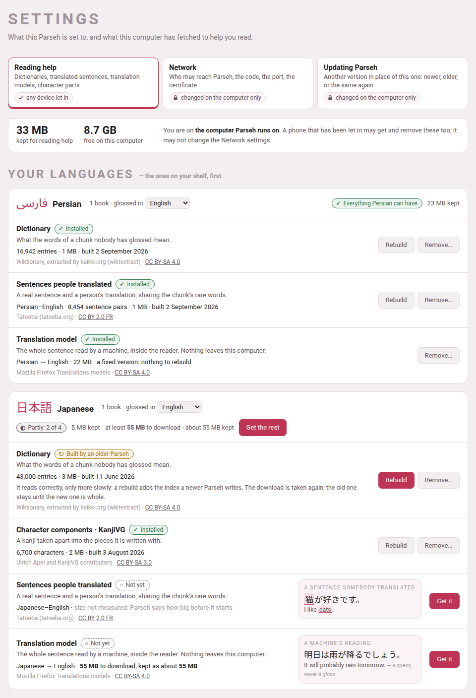
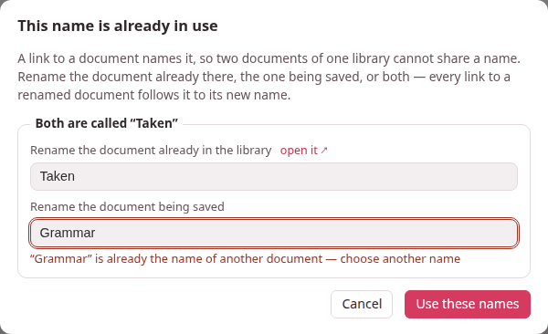
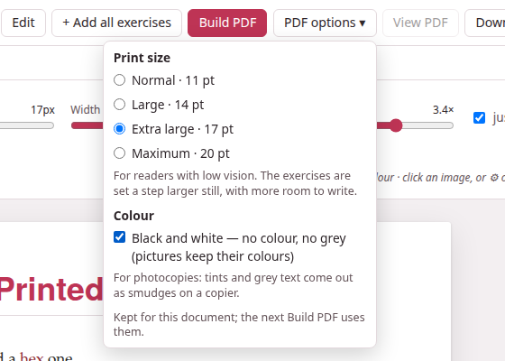
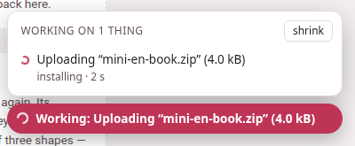
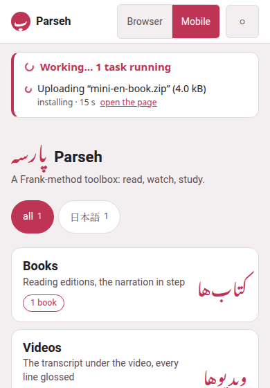

Every version of Parseh, the newest first, with the day it was released —
the one still being made says *not yet released* — and under it what it
brought: a line or two on each thing, and a link to the page that explains
it in full. The version you are running is written at the foot of the
[hub](../getting-started/the-hub.md#the-foot). `CHANGELOG.md`, at the top
of Parseh's folder, lists the same versions in fewer words, change by
change. A new version comes in from **Settings → Updating Parseh**
([Updating Parseh](../getting-started/updating.md)), which compiles this
guide and rebuilds the readers by itself.

## a0.4.4 — not yet released

### Parseh has a home of its own on GitHub

Parseh's repository moved to the **parseh-io** organisation
(`github.com/parseh-io/Parseh`). Nothing you keep changes. **Settings →
Updating Parseh** now asks the new place for the newest release; a Parseh
from before the move asks the old address, which GitHub sends on to the new
one, so it finds this release too — and when it cannot, **A zip of your own**
takes the release's zip by hand. See [Updating Parseh](../getting-started/updating.md).

### The guide at parseh.io/guide

The guide has an address of its own, <https://parseh.io/guide/>, under a slim
bar with Parseh's logo that leads to **parseh.io**, Parseh's site. A page
exported from Parseh now links there in its foot, for good; a page exported
before this version still says the old `github.io` address, which no longer
answers. The guide installed with Parseh is read from your computer and is
unchanged. See [This guide](../getting-started/this-guide.md).

On Android, Chrome offers to install Parseh with Parseh's own icons again: they
had been named at an address that stopped answering when the guide was
published another way, and an app whose icons cannot be fetched is not built.

### A friendlier Settings

**LLM Integration**, **LM likelihood** and **About** had lost their stylesheet:
their forms were drawn bare and the links of their feet ran together. They look
like the other doors now, and end in a foot like theirs, with the links that
reach the guide. On **Speech to text** the **Whisper program** is the first
thing on the page, since every model runs on it. **About** adds a few rough
numbers for the pleasure of it — cards answered, videos and books on the
shelves, and since when Parseh has been here — counted from what is on the
computer, with nothing recorded. See [About Parseh](../getting-started/about.md).

### a0.4.2 and a0.4.3 come with it

Those two versions were finished and not released on their own: this release
carries both, and their entries follow.

## a0.4.3 — 5 October 2026

### More Whisper models

**Settings → Speech to text** lists standard and language-specific Whisper
models, filters them by language, and remembers a preferred installed model for
each language. Persian and Hindi have separate fast and accuracy-oriented
choices. Models install independently, with cancellation, resume and verified
files; these labels do not guarantee better recognition on every recording.

See [Speech to text](../lookup-and-languages/speech-to-text.md).

### A transcript workspace with reusable tools

Transcription now opens straight into editing, with no review-method gate.
Try correction tools on the same pending draft, keep manual edits and locks,
and use the transcript when ready. **Settings → Speech to text** has an
**Automatically run a second Whisper pass** checkbox; the second pass can
also run later for remaining suspect words, a section, or one selected word.
It adds audio-based alternatives without changing original text or timestamps.
See [Adding a video](../videos/adding-a-video.md#speech-to-text).

### Check, pause and continue a transcript

Select a section or review one word with LM likelihood while keeping the full
surrounding context. Lock checked words before another review, or choose
**Select best for all** to put the latest method's first choices into the
pending draft. The similar-sound filter starts enabled and can be turned off
for another pass. **Save & pause** keeps the review on disk; **Continue pending
transcription** on Videos restores it after a browser or server restart.
Settings and ordinary review controls are shorter, with technical details
folded away. **Settings → About** shows version, installation information and
the locations of `serve.sh` and the Windows launcher. See
[LM likelihood](../lookup-and-languages/lm-likelihood.md) and
[About Parseh](../getting-started/about.md).

### Review a transcript before using it

Whisper results now open directly in the transcript workspace. Inspect low ASR
scores without sending text anywhere, or ask an already configured LLM for
validated word-level proposals; accept or reject them in a pending draft.
Only **Use this transcript** fills the box. **Settings → LLM Integration**
adds a reusable OpenAI-compatible connection, Ollama/Unsloth/generic presets,
served-model discovery, remote model selection, local credential controls and a connection test.
Short sentence replies, word-count progress, local failure recovery, a single
retry action, keyboard word edits and inspectable LLM responses keep review
under your control. A downloadable correction skill can be installed and
invoked through Unsloth's Agent Skills API.
Saved Studio share links load installed model variants/options through the API.
Separate review models and skills support a whole-text check, including confident
Whisper words and spans split across ASR pieces. See
[LLM Integration](../lookup-and-languages/llm-integration.md).
Word playback pauses shortly after the selected span. Installed dictionaries
add a separate suspect-word cue using the readers' base-form rules, and the
inspector compares meanings for the original, Whisper alternatives and proposed
LLM replacements.
The existing faster-whisper backend exposes native beam alternatives where
they map exactly to a source word, with sequence scores labeled separately
from word probabilities. The low-ASR-score threshold remains 0.5. An additional reasoning workspace
review gives a tool-capable model a temporary blanked transcript and CSV evidence,
first skimming unblanked text and then resolving numbered entries with isolated
Python. Its model selection is separate; existing review methods remain available.
Each of the three methods also supports an external chatbot through a copied
prompt and pasted answer. No configured endpoint is needed. Workspace review
can download its text/CSV files for an external service with file/code tools.
Imported proposals are checked and remain in the pending draft until accepted
and explicitly used.
An additional [LM likelihood](../lookup-and-languages/lm-likelihood.md)
method searches raw model probabilities for candidate words and ranks the original,
every Whisper alternative and those candidates using fixed original context.
Select installed GGUF weights separately from chat models. Its isolated CPU/GPU
worker reports numerical scores, candidate origins and incomplete coverage;
changes still require explicit acceptance and Use.

### Colour meaningful parts of a word

Studio can colour a stem, affix, radical or ending without splitting the
word. Select the exact letters and use the split **colour** control; another
selection may receive another colour, and **No colour** removes only the
selected part. Persian and Arabic keep their cursive joining, Unicode
graphemes stay whole, and the word remains one unit for copying, search,
glosses and its pronunciation cloud. The same colours reach the PDF and a
downloaded HTML page. Word clouds now contain linguistic annotations only;
colour is an authoring operation. See [Colours and
pronunciation](../dialect/colours-and-pronunciation.md#colouring-part-of-a-word)
and [the editor](../studio/editor.md#insert-at-cursor).

### Exact word times while adding a video

Speech to text can now keep the word boundaries it heard while you correct a
transcript. Settings offers an optional, per-language exact-word-time network:
it is local, hash-checked before it is installed, and leaves Whisper's captions
unchanged. The add page remembers whether to use it; Whisper still works when
it is absent or switched off. The editor uses a recorded word at a new caption
boundary, preserves a start you set yourself, offers undo and redo, and can
tidy from ordinary text cues or from recorded pauses. The captured audio is
not retained. See [Speech to text](../lookup-and-languages/speech-to-text.md),
[Adding a video](../videos/adding-a-video.md#speech-to-text) and
[Mending the transcript](../videos/mending-the-transcript.md).

### Target-language cards stay in reading order

A Markdown or exercise-deck card made from a book or video now marks its
target and every context line as target language automatically. This keeps
right-to-left punctuation and line wrapping in their correct reading order;
Anki cards and fields that already contain markup stay unchanged. See
[the reader](../books/reader.md#making-a-card).

### Keyboard skipping in Mobile mode

On a keyboard, Mobile mode's ← and → now do the same chosen-seconds move as
↺ and ↻. Shift keeps a book reader's subparagraph keys, while a video skips.
See [Mobile mode](../getting-started/mobile-mode.md).

## a0.4.2 — 30 September 2026

### The meaning under a phrase is a gloss

When an LLM glosses a stretch, each phrase's meaning now says what *that*
phrase says, in the order of the text, instead of a fluent translation of the
sentence cut into as many pieces as there are phrases. Every gloss prompt
carries the rule, with an example: see [What the meaning
says](../books/glossing-with-an-llm.md#what-the-meaning-says) for a book and
[the same for a video](../videos/glossing-with-an-llm.md#what-the-meaning-says).
Glosses an LLM wrote before a0.4.2 may not be aligned: **re-gloss** redoes a
stretch.

### One prompt kit, and a row of controls for it

Every prompt Parseh hands to a chatbot is assembled from three parts (the
instructions, the answer contract, the data), opens with a line saying which
prompt it is and which Parseh made it, and each page that copies one now says
how long it is before you copy it. The buttons around a prompt are one row,
drawn once, on the studio's prompt page, the exercise dialog, the add-a-video
page, the transcript tidy, the player, the reader and Ask LLM. A reader built
before a0.4.2 shows the new row after **rebuild the reader**.

### A video's vocabulary in the books' entries

A video's vocabulary line may now use the books' entries (`\dw`, `\vb`, `\bw`,
`\pw`), drawn as the reader draws them, and the prompts for a video ask the
chatbot for them (a plain line still works and looks as it did). The four buttons that insert them, in a book's chunk sheet and in a
video's ✎ form, say what they write and show an example. See [Editing a
phrase](../videos/editing-a-phrase.md).

### A book made by an agent, in place

A book can be made by an agent of your choice working in the book's own
folder, which Parseh makes for you: the library shows it as **being made**,
its reader shows the batches as they arrive, you steer it by writing asks, and
**Finish** ends the making. Nothing to copy into a terminal. The folder holds
`AGENTS.md`, the whole method (the tools with their full paths, the shape of an
annotation, the checks), made from the ten parts of one method, and the same
method as a project skill, so that any agent that can work in a folder can make
the book. Every device you let in can do all of it, bar opening the folder on
the computer's own screen; the text may be given **a part at a time**, a file or
pasted, and the agent takes each part before its next batch. You can write the
instructions again from the page. See [A book made by an
agent](../books/made-by-an-agent.md).

### Prompts of your own

Before **copy the prompt**, on every page that has one, a menu keeps the prompts
you write: one added after Parseh's, or one in place of it, for a language or
for all, saved and deleted there, with a line that says when Parseh's own has
changed since you started from it. **Settings → Your prompts** exports and
imports them as files. The LLM prompt page's Edit prompt, Save custom prompt and
Reset to default are gone: the menu does it, and the custom prompt you had is in
it as *my studio prompt (from before a0.4.2)*. See [Your own
prompts](../studio/your-prompts.md).

### The studio's prompt, in parts you tick

The prompt that asks a chatbot for a document is built from boxes you tick (a
short answer, a lesson, a vocabulary study, or your own set), with a level and a
length, and says its size as you tick; the exercise dialog ticks beforehand
what the page already uses and the exercise types you want. See [The LLM prompt
page](../studio/llm-prompt.md).

### The transliteration in IPA, and the short vowels

A prompt has options you set for that prompt: the scheme of the transliteration
(the language's usual one, or IPA) and, for Persian and Arabic, whether the
chatbot writes the short vowels. A book's or a video's own file keeps the scheme
it was made in, and an answer that only added the short vowels is written with
its gloss. See [Glossing a book with an
LLM](../books/glossing-with-an-llm.md) and [the same for a
video](../videos/glossing-with-an-llm.md).

### A worked example in every language's conventions

Each of the eleven languages' conventions now carries a worked example, one
vocabulary convention for books and videos, and its IPA variant, and the
sources sidebar's paragraph left the prompts for the guide. See [Adding a
language](../lookup-and-languages/adding-a-language.md).

### Skills for your chatbot

Parseh builds three skills on request, from the same parts as its prompts:
**parseh-gloss**, **parseh-markdown** and **parseh-book**. **Settings → Skills**
downloads them with the steps to install each in the tools that take skills, and
the row's **copy the request for the skill** copies a short request, a few lines
instead of the whole prompt. See [Skills for your chatbot](../studio/skills.md).

### A sound in a video's place

A recording, from a file or a link, can stand where a video stands: it plays in
the player with its waveform, keeps its timings, and travels in a bundle and a
backup like a video. See [Adding a video](../videos/adding-a-video.md).

### Notes on a video's phrases

The note a model leaves on a phrase can be edited or taken off in the ✎ form,
and a **✱ notes** button in the browser player lights every phrase that has one,
to see where an LLM may have flagged a doubt. See [Editing a
phrase](../videos/editing-a-phrase.md).

### Flashcards that turn

On a vocabulary or opposites flashcard the example, the notes and the source go
by default on the side the card turns to; a `-side` field and a box in the
exercise form say otherwise. See
[Flashcards](../dialect-exercises/flashcards.md).

### Pictograms (ARASAAC)

**Settings → Pictograms (ARASAAC)** fetches ARASAAC's pictograms and the words
that name them, only when you ask, with their licence said first and their credit
kept beside them. The studio does not use them yet. See
[Pictograms](../studio/pictograms.md).

## a0.4.1 — 29 September 2026

### Speech to text

Optional, local, and made on this computer. While you add a video, Parseh can
write its transcript with Whisper: nothing is sent to a speech-recognition
service and nothing is installed until you ask. It has a door of its own in
Settings, [Speech to text](../lookup-and-languages/speech-to-text.md), where
you get the program and one of two models — faster-whisper / large-v3-turbo
(recommended: faster and lighter) or large-v3 (higher accuracy, larger and
slower) — with what each costs said before it starts. The processor is a
separate choice: the CPU always works, and an NVIDIA graphics card is used
only when Parseh has proved it can be; the page says exactly what is missing
when it cannot (for this version of the program, the driver and cuBLAS for
CUDA 12 — cuDNN is not needed), and a button looks again. Any device that
has been let in may get, stop or remove it: only files Parseh pins, each
checked against its hash, can ever be fetched. Everything lives in the new
`stt/` folder, which updates and going back leave exactly as it is
([Updating Parseh](../getting-started/updating.md#what-it-keeps)).

On the Add a video page, once it is set up, the transcript step has a block
that writes the transcript for you: pick the model (only what is installed)
and how it is processed (Automatic, CPU, or an NVIDIA graphics card once it
is ready), and press Transcribe. A film on this computer is read straight
from its file, so nothing is played and any browser or device will do. A
YouTube video is loaded in a frame on the page and recorded through this tab
while it plays, in real time, from its beginning (Chrome or Edge on a
computer; the page says what you need to turn on, and says plainly when your
browser cannot). The words arrive in the transcript box, timed to the video,
ready to edit; the video is never added by itself, a transcript you wrote is
never replaced without asking, and a prompt you had prepared for an LLM is
taken away because it is out of date. A YouTube video that was recorded keeps
its waveform when you add it. Nothing is installed or fetched by opening the
page, pasting a transcript works exactly as it did, and a video already added
has none of this. See [Adding a video](../videos/adding-a-video.md#speech-to-text)
and [A film on this machine](../videos/a-film-on-this-machine.md#speech-to-text).
The recording of the tab is one piece of code now, shared by the waveform and
the transcript; and, on the way, after a waveform was drawn, stopping the tab
share no longer pauses the video or puts its speed back.

### Hover ⏸ in a book

A video has long had a switch, **hover ⏸**, that makes it wait while you read
a gloss. A book read aloud has the same now, in its reader on the computer
(beside **hover**) and on a phone (under ⋯, **Listening**). Turn it on and
opening a gloss cloud pauses the narration; it goes on a third of a second
after the cloud closes, so moving from one word to the next does not make it
stutter. A narration you paused yourself is never started by it, the
dictionary's sheet on a phone still waits it out once, and in **loop** the
silence between repeats waits too. It is off to begin with and remembered on
that device only. See [Playing and listening](../books/listening.md).

### Edit times by ear, where you are listening

While you listen and hear that the alignment was lost, you no longer have to
go through the narration panel to fix it. A book's header has a new button,
**edit times by ear**, right after **edit times**. It opens the sheet that
moves the boundaries over a picture of the sound, on the recording the text
is following and at the subparagraph you are on, so the boundary to move is
already in front of you ([Fixing the timings](../books/timings.md)). A
video's **the timings** does the same: it now opens at the caption under the
playhead instead of always at the first ([The timings](../videos/the-timings.md)).
A book built before needs **rebuild the reader** to get the button (an update
does it for you). Neither exists in the mobile mode, which never edits.

### Try again, and pages that are only slow

The page that says Parseh cannot be reached no longer looks as if Try again
did nothing: press it and it says *Trying…* while it waits, and if the computer
still does not answer it tells you when it tried; if you came from another
page, **Go back** is there too. And a page Parseh has not kept on this device
no longer says it cannot be reached just because the computer is slow to make
it: follow a link to a big document and the page you are on stays as it is
while the computer works, up to half a minute, for as long as the computer is
answering; then the new page opens. When the computer really answers nothing,
the message comes after about four seconds (two and a half when Parseh has
already said the computer is away), as before. A link opened where no Parseh
page is open, or from a tab behind another, has nobody to ask and still says
it early, and Try again on that page cannot wait for a slow computer: go back
and follow the link again from a Parseh page. Downloads made on demand — a
document's HTML page, its zip, a book's zip, a backup, an Anki deck, a deck's
export — were checked from another address with the app's worker in control,
with the computer made slow on purpose and stopped on purpose: they wait, say
what is being made, and say in words when the computer cannot be reached
([Parseh as an app](../getting-started/mobile-mode.md),
[Troubleshooting](../reference/troubleshooting.md)).

## a0.4.0 — 28 September 2026

### LaTeX drawings

What MathJax cannot draw — a reaction with `mhchem`, a molecule with
`chemfig`, a TikZ drawing, a plot — LaTeX itself draws now: in a block
between `::::latex` and `::::`, four colons, so that it may stand in a
Jolly card's field too, or inline, `[...]{latex}`, right inside a line of
prose or an exercise's option, sitting on that line's own baseline. Each is
compiled on its own and becomes one picture: the same drawing on the page,
in the PDF, in an HTML export and on a phone. A page never waits for them:
it opens at once, and the drawings not made yet come in under a bar. One that cannot be made shows
its source and a line saying why, with the button that mends it. The
editor has a sheet for writing one — its preview beside the source and
scaled to fill its pane, the drawing made as you type, a caption for a
block, size and position folded away unless you have set them — and **✎** on
a drawing opens it again. A block may carry a caption,
`caption="…"` in its braces, set under it as a picture's is. The guide
shows its examples beside what they draw, and the exercises have a page of
their own for them ([LaTeX in exercises](../dialect-exercises/latex.md)). A
drawing kept while you are
only trying it out is not kept for long: it is a document or an exercise
being saved that keeps a drawing, so trying a few before settling on one
leaves nothing behind ([LaTeX drawings](../dialect/latex-drawings.md)).

### Themes, in Settings

**Settings → LaTeX drawings**, in the same look as the rest of Settings,
keeps named themes: packages ticked from a list, the languages Parseh
teaches, a font, a preamble of your own, and the compiler. A fresh Parseh
has *default*, *chemistry* and *drawing*, and now also packages for
linguists and poets — syntax trees, dependency arcs, the IPA, pinyin over
Chinese characters. A theme is exported as a file and imported — its whole
preamble shown first; a rename says how many blocks name the theme, and
where, then rewrites every one. The same page gets the TeX packages a theme
needs into Parseh's own `texmf/`. A package a theme uses beyond the base is
Parseh's own even on a computer whose TeX has every package: a drawing uses
it only once Parseh has got it, and **Remove…** really takes it away. The
table lists every package the themes use — Parseh's own, each missing one
saying *Not installed*, what it costs and its own **Get it**, asked of the
TeX Live repository by itself and downloaded only when you press it, one at
a time; and the base, marked as coming with the computer's TeX, with
nothing to get or remove. **Edit** on a theme takes the page to its editor. **Forget drawings nothing uses** shows a bar while it works, and no
longer keeps the drawings of a deck sitting in the trash. The page also
sets how long a drawing may take
([Themes](../dialect/latex-drawings.md#themes)).

### Flashcards that are asked both ways

A flashcard's **Which side appears first** has two more choices beside
*Front* and *Back*: **Both (random)**, which draws the side each time the
card is shown — on the page, in an exported page, in a deck — and **Both
(repeat)**, which shows the front, with a small note under the card that a
deck will ask both sides, and in a deck becomes two cards, one asking each
way, linked to each other. Editing or deleting one of the two asks whether to
change both or only this one, which unlinks them; and once one side has been
answered the other waits until the next day. On paper both act as *Front*.
The exercise form, the deck's own forms and the card sheets of books and
videos offer the four choices, and the sheet's **⇄ both** now makes a real
pair ([Which side comes first](../dialect-exercises/flashcards.md#which-side-comes-first),
[a card in a deck](../dialect-exercises/in-a-deck.md)).

### A deck's exercises, filtered by where they came from

Beside a deck's text and tag filters, **Sources** narrows Browse to the
exercises one or more Markdown documents, books, videos or notes made — or
to the ones written in the deck itself. Each choice says how many matching
exercises it has, and the choices themselves narrow with the other filters,
so a source with nothing left to show is not offered
([Browsing a deck](../exercises/deck-page.md)).

### The transliteration cloud on an exported page

On a page exported for a website, pointing at a word of the target
language opens the cloud — its transliteration, the kana, the colours —
and what is changed there changes the open page only, and is gone with the
tab; the first click says once, at the top of the page, *Changes made here
are not saved*. The words of this guide that carry a transliteration or a
reading open the same cloud, each in its own language
([A page for a website](../studio/web-page.md)).

### The phone's video: the size of the subtitles

On a phone, the subtitles over a video on the whole screen have a text size
of their own, apart from the transcript's: an **Aa** button in the corner of
the whole screen opens it, and the subtitles grow or shrink at once while the
video plays. The size is remembered on that phone; the transcript's own size
keeps its slider on the first line of the header, where the book reader's
is ([Browser and Mobile](../getting-started/mobile-mode.md#the-videos)).

### Wider sliders for books and videos

The **Aa** sliders of a book and of a video reach about half as far again as
they did, at both ends: larger and smaller text and glosses, a narrower or a
much wider column, tighter and looser lines, and a reading from far smaller to
three times its size. Where one end would stop being readable, the extra
went to the other end ([The reader](../books/reader.md),
[The player](../videos/the-player.md)).

### An export to HTML, with a bar

**Download → HTML page, for a website (.html)**, and a deck's **Export selected
to HTML**, show a bar while the page is being made, however long it takes,
and save the file when it is ready. From another device the export could
land on *Parseh cannot be reached* if it was slow; it never does now, and a
failure is said in words with **Try again**
([A page for a website](../studio/web-page.md)).

### Deleting a document

The library's cross and the document page's **Delete document** ask in
Parseh's own window, as a deck's delete does, and the document leaves the
list at once ([The library](../studio/library.md)).

### Going back

Documents, notes, decks, bundles and shelves are kept in a new shape, since
a latex block may be in them: a0.3.3 does not know one. Going back says so
first, under *What may not survive going back*
([Updating Parseh](../getting-started/updating.md)).

### Settings, one bar on every page

Every page of **Settings** — Reading help, Network, Updating Parseh — starts
with the same bar of doors, the page you are on marked, each door saying who
may change what is behind it; moving from one page to another never needs
the hub. **Network**, the oldest of them, is laid out as the others now
([Other devices](../getting-started/other-devices.md)).

## a0.3.3 — 25 September 2026

### Estimate the next N seconds

On the sheet of a book's **by ear** and of a video's **the timings**, a small
box beside **estimate the rest** reads **the next [ ] s**. Type a number of
seconds in it — 90, or 1:30 — and the button becomes **estimate the next 90
seconds**: the same guess, **by the text** or **by the sound** as the switch
says, over a shorter stretch — from the line in hand to the boundary closest
to that many seconds after it, on either side, and that boundary stays where
it is. Nothing outside the stretch moves, and a shorter stretch is a shorter
wait by the sound. **E** runs whatever the button reads. Empty, it is
**estimate the rest**, as ever; a box that holds anything but seconds is
refused in words and estimates nothing. The number is not remembered: every
sheet opens on the rest. It is explained in full for
[books](../books/timings.md#only-the-next-few-seconds) and for
[videos](../videos/the-timings.md#only-the-next-few-seconds).

## a0.3.2 — 25 September 2026

### Updating Parseh from Settings

**Settings → Updating Parseh** puts another version of Parseh in place of
the one you have, and keeps everything that is yours: the books, the
videos, the documents, the decks with every answer ever given, the Anki
cards and clips, the dictionaries and models, your settings, the
certificate and the devices you let in. **Check now** asks GitHub for the
newest release, and **Download** fetches it, checked against its checksum;
or choose a release's zip you already have. **Look once a day** asks by
itself, and is off until you tick it.

Before anything happens the page says **which way it goes** — newer, older
(*going back*), or the same version again, all three allowed — which files
it writes and deletes, and any file of Parseh's that was changed by hand,
which is kept in a backup and listed. **A file of yours that an update
replaced** — one you had put where the new version ships a file of the same
name — goes back where it was, byte for byte, when you later install a
version without that name (going back, most often); the page lists it under
*Yours, put back*. Going back to a version that would
read some of your data in an older shape waits until you tick that you
understand, and copies the small files of your content first. While it
runs the page shows each step; afterwards the report stands at the top,
with **Back to where you were**. An update that fails puts everything back
and says in words which step it stopped in and why, with the technical line
beneath in small type. An update that is interrupted is finished
or undone the next time Parseh starts. Only the computer installs one: a
phone may look, and is told why it may not. A Parseh installed before this
version cannot update itself yet — install this one afresh from its zip,
once ([Updating Parseh](../getting-started/updating.md)).

**The app on a phone is told.** The next time it reaches the computer it
takes the new version and says so once, in a line at its foot — *Parseh
was updated to*, and the number — and nothing you kept is lost. *Change
what is kept* calls the files an update changed *updated*, not damaged,
and fetches nothing again for them
([Browser and Mobile](../getting-started/mobile-mode.md#the-books)).

### Releases, and the version on the hub

Each version of Parseh is now a **release** on GitHub: one zip,
`parseh-<version>.zip`, holding the program and nothing else — no tests,
no content — with a list of its own files inside, which is what an update
reads. That zip is how Parseh is installed now
([Installing Parseh](../getting-started/installing.md)). And Parseh says
**which version it is**: at the foot of the [hub](../getting-started/the-hub.md#the-foot)
(on a phone, on a line of its own at the very foot), on **Settings**, and
in the first line the server writes as it starts. A book or a video
downloaded as one file names the version that wrote it.

### The reading help moves into Settings

The page that fetches dictionaries, translated sentences, translation
models and character components is now **Settings → Reading help**, at
`/settings/reading-help/`. The old address still opens it, so a reader
built before, or a page kept on a phone, needs no rebuild.

{width=90 align=center}

It is laid out **by language**: a card for each language on your shelf,
saying what it has and what it could have, with **Get everything** and what
that costs; the other languages one line each; and a card for what they
all share. Each row's state is a sign and a word — *Installed*, *Built by an
older Parseh*, *Not yet* and the rest — with the licence of what it holds
and, not yet installed, a small example of what it would add. Sizes are said
**before** anything is fetched, and nothing starts that the disk has no room
for. A download shows a bar with **the time left**, has a **Stop**, and
**carries on** from where it stopped. **Get everything** runs on the
computer, one download after another, so a phone may lock its screen.

**Who may change what** is now a property of each setting: one that decides
who may reach Parseh, what it exposes or what it runs is changed on the
computer only. So a phone let in may get and remove a dictionary, but not
touch **Network** or update Parseh — each says why, with a lock — and the
pairing code is shown on the computer alone
([The reading-help page](../lookup-and-languages/reading-help.md),
[From a phone or another computer](../getting-started/other-devices.md)).

### A language you add is yours

A language added with `lib/newlang.py` is kept in `config/languages.json`,
beside your settings, where an update cannot take it away, and its Anki
note types take ids Parseh's own languages never use
([Adding a language](../lookup-and-languages/adding-a-language.md)).

### Only Parseh's own pages change anything

A page on another site, open in the same browser, could make the browser
send Parseh a request that changed something — stop it, delete a book,
empty the clip tray. Now anything that changes Parseh must come from one of
Parseh's own pages; any other request is refused, in words, and changes
nothing. Reading is as it was: a link from anywhere still opens a Parseh
page, and `./serve.sh stop` still stops it
([Troubleshooting](troubleshooting.md#starting-parseh-and-installing-it)).

### Offline only when the computer is really gone

Parseh says **offline** only when it is sure the computer cannot be reached:
at once when the phone has no network, within a few seconds when the
computer refuses, and after 45 seconds of silence when it answers nothing at
all — which is what a computer that is off or asleep looks like over
Tailscale. A slow answer is never offline: while one is late, a quiet
**checking…** stands where the chip would and everything goes on as usual.
**Refreshing a page always asks again** — the browser's reload, a pull down
from the top, or the new **↻** beside the *offline* chip, which in the app
on an iPhone or an iPad, with neither of the other two, is the only refresh
there is ([Browser and Mobile](../getting-started/mobile-mode.md#the-books)).

### Estimating the rest by the sound

**estimate the rest** (**E**) — on the sheet that moves a book's boundaries
by ear, and on a video's **the timings** — has a switch beside it: **by the
text** or **by the sound**. **by the text** is the guess it always made, a
slice of what is left for each piece in proportion to its text. **by the
sound** reads the picture of the sound instead and puts each boundary in a
pause it shows, where the length of the text allows, following the pace of
the speech as it changes. It hears where the voice stops and starts, never
which word is which: a better first guess to correct by ear, not an
alignment. When it is done it says how many boundaries sit in a pause it
heard. It takes a few seconds for an hour of recording, and up to about a
minute for four; meanwhile **stop estimating** (or Esc) gives the wait up
and keeps whatever you moved by hand.

It needs a picture of the sound, and is greyed where there is none, saying
why: on a YouTube video, draw the sound first; a book's reader built before
it gains it with **rebuild the reader**. It also needs one more package,
NumPy, which the installer adds, and so does an update from Settings that
brings it. The choice is
remembered in this browser, for books and videos alike
([Fixing the timings](../books/timings.md#estimate-the-rest-by-the-text-or-by-the-sound),
[The timings](../videos/the-timings.md#estimate-the-rest-by-the-text-or-by-the-sound)).

### A page for a website opens on Sepia

A document, or a deck's exercises, exported as **one HTML page** now opens
on **Sepia**, the warm paper made for reading, whatever the studio was
showing when you made it and whatever the student's computer or phone
prefers, even opened straight from the disk. That is only where it starts:
**Aa** still offers **Paper**, **Sepia** and **Dark**, and the page forgets
the choice when its tab is closed
([A page for a website](../studio/web-page.md#what-the-page-has)).

### The dictionary in a sheet, on a phone

On a phone, the dictionary no longer opens inside the gloss cloud, where it
was a small box scrolling inside the page and over the word. It rises from
the foot of the screen in a **sheet**, as *Keep on this phone* does: as tall
as the entry, up to most of the screen — even under a video pinned at the
top — and only the sheet scrolls. The word you looked up stays marked:
where there is room above the sheet the page moves it there, and where there
is not the sheet covers it, and closing the sheet shows it again. Each
word's senses are
**numbered, one to a line**, its part of speech a small label beside it; and
Persian, Arabic and every other language are set in their own type and
direction. **Swipe it down, tap beside it, or go back** to close it, and
nothing is left open. A video, or a book being read aloud, waits, paused,
while it is up; on the whole screen the sheet covers the subtitles, and
going back closes the sheet and leaves the video where it was.

The gloss cloud is the gloss, as it always was, and a chunk is glossed when
anything is written under it — a meaning, a transliteration or a vocabulary
line: it opens its gloss beside the word, and **dictionary**, beside *copy*,
opens the sheet. With the dictionary switched on, only a chunk with nothing
written under it opens the sheet at a tap, with no cloud. And a book or a
video with **few glosses** — fewer than half of all its chunks — shows which
chunks are glossed, so you can tell which a tap will gloss: where every
phrase already has a faint dotted line (a video's transcript, a book's first
pass in hover mode) the glossed ones have it darker, elsewhere in a book the
glossed chunks get a faint dotted line, and over the whole-screen subtitles
the glossed phrase's line is almost white. The cloud's **copy** and
**dictionary** are a finger's size now; a video's cloud on a phone no longer
offers the colour marks, which wrote into the video, and its transcript no
longer shows the **+** between captions that writes a note
([Browser and Mobile](../getting-started/mobile-mode.md#the-dictionary-on-a-phone)).

## a0.3.1 — 24 September 2026

### A blank's cloud in the browser too

A fill-in's blank and a matching exercise's box open **the cloud of the
bank's words** in the browser interface as well, as they do on a phone: click
the blank, then the word. Dragging is still there, and so is a word clicked
and then its blank — which puts the word there and opens no cloud. On a
document's page, in a deck, and in a page exported for a website
([Placement](../dialect-exercises/placement.md#moving-the-blocks),
[Matching](../dialect-exercises/matching.md#on-the-page)).

### The lines around a subtitle, and the dictionary under any gloss

On a phone, a video on the whole screen can show **the caption before and
the caption after** the one being said, above and below it in the same
cloud, a little smaller and greyer; every phrase in them opens its gloss at
a tap. The button beside the ⛶ in the corner turns them on and off, and the
choice is kept. And the gloss cloud of a book and of a video has
**dictionary** beside *copy*: it opens the dictionary for a phrase that has
a gloss too, which the cloud never did by itself — and, a version later, in
a sheet of its own ([The dictionary in a sheet, on a phone](#the-dictionary-in-a-sheet-on-a-phone);
[Browser and Mobile](../getting-started/mobile-mode.md#the-videos)).

### Flashcards to cut out and fold

In a document's PDF a flashcard is **a card to cut out and fold**: a frame
with round corners, its front in the left half and its back in the right,
drawn as the page draws them — the picture, the recording, the main field
bold and the others grey — and a dashed line between the two to fold it on
([Flashcards](../dialect-exercises/flashcards.md#on-paper)).

## a0.3.0 — 23 September 2026

### A book that comes onto the phone by itself

On Android, in Chrome, **Keep on this phone** no longer needs you to stay on
the page. A book now comes by **the phone's own download** — its text first,
then its recordings — with Android's notification saying how far it has got,
and the button says *Keeping… 43% — you can leave this page*: go to another
page, close Parseh, lock the phone. **Cancel** on the notification stops the
whole keep and leaves what had come; a second book waits for the first and
says so; a book that needs, for a moment, more room than the phone has free
says so before it starts, with **Keep it anyway** and **Not now**. If it
finishes while Parseh is closed, the notification says so, a tap on it opens
the book, and the next page you open says it once at its foot. *Kept on this
phone* lists a book still coming as *coming — 43%*, with **Stop**. And a keep
that stops part-way keeps what had come and says why, each reason in its own
words: stopped, a file the computer no longer has, or no room.

**The button no longer goes back to *Keep on this phone* in the middle of a
keep**, on any phone: it says *Keeping…* until the keep is over. On the iPad,
and in a browser without that download of its own, keeping is as it was: stay
on the page until it says the book is on this phone
([Browser and Mobile](../getting-started/mobile-mode.md#the-books)).

### The videos and the studio's pages on a phone

The mobile interface ([Browser | Mobile](#browser--mobile), below) now has
**the videos and the studio's pages** too: a shelf of **channels**, with a
channel's videos one tap inside it — the browser's own shape, instead of one
long list of every video of every channel — the player itself with its
transcript and glosses (the video at the left and the transcript at the right
when the phone is turned, with a divider you drag, and a full-screen button
that lays the line being said over the video — tap a phrase in it and its
gloss opens), and the studio's library and documents, to read, with their
exercises still answerable.

**The narration is moved from the foot of the screen.** ↺, ⏯ and ↻ float in
the corners a thumb reaches, with the speed beside them; they fade when you
stop touching the screen. Hold ↺ or ↻ to choose how far they carry (1 · 2 ·
5 · 10 · 15 · 30 · 60 seconds — one and two for going back over the phrase
you have just heard, in a video as in a book), and tap the speed to choose
how fast the narration plays. The computer's reader has ↺ ↻ now too, with **Shift+←** and
**Shift+→** — and **the speed no longer falls back to 1× by itself** when the
recording changes. The controls **keep their order in a book that reads right
to left**: time does not run backwards in Persian, so ↺ stays behind and ↻
stays ahead, wherever the words go. ⏯ shows **‖** and **▶** — the marks the
rest of Parseh uses, and not the one an Android phone drew as an orange
emoji. **A video keeps its own speed** now, apart
from a book's — watching and listening are different habits — and the speed
you tap is the speed shown **at once**, instead of a change late.

**The whole screen, on a video, is Parseh's own.** ⛶ used to hand the screen
to YouTube's frame, which took it whole: no subtitles could be drawn over it
and the way out was a bar that would not answer. Now the **page** goes full
screen and Parseh lays the video out on it — the picture on black, the line
being said at its foot, the controls where your thumb left them — and there
are **three ways out**, so nobody is shut in: the ⛶ in the corner, your
phone's back gesture, and a tap on the black beside the picture. A tap on a
word of the subtitle opens its gloss **over the subtitle**, where your finger
is. Where a phone refuses the whole screen, you get the same layout with the
browser's own bars, and it says so rather than doing nothing.

**A finger reaches what a key reached**: hold a finger on a word for *Card for
“word”*, *Copy the chunk*, *Copy the sentence*. And a **?** in the bar, on a
phone or a tablet, says what any button does when you tap it — the
explanations that only a mouse could read before.

**Parseh keeps your place.** The reading place of each book, the narration's
speed, the gap, the seconds and the theme are the computer's now, so a phone
goes on where the desk stopped — and it never moves you without asking.

### With the computer away

**It works with the computer away.** Keep a book, a video, a deck or a
document **on this phone**, and it opens, reads and plays with the computer
asleep, off, or a train away — the narration seeks as it always did.
*Kept on this phone* lists what you keep and gives the room back. Studying a
deck away is a **check-out**: take the deck out, study it on the train, and
every answer is sent home and scheduled as soon as the computer is there
([the mobile pages](../getting-started/mobile-mode.md)).

**Keeping was mended where it had never really worked.** A kept book would
open half-drawn in airplane mode and stop: one script every reader loads was
in no list, and the page never reached its text. A kept deck never showed an
exercise, because its exercises were asked for in a way no phone is allowed
to keep — now they come **with the deck**, with their pictures and their
recordings, one tick and nothing to choose, so *Cram all* works on a train.
A fully narrated book offered you no recording to keep at all where its
narration was written the older way, or was a `.webm`. And a kept book played
to the times it was built with rather than the ones you had corrected.

**A tick now means the file is really there.** *Change what is kept* looks at
**every file on the phone** before it draws a tick — the computer sends a
checksum with each one — and says so: *Looked at file by file: what is ticked
is whole on this phone.* A download cut off by a tunnel, or a refusal the
phone kept by mistake, is **unticked** and says *kept, but no longer whole —
tick it to fetch it again*. Beside it, *Change what is kept* and *Remove from
this phone* now share one line, half each. The recordings in that list say
**which chapters and sections** they cover, not only their paragraph numbers,
and the lines are narrower and against the left so there is room to scroll
with a thumb.

**And Parseh remembers that the computer was away.** Open a page after one
that said *offline* and it starts offline too, instead of pretending for a
few seconds that all is well. It still asks every time and puts itself right
at once if the computer is there.

**And the app says when it is ready.** Installing it puts the icon on the
home screen at once; Parseh then fetches the pages it needs to open with the
computer away, and says how far it has got — **Getting ready — 12 of 46** —
on the install page, which says **Ready** when they are all there, and on the
mobile hub, which says nothing once there is nothing left to fetch. On the
hub that line stands **at the foot, under the doors**, so it never pushes
them down and lets them spring back under your thumb
([Parseh as an app](../getting-started/mobile-mode.md#parseh-as-an-app)).

### Settings, and a phone let in with a code

The hub has a **⚙ Settings** door, and its first page is **Network**: who
may reach Parseh — this computer, a VPN, the Wi-Fi — the port it answers on,
and a certificate of your own, each changed with a button and taking effect
at once, with no terminal. A phone on the Wi-Fi is **let in once**, with a
short code shown on the computer
([Who may reach Parseh](../getting-started/other-devices.md#who-may-reach-parseh),
[Letting a phone in](../getting-started/other-devices.md#letting-a-phone-in)).

### Notes open at once, keep a folded run, and travel with the book

A note used to open the studio's whole document page inside the reader —
editor, scripts and all, about a megabyte of them, every time, and again for
every book. Now it opens as **the note and nothing else**: the studio's own
sheet, with its face, its colours and its marks, and no machinery behind it.
The reader and the player also **fetch the notes within a screen of where you
are**, so a mark opens the moment you press it, even from another room over a
slow connection. **Open in the studio** is in the window's head when the full
page is wanted, and a note that **holds an exercise** opens that full page
straight away, so nothing unanswerable is ever shown.

**A folded run no longer swallows its notes.** Folding a run of paragraphs
hid the seams and the marks in them. The fold bar now carries **a row of the
marks of every note inside the run** — the first three, then *+N more* — and
the row goes away when you open the run.

**And your notes go onto the phone with the book.** Keeping a book or a video
used to keep the text and the recordings and leave every note you had written
behind, so on a train each seam opened on nothing. *Keep on this phone* now
has **one line for all of them** — *its notes · 34 · about 280 kB* — ticked
unless you untick it: the marks are in their seams, the notes open looking
exactly as they look at the desk, and one that holds an **exercise** can be
answered away from the computer. The pictures in your notes come with them;
their recordings are a line of their own beside the narrations, so nothing
heavy is kept by surprise. Write a note at the desk afterwards and its mark is
there the next time the phone can reach the computer; delete one and the phone
gives the room back the next time you save that list, saying how many first
([Notes in the seams](../books/notes.md),
[Browser and Mobile](../getting-started/mobile-mode.md)).

### A frame off a film, and a video that will not play

**A film on this machine gives its frame straight away.** The picture is read
off the film itself, so there is no question about sharing the screen, nothing
to allow and no window to keep in view — and it works on a phone as on the
computer. A **YouTube** video's frame is still taken from a share of this tab,
which is a computer's affair: no phone browser shares a tab, and on a phone
the button now says exactly that instead of failing for a reason that was
never the real one
([Recordings and frames](../cards-and-anki/recordings-and-frames.md)).

**A video YouTube will not play says why.** A video that is gone, private, or
whose owner does not allow it to be played outside YouTube used to leave an
empty black box; now it says which of those it is, and what you can do.

**And it no longer says that on a phone that is online.** The player used to
put up *the video needs an internet connection* after six seconds, whatever
had really happened — and on a phone it happened often, because the app had
started fetching its own pages the instant any page loaded and was taking the
bandwidth YouTube's player needed. The fetching waits for the page now, and
keeps out of its way; the player waits for the video's own answer, gives it a
real chance, and then says what actually went wrong, with **Try again** and a
way out to YouTube.

### Picking a part of the book

The fold sheet, the sections sheet and a recording's **covers** used to
offer every paragraph of the book — or every subparagraph — in long lists,
twice over. They now show the book as an outline: its chapters, their
sections, and their paragraphs by number and first words. A click takes a
whole chapter, section or paragraph; **Shift**-click, or **stretch it to…**,
takes everything in between; and the pick is said in words (*chapter 2 · The
Wind · 14 paragraphs*). In the sections sheet you pick what you want to
name: a chapter, a paragraph, or a section's heading to rename or remove it.

What a recording covers is now written with its chapter (`2:1.1`), since
every chapter has a `1.1`. A recording of chapter 2 used to answer for
chapter 1's subparagraphs of the same numbers too. A recording saved before,
without the chapter, is read from its first label to the first matching
label after it — so in a book whose chapters each number from 1, a
recording of chapter 1 stays in chapter 1, where it used to run on into
every later chapter. See [Picking a part of
the book](../books/contents.md#picking-a-part-of-the-book).

### Licences

The foot of the hub, in both interfaces, now leads to **Licences**
(`/licences/`): what Parseh is under — the GNU GPL, version 3 or any later
version — with the licence's text, and, work by work, the fonts, MathJax
and the data the reading help downloads, each under its own licence. See
[Licences and credits](licences.md).

### These pages are the whole manual

The PDF manual that came before these pages is gone: they are the whole
manual now, and its old address, `/guide.pdf`, opens them instead
([This guide](#this-guide), below).

### Glossing a stretch with an LLM

A book's reader has **gloss with an LLM** in its header (and **gloss around
here with an LLM…** in the chunk sheet), and a video's player the same in
its bar. Pick a stretch — subparagraphs in the book's outline, or a first
and a last caption clicked in the transcript — and **copy the prompt**: it
carries the stretch as it stands, the chunks nobody has glossed marked to
do, the glossed ones as context, and the language's own conventions. Paste
the chatbot's reply back and press **fill from the answer**: the chunks are
written one by one, through the same door as a hand edit, and the report
says what was **filled**, **completed** and **replaced**, and what was
**kept**, **dropped** or left **unanswered**.

What is already glossed is never changed by an answer, whatever it says:
Parseh works that out itself, from the files as they are when you paste.
Two checkboxes widen it — **re-gloss what is already glossed** (which asks
you to press twice before it replaces anything) and **also fill the empty
boxes of partly glossed chunks** (which asks for every empty box of a chunk
that has a gloss, a vocabulary line left empty on purpose included) — and
an answer never writes half a gloss.
See [Glossing a stretch with an LLM](../books/glossing-with-an-llm.md) and
[Glossing captions with an LLM](../videos/glossing-with-an-llm.md).

### Deleting a gloss

**delete gloss**, in the chunk sheet and in the player's ✎ form, takes a
chunk's whole gloss off in one click — the text, the colour and the word
line stay — and **undo delete** puts it back, for as long as the page is
open. A deleted gloss counts as no gloss, so the next LLM prompt asks for
it: delete, copy, paste is how one chunk is glossed again. See
[Deleting a gloss](../books/writing.md#deleting-a-gloss) and, in the player,
[Deleting a gloss](../videos/editing-a-phrase.md#deleting-a-gloss).

### A blank gloss is legal everywhere

A chunk nobody has glossed used to be legal only in a book or a video
marked a draft, by a line in its `book.json` or `video.json` that had to be
taken out by hand at the end. There is no such mark any more: a blank chunk
is legal in every book and every video, for good. The checkers count blank
chunks in one note (*3 of 12 chunks have no gloss yet*) and list a chunk
half glossed as an error. The chunk sheet and the ✎ form save a gloss one
box at a time, and refuse only to empty, on its own, a box the language
requires — emptying every box is **delete gloss**. A cut or a join may leave
halves blank or half glossed, and a video bundle brought back with a half
glossed phrase is taken in, with a note. The **draft** tags on the cards and
the **draft** marks in the reader and the player are gone; a `"draft": true`
still in an older file is simply not read. See [Glosses still to
write](../books/adding.md#glosses-still-to-write) and [A video still being
glossed](../videos/video-info-and-drafts.md#drafts).

### A page for a website

A document, or a deck's chosen exercises, can now be **one HTML file** to
put on a website for students who have no Parseh, or to send: **Download ▾
→ HTML page, for a website (.html)** on a document's page, and **Export
selected to HTML** beside **Cram exercises** on a deck's page. The file
works with no server behind it, even opened from the disk. A document's
exercises can be answered and checked; a deck's page crams its exercises
as the cram page does. Pictures and recordings travel inside the file, a
clip cut down to its stretch where ffmpeg is installed, and a video stays
YouTube's player (which plays only on a website: opened from the disk, a
line under it says so and opens it on YouTube). **Aa** sets the size of the text and the theme. The page
holds none of the Markdown and nothing that edits, keeps nothing and sends
nothing, and its foot says it was exported from Parseh, with links to
Parseh on GitHub and to this guide. See [A page for a
website](../studio/web-page.md) and [Cram mode](../exercises/cram.md#as-a-page-for-a-website).

## a0.2.0 — 22 September 2026

### The books and the exercise decks on a phone, and as an app

The hub was the first mobile page; the books — a shelf, and every book's
reader as a reader only, with **↺ ↻** to move the narration by ten seconds
(or as many as you set) — and the exercise decks have followed: a cram of
your own picked from a deck, by tag or one by one, and **Next** in the very
place **Check** was. Every mobile page is made for a phone held sideways as
well as upright. And the mobile interface installs **as an app**: an icon on
the home screen, the whole screen for the page, no address bar
([Parseh as an app](../getting-started/mobile-mode.md#parseh-as-an-app)).

On a phone, a fill-in's blank and a matching exercise's box are filled the
other way round: tap the blank or the box, and a cloud offers the words of
the bank below ([Placement](../dialect-exercises/placement.md#moving-the-blocks),
[Matching](../dialect-exercises/matching.md#on-the-page)).

### Cram mode's Skip, and how it went

Cram mode has **Skip** too, as studying has, and its end now says how it
went and lists the exercises you got wrong at least once and the ones you
skipped — each shown solved at a click, and crammed again at one
([Cram mode](../exercises/cram.md#the-end)).

## Before a0.2.0

What was new when Parseh was first published, on 21 September 2026, before
it had a version number.

### Links between documents, by name

A link from one studio document to another used to name the target by a
code nobody could read. It now names it by its **name** — its title,
exactly as its `title:` line spells it:

```markdown
[the companion piece](doc:Verbs of motion)
[](doc:The shape of a Persian word)
```

The second, with nothing between its brackets, shows the other
document's title as it is now. What follows from that:

- **Names are unique.** No two documents of one library — the studio's,
  or the notes of one book or one video — share one. Whenever a save, a new document, **Paste LLM answer**,
  **Upload .md / .zip** or **Load from backup** would take a name already in
  use, nothing is written and a dialog opens, *This name is already in
  use*, with a field to rename the document already there, a field to
  rename the one coming in, or both. A name still taken is said under its
  field, and the dialog stays open.
- **Renames follow into every link.** As in Obsidian, change a document's
  title and every link that named it — in other documents, in itself, in
  the exercise decks — is rewritten to the new name, its shown text kept.
- **A link to a deleted document is left hanging.** It is drawn red and
  dashed, and works again the moment a document of that name exists — made,
  uploaded, restored or renamed.
- **↩ Linked from (N).** Beside **☰ Contents** on a document's page, it
  opens a drawer listing every document that links to this one, each with
  a few words around the link.
- **Doc link…** in the editor writes the link for you. Links written the
  old way still work, and were rewritten by name the first time the server
  met each library — the studio's when it started, a book's or a video's
  notes when they were first opened.
- **Two documents that shared a name were told apart then too.** Nothing
  forbade it before — a book's notes were all called *A note* — so that
  same first time, the oldest kept the name and each later one got a
  number after it, in its header: *A note 2*, *A note 3* and so on. A
  title that suddenly ends in a number is one of those: rename it as you
  like.

{width=100 align=center}

All of it: [Names and links](../studio/names-and-links.md).

### The enlarged flashcard

**⤢ Enlarge** on a flashcard opens the same card over the page, laid out
exactly as it is on the page — every field where it sits there, a
right-to-left paragraph on the right, a Latin block to its side, every
line breaking where it breaks there — and then magnified as much as the
window allows. On a phone it is laid out a little narrower instead, so it
can be up to twice as large, though a line that is whole on the page stays
whole: only a paragraph that already wraps there may wrap at other words.
A click, Space or Enter turns it; Escape closes it. See
[Flashcards](../dialect-exercises/flashcards.md) and
[Studying](../exercises/studying.md).

### The RTL editor

For a document whose prose is a right-to-left language — a Persian
teaching English to Persians — **⇤ RTL editor** in the editor's bar sets
the whole source right to left, in the face of that language, every line
of it, a `prompt:` or `meaning:` with a Persian sentence included (a line
of Latin letters alone then reads as any right-to-left editor draws it);
**⇥ LTR editor** turns it back.
A document whose `lang:` is Persian or Arabic opens right to left by
itself, and the choice you make is remembered for each document. Only
the source box changes; the preview is drawn as before. See [Writing in
the editor](../studio/editor.md).

### Large print, and black and white

**PDF options ▾**, beside **Build PDF** on a document's page:

| Option | For |
|---|---|
| **Print size**: Normal · 11 pt, Large · 14 pt, Extra large · 17 pt, Maximum · 20 pt | Readers with low vision. Everything grows with the text, and the exercises a step larger still, with more room to write. |
| **Black and white — no colour, no grey (pictures keep their colours)** | Photocopies: the tints go white, coloured words print black. |

{width=95 align=center}

The choice is kept for each document, and the build badge says what a PDF
was built with (*17 pt · B&W*), and **built with other options —
rebuild** when the menu now says otherwise. Large print needs the TeX
package `extsizes`, which `./install.sh --pdf` installs (on Windows, your
TeX's package manager: MiKTeX Console, or the TeX Live Manager). See
[Printing to PDF](../studio/pdf.md).

### Exercises laid out for a pen

On paper, and only on paper:

- **Matching** — every entry of both columns in a frame of its own, the
  columns equally wide, with a gap between them for the line the student
  draws.
- **Construct the sentence** — the chunks in a row, each framed, and under
  them lines to write the whole sentence on: as many as it takes to hold
  one and a half times the sentence, measured as it is set.
- **True / false and yes / no** — each statement wraps in a column of its
  own, and the marks sit in a column at the right, level and aligned on
  every row.

See [Exercises on paper](../dialect-exercises/on-paper.md).

### Working…

Whatever takes a while — a book being built, an upload, a download being
packed, a backup, a restore, a narration being aligned, a studio PDF, a
dictionary being fetched — now shows on every page until it is over: a
pill in the corner says **Working:** and what, with **+N more** when there
are several. Click it for the list, each with its time, its progress where
it is counted and **open the page** it was started from; **shrink** folds
it to its spinner. The hub lists the same in a **Working…** panel under
its bar, and every stop button says what is still running before it stops
the server.

{width=70 align=center}

See [The Working… indicator](../getting-started/working-indicator.md).

### The size of “all of it”

A narrated book's **download** sheet now says how big each of its three
shapes is, and **all of it** counts every recording — a book read in nine
parts carries nine files — where it used to count only the first. A
reader built before this says the old figure until **rebuild the reader**.
The player's **⤓** says the same of a film on this machine. See [Taking a
book away](../books/download.md).

### Browser | Mobile

The hub's top bar has a new switch. **Browser** is every page as it has
always been. **Mobile** is a streamlined set of pages for reading on a
phone, with no editing on them: a single column, big doors with their
counts, the language chips in one row, and the guide — and nothing that
edits or administers. The choice holds on every page and after a reload.
The hub was the first mobile page; the others followed it, version by
version, above.

{width=60 align=center}

See [Browser and Mobile](../getting-started/mobile-mode.md).

### This guide

The hub's **guide** button opens these pages, at `/guide/`. The pages have
a list on the left, a search box that finds any word on any page, the
three themes, and working examples of everything the studio's Markdown can
hold.

- The installers compile the guide every time they run;
  `./install.sh --guide` compiles it alone.
- When Parseh serves it and the pages are missing, the front page offers
  **Compile the guide**; when they are older than their Markdown,
  **Compile the guide again**.
- Opened straight from the disk (`html-guide/index.html`), it needs no
  server at all.
- It can be published on GitHub Pages, and taken into a project of its
  own.

[Writing this guide](../writing-this-guide/_index.md) explains how the
pages are written, and [Compiling and
publishing](../writing-this-guide/compiling.md) how they are compiled and
published.

### New starter pages

**+ New** in the studio opens a new document on a page written afresh for
each of the eleven languages: a guided tour, in English, of everything a
document can hold — boxes, headings, target-language runs and blocks,
readings and colours, lemma headings, tables, footnotes, links by name,
formulas, pictures, a recording, a video, and one exercise of every kind —
with correct examples in that language. It ships with two pictures and a
short chime, which become the document's own when it is saved; delete what
you do not need. See [The library page](../studio/library.md) and [The
Markdown dialect](../dialect/_index.md).
