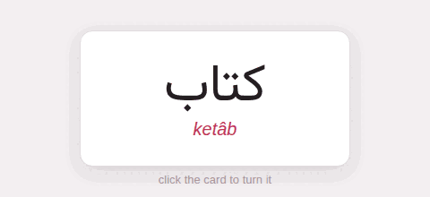
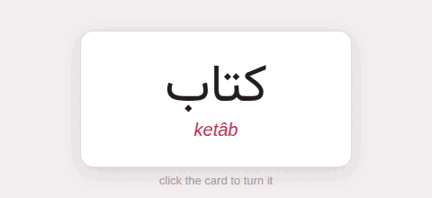

This page is a test as much as a page: it holds one of everything the
guide draws, so that a change to the engine, or to the studio behind it,
shows here first. Its target language is Persian, the studio's default;
[Writing this guide](writing-this-guide/_index.md) says how each piece is
written.

## Text

Prose in the page's language, with a Persian word in it, کتاب, found and
set right to left on its own, and [a marked stretch, with a PDF in it]{tl}.
**Bold**, *italic*, _italic again_, ~~struck~~, `code [x]{tl}`, a
[link to a page](writing-this-guide/markdown.md), a [link to a
site](https://github.com), and a note.^[A footnote, written in place.]

من کتاب را خواندم، و بعد به خانه رفتم.

[تو را من چشم در راهم ⏎ شباهنگام]{tl font=nastaliq bg=quote}

[تند]{teal} fast, [آهسته]{translit:âheste} slow, [کتاب]{#8E2B34 translit:ketâb} = *book*;
✗[کتابا]{tl} is wrong, ✅ [کتاب‌ها]{tl} is right; here -> there.

[A Latin paragraph laid out on its own: centred, tinted, narrower.]{la align=center bg=sage width=70}

## [کتاب]{teal} | ketâb | Arabic *kitāb* | = *book*

A lemma heading: the headword, its transliteration, its etymology.

## Blocks

> **A box.** It holds anything: a list,
> - [خانه]{tl} = *house*
> - [آب]{tl} = *water*
>
> and a formula, [e^{i\pi} + 1 = 0]{math}.

| Word | Transliteration | Meaning |
|:-----|:---------------:|--------:|
| کتاب | ketâb | book |
| خانه | xâne | house |
| آب | âb | water |

- **Nouns** name things.
- **Verbs** say what they do.

1. First
2. Second
   - nested
     - and nested again
- [x] a task done
- [ ] a task to do

Glossary
: A table of the glosses in a document.

:::math
\sum_{k=1}^{n} k = \frac{n(n+1)}{2}
:::

## Pictures, sound, video

A GIF inside a sentence  and a
figure laid out the studio's way:

{width=40 align=center}



{width=50 align=center}

@[Big Buck Bunny, the Blender Foundation's open film](https://www.youtube.com/watch?v=aqz-KE-bpKQ){width=70 align=center start=30}


Inside a **details** block: [کتاب]{tl}, a list,

- one
- two




## Code

```python {linenos=true,hl_lines=[2]}
def gloss(word, meaning):
    return f"{word} = *{meaning}*"
```

```parseh-example
The word [کتاب]{teal} = *book*.
```

## Exercises in Persian

:::exercise fill-blanks
prompt: Put the word where it belongs.
text: [من [[a]] را خواندم]{tl}
- [a] کتاب
- [ ] خانه
explanation-correct: کتاب — *the book*.
:::

:::exercise single-choice
prompt: Which one means *water*?
- [ ] [خانه]{tl}
- [x] [آب]{tl}
- [ ] [کتاب]{tl}
:::

:::exercise construct-sentence
prompt: Build the sentence: *I read the book.*
- [1] [من]{tl}
- [2] [کتاب را]{tl}
- [3] [خواندم]{tl}
:::

:::exercise yes-no
- [کتاب]{tl} means *book* => yes
- [آب]{tl} means *house* => no
:::

:::exercise match-translations
prompt: Match each word with its translation.
- [کتاب]{tl} => book
- [خانه]{tl} => house
- [آب]{tl} => water
:::

:::exercise flashcard
target: کتاب
transliteration: ketâb
meaning: book
front-image: images/card-front.png
:::

## Exercises in Japanese

```parseh-example
---
target: ja
---
[猫]{kana:ねこ translit:neko} = *cat*, [犬]{kana:いぬ translit:inu} = *dog*.

:::exercise flashcard
target: 猫
reading: ねこ
transliteration: neko
meaning: cat
:::

:::exercise choose-all
prompt: Which of these are animals?
- [x] [猫]{tl}
- [x] [犬]{tl}
- [ ] [本]{tl}
:::

:::exercise order-sentences
prompt: Put the lines in order.
- [1] [春はあけぼの。]{tl}
- [2] [夏は夜。]{tl}
- [3] [秋は夕暮れ。]{tl}
:::
```

## Exercises in English

```parseh-example
---
target: en
---
:::exercise true-false
- [London]{tl} is the capital of England => true
- [Paris]{tl} is the capital of Spain => false
:::

:::exercise odd-one-out
prompt: Which one is not a colour?
- [ ] [red]{tl}
- [ ] [green]{tl}
- [x] [table]{tl}
:::

:::exercise match-opposites
- [hot]{tl} => cold
- [up]{tl} => down
- [early]{tl} => late
:::
```
