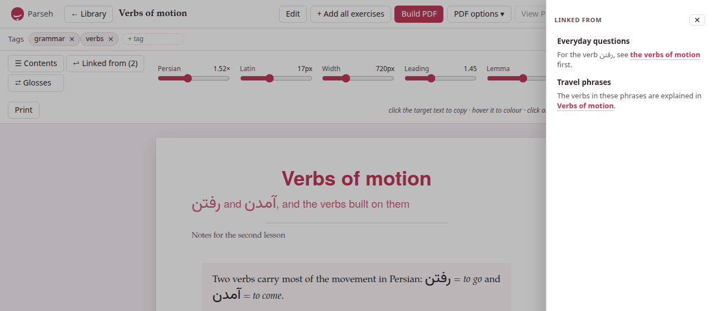

A click on a card in the library opens the document's page,
`/studio/doc/<id>`: the document typeset as a sheet in the middle of the
window, with the same colours, numbered sections, lemma headings and
tables its PDF will have. Three bars stand over it — the top bar, the tags,
and the typography — and every one of them can be put away.

## The top bar

From the left: **Parseh** (the hub), **← Library**, the document's title
(the whole of it on hover, when it is cut short), and then:

- **Edit** opens [the editor](editor.md).
- **+ Add all exercises** copies the page's exercises into an exercise deck
  at once: see [Reading, annotating and practising](reading-tools.md#decks).
  It is there only when the page has an exercise or a gloss to copy.
- **Build PDF** and **PDF options ▾** make the PDF, and **View PDF** shows
  it in place of the sheet (**View web** brings the sheet back): see
  [Printing to PDF](pdf.md).
- **Download ▾** — see [below](#download).
- **⋯** holds **Duplicate** and **Delete document**.
- **Stop server** stops Parseh, after asking.

## Tags {#tags}

Under the top bar, **Tags** lists the document's tags, each with a **✕** to
take it off. Type a new one in **+ tag** and press Enter (or a comma): it
is added at once, and the box offers the tags the library already has as
you type. Tags are stored in lower case. They are how the library's tag
filters find the document.

On the right of the same bar are the badges of the last PDF build: see
[Printing to PDF](pdf.md#the-badges).

## Typography: the third bar

The third bar sets how the sheet looks. Every setting takes effect as you
move it.

| Control | What it sets |
|---|---|
| **Persian** (the target language's name) | the size of the target language's script relative to the Latin text, from 0.8× to 2.6×; the same knob the PDF build uses as its scale |
| **Latin** | the size of the Latin text, 13 to 23 pixels |
| **Width** | the width of the text column, 420 to 1,400 pixels |
| **Leading** | the space between lines, 1.15 to 2 |
| **Lemma** | the size of the big lemma headings, 2.2× to 4.6× |
| **justify** | justified text, hyphenated, as in the PDF — or ragged |
| **Paper / Sepia / Dark** | the page's theme |
| **Reset** | everything back to the PDF's defaults |
| **Print** | prints the page as it is set, without the bars |

The target size starts where the language's script looks right beside
Latin text — 1.52× for the Arabic script, 1.20× for Japanese, Chinese and
Devanagari, 1× for a language written in the Latin alphabet. The **Width**
follows the **Latin** size, so the two move together; drag the width
yourself and it keeps the new proportion from then on.

The settings are remembered for the document, in this browser, and the
last ones you set are where every document you have not set yourself
starts — the target size only among languages of the same script, so a
Persian size never reaches a Japanese page. The theme follows the
toolbox's ◐ theme until you pick one here.

**⌃ bars**, at the end of the bar, takes all three bars away and leaves one
faint **⌄ bars** in the corner to bring them back: the whole window for the
text. That choice holds for every document, since it is a way of reading
rather than a property of a page.

## Contents

**☰ Contents** opens the table of contents as a drawer over the page: the
sections, the subsections and the lemma headings, in order. Click one and
the page goes there, the drawer closing behind it. Escape, the **✕**, or a
click beside the drawer closes it too. The sheet stays where it is, centred
in the window, whether the drawer is open or not.

## ↩ Linked from {#linked-from}

**↩ Linked from (N)** says how many documents of the library link to this
one, and opens a drawer from the other side of the page listing them: each
document's title, a link to it, and under it the words around each of its
links here, the link itself marked — a Persian line read right to left, an
English one left to right. A document links here when it names this one
[by its name](names-and-links.md), or by the permanent id of a link written
before names; its links to itself are not listed. A document nothing links
to says *No document links here yet.*

The drawer closes on Escape, on its **✕**, or on a click beside it. Only
one drawer is open at a time: opening **☰ Contents** closes it. On a note
beside a book or a video it lists the notes of that book or video that link
to it.

## Glosses, colours, exercises

The page is not only for reading. A click on a word of the target language
copies it; pointing at it offers a palette to colour it or write its
transliteration; **⇄ Glosses** turns every gloss of the document into a
table and a flashcard drill; the exercises can be answered and checked;
a flashcard opens large with **⤢ Enlarge**; and **+ Deck** copies an
exercise into a deck. All of it is on
[Reading, annotating and practising](reading-tools.md). The hint at the end
of the typography bar says the first of it: *click the target text to copy
· hover it to colour · click an image, or ⚙ on a player, to lay it out.*

## Download ▾ {#download}

**Download ▾** takes this one document away:

- **Markdown (.md)** — its source, named after its id without the random
  end (`verbs-of-motion.md`).
- **Markdown + media (.zip)** — the Markdown with the pictures and
  recordings it shows, and its tags, in one zip. The library's
  **Upload .md / .zip** takes it back, pictures and all.
- **LaTeX (.tex)** — the `.tex` the last PDF was built from.
- **PDF** — the last PDF built.
- **HTML page, for a website (.html)** — the document as one file that
  works anywhere, for students who have no Parseh: its exercises working,
  its pictures and recordings inside it, and none of its Markdown. See
  [A page for a website](web-page.md).

**LaTeX** and **PDF** are greyed out until a PDF has been built; the HTML
page needs no build. For many documents at once, the library has
**Download N shown**.

## Duplicate and Delete

**⋯ → Duplicate** makes a copy of the document — its text, its tags, its
pictures and its recordings — and opens it. The copy is named after the
original: *Verbs of motion (copy)*, or *(copy 2)* when that is taken, in its
front matter as in the library, so the two never share a name. It has no
PDF of its own yet.

**⋯ → Delete document** deletes it, after asking — *Delete “…” and its
builds? This cannot be undone.* — and goes back to the library. The
document's folder goes, with its pictures, recordings and PDF; there is no
bin. Links to it from other documents stay as they are, waiting for a
document of that name (see [Names and links](names-and-links.md#deleting-a-document)).

## On a phone

On a narrow screen the top bar and the typography bar are pinned to the top
of the window, and both go away as the page moves down and come back on the
smallest move up. The typography bar keeps only **☰ Contents**,
**⇄ Glosses**, **↩ Linked from** and **Aa**; **Aa** opens the typography
controls under them, and closes them again. **⌃ bars** sits there with the
controls. The top bar's buttons scroll sideways when they do not fit.

**↑ Top**, in the lower-left corner, takes a long document back to its
beginning; it appears once you have scrolled some way down, on every
screen.
