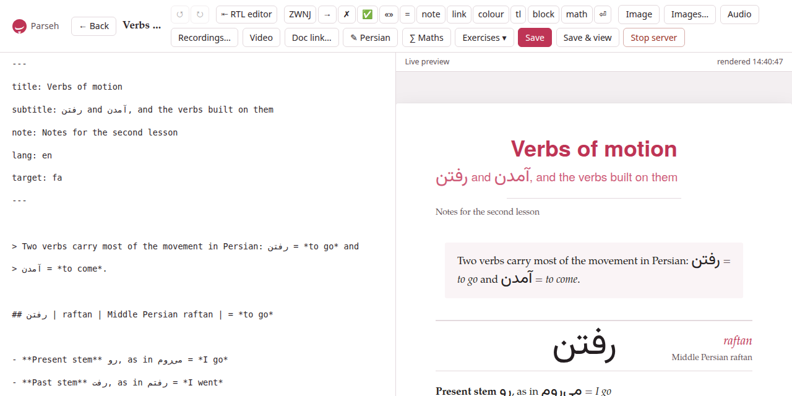
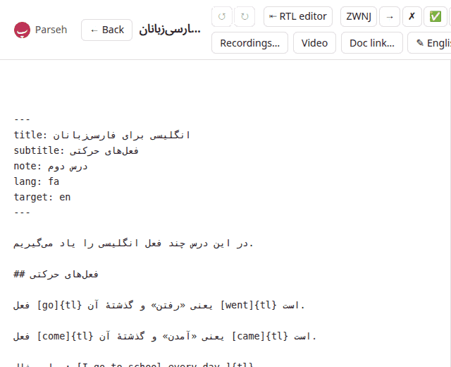

The editor opens from **Edit** on a document's page (`/studio/doc/<id>/edit`)
and from **+ New** on the library (`/studio/new`). The Markdown is on the
left; on the right, under **Live preview**, is the document as its page
will show it, drawn again a third of a second after you stop typing. It is
drawn by the same renderer as the document page, so the preview *is* the
document: what you see there is what a reader sees.

The line beside **Live preview** says when the preview was last drawn
(*rendered 14:02:31*), or *render error* and why. A `target:` naming a
language the toolbox does not teach is said there too — *unknown target
language 'xx' -- rendered as Persian* — and the document is drawn as
Persian until you correct it.

On a screen narrower than a tablet's the two panes are stacked, the source
above the preview, and the toolbar wraps onto as many rows as it needs.

## The front matter {#front-matter}

The lines between the two `---` at the top of a document are its front
matter, and the editor follows them as you type:

- **`title:`** is the document's **name**: the name the library shows, the
  name a link to it spells, and unique in the library — see
  [Names and links](names-and-links.md).
- **`subtitle:`** and **`note:`** are the lines under the title.
- **`lang:`** is the language you write the prose in (`en`, `it`, `fa`,
  `pt`…). It picks the hyphenation of the PDF — and, when it is a
  right-to-left language, the direction of the editor itself (below).
- **`target:`** is the language the document is about (`fa`, `ja`, `it`…).
  Change it and the preview is drawn in that language at once, with its
  face and direction, the **kana** button appears or goes, and the
  target-text button takes the language's name. On the next save the
  document moves to that language's shelf of the library.

A new document starts with the `target:` the toolbox's language is set to.

## Saving

- **Save** — or Ctrl+S, ⌘S on a Mac — writes the document. The first save
  of a new document creates it, and the editor opens again at its own
  address; a later save says *Saved* at the bottom of the page and puts the
  new title in the bar.
- **Save & view** saves and opens the document's page.
- **← Back** goes to the document's page, or to the library for a document
  not saved yet.

The editor knows when you have written something since the last save, and
the browser asks before leaving the page — **← Back**, a closed tab, a
reload — while it has. Both save buttons are greyed out while a save is on
its way, so a second press cannot make a second document.

A save that changes the title **renames** the document. If the new title is
one another document of the library has, nothing is written and the dialog
*This name is already in use* opens, with your text left exactly as it is
in the editor; cancel it and the editor says *Not saved: that name is taken
— nothing was written*. A rename is followed by every link in the library
that named the document by its old name. When the save rewrote a link in
the document itself (a link to itself, or to a document renamed meanwhile
from another tab), the editor takes the rewritten text back, as an edit
you can undo. See [Names and links](names-and-links.md).

A save also brings in the files the text names and the document does not
have yet: a starter's picture, a clip from the clip tray (see
[Pictures and recordings in a document](editor-media.md)). And a save that
changes nothing at all leaves a built PDF as it was; one that changes the
text marks it *source changed*.

## History: ↺ and ↻

**↺** undoes and **↻** redoes, as do the shortcuts of every platform:
⌘Z and ⇧⌘Z, Ctrl+Z and Ctrl+Shift+Z, Ctrl+Y. The editor keeps its own
history, three hundred steps deep, so that everything it writes for you —
an insert, a picture, a colour chosen in the preview, a rename taken back
— can be undone like typing. Fast typing counts as one step. Each button is
greyed out when there is nothing to undo or redo.

## ⇤ RTL editor {#rtl-editor}

The source box is written left to right, in a monospaced face. For a
document whose **prose** is a right-to-left language — a Persian writing
in Persian to teach English to Persians — that puts every full stop,
question mark and heading mark of the prose at the wrong end of its line.
**⇤ RTL editor**, in the bar's **Editor** group, turns the whole source
right to left; the button then reads **⇥ LTR editor**, and turns it back.
The button always says what a click does, and its tooltip says which way
the source goes now.

Right to left, the source is set from the right, a step larger, in a face
made for the script: the prose language's (Vazirmatn for Persian, Noto
Naskh Arabic for Arabic), or else the target's, when that is a
right-to-left language. Every line is then right to left, the dialect's
own lines too: a key whose value is a Persian sentence — a `prompt:`, a
`meaning:`, an answer `- [x]` — has its key on the right and its full stop
on the left, where the sentence ends. A line of Latin letters alone, such
as a `:::exercise` fence or an English `context:`, reads the way any
right-to-left editor draws it, its `:::` on the right and an English full
stop on the left. Left to right, the source keeps its monospaced face.

Only the source box changes. The preview, the document's page and its PDF
are drawn as they always are — the button is about how you write the
source, not about how the document is laid out. The exercise form's own
**⇤ RTL** and **⇥ LTR** buttons are their own, and the panes stay lined up.
Inserts, pasted and dropped pictures, undo and redo all work the same
either way.

**Until you press it**, the source goes the way the prose language of
`lang:` is written: a document with `lang: fa` or `lang: ar` opens right to
left, every other left to right, and typing another `lang:` into the front
matter turns it. **Once pressed**, the choice is the document's, kept in
this browser. A new document keeps the choice made for it with its page
(a reload keeps it) and takes it as its own when it is first saved; the
next new document starts again from its own `lang:`.

## Insert at cursor

The bar's **Insert at cursor** group puts a piece of the dialect in at the
cursor. Only four buttons wrap the text you selected — **tl**, **kana**,
**block** and **math**; with nothing selected they put in an empty mark
with the cursor inside it. Every other one puts its piece **in place of**
a selection: select *WORD* and press **colour** and you get `[]{teal}`,
with *WORD* gone. Press them with nothing selected — or undo (Ctrl+Z),
which brings the selection's text back.

| Button | What it puts in |
|---|---|
| `ZWNJ` | the zero-width non-joiner, the Persian half-space (می‌روم) |
| `→` | an arrow |
| `✗` | the mark of an ungrammatical form: the form after it is shown in red |
| `✅` | the mark of a correct form (it colours nothing) |
| `«»` | a pair of guillemets, the cursor between them |
| `=` | the `=` of a gloss, with a space on each side |
| `note` | a footnote, through a dialog (below) |
| `link` | a web link, `[testo](https://)`, the cursor where the address goes |
| `colour` | a colour mark, `[]{teal}`, the cursor inside the brackets |
| `tl` | wraps the selection as a block of the target language, `[…]{tl}` — over several lines when the selection is — and is how a run of a Latin-script target is marked |
| `kana` | wraps the selection as `[…]{kana:}`, the cursor where the reading goes (only for a language with a reading: Japanese) |
| `block` | wraps the selection as a Latin block, `[…]{la}` |
| `math` | wraps the selection as a formula in the line, `[…]{math}` |
| `⏎` | a forced line break |

What each mark means, and every option it takes, is in the
[dialect section](../dialect/_index.md).

### The footnote dialog

**note** asks for the note's **Name** (optional) and its text, then does the
two things a footnote needs: the reference `[^name]` goes in at the cursor,
and the note itself is placed among the other notes at the foot of the
document **in the order the reader meets them**. Left empty, the name is
`n1`, `n2`…, the first one free; a name already in use is refused rather
than merged with the other note. **Insert note** puts it in.

## The target-text editor: ✎ Persian {#target-text-editor}

Typing a long stretch of Persian or Arabic into a box set left to right is
hard to follow. The button that bears the target language's name — **✎
Persian**, **✎ Japanese**… — opens a large box set in that language's
direction and face. Every line you type there becomes a real line (a `⏎`
in the Markdown); square brackets are not allowed in it and are taken out.
Under the box, what the language offers:

- **Font** — the language's other face, where it has one: *nastaliq* for
  Persian, *gothic* for Japanese.
- **Background** — a tint behind the block: *quote*, *sand*, *rose*,
  *sage* or *lilac*.
- **vertical** and **height** — for a language that can be set vertically
  (Japanese, Chinese): the block in columns, top to bottom, right to left,
  each column as tall as the height says (8 to 60, in ems; 22 unless you
  say otherwise).

**Insert** puts one line in at the cursor as `[…]{tl}` with the options you
chose; several lines, or a vertical block, go in as a block of their own.

**Editing a block you already have**: point at a target-language block in
the preview and a small **✎** with the language's code appears at its
corner. Click it and the same box opens with the block's lines and
options, titled *Edit Persian block*; **Save** writes the change into the
Markdown, as one step you can undo. A paragraph the studio sets as the
target language by itself (one with no Latin letters) stays plain text
until you add a Latin word to it through this box, when it becomes a
`[…]{tl}` block.

## The maths sheet: ∑ Maths {#maths}

**∑ Maths** opens a sheet for a formula: the notation on top, in LaTeX,
and the formula drawn under it as you type, by the same program that draws
it on the page. A mistake is shown in that program's own words (*Missing
close brace*) instead of a formula. Choose **in the line** — the formula
goes in at the cursor as `[…]{math}` — or **on its own**, a `:::math` block
on lines of its own. **Insert** (or Ctrl+Enter) puts it in; Escape closes
the sheet. Text selected when you press the button is the formula the sheet
starts from, and what you insert takes its place.

The exercise form has the same sheet on its own **∑ Maths…** button, which
writes into the field you were last in: see
[Exercises in the editor](editor-exercises.md).

## Links to other documents: Doc link…

**Doc link…** lists the other documents of the library, to link to one by
its name: see [Names and links](names-and-links.md#the-doc-link-picker).

## Tools in the preview

The preview is not only to look at. Everything the document page lets you
do to the text with the mouse works in the preview too, and writes into
the editor's text — saved or not — as an edit you can undo:

- pointing at a word of the target language opens its palette: a colour,
  a transliteration, a reading (see
  [Reading, annotating and practising](reading-tools.md#colours-and-transliterations));
- a click on a picture, or on ⚙ at a player's corner, opens its layout
  panel, and a click on a Latin block opens the block's (see
  [Pictures and recordings in a document](editor-media.md#laying-out));
- **✎ Edit** on an exercise reopens it in the exercise form (see
  [Exercises in the editor](editor-exercises.md)).

In the preview the exercises are drawn **solved** — the answers in place,
both sides of every flashcard shown (*front and back shown in preview*) —
because you are writing them, not answering them. There is no **Check
exercises** and no **+ Deck** here; those are on the document page.

## Aligned panes

A line of Markdown and the block it becomes are rarely the same height, so
two panes scrolled side by side soon disagree about where you are. The
editor keeps them together: the renderer tags every block of the preview
with the source line it starts on, the source box's line spacing and top
margin are fitted to all those anchors at once, and scrolling either pane
scrolls the other to the matching place — measured anew on every redraw
and whenever the window changes size. You scroll the source, and the
preview shows what you are looking at.

## The rest of the bar

**Image**, **Images…**, **Audio**, **Recordings…** and **Video** are for
the document's pictures, recordings and videos: see
[Pictures and recordings in a document](editor-media.md). **Exercises ▾** is
[Exercises in the editor](editor-exercises.md). **Stop server** stops
Parseh, after asking.
