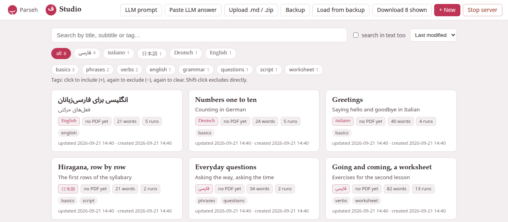

The library is the studio's front page, `/studio/`: every document as a
card, and above them the ways to find one and the buttons that bring
documents in and take them out.



## A document's card

Each card shows, from the top:

- **The title** — with any word of the target language in its own face.
- **The subtitle** — the front matter's `subtitle:` line.
- **The badges** — the target language, in its own script (فارسی,
  日本語, italiano…); the state of its PDF, **no PDF yet** or, for the
  last PDF that built, **PDF ✓** with its page count and **N/N verified** (or
  **N verify fail**, or **not verified** when the checker could not run),
  plus **source changed** when the document was edited after the PDF was
  built; and what the document holds: how many lemma headings, words and
  runs of the target language. A build that failed does not show here: it
  is said on the document's page (see
  [When a build fails](pdf.md#when-a-build-fails)).
- **Its tags.**
- **When it was updated and created.**

A click anywhere on the card opens [the document page](document-page.md).
The **✕** in its corner deletes the document, after asking — *Delete
“…” and its builds? This cannot be undone.* It really cannot: the
document's folder, with its pictures, recordings and PDF, is removed, and
there is no bin to take it back from. The links other documents have to it
are not touched: they wait, drawn as links to a missing document, until a
document of that name exists again (see [Names and links](names-and-links.md)).

Under the cards, a line says how many documents there are, whether XeLaTeX
(the typesetter the PDF needs) and the Italian hyphenation are installed,
and where the library is on the disk.

## Finding a document

Everything in the row above the cards narrows the list at once, as you type
or click, and all of it can be combined.

- **The search box** looks in the titles, subtitles, notes (the small line
  under a title) and tags. The comparison is the toolbox's own: case does
  not matter, and a Turkish *İ* is found by typing *i*.
- **search in text too** extends the search to the whole text of every
  document, the Markdown included.
- **The sort menu** puts the cards in the order **Last modified** (the
  default), **Created** or **Title A–Z**. The library remembers the one you
  chose, in this browser.
- **The language chips** — **all**, then one chip per language that has
  documents, each with its count — show one language's documents. They are
  the same chips every index of the toolbox has, and the choice is shared:
  pick Japanese here and the books, the videos and the hub open on Japanese
  too. The counts follow the search.
- **The tags** in a row of their own filter by what you tagged the
  documents with. Click a tag once to **include** it (+): only documents
  carrying it are shown. Click again to **exclude** it (−): documents
  carrying it are hidden. A third click clears it. **Shift-click** excludes
  a tag straight away. A document must carry every included tag and none of
  the excluded ones.

The number on a tag is how many of the documents now in front of you it
would leave — not how many the whole library holds — and a tag that would
leave none is not offered at all, since it could only empty the page. A tag
that is doing the filtering always stays, whatever its count: an excluded
tag shows zero by its nature, and hiding it would take away the only way to
switch it off.

**Clear all filters** appears as soon as anything narrows the list — a
search, **search in text too**, a tag, a language chip — and puts
everything back.

> **Your filters wait for you.** Open a document and come back: the
> search, the in-text box and the tags are as you left them. They belong to
> the browser tab, so a second window can browse the library its own way.
> The language chip and the sort order are remembered for good.

When no card is left the page says so, in one of two ways:

- *No documents yet*, with a link to the LLM prompt and to a new document,
  whenever nothing matches at all — in an empty library, but also in a
  full one when the search, **search in text too** or the tags leave no
  document. The documents are still there: **Clear all filters** brings
  them back.
- *No … documents here*, when documents do match but the language chip
  hides every one of them.

## Tags

A document's tags are set on [its own page](document-page.md#tags), in the
bar under the title. They are stored in lower case — *Verbs* and *verbs*
are one tag — and they travel with the document in its zip and in a backup.

## + New {#new}

**+ New** opens [the editor](editor.md) on a new document. It is not saved
until you press **Save**: close the tab first and nothing is made.

A new document starts as the **starter page** of a language: a guided tour
of everything a document can hold, written in English about that language,
with real words of it in every example — boxes, lemma headings, tables,
footnotes, colours, formulas, a picture, a recording, a video, and one
exercise of every kind. Keep what you need and delete the rest. Its front
matter is filled in:

```yaml
---
title: New Persian note
subtitle: a guided tour of everything a note can hold
note: English prose with Persian examples: keep what you need, delete the rest
lang: en
target: fa
---
```

**Which language.** **+ New** follows the language chip: with Japanese
picked, it opens the Japanese starter; with **all**, the toolbox's first
language (Persian). Every one of the eleven languages has a starter of its
own. To write about another language, pick its chip first — or change the
`target:` line, and the preview follows at once. The `lang:` line says what
language you write the prose in; see [the editor](editor.md#front-matter).

**Give it a name.** The starter's title — *New Persian note* — is a name
like any other, and two documents of the library cannot share one. Save a
second new document without changing it and the studio asks you for
another name (see [Names and links](names-and-links.md#the-name-conflict-dialog)).
Change the `title:` line before the first save and the question never
comes up.

**Its pictures and recording.** The starter shows two pictures (an apple,
a house) and a short chime, and they display in the preview before
anything is saved. They ship with the studio, and your first **Save**
copies the ones the text still names into the document's own folders. From
then on they are the document's files like any other: listed in
**Images…** and **Recordings…**, taken away in its zip and its backup,
printed in its PDF. Delete one there and it stays deleted — a later save
does not bring it back, even while the text still names it; the page then
shows it as missing, as it shows any file a document lacks. See
[Pictures and recordings in a document](editor-media.md#the-starters-pictures).

**Its links.** The starter links to *My second Persian note* (in each
language, its own), a document that does not exist yet: the link is drawn
as a link waiting for its document. Make a document with that title and
the link works — the starter shows you how links by name behave.

## The bar

The bar across the top of the library holds, from the left: **Parseh**
(back to the hub), **Studio** (this page), and:

- **LLM prompt** opens [the prompt page](llm-prompt.md).
- The five buttons **Paste LLM answer**, **Upload .md / .zip**,
  **Backup**, **Load from backup** and **Download N shown** bring documents
  in and take them out: see
  [Bringing documents in and out](documents-in-and-out.md).
- **+ New** starts a document, as above.
- **Stop server** stops the whole of Parseh — every door, not only the
  studio. It asks first, and names what is still running (a PDF being
  built, a backup going up), since stopping cuts that off. The page then
  says the server has stopped and can be closed.

On a phone the bar goes away as the page moves down and comes back on the
smallest move up.
