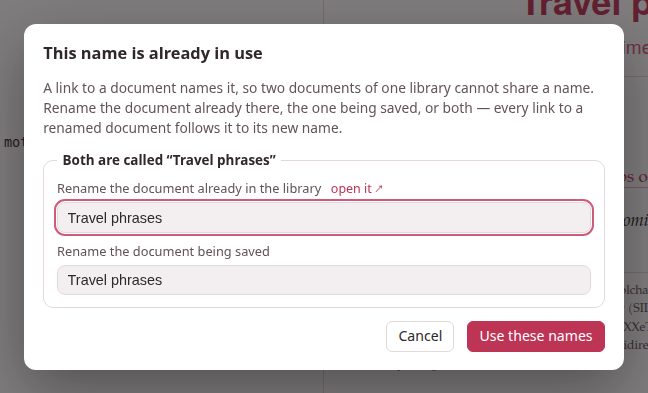

A document can link to another one of the same library — *see the verbs of
motion* — and the link names its target the way you would: **by its
name**. This page is about what a name is, how the studio keeps names
unique, what happens to the links when a document is renamed or deleted,
and the dialog that asks you for a name when one is taken.

## A document's name is its title

The name of a document is the `title:` line of its front matter — what the
library shows on its card, what the document's page shows in its bar, and
what a link to it spells:

```markdown
---
title: Verbs of motion
target: fa
---
```

A link is written `[shown text](doc:Name)`:

```markdown
The same verbs come back in [the chapter on motion](doc:Verbs of motion).
[](doc:Verbs of motion) — left empty, the link shows the document's title.
```

Behind the name every document also has two identifiers of its own — the
name of its folder (`verbs-of-motion-3f9a1c`) and a permanent one kept in
its record — which never change and which you never type. The name is the
one you read and write, and the one you may change.

**Names are compared as a Mac or a Windows machine compares file names**:
case does not matter, and a run of spaces counts as one. `doc:verbs  of
Motion` reaches *Verbs of motion*. A name may hold spaces, any script, and
parentheses that pair up (`doc:Table 7-6 (percentages)`); a lone
parenthesis, or a backslash, is written with a backslash in front of it
(`doc:Notes \(draft`). You rarely write that by hand: **Doc link…** does.

### What a link looks like

On the page, a link to a document is set in the accent colour with a small
→ after it, and opens the document in the same tab. On paper it is the
same words in the link colour, since there is nothing to click through to.
The links of this guide name its pages the same way — this one is written
`[](doc:Writing in the editor)`:

```parseh-example
Everything about typing is in [](doc:Writing in the editor), and the buttons that
bring documents in are in [the page on uploads](doc:Bringing documents in and out).
```

A link whose name **no document has** — its target deleted, or not written
yet — is not dropped: it is drawn in red, dashed, with ⚠ after it, and its
tooltip names what it is waiting for: *No document named “Verbs of motion”
in this library — create or upload one with this name and this link will
work again.* The moment a document of that name exists — made with
**+ New**, uploaded, restored, or another one renamed to it — the same link
works, with nothing rewritten. Every starter page has one such link, to a
document it invites you to write.

**A link reaches only its own library**: the studio's documents link to one
another, and the notes of one book link to the notes of that book. A link
from a studio document to a note, or from a book's note to a studio
document, finds nothing there.

## The Doc link… picker {#the-doc-link-picker}

**Doc link…**, in the editor's bar, is the easy way to write a link. It
opens **Link to another document**: every other document of the library —
the one you are editing is left out — each with its title and subtitle.

- **Filter by title or tag** narrows the list as you type.
- Click a document to choose it.
- **Shown text** is the link's own words; it starts with whatever you had
  selected in the editor. Left empty, the link shows the target's title,
  and follows it when the title changes.
- **Insert link** puts `[shown text](doc:Name)` in at the cursor, in place
  of the selection, the name escaped where it must be.

With no other document in the library, the button says so and opens
nothing.

## Renaming follows the links

Change a document's `title:` and save it, and you have renamed it. **Every
link in the library that named it by the old name is rewritten to the new
one**, as Obsidian does — each link's shown text kept, the document's own
links to itself included, and the exercises in your exercise decks too,
which link to the studio's documents the same way. A change of case or of
spacing is a rename like any other: a link always spells the name as it is
now.

- A document rewritten only because another one was renamed **keeps its
  "updated" date**, so the library's *Last modified* order does not
  reshuffle; a PDF built from it is marked **source changed**, since its
  text did change.
- The editor that made the rename takes back its own rewritten links, as
  an edit you can undo.
- **An editor left open** in another tab while a document it links to is
  renamed follows the rename at its next save, instead of writing the old
  name back. (It follows the renames this run of Parseh made; one made
  before a restart is already in the saved text it opened.)

## One name, one document

Since a link names its target, **no two documents of one library may share
a name** — the studio's library, all its languages together, or the notes of
one book, or of one video. The name is checked on every way a document
comes into the library or changes its name:

- **Save**, **Save & view** and Ctrl+S in the editor, when the title says
  something new — and the first save of a new document;
- **Paste LLM answer**;
- **Upload .md / .zip**, after its header dialog, when there was one — a
  file's title against the library's documents and against the other files
  of the same zip;
- **Load from backup**, for a document of the backup with an id of its own
  (one with the same id is the same document, kept or replaced as ever) —
  against the library and the rest of the backup;
- the same in a book's or a video's notes.

### The name conflict dialog {#the-name-conflict-dialog}

When a name is taken, **nothing is written** — not the save, not the
upload, not the restore — and a dialog opens: **This name is already in
use**.



For each clash it shows a box, *Both are called “Verbs of motion”*, with
two fields, each filled with the name the document has now:

- **Rename the document already in the library** — with **open it ↗**
  beside it, which opens that document in a tab of its own so you can see
  which one it is without losing what you are doing;
- **Rename the document being saved** — or **being added**, with the file
  it comes from, for an upload or a restore. For two files of one zip that
  share a name, the first field is **Rename the other document being
  added**.

Change either one, or both — they may even swap names — and press **Use
these names** (or Enter in a field). The button says **Checking…** while
the server looks at every name again, together. A name that is still taken
— by the other document of the box, or by any third document of the
library — is said under the field you typed it in, *“Verbs” is already
the name of another document — choose another name*, and the dialog stays
open, as it was, for another; an empty field is *A document needs a name —
give it one*. When every name
is free, it all goes through at once: the document already in the library
is renamed (and every link to it follows it), the incoming document is
written under its name, and a link inside an upload or a backup that named
another document of that same upload or backup follows *that* document to
its new name, since it was written for it.

**Cancel** — or Escape, or a click outside — writes nothing. The editor
keeps your text exactly as it was, and says *Not saved: that name is taken
— nothing was written*; a cancelled paste comes back in its box; a
cancelled upload skips that file; a cancelled restore restores nothing.
For a backup, the names you gave are given again to its **Replace them**,
and if a document put back by **Replace them** holds a name that is taken,
the dialog asks again.

The same dialog, titled **This name cannot be used**, asks for another name
when one holds a `|`: a link to it standing in a table would split the
cell. (A document named with one before names were checked keeps it, and
**Doc link…** links it by its permanent id, which reaches it too.)

### Names given for you

Where there is nobody to ask, the studio picks a free name itself:

- **Duplicate** names the copy *Verbs of motion (copy)*, then *(copy 2)*,
  *(copy 3)*… — in its front matter as in the library;
- a new note beside a book or a video is *A note*, then *A note 2*…;
- a pasted text with no title at all is *Untitled*, then *Untitled 2*…,
  in a front matter made for it when it has none. (An uploaded file is
  never nameless: its header dialog asks for a title.)

## Deleting a document

Deleting a document leaves every link to it **as it is**: drawn in red,
waiting. Nothing is rewritten, so the day a document of that name exists
again — you write it anew, upload it, restore it from a backup — every
link to it works again.

## Links written before names {#links-written-before-names}

Earlier versions of Parseh wrote a link with the target's permanent id,
twelve characters of hexadecimal: `[](doc:9f3c1a7b20de)`. Such a link still
works — a link whose name no document has, but which spells the permanent
id of one, reaches that one — and it is rewritten by name once, by itself:

- the studio's library when Parseh starts, a book's or a video's notes the
  first time they are opened after that;
- and after every upload and restore, for the links that came in with it.

The same pass gives a name of its own to any two documents that still
share one (nothing forbade it before): the oldest keeps the name, the
others get *2*, *3*… after it, each said on the server's console. Their
links are then written by their new names.

## Who links here

A document's page lists every document of the library that links to it —
**↩ Linked from** — with the words around each link: see
[The document page](document-page.md#linked-from).
