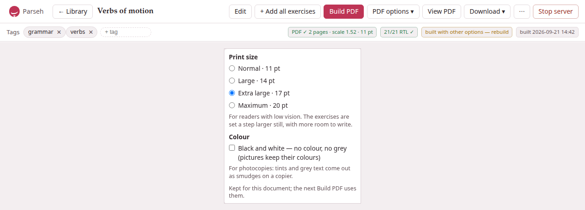
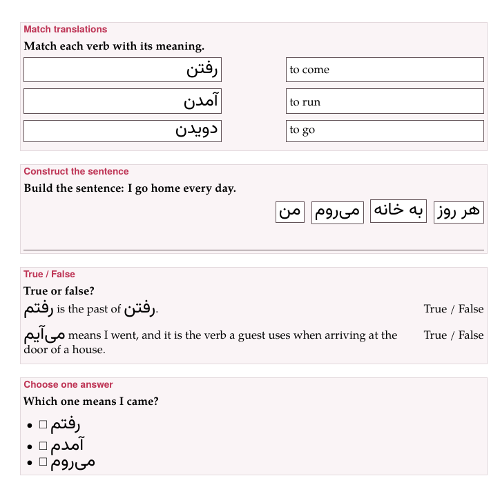

Every studio document can be printed: **Build PDF**, on its page, typesets
it with XeLaTeX into a PDF with the same colours, sections, lemma headings
and boxes as the page — and then **checks** it, reading every word of the
target language back out of the finished PDF to prove it came out right.
A PDF is how a document reaches a class, a printer, or a reader without a
screen.

> **What it needs.** The PDF is made on your computer by XeLaTeX, which
> comes with TeX Live (see [getting started](../getting-started/_index.md));
> the installer, asked to prepare for PDFs, fetches the TeX packages a small
> TeX Live lacks. The library's status line, under the cards, says
> *XeLaTeX ✓* when it is there. The check needs PyMuPDF, which is in the
> environment the installer makes; without it the PDF is still made, and
> says it was not verified.

## Build PDF

Press **Build PDF**. The button says **Compiling…** while the server works
— a few seconds for a short note, longer for a long one with many
pictures — and the build is on the **Working** list in the corner of every
page, so you can go on elsewhere. When it is done a message says so —
*PDF built: 7 pages, 186/186 Persian strings verified* — and the badges
beside the tags say the rest.

What a build uses:

- **The document as it is saved.** Save in the editor first: the build
  reads the stored Markdown, not the editor's.
- **The target-language size** of the typography bar — the slider named
  after the language — as the size of the target script in the PDF. Set
  the sheet the way you want the page and the PDF follows.
- **The PDF options** — the print size and black and white — below.

**View PDF** swaps the sheet for the PDF, in your browser's own viewer;
**View web** swaps back. **Download ▾ → PDF** and **Download ▾ → LaTeX
(.tex)** take the PDF and the `.tex` it was made from away. All three are
greyed out until a PDF has been built.

### When a build fails {#when-a-build-fails}

A build that fails says so, but not why: a red message, *Build failed:
500 Internal Server Error*, and a badge **build failed — see message**
beside the tags, whose hover says the same. The reason stays on the
server's side. Where to look for it:

- **A picture the text names and the document lacks** is the commonest
  cause, and the page shows you which before you build: where the line
  stands there is only the browser's broken-picture sign and the picture's
  words. Upload it, or take the line out, and build again.
- **Any error TeX met** is written down in full, in a file of the
  document's own folder on the disk:
  `persian/verbs-of-motion-3f9a1c/build/compile-error.log` inside the
  library's folder, for a Persian document whose page is
  `/studio/doc/verbs-of-motion-3f9a1c`. The line under the library's cards
  names the library's folder. Open the log with any text editor; the lines
  that begin with `!` are the errors — *! Unable to load picture or PDF
  file 'images/cat.png'.* A log left by an earlier failure stays there
  after a build succeeds, so look at its date.
- **No log** is written when the build never reached TeX's end: XeLaTeX
  not installed, or a build stopped after five minutes. The line under the
  library's cards says *XeLaTeX ✗ missing* when the typesetter is not
  installed.

The last PDF that did build is kept: it stays on view and downloadable,
and the library's card goes on showing it — or *no PDF yet*, if there was
none. Only one build of a document runs at a time; a press in a second tab
while one is running is refused with *Build failed: build already
running*.

## The badges {#the-badges}

On the right of the tags bar, after a build:

- **PDF ✓ 7 pages · scale 1.52 · 17 pt · B&W** — the PDF, how many pages,
  the size the target script was set at, and the print options it was built
  with (**B&W** only when in black and white).
- **186/186 RTL ✓** for a right-to-left target, **42/42 text ✓** for the
  others — the verification (below) found every string. Its hover says what
  was checked.
- **3 RTL FAIL** (or **3 text FAIL**) — some strings were not found as
  written. Click it to see which, each with what went wrong: *missing*, or
  *LTR word order (bidi bug!)* — the words of a right-to-left phrase set
  left to right, the fault the check exists to catch.
- **not verified** — the checker (PyMuPDF) is not installed; the PDF is
  there, unchecked.
- **2 overfull** — lines more than 10 points too wide for the column,
  which TeX could not break better.
- **source changed — rebuild** — the document was edited after this PDF was
  built (a rename of a document it links to counts).
- **built with other options — rebuild** — **PDF options ▾** now says
  something else than this PDF was built with; its hover says both.
- **built 2026-09-21 14:30** — when.

Before any build the bar says **no PDF built yet**. The library's cards
carry the short form of the same: **PDF ✓ 7 pp**, **186/186 verified**
(or **3 verify fail**, **not verified**), **source changed**, **no PDF
yet**. A build that failed changes nothing on the card, which goes on
showing the last PDF that did build.

### What "verified" means

Right-to-left text inside left-to-right prose is where typesetting goes
wrong without anyone noticing: every letter right, the words in the wrong
order. So after every build, each string of the target language the `.tex`
contains is looked for in the finished PDF, glyph by glyph, in the order the
glyphs actually sit on the page. For a right-to-left language a string found
only with its words reversed is reported as the bidi fault it is; for the
others, a string not found as written is reported *missing*. Blocks written
as `[…]{tl}` and vertical blocks are set another way and are not part of
the count.

One false alarm is known, and the badge's hover says it too: a long phrase
that wraps across two lines may be reported *missing* although it is set
correctly. Look at a *missing* on a long phrase before believing it.

## PDF options ▾ {#pdf-options}



**PDF options ▾**, beside **Build PDF**, says how the next build prints the
document. They are options of the print, not of the Markdown: the same
worksheet can be printed large for one reader and in black and white for a
class, without changing a word of it.

**Print size** is **Normal · 11 pt**, the size of every PDF before the
options came, or one of three for readers with low vision: **Large ·
14 pt**, **Extra large · 17 pt** and **Maximum · 20 pt**. At the larger
sizes everything grows with the text — the headings, the
target script, the spacing — the margins give a little, and the rules
students write on (a blank, a frame, a writing line) get heavier. **The
exercises are set a step larger still**, with more room to write. An
exercise taller than a page — a reading passage and its questions at
20 pt, ten pictures to match at any size — starts a page and continues
over as many as it needs, framed on each. A table wider than the line is scaled down to fit, the column of a
vertical block is never longer than the page, and a word too wide for its
place in an exercise's frame or column is hyphenated there or, if it cannot
break, set smaller until it fits. A line holds fewer words, so a phrase kept
whole at 11 pt may be broken at a line's end, and a line of text is spaced
more loosely rather than run into the margin.

**Black and white — no colour, no grey (pictures keep their colours)** —
for photocopies, where tints and grey text come out as smudges. Every colour
of the page becomes black and every tint white: a box, a tinted block, an
exercise's panel, a recording's card become white panels with a thin black
frame, and a coloured word, a coloured lemma and the red of an exercise that
needs attention are all printed black. Pictures keep their own colours.

The choice is **kept for the document**, in this browser, and the next
**Build PDF** uses it. A document you have not chosen for starts from what
its PDF on disk was built with, so the menu says what the PDF is. When the
menu says something else than the PDF on disk, the badge **built with
other options — rebuild** says so.

> **If the large sizes fail.** They use a TeX package, `extsizes`, which
> the installer fetches when it prepares for PDFs. A TeX without it stops
> a large-print build — the page says only *Build failed*, and the
> document's `compile-error.log` ([above](#when-a-build-fails)) says
> *Large print needs the TeX package extsizes (extarticle.cls), which this
> TeX installation does not have*. **Normal · 11 pt** still builds.

## Exercises on paper {#exercises-on-paper}

(Every kind, written and printed, is in
[Exercises on paper](../dialect-exercises/on-paper.md) of the exercise
section; this is the short table.)

On paper an exercise is printed **unsolved**, to be done with a pen: the
blanks empty, nothing ticked, no statement marked, no explanation, and
neither the picture nor the recording kept for the answer. Each exercise
sits in a framed box headed by its kind, with its prompt, and its
question's picture and recording under the prompt.



| Kind | On paper |
|---|---|
| **Fill in blanks** | the sentence with a line for each blank, and under it *Blocks:* — every block, the right ones and the extras, in the order written; a right-to-left sentence is set from the right. A Chinese or Japanese sentence may end a line at a blank, at every size, but never so that a line begins with a closing mark (。，、？ 」) or ends with an opening one (（「): the blank stays with the mark, and the line ends on its other side |
| **Order sentences** | the sentences as a list, in another order than the answer's |
| **Construct a sentence** | the chunks in a row, each in a frame, shuffled, flowing the way the answer is read (right to left for Persian or Arabic); under them, lines as wide as the box to write the whole sentence on — as many as one and a half times the sentence needs, never fewer than one |
| **Match translations, opposites, definitions** | every entry of both columns in a frame of its own; the two columns equally wide, with a gap between them for the line the student draws; the two frames of a row equally tall; the right column shuffled. A right-to-left entry is set flush right, and a picture sits in its frame |
| **True / False**, **Yes / No** | each statement in a column of its own, wrapping inside it; *True / False* (or *Yes / No*) in a column on the right that nothing enters, level with the statement's first line and in the same place on every row |
| **Choose one answer**, **Choose all correct answers**, **Identify the incorrect part**, **Odd one out** | the options as a list, each with a □ to tick, in the order written |
| **Flashcards** | the exception: a card to cut out and fold — the front in the left half of a frame with round corners, the back in the right, a dashed line between them to fold on; each side as the page draws it, a recording as ♪ and its file name ([Flashcards](../dialect-exercises/flashcards.md#on-paper)) |
| **An exercise with errors** | *Exercise needs attention in the Markdown source.* |

Nothing crosses a frame or runs under the marks, at any print size: a long
word is hyphenated in its frame, even as the first word of a line; a line
may end after a slash; and what cannot break at all, such as a long
number, is set smaller until it fits.

**The rest of a document on paper**: a recording is a card saying what it
is (♪, its caption, the file and the stretch it plays); a video is a card
whose click opens the clip; a link to another document is its words in the
link colour, with nothing to click through to; a formula is set by TeX
itself; a footnote is at the foot of its page.


The same PDF can be built without the studio, by the tool the studio
itself uses. It writes the same `.tex` for the same options:

```bash
cd markdown
python3 exlex/exlex.py build notes.md                  # 11 pt, in colour
python3 exlex/exlex.py build notes.md --size 17 --mono # large print, black and white
```

It ends with the verification line, `N/N … strings correct`; anything
short of the full count exits with status 1.


## Notes are never printed

A note beside a book or a video is read on its page and nowhere else: its
**Build PDF** answers *a note beside a book or a video is read on its page
and nowhere else: it is never built to a PDF and never taken away as
LaTeX*. To print one, copy its text into a document of the studio. See
[Notes beside books and videos](notes.md).
