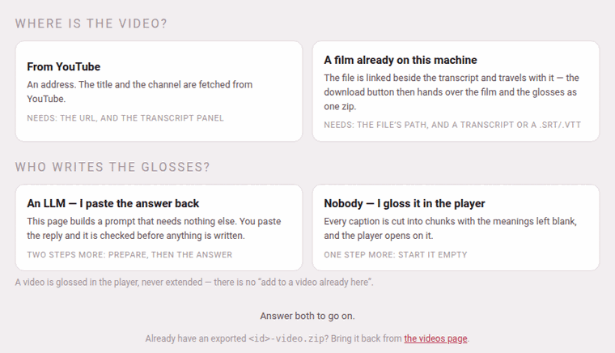

The **＋ Add a video** card on the videos page opens `/youtube/add/`. It
needs no Claude Code and no access to the project's files: everything is
done in the browser, and nothing is written until what you give it has
passed the same checks the pipeline runs.

## Two questions first



The page opens on two questions, and shows nothing else until both are
answered — only the steps your two answers need come after them.

**Where is the video?**

- **From YouTube** — an address. The title and the channel are fetched from
  YouTube.
- **A film already on this machine** — a video file. It is linked beside the
  transcript and travels with it, and the download button then hands over
  the film and the glosses as one zip. See
  [A film on this machine](a-film-on-this-machine.md).

**Who writes the glosses?**

- **An LLM — I paste the answer back** — the page builds a prompt that needs
  nothing else, you give it to any model you like, and you paste the reply
  back; it is checked before anything is written. Two steps more: prepare,
  then the answer.
- **Nobody — I gloss it in the player** — every caption is cut into phrases
  with the meanings left blank, and the player opens on it. One step more:
  start it empty.

All four pairs are real:

| | An LLM | Nobody |
|---|---|---|
| **From YouTube** | the prompt, the answer, **Check & add the video** | **Start it empty** |
| **A film on this machine** | the same, with the film put beside the transcript | **Start it empty**, with the film put beside it |

A video is glossed in the player, never extended: there is no “add to a
video already here”. The address remembers your two answers
(`/youtube/add/?src=film&by=empty`), and a link under the questions points
to the videos page for a video you already have as a zip.

## Step 1: the video

- **YouTube URL** takes any of the ways a YouTube address is written —
  `watch?v=…`, `youtu.be/…`, `/shorts/…`, `/embed/…` — or the bare
  11-character id.
- **The film** takes the full path of the file on this machine
  (`/home/you/films/lesson-1.mp4`); see
  [A film on this machine](a-film-on-this-machine.md).
- **Language** is the language the video **teaches**. It starts on the
  language the toolbox's chips last picked. It decides which captions count
  as *plain* — for a language with its own script, a caption with not one
  character of it (the English opening of many lessons) is never glossed —
  and the folder the video is filed under (`youtube/videos/japanese/…`).
- **Glossed in** is the language the meanings are **written** in: an
  Italian learning English wants them in Italian. It lists first the
  languages this toolbox teaches, then a few it can write in but does not
  teach (Portuguese, Dutch, Catalan, Romanian, Polish, Russian, British and
  American English). It starts on English and remembers your choice for the
  next video.
- **Details the answer may not know (optional)** — or, where there is no
  answer or no YouTube to ask, **Details this page cannot fetch** — holds
  **Title**, **Channel**, **Level**, the title in the video's own language
  (the field is named after it: **Persian title**, **Japanese title**) and
  **Blurb**, one sentence for the card. What you type here wins over
  whatever the answer or YouTube says.

## Step 2: the transcript

On YouTube, open the video's description, press **…more**, then
**Show transcript**; select the whole panel and copy it. Paste it into
**Transcript** as it is, timestamps included:

```text
0:00
Welcome back to the channel, today we learn Persian at the greengrocer's
فصل ۱: در میوه‌فروشی
0:06
سلام، ببخشید سیب چند است
0:12
کیلویی سی هزار تومان، تازه آمده
```

The panel is read exactly as the rest of the toolbox reads it: a line that
is a time starts a caption, the lines under it are what is said, a line
like `فصل ۱: …` or `Capitolo 3: …` is a **chapter marker** that becomes a
heading over the next caption, and the spoken-duration line some panels
add under each time (`1 minuto e 6 secondi`, `۱ دقیقه و ۳ ثانیه`) is
dropped. The box also takes a whole `.srt` or `.vtt` subtitle file — the
page says so when the video is a film, and reads one on either road
([A film on this machine](a-film-on-this-machine.md#its-transcript-a-panel-or-a-subtitle-file)).

**Edit the transcript…** opens a small subtitle editor over the panel, to
mend what YouTube heard and where it cut before anything is built from it:
see [Mending the transcript first](mending-the-transcript.md). It is the
one moment the transcript can be changed.

### A stray line on every caption

Some panels repeat an extra line on every caption that the reader does not
know to drop — a second timestamp, or a duration written in a way it was not
told to expect. **the paste repeats a stray line on every caption?** opens a
row for that: **Drop pasted lines where line-number mod** *3* **equals** *1*,
and **Remove those lines**. The first pasted line counts as 0, so a panel
that repeats *time, duration, caption* has its durations at 1, 4, 7… —
mod 3, remainder 1. It rewrites the box in place and says how many lines
went; look at the result before going on.

## With an LLM: the prompt

**Word list** offers the word lists under `youtube/docs/` — a list per
family of videos that keeps names and transliterations the same from one
video to the next. **none** is the default; only the prompt uses it.

**Prepare & copy the prompt** reads the transcript with the language you
picked and puts a self-contained prompt on the clipboard. It holds:

- the conventions, whole — what is the same for every language (the size of
  a phrase, the fields, the rule that a word is glossed fully the first
  time and then left bare) and what is the language's own (its
  transliteration scheme, what never to gloss, how to cut it into phrases);
- which language the meanings must be written in, on a line of its own
  under *This video* — with *not in English* after it when that language
  is any other — and the card's blurb asked for in the same language;
- a worked example — four captions of a finished video already in the
  player and the answer they were given: of the same language when there is
  one, otherwise of the Persian reference video, introduced as such. With
  nothing to quote the example is left out, and the conventions carry the
  shape of an answer on their own;
- the word list, if you picked one;
- the captions, numbered, with their start times — the plain ones and the
  chapter markers shown for context and marked not to be annotated — and,
  for Japanese and Chinese, the machine's own division of each caption into
  words under it, for the model to start from and correct.

The page then says what it found — the id, the title and channel YouTube
gave, how many captions, how many to annotate, how many plain, how long —
and how long the prompt is. **The prompt, as copied** shows it, with
**copy again**. If the video is already in the player it says so: adding it
again will replace it.

Paste the prompt to any LLM. A long video may not fit one answer: the prompt
tells the model to stop at a caption and go on in the next message.

A box left empty is answered on the page itself, before anything is asked
of the server: *paste the URL* (for a film, *name the film on this
machine*) and *paste the transcript first* — and at **Check & add the
video**, *the transcript is needed too* and *paste the answer first*.

What **Prepare** refuses, in its own words:

| It says | Which means |
|---|---|
| *that is not a YouTube URL (or id) -- or name a film on this machine instead* | the address could not be read |
| *no captions found -- paste the transcript as YouTube shows it, timestamps included* | the box holds no line that is a time |
| *every caption is plain (not one character of Japanese script) -- nothing to annotate; is the language right?* | the language picked is not the video's |
| *'xx' is not a language this toolbox teaches* | a code nobody can use (only reachable by hand) |

## With an LLM: the answer {#the-answer}

Paste the model's whole reply into the answer box — or several replies, one
under the other. The page reads the ```` ```json ```` blocks in it and
merges them in order, and a caption given again in a later block replaces
the earlier one: that is how a correction lands. A fence with no `json` on
it that holds words rather than JSON is prose, and is passed over; with no
block at all the page tries the whole text as JSON. Then press **Check &
add the video**.

The answer is checked with the pipeline's own tools, **before anything is
written**:

- every caption that wants glossing is in the answer exactly once, found by
  its number or by its start time;
- the phrases of each caption, joined back, reproduce the caption **letter
  for letter** — the one test that stops a model rewriting the video;
- every phrase the model glossed is glossed whole, with the fields its
  language requires (the meaning; the transliteration where the language
  wants one; the kana for Japanese) — half a gloss is refused. A phrase the
  model left with **nothing** written in it is legal: it goes in blank, the
  answer's notes count it, and you gloss it in the player;
- Japanese and Chinese words, where given, join back into their phrase —
  and a phrase the model left without words is given the machine's
  division, to correct later in the player.

Then the page writes the video into a hidden staging folder, runs
`merge_parts.py` and `check_annotations.py` on it exactly as the pipeline
does, and only if both pass moves it into `youtube/videos/<language>/<id>/`.
A failure leaves the videos exactly as they were. The batches the answer
was cut into are dropped in the staging folder once both tools have passed
on what they built: the video reaches the shelf with `annotations.json` and
nothing beside it to rebuild from ([A video's files](the-files.md#parts)).

**When it is added** the page says so — *Added. 38 captions glossed, 40
captions in all.* — says how many phrases were left without a gloss, to
fill in the player, and how many had their words proposed by the machine,
and links **Open the video →**. **What the pipeline said** holds the two
tools' own output, and a line of **notes** lists anything worth a second
look (a plain caption the model annotated anyway, which is ignored; a
correction taken from a later block; the checker's warnings).

**When it is refused** nothing is written, the reason is said at the top,
and **To fix, then paste again:** lists every caption that needs it:

```text
2 caption(s) missing from the answer: [14] 62s, [15] 66s
caption [3] (start 12) appears twice in the answer
caption [7] (start 30) chunk 1: missing 'tr'
caption [9] (start 41): chunks do not reproduce the text
```

Every line names a caption the way the prompt did — its number in square
brackets and its start — so the model can find it. Paste those lines to the
model as they are: it answers with the corrected captions only, and that
block goes under the first answer in the box, where a caption given again
replaces the first one (the page says so in a note). A caption twice in the
**same** block is still refused. Everything is re-derived at each press, so
an answer from an earlier session works as well as one from a minute
ago.

**A video already in the player** is refused with the folder it is in and a
checkbox beside the button: **replace the existing
videos/persian/<id>/ (the old one is kept under videos/.trash/)**. Tick it
and press again. The old copy — under this language or any other — goes to
the trash, where you can still find it.

Title, channel, level and blurb come, in that order of preference, from the
details you typed, from the answer's `video` object, and from YouTube; the
level is **beginner** when nobody says.

## Without an LLM: start it empty {#start-it-empty}

The second road uses no model at all. **Cut the captions into** chooses how
each caption is divided:

- **one chunk per sentence** (the default) — every sentence one phrase, for
  you to divide. Where a sentence breaks into phrases is the editorial heart
  of the method, so nothing guesses at it unless you ask.
- **sense groups (the dictionary reads the parts of speech)** — a first
  division at the edges of phrases (a preposition with its noun, a verb
  with its auxiliaries), read from the language's installed dictionary.
  Without one, a language written with spaces is cut only where its own
  short list of function words or its punctuation allows, and a sentence
  that offers nothing stays whole. Japanese and Chinese need no
  dictionary: each is cut between the words its analyzer divides it into
  (SudachiPy for Japanese, pkuseg for Chinese) where that is installed, and
  otherwise from its characters — Japanese after its particles and its
  punctuation, Chinese at its own punctuation (`，` `？` `。`) and after
  吗 呢 吧.

Either way you can re-cut any phrase in the player
([Cutting and joining](cutting-and-joining.md)).

**Start it empty** writes `video.json`, `transcript.txt` and
`annotations.json`, with every transliteration, vocabulary line and meaning
blank, says *Drafted.* with the counts, and opens the player on it. A
blank phrase is legal in any video, for as long as it stays blank: the
checker counts such phrases and asks nothing else of them. Gloss them in the
player, a phrase at a time or a run at a time by an LLM — see [A video still
being glossed](video-info-and-drafts.md#drafts).

On this road nothing is fetched from YouTube: the title is the one you type
in the details, or the video's id, and the channel **Unknown channel** unless
you name one. A video started empty cannot be started again over itself —
*annotations.json already exists in … -- draft into a new name, or move that
one out of the way* — so move the old one off the shelf first; only the LLM
road can replace.

## What the page keeps for you

Every field — the address or the path, the transcript, the answer, the
language, the details — is kept in this browser as you type, so a reload,
or a day away, loses nothing. It is cleared once the video is added.

While the prompt is prepared, an answer is checked and added, or a film is
added, the **Working** pill of every page, and the hub's list, say so.

> **For the command line.** `youtube/PROMPT.md` is the same job for a
> Claude Code session opened in the project — for a long video that wants a
> word list of its own. `python3 youtube/lib/import_old_video.py <dir>`
> brings in a video from the older watching-edition format (a
> `segments.json`, a `sections.json` and a `script.tex`), and
> `python3 lib/draft.py video …` starts one empty. See
> [A video's files](the-files.md#for-the-command-line).
