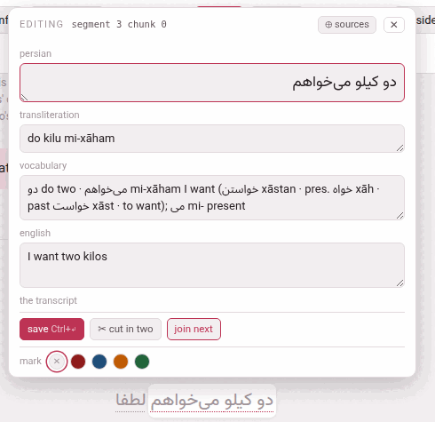

A video's writing door is the gloss cloud itself, and it needs no mode:
point at a phrase and the cloud is already there. It carries two things
that write into the video — a row of colours, and **✎ edit**. Both save
straight into the video's `annotations.json`; there is nothing to rebuild,
because the player reads that file afresh on every visit, so the phrase is
redrawn in place at once and a reload shows the same.

## The four colours

At the foot of every cloud is the **mark** row: a **✕** and four dots —
red, blue, orange, green. One click marks the phrase in that colour, and it
wears the colour in the transcript from that moment; **✕** takes the mark
off. It is a reading gesture, not an edit, so it is one click and never
sits behind the ✎.

They are the reading editions' own four colours, spelled the same and drawn
in the same shades. **Nothing reads them**: no tool does anything with a
colour but check that it is one of the four, no card carries one, no page
filters by one. It is your own mark on the text — *this is the word I did
not know*, *this is the construction I keep missing*.

> A colour, like every edit made in the player, is written into
> `annotations.json`, and nothing else on the shelf holds a gloss: the
> answer a video was built from is folded in once, while the video is being
> added, and the batches are dropped there and then
> ([A video's files](the-files.md#parts)).

## The form

**✎ edit**, in the row with **+ card** and **⧉ copy**, turns the cloud
into a form. Its head says which phrase it is, the way the checker names it
— **editing** *segment 3 chunk 0* — so that a refusal about “segment 3
chunk 0” is recognisably about this one.

The fields are named the way this video's language names them:

| Field | Holds |
|---|---|
| the language's name (**persian**, **japanese**, **italian**…) | the phrase's text, in the language's own face and direction |
| **words** (Japanese, Chinese) | the phrase divided into words, each with its reading — below |
| **kana** (Japanese) | the reading of the whole phrase |
| **transliteration**, **pronunciation**, **rōmaji** or **pinyin** | its romanisation, called what the language calls it |
| **vocabulary** | the vocabulary line: the dictionary form, the root, what it is made of |
| the gloss language's name (**english**, **italian**…) | what the phrase means here — called **meaning** when the video is glossed in the language it teaches |
| **the transcript** | the one checkbox: below |

Target-language boxes take the language's face and direction; the
vocabulary and the meaning take the gloss language's, so an Arabic meaning
runs right to left inside this left-to-right form.

Under the fields: **save** (**Ctrl+↵**, or ⌘+↵) and **delete gloss**
beside it (below), **✂ cut in two**, **join next**, and — from the second
phrase of a caption on — **join previous**; those three move where a phrase
ends ([Cutting and joining](cutting-and-joining.md)). The colour row stays
at the foot. **⊕ sources** in the head opens the column described below,
and **✕** or Esc closes the form.

**While the form is open the cloud stops being a hover**: it stays when the
pointer leaves it, and pointing at another phrase does not wipe what you
have half typed. The video pauses, because a page that follows the speaker
would otherwise scroll the phrase away from under your hands; it plays on
when you close the form, if it was playing.

**What is saved** is only what you changed — so a refusal names that field
and not every field the phrase has — and **nothing changed** is all a press
says when you changed nothing. The server trims every value, and an
emptied box removes its field (absent and empty mean the same thing to
everything that reads the file). After *saved ✓* the boxes show what is now
on disk.

Two fields are deliberately not in the form: `note` and `plain`. They
belong to whoever authored the video — `plain` in particular decides
whether a phrase is asked for a gloss at all — so they are edited in the
file ([A video's files](the-files.md)).

**One box at a time is fine.** A phrase nobody has glossed opens with its
boxes empty, and you may fill them in any order, over as many sittings as
you like: a meaning saved before its transliteration is saved as it is, and
the checker lists the phrase until the rest is written. What is refused is
the opposite — emptying, on its own, a box the language requires, which
would turn a finished gloss into a half-finished one (the refusals, below).

## Deleting a gloss {#deleting-a-gloss}

**delete gloss**, beside **save**, takes the phrase's whole gloss off in one
click: its transliteration, its kana (in Japanese), its vocabulary and its
meaning. It asks
nothing first, because it can be undone. The text, the colour, the words, the
note and the transcript mark stay; what is left is a phrase with no gloss.
In Japanese and Chinese that is one step emptier than a phrase nobody has
touched: a drafted phrase holds the reading proposed from its words (the
kana, or the pinyin), and delete empties the reading rather than put that
proposal back. The form says *gloss deleted*, and an **undo delete** button
appears: it writes the deleted gloss back, down the same route as a save.

The page keeps the deleted gloss until it is reloaded, not longer: close the
form, open the same phrase again later, and **undo delete** is still there;
reload the player, and it is gone. The button is not offered on a phrase
marked plain, and is greyed out on one that has no gloss as saved — a
reading that still says exactly what its words propose is none.

It is how a gloss is written again from nothing — by you, or by an LLM: a
deleted gloss counts as no gloss, so the next prompt of **gloss with an
LLM** asks for this phrase, and the answer may fill it
([Glossing captions with an LLM](glossing-with-an-llm.md)). It is also the
one way to empty a box the language requires.

## When YouTube heard wrong {#when-youtube-heard-wrong}

A caption's text must equal its line of `transcript.txt`: the check that
the phrases of a caption, joined back, **reproduce** that caption is what
stops a model — or a careless edit — quietly rewriting the video. So the
text box is narrow on purpose: you may add the vowel marks to a Persian or
Arabic phrase (the marks are set aside before the comparison), but not
change a letter or a stop of it.

But the pasted transcript is only what YouTube heard, and it is sometimes
simply wrong: a name misheard, a particle dropped. For that one case the
form ends with **the transcript**: *this phrase need not reproduce
`transcript.txt`*. Ticked and saved **together with** the correction:

- the edit that changes the words is written instead of refused;
- the caption's text is rewritten from its own phrases;
- the checker reports the caption as *not checked against transcript.txt*
  — a warning counting such captions, not an error.

It frees the whole **caption**, because the whole caption is what is
compared: one phrase departing takes its caption with it. Every other
caption is checked as before. To go back, put the words as the transcript
has them and untick the box in the same save; unticking alone, while the
words still differ, is refused — *segment 1: text differs from
transcript.txt*, with the two texts under it. When a save is refused
because the words differ, the form scrolls this box into view.

## Japanese and Chinese: the words

A Japanese or Chinese phrase carries its **words** as a line of its own —
`今日(きょう) は 天気(てんき) が` — which is what the reading over each word,
**I know this** and the dictionary go by. The form draws that line as a
strip under the text box: one chip per word, the word on top and its reading
in a box underneath.

| To | Do |
|---|---|
| cut a word in two | click between two of its characters, where the scissors appear |
| join two words | the **⊕** between them; their readings run together |
| move where a word begins | click the word and press ← or →: a character at a time |
| correct a reading | type in the box under the word |
| write the line itself | **edit as text**: the line as it is stored |
| start again | **propose** asks the machine for its division again (SudachiPy for Japanese, pkuseg and pypinyin for Chinese, when the server has them); **divide by hand** starts a phrase that has no words from its whole text as one word |

Under the chips the strip says what is wrong with the line. An **error** —
the words do not join back into the text — refuses the save,
as the checkers would. A **warning** does not: a kanji word with no
reading, or the words' readings run together disagreeing with the phrase's
own kana or pinyin — which in a text read out of its written order
(kanbun) they rightly do; the checkbox on
[video info](video-info-and-drafts.md#video-info) quiets it. The line is
written with the rest of the phrase, by **save**, and not before; changing
the text or the reading redraws the strip against them.

## The sources beside the fields {#the-sources-beside-the-fields}

**⊕ sources** opens a column to the left of the fields, and the form grows
to hold it: *Everything the toolbox already knows about this phrase.
Nothing here is a gloss and nothing writes itself: each line has the
buttons that put it into a field.* Reading them in the cloud and retyping
them was the whole of the work before, and retyping is where a romanisation
loses a macron. Whether the column is open is remembered.

It holds four blocks, in this order:

- **dictionary** — each entry for the phrase's words, with **romanisation →**
  (into the transliteration), **→ vocabulary** (the word added to the
  vocabulary line — for a verb, the form in the phrase and then its lemma
  with its other forms, as a vocabulary line writes a verb) and
  **meaning →**. Where the recipe for a verb could not fill something the
  language needs, the row and the button say what is still to write.
  Where the dictionary defines its words in their own language and a
  translation model is there, an **in english** switch (named after the
  gloss language) over the block puts each sense into the gloss language,
  with its own **→ vocabulary** and **meaning →**.
- **a machine's reading** — the caption translated by the model on this
  machine, with **the marked words → meaning** (the part that seems to be
  this phrase's) and **the whole caption → meaning**; or *no translation
  model for this pair*.
- **sentences somebody translated** — from the corpus, each with
  **its meaning →**; or *nothing in the corpus is about this phrase*.
- **external chatbot** — for any chatbot you like, with nothing installed.
  **Ask LLM** copies a prompt holding the caption, the captions around it,
  what the dictionary says of its words and every example sentence the
  corpus has; paste the chatbot's answer into the box and press
  **Use translation** (or Ctrl+↵). The translation then appears with the
  same buttons the model's has, and it is reused for every phrase of the
  same caption.

A button **adds** to its field rather than replacing it, since a vocabulary
line is built entry by entry. Nothing is saved until **save**.

## The refusals

Every save goes through `check_annotations.py` **before** anything is
written, and is refused — in the checker's own words, shown at the foot of
the form — if it brings in an error the file did not already have.
*Brings in*, not *has*: an editor that would not work until the video was
finished could not be how the video gets finished. And a box still empty
beside the ones you fill is never counted: a phrase half glossed is the
middle of the work. A refused save writes nothing at all; the form stays
open with your text in it.

| It says | Which means |
|---|---|
| *segment 1 (start 6): chunks do not reproduce the text* (with the two texts under it) | the text changed. Marks are set aside first, so vowelling goes through, and changing a word or a stop does not. Moving a word to the next phrase is not one phrase's edit: it is a boundary moving ([Cutting and joining](cutting-and-joining.md)). A misheard word is what **the transcript** box is for |
| *segment 4 (start 21) chunk 1: a glossed phrase needs its meaning -- check_annotations.py calls an empty en an error; empty every box of the gloss ("delete gloss") to take the whole gloss off* | you emptied, on its own, a field the language requires. The same goes for the transliteration where the language romanises every phrase (*Persian romanises every phrase, so tr cannot be emptied on its own*) and for the kana of a Japanese phrase. Emptying **every** box at once is allowed — that is **delete gloss** — and the vocabulary may always be emptied. Filling a box is never refused for what is still empty beside it |
| *segment 2 (start 12) chunk 1: the words do not reproduce the text: …* | Japanese, Chinese: the text changed and the words did not — change both in one save |
| *no chunk 3 in segment 4: there are 2* | the page is out of date: the file was changed elsewhere since it was drawn. Reload rather than let a neighbouring phrase be edited by mistake |
| *the edit was refused* / *the server did not answer* | the server is stopped or could not be reached; nothing was written |

Two more exist for requests made by hand, never by the page:
*colour 'purple' is not one of red, blue, orange, green*, and
*cannot set 'plain' on a chunk: fa, words, kana, tr, voc, en, col, free* —
which is also what a mistyped field name gets.
