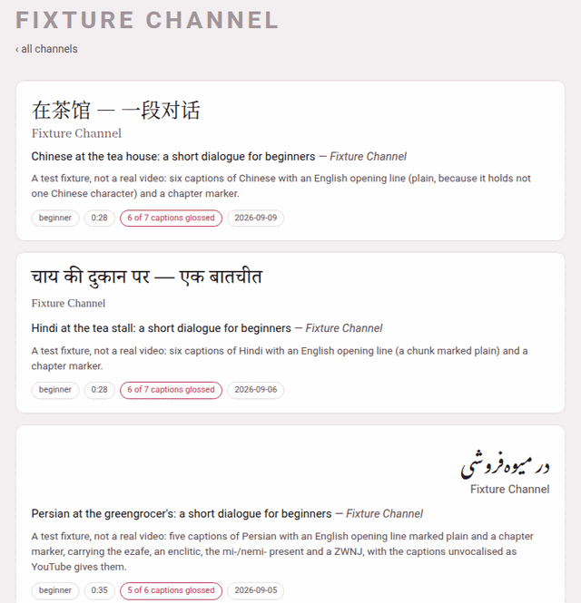

## Channels first, then videos

The videos page, `/youtube/`, is a tree of two levels: first a **channel**,
then a video of that channel. There is deliberately no page that lists every
video flat. With a few dozen videos across several channels, the channel is
how you actually remember which one you want — “the one from the bakery
series” — and a flat list of forty titles in five scripts is the page
nobody reads.

The channels are grouped under a heading per language, in the order of
Parseh's language registry (Persian first). Each heading gives the
language's English name, its own name in its own script, and how many
videos it holds.

Above the headings is the toolbox's row of **language chips** — **all**,
then one per language that has a video, each with its count. A chip hides
every heading and card of the other languages. The choice is the one
preference every page of Parseh shares: pick Japanese here and the books'
library, the hub and the add page start on Japanese too.

## A channel is only a field

Nothing stores a channel. It is the `channel` field of each video's
`video.json`, grouped: a channel appears the moment its first video does,
and goes the moment its last one is taken away. A video whose `video.json`
names no channel is filed under **Unknown channel**, and every film added
from this machine without a channel of its own is filed under
**on this machine**.

A channel card says:

| Tag | Means |
|---|---|
| **3 videos** | how many videos of this language the channel has |
| **1 in draft** | how many of them are still being written ([drafts](video-info-and-drafts.md)) — counted here because the index shows channels, and a draft would otherwise be invisible until you opened the channel |
| **2 fully glossed** | how many have phrases under every caption and no phrase left blank — so a video that opens with a caption in another language, which carries no phrases, is not counted |
| **beginner**, **intermediate**… | the levels its videos are marked with |

A channel with videos in two languages has a card under each language, and
both cards open the same channel page.

## A channel's page

Click a channel card and its page, `/youtube/c/<channel>/`, lists its
videos, newest first, of every language it has them in — **‹ all
channels** goes back. Each video card shows:

- the title in the video's own language (`title_native`), in its own script
  and direction — the Persian card above reads from the right;
- the channel;
- the title in Latin letters, and the channel again;
- the blurb, one sentence on what the video is;
- the tags.

| Tag | Means |
|---|---|
| **draft** | the video is still being written: a phrase with nothing on it is expected, not a fault |
| **beginner** … **advanced** | its level, when it has one |
| **0:35** | about how long it is (the last caption's time) |
| **no annotations yet** | the directory has a `video.json` but no captions; the card is drawn quieter |
| **12 of 40 chunks glossed** | phrases, not captions, when some are still blank — a draft has a phrase under every caption and nothing written in them, so counting captions would call it finished |
| **5 of 6 captions glossed** | how many captions carry phrases; a caption entirely in another language (the English opening of many lessons) never does |
| **6 captions glossed** | every caption carries phrases |
| **2026-09-05** | the day it was added |

Click anywhere on the card to open the [player](the-player.md). A video's
address is `/youtube/v/<id>/`, whatever its language: an id is unique
across languages, so the address does not name the folder.

## Taking a video off the shelf

Point at a video card and a **✕** appears in its corner (it also appears
when you Tab onto it: the ✕ is the next stop after its card). It asks
first:

> Take “Persian at the greengrocer's…” off the shelf?
>
> It is moved to the trash beside the others, not deleted: nothing is
> lost, and it stops being part of the library.

It means exactly that. The video's whole directory — transcript, glosses,
notes, film, waveform — is moved to `youtube/videos/.trash/<id>-<date>-<time>/`,
a folder no page ever lists, and a message says where it went. To put it
back, move that folder back into its language's folder
(`youtube/videos/persian/<id>/`) and reload: the player reads its folders
afresh on every visit. There is no button for that way back, and no button
that empties the trash — both are deliberate acts with your file manager.

The same trash receives a video you replace when you add it again
([Adding a video](adding-a-video.md#the-answer)).

## The rest of the page

Below the channels:

- **＋ Add a video** — the page that adds one, from YouTube or from a film
  on this machine, glossed by an LLM or by you
  ([Adding a video](adding-a-video.md)).
- **⇆ Sync with Anki** — for cards you have edited inside Anki; the
  section *Cards and Anki* explains it.
- **⇩ Bring a video back** — takes back a video's zip, the one the
  player's ⤓ makes.
- **⇩ The whole shelf** — **Backup every video** and **Load from backup**.

The last two are explained in
[Taking videos away and bringing them back](downloads-and-backups.md).
With no video at all, the page says *No videos yet — add one below.*

The line at the foot of the page names `youtube/PROMPT.md`, the recipe for
writing a video by hand in a Claude Code session opened in the project —
the long way, for a video that wants a word list of its own. Everything it
does, the add page does from the browser.
