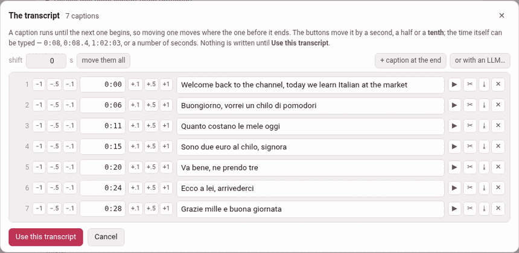

A pasted transcript is what YouTube **heard**, cut where YouTube chose to
cut it. Both are often wrong: a name misheard, a sentence split across two
captions, a caption that begins three seconds late, two words glued to the
caption before. Every road out of the add page — the prompt, the blank
draft, the checker — reads the panel as it stands, so a panel that is wrong
makes a video that is wrong.

So the add page has a small subtitle editor, in the manner of
*Subtitle Edit*, for the one moment it is wanted: **before anything is built
from the transcript**. Paste the transcript (step 2 of
[Adding a video](adding-a-video.md)), then press **Edit the transcript…**
under the box.

## The list

The editor, **The transcript**, says how many captions it read and lists
them, one row each:

| In each row | What it does |
|---|---|
| the number | the caption's place in the transcript |
| **−1** **−.5** **−.1** | move the caption earlier by a second, a half or a tenth |
| the time | where it starts; type one — `0:08`, `0:08.4`, `1:02:03`, or a number of seconds |
| **+.1** **+.5** **+1** | move it later by a tenth, a half or a second |
| the words | what is said, to correct as you like |
| **▶** | play the caption, from its start to where the next one begins |
| **✂** | cut the caption in two where the cursor is in its words |
| **⤓** | join the caption after this one to it |
| **✕** | delete it |

**A caption runs until the next one begins**, so moving one moves where the
one before it ends; there is no end to set.

After **✂**, the second half starts halfway to the next caption — a guess,
the one a hand would make — and the editor says *cut in two — set where the
second half begins*. Click in the words where the cut goes first, or it asks
you to. A join puts the two captions' words together with a space.

Above the list:

- **shift** *n* **s**, **move them all** — add that many seconds (negative
  for earlier) to every caption's start at once. A panel copied from a
  re-uploaded video is often late or early by the same amount throughout.
  It refuses to take the first caption before the video begins.
- **+ caption at the end** — one more, four seconds after the last, to give
  its words and its time.
- **✨ tidy up**, **undo the tidy** and **or with an LLM…** — below.

### Hearing a nudge

For a YouTube video, the video itself stands over the list, and **▶** plays
one caption and stops where the next begins. That is how a nudge is
answered: press, play, press again. If the video cannot load (no internet),
its place says *the video did not load — the times can still be typed*.

A film on this machine is not in the player yet while it is being added, so
there is no video over the list: its captions are timed by eye and by
typing. The **▶** in each row stays, but cannot play a film: it answers
*the video is still loading*.

### A tenth of a second

The panel keeps what the steps make. A caption's clock line takes a
fraction — `0:08.4` — written only where there is one, so a panel of whole
seconds goes back as whole seconds, and every transcript written before
reads exactly as it did. The player seeks to a tenth as readily as to a
whole second. A pasted `.srt` keeps its cues' own fractions.

## ✨ tidy up

An automatic transcript is cut where YouTube ran out of room, never where a
sentence ends. **✨ tidy up** reads the whole transcript at once and
re-cuts it into **sentences**, one caption each:

1. It lays every word across the time its caption covers, in proportion to
   how long the word is (a language written without spaces, character by
   character).
2. It cuts that stream into sentences — **across** the caption edges, which
   is what the transcript cannot do for itself.
3. Each sentence becomes a caption starting at its first word's time, and
   ends with the stop its language prints: `.` and `?`, `؟` in the Arabic
   script, `。` and `？` for Japanese and Chinese, `।` for Devanagari — a
   question mark where one of the language's own question words opens or
   closes it.

Every language here gives it something to read:

- **the stops the transcript already carries** — YouTube punctuates its
  automatic captions for English, Italian, French, German, Spanish and
  Japanese, and for those this is nearly the whole job;
- **the verb**, where the language puts it last and nothing is punctuated —
  Persian, Turkish: the toolbox knows the copulas from the language's own
  word lists and the verbs from the installed dictionary;
- **a pause** the caption edges betray, a **question asked without a verb**
  at a caption's edge, and a **`[music]`** tag, which is kept on a line of
  its own — these belong to every language.

**Not one word changes**: only the punctuation is new, and a tidy that could
not promise that gives the captions back untouched. It is a guess, so it is
a button and not a rule: the editor says what it did (*40 captions became
23*), **undo the tidy** takes it back in one press, and whatever it got
wrong is a **✂** or a **⤓** away.

**What decides whether it is offered is the dictionary** of the video's
language. Not because a full stop needs one, but because everything above a
full stop is a question about a word — is it a verb, is it a name — and a
dictionary is what answers that. Without it the button is not shown at all;
install the dictionary from the dictionaries page (`/lookup/`) and it is
there the next time you open the editor, with nothing to restart.

## Or with an LLM…

**or with an LLM…** is the other road — the one the glossing step already
walks. It copies to the clipboard a prompt that sets out the same job — one
caption per sentence, keep the words, punctuate, time each caption at its
first word, mend only a word that is plainly misheard — with the
transcript inside it, and opens a box for the answer. Paste the model's
whole answer there and press **use the answer**; it is read as an
ordinary transcript. **copy the prompt again** copies it once more, and
**close** folds the box away.

The two roads fail differently, which is why both are offered: the
algorithm cannot hear a misheard word and will never invent one; a model
hears the sense and may invent anything. So when a model's answer goes in,
the editor says how far the letters moved — *40 captions became 23, and not
one letter of the words changed*, or *— and the words are not the same: 3
letters more or fewer. Look them over.* **undo the tidy** takes an answer
back too. The prompt needs nothing installed.

## Putting it back

Nothing is written until **Use this transcript**: the captions go back into
the transcript box as an ordinary panel, which is what the next step reads,
and the page says *the transcript was edited* (or *unchanged*). The panel
comes back in its plainest form — a chapter marker as `Chapter 1: …`, no
spoken-duration lines — which reads exactly as before. A prompt you had
already prepared is forgotten, since it was made from the old panel.

It refuses, by name, a caption whose start does not come after the one
before it — *caption 7 starts at 0:21, which is not after the one before it
(0:22)* — and marks that row: the checker would refuse it later, and later
is worse. It also refuses a transcript whose every caption is empty.

**Cancel**, **✕** or Esc leave the box as it was (*left as it was*).

## Only while the video is being added

There is no such editor in the player. Once a video is added, its
transcript is what its glosses were checked against, and a door that could
rewrite what a caption **says** would quietly unmake that check. The one
thing that may still move afterwards is where a caption **starts** —
[the timings](the-timings.md) — and a phrase whose words YouTube got wrong
has its own way out ([Editing a phrase](editing-a-phrase.md#when-youtube-heard-wrong)).
